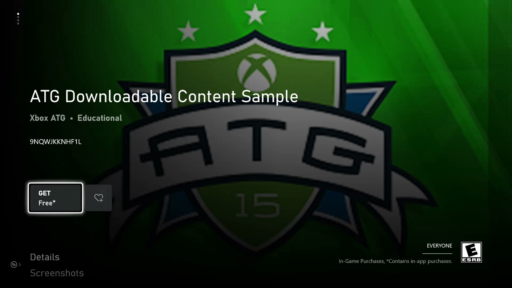

  

#   Downloadable Content (DLC) Sample

This sample is compatible with the Microsoft GDK (June 2023)

# Description

This sample demonstrates how to implement purchase, download,
enumeration and loading of downloadable content (DLC) through XPackage 
and XStore APIs. DLC containing a DLL and an EXE is also demonstrated.

# Building the sample

If using an Xbox One devkit, set the active solution platform to `Gaming.Xbox.XboxOne.x64`.

If using Xbox Series X|S Dev Kit, set the active solution platform to `Gaming.Xbox.Scarlett.x64`.

If using a Windows PC, set the active solution platform to
Gaming.Desktop.x64

*For more information, see* __Running samples__, *in the GDK documentation.*

# Running the sample

This sample is configured to work in the XDKS.1 sandbox.

The left side of the screen will show the packages that are installed.
These operations can be available depending on what the DLC contains:
- Mount: this will acquire a license and then mount the DLC contents
in the filesystem
  - DLCPackage: this will show an image
  - DLCDlPackage: this will call an API found in the DLL that the 
ComboDLL project builds
  - DLCExePackage: this will launch the exe that is contained in
the DLC
- Unmount: unmount the DLC package
- Uninstall: uninstall the DLC package

If the sample is run in XDKS.1, the right side will show a list of
available DLC addons. Selecting the item will bring up the Purchase
UI if it is not owned by the account; if it is, then selecting the item
download the package. Upon completion, the package should show up on the
list on the left. This most closely represents the actual retail flow
where DLC is purchased from the Store and packages are installed from
CDN.

| Action                     |  Keyboard           |  Gamepad            |
|----------------------------|--------------------|--------------------|
| Select Package  |  Arrow keys Up and Down |  D-Pad Up and Down |
| Switch between local or store packages |  Arrow keys Left and Right |  D-Pad Left and Right              |
| Mount or Unmount Package (left column) Purchase or Download Package (right column) |  Enter  |  A button |
| Toggle XPackageEnumeratePackages kind and scope |  Page Up/Page Down  |  LB/RB |
| Uninstall Package          |  X                  |  X Button           |
| Refresh the enumerated packages |  Y  |  Y Button |
| Toggle debug window        |  OemTilde            |  Menu button        |
| Exit                       |  Esc                |  View button        |

# How the products are set up

The Store ID for this product is 9NQWJKKNHF1L.

To reach its Store page on Xbox, from Gaming command prompt use

`xbapp launch ms-windows-store://pdp/?productid=9NQWJKKNHF1L`

On Windows `msxbox://game/?productId=9NQWJKKNHF1L` 

9NQWJKKNHF1L contains three addons, representing
common combinations of packages for available platforms:

-   9P96RFVJQ562 contains packages for Xbox Series, Xbox One GDK and PC

-   9PPJJCWPCWW4 contains an Xbox One ERA package

-   9PGJRLSPSN3V contains an Xbox One GDK package and PC

The sample running on Scarlett devkit should be able to Scarlett DLC
(9P96RFVJQ562) package, and the package that is installed from Store
should have the \_xs suffix. The sample running on Xbox One devkit
should be able to access all three packages, and for 9P96RFVJQ562 the
package would have an \_x suffix instead. The sample running on PC
should only be able to access 9P96RFVJQ562 and 9PGJRLSPSN3V packages.

The sample as installed from the store will be properly licensed and
function properly, but may represent an older version of the sample.

# Running with local packages

While this sample can be run with DLC packages downloaded and installed
from the Store, typical development will involve iteration of DLC
content locally. There are several ways to accomplish this. More
information can be found in the GDK documentation titled "**Manage and
license downloadable content**".

Included in the same are several script files use to generate packaged
versions of the sample and the DLC. For the sample (i.e. base game)
makepcpkg, makexboxonepkg, makescarlettpkg will create their respective
packages. The scripts will build the package with the correct contentID
associated with the packages submitted for 9NQWJKKNHF1L on Partner
Center.

For DLC, several DLC are demonstrated:

- DLCPackage: Scarlett GDK, Xbox One GDK, and Xbox One ERA DLC
- DLCPackagePC: PC DLC
- DLCDllPackage: GDK DLC for console that includes ComboDLL
- DLCDllPackagePC: GDK DLC for PC that includes ComboDLL
- DLCExePackage: GDK DLC for console that includes 
AlternateExperience.exe
- DLCExePackage: GDK DLC for PC that includes AlternateExperience.exe

AlternateExperience and ComboDLL are derived from the SimpleMultiExePackage sample.

Scarlett packages end in \_xs.xvc

Xbox One (GDK) packages end in \_x.xvc

Xbox One (XDK) packages will have no extension

PC packages end in .msixvc

Within each are makedlcpkg commands that will generate each platform's
DLC packages. BuildAllDlc.cmd in root directory will generate all type DLC.

To install, use **xbapp install** on Xbox or **wdapp install** for PC,
or available equivalent tools. In this configuration, any installed DLC
should show up in the left hand side and be mountable.

It is also possible to run completely using loose files. To achieve
this, use **xbapp deploy** on Xbox or **wdapp register** on PC and pass
in the directory where the MicrosoftGame.config is located, e.g.

`xbapp deploy .\DLCPackage\Package_Scarlett`

`wdapp register .\DLCPackagePC\Package`

It should be possible to mix and match: packaged base game + loose DLC;
loose base game + packaged DLC, loose base game + Store DLC, etc.,
though see the Known Issues section for any problems with certain
combinations.

# Known issues

# Update history

**Update:** June 2023

Support EXE/DLL in DLC.

**Update:** March 2022

Added DLCPackagePC folder for demonstrating DLC on PC.

Fixed the crash when the license lost.

**Update:** June 2022

Change XPackageMount API to XPackageMountWithUiAsync API.

Add XPackageUninstallPackage API.

**Update:** July 2022

Fixed the error handling.

**Initial Release:** April 2019

# Privacy statement

When compiling and running a sample, the file name of the sample
executable will be sent to Microsoft to help track sample usage. To
opt-out of this data collection, you can remove the block of code in
Main.cpp labeled "Sample Usage Telemetry".

For more information about Microsoft's privacy policies in general, see
the [Microsoft Privacy
Statement](https://privacy.microsoft.com/en-us/privacystatement/).
