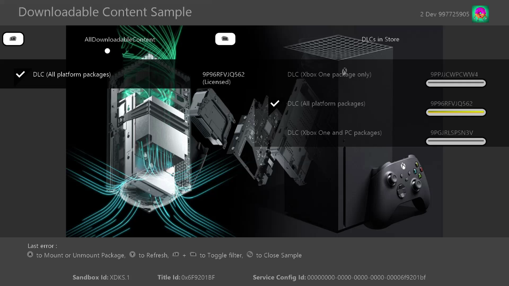

# DLC(다운로드 가능한 콘텐츠) 샘플

이 샘플은 Microsoft GDK와 호환됩니다(2023년 6월).

# 설명

이 샘플에서는 XPackage 및 XStore API를 통해 DLC(다운로드 가능한 콘텐츠)의 구매, 다운로드, 열거 및 로드를 구현하는 방법을 보여줍니다. DLL 및 EXE를 포함하는 DLC에 대해서도 설명합니다.

# 샘플 빌드

Xbox One 개발 키트를 사용하는 경우 활성 솔루션 플랫폼을 `Gaming.Xbox.XboxOne.x64`(으)로 설정합니다.

Xbox Series X|S 개발 키트를 사용하는 경우 활성 솔루션 플랫폼을 `Gaming.Xbox.Scarlett.x64`(으)로 설정합니다.

Windows PC를 사용하는 경우 활성 솔루션 플랫폼을 Gaming.Desktop.x64로 설정합니다.

*자세한 내용은* *GDK 설명서의* __샘플 실행을__ 참조하세요.&nbsp;

# 샘플 실행

이 샘플은 XDKS.1 샌드박스에서 작동하도록 구성됩니다.

화면 왼쪽에는 설치된 패키지가 표시됩니다. 이 작업은 DLC에 포함된 내용에 따라 다음과 같이 사용할 수 있습니다.
- 탑재: 라이선스를 획득한 다음 파일 시스템에 DLC 콘텐츠를 탑재합니다.
   - DLCPackage: 이미지가 표시됩니다.
   - DLCDlPackage: ComboDLL 프로젝트가 빌드하는 DLL에 있는 API를 호출합니다.
   - DLCExePackage: DLC에 포함된 exe가 시작됩니다.
- 분리: DLC 패키지를 분리합니다.
- 제거: DLC 패키지를 제거합니다.

샘플이 XDKS.1에서 실행되는 경우 오른쪽에 사용 가능한 DLC 추가 기능 목록이 표시됩니다. 항목을 선택하면 계정이 소유하지 않은 경우 구매 UI가 표시됩니다. 이 경우 항목을 선택하면 패키지가 다운로드됩니다. 완료되면 패키지가 왼쪽 목록에 표시됩니다. 이는 Microsoft Store에서 DLC를 구매하고 패키지가 CDN에서 설치되는 실제 소매 흐름을 가장 가깝게 나타냅니다.

| 동작 | 키보드 | Gamepad |
|---|---|---|
| 패키지 선택 | 위쪽 및 아래쪽 화살표 키 | 위쪽 및 아래쪽 방향 패드 |
| 로컬 패키지 또는 저장소 패키지 간 전환 | 왼쪽 및 오른쪽 화살표 키 | 왼쪽 및 오른쪽 방향 패드 |
| 패키지 탑재 또는 분리(왼쪽 열) 패키지 구매 또는 다운로드(오른쪽 열) | Enter | A button |
| XPackageEnumeratePackages 종류 및 범위 설정/해제 | Page Up/Page Down 키 | LB/RB |
| 패키지 제거 | X | X 버튼 |
| 열거된 패키지 새로 고침 | 예 | Y 버튼 |
| 디버그 창 토글 | OemTilde | 메뉴 단추 |
| 끝내기 | Esc | 보기 버튼 |

# 제품 설정 방법

이 제품의 Microsoft Store ID는 9NQWJKKNHF1L입니다.

Xbox에서 Microsoft Store 페이지에 도달하려면 게임 명령 프롬프트에서 다음을 사용합니다.

`xbapp launch ms-windows-store://pdp/?productid=9NQWJKKNHF1L`

Windows에서 `msxbox://game/?productId=9NQWJKKNHF1L`

9NQWJKKNHF1L에는 사용 가능한 플랫폼에 대한 패키지의 일반적인 조합을 나타내는 세 개의 추가 기능이 포함되어 있습니다.

- 9P96RFVJQ562에는 Xbox Series, Xbox One GDK 및 PC용 패키지가 포함되어 있습니다.

- 9PPJJCWPCWW4에는 Xbox One ERA 패키지가 포함되어 있습니다.

- 9PGJRLSPSN3V에는 Xbox One GDK 패키지 및 PC가 포함되어 있습니다.

Scarlett 개발 키트에서 실행되는 샘플은 Scarlett DLC(9P96RFVJQ562) 패키지를 사용할 수 있어야 하며 Microsoft Store에서 설치된 패키지에는 _xs 접미사가 있어야 합니다. Xbox One 개발 키트에서 실행되는 샘플은 세 가지 패키지 모두에 액세스할 수 있어야 하며 9P96RFVJQ562의 경우 패키지에 대신 _x 접미사가 있습니다. PC에서 실행되는 샘플은 9P96RFVJQ562 및 9PGJRLSPSN3V 패키지에만 액세스할 수 있어야 합니다.

스토어에서 설치된 샘플은 올바른 라이선스가 제공되고 제대로 작동하지만 이전 버전의 샘플을 나타낼 수 있습니다.

# 로컬 패키지로 실행

이 샘플은 Microsoft Store에서 다운로드하여 설치한 DLC 패키지를 사용하여 실행할 수 있지만, 일반적인 개발에는 DLC 콘텐츠를 로컬로 반복하는 작업이 포함됩니다. 이를 수행하는 방법에는 몇 가지가 있습니다. 자세한 내용은 &ldquo;**다운로드 가능한 콘텐츠 관리 및 라이선스 부여**&rdquo;라는 GDK 설명서에서 확인할 수 있습니다.

샘플 및 DLC의 패키지된 버전을 생성하는 데 사용하는 여러 스크립트 파일도 동일하게 포함됩니다. 샘플(즉, 기본 게임)의 경우 makepcpkg, makexboxonepkg 및 makecarlettpkg가 각각 해당 패키지를 만듭니다. 스크립트는 파트너 센터에서 9NQWJKKNHF1L에 대해 제출된 패키지와 연결된 올바른 contentID를 사용하여 패키지를 빌드합니다.

DLC의 경우 몇 가지 DLC에 대해 설명합니다.

- DLCPackage: Scarlett GDK, Xbox One GDK, Xbox One ERA DLC
- DLCPackagePC: PC용 DLC
- DLCDllPackage: ComboDLL을 포함하는 콘솔용 GDK DLC
- DLCDllPackagePC: ComboDLL을 포함하는 PC용 GDK DLC
- DLCExePackage: AlternateExperience.exe를 포함하는 콘솔용 GDK DLC
- DLCExePackage: AlternateExperience.exe를 포함하는 PC용 GDK DLC

AlternateExperience 및 ComboDLL은 SimpleMultiExePackage 샘플에서 파생됩니다.

Scarlett 패키지는 \_xs.xvc로 끝납니다.

Xbox One(GDK) 패키지는 \_x.xvc로 끝납니다.

Xbox One(XDK) 패키지에는 확장명이 없습니다.

PC 패키지는 .msixvc로 끝납니다.

각 플랫폼 내에는 각 플랫폼의 DLC 패키지를 생성하는 makedlcpkg 명령이 있습니다. 루트 디렉터리의 BuildAllDlc.cmd는 모든 DLC 형식을 생성합니다.

설치하려면 **xbapp install**(Xbox) 또는 **wdapp install**(PC)을 사용하거나 사용 가능한 동등한 도구를 사용합니다. 이 구성에서는 설치된 모든 DLC가 왼쪽에 표시되고 탑재 가능해야 합니다.

느슨한 파일을 사용하여 완전히 실행할 수도 있습니다. 이렇게 하려면 **xbapp deploy**(Xbox) 또는 **wdapp register**(PC)를 사용하고 MicrosoftGame.config가 있는 다음과 같은 디렉터리를 전달합니다.

`xbapp deploy .\DLCPackage\Package_Scarlett`

`wdapp register .\DLCPackagePC\Package`

패키지된 기본 게임 + 느슨한 DLC, 느슨한 기본 게임 + 패키지된 DLC, 느슨한 기본 게임 + Microsoft Store DLC 등과 같이 혼합해서 사용할 수 있어야 합니다. 단, 특정 조합과 관련된 문제는 알려진 문제 섹션을 참조하세요.

# 알려진 문제

# 업데이트 기록

**업데이트:** 2023년 6월

DLC에서 EXE/DLL을 지원합니다.

**업데이트:** 2022년 3월

PC에서 DLC를 시연하기 위한 DLCPackagePC 폴더가 추가되었습니다.

라이선스가 손실될 때 발생하는 충돌을 해결했습니다.

**업데이트:** 2022년 6월

XPackageMount API를 XPackageMountWithUiAsync API로 변경합니다.

XPackageUninstallPackage API를 추가합니다.

**업데이트:** 2022년 7월

오류 처리를 수정했습니다.

**초기 릴리스:** 2019년 4월

# 개인정보처리방침

샘플을 컴파일하고 실행하는 경우 샘플 사용량을 추적할 수 있도록 샘플 실행 파일의 파일 이름이 Microsoft에 전송됩니다. 이 데이터 수집을 옵트아웃하려면 Main.cpp에서 "샘플 사용량 원격 분석"이라는 레이블이 지정된 코드 블록을 제거할 수 있습니다.

일반적인 Microsoft의 개인 정보 정책에 대한 자세한 내용은 [Microsoft 개인정보처리방침](https://privacy.microsoft.com/en-us/privacystatement/)을 참조하세요.

