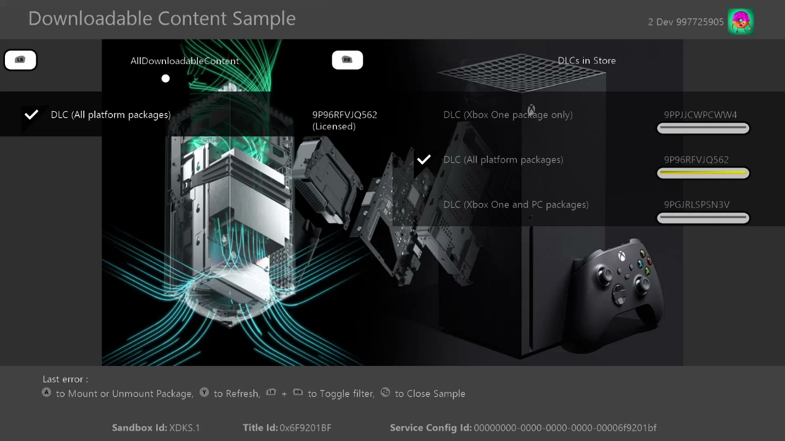
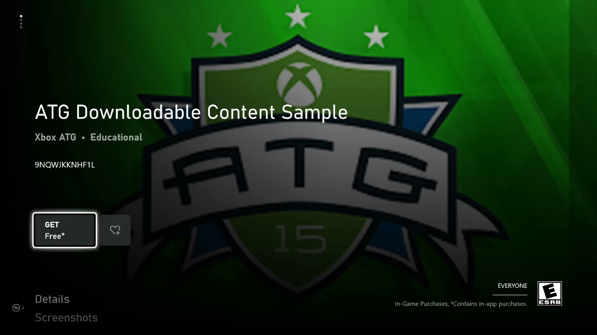

# 可下载内容 (DLC) 示例

此示例适用于 Microsoft GDK （2023 年 6 月）

# 说明

此示例演示了如何通过 XPackage 和 XStore API 实现可下载内容(DLC)的购买、下载、枚举和加载。 还演示了包含 DLL 和 EXE 的 DLC。

# 生成示例

如果使用 Xbox One 开发工具包，请将活动解决方案平台设置为 `Gaming.Xbox.XboxOne.x64`。

如果使用 Xbox Series X|S 开发工具包，请将活动解决方案平台设置为 `Gaming.Xbox.Scarlett.x64`。

如果使用 Windows 电脑，请将活动解决方案平台设置为 Gaming.Desktop.x64

*有关详细信息，请参阅*__运行示例__，详见*GDK 文档。*

# 运行示例

此示例配置为在 XDKS.1 沙盒中工作。

屏幕左侧将显示已安装的包。 这些操作可以根据 DLC 包含的内容提供：
- 装载：这将获取许可证，然后在文件系统中装载 DLC 内容
   - DLCPackage：这将显示图像
   - DLCDlPackage：这将调用在 ComboDLL 项目生成的 DLL 中找到的 API
   - DLCExePackage：这将启动 DLC 中包含的 exe
- 卸载：卸载 DLC 包
- 卸载：卸载 DLC 包

如果示例在 XDKS.1 中运行，右侧将显示可用 DLC 加载项的列表。 如果该项不归该帐户所有，则选择该项将显示购买 UI；如果归该帐户所有，则选择该项会下载包。 完成后，包应显示在左侧列表中。 这最准确地表示了从 Microsoft Store 购买 DLC 并从 CDN 安装包的实际零售流。

| 操作 | 键盘 | 游戏板 |
|---|---|---|
| 选择包 | 箭头键向上和向下 | 方向键向上和向下 |
| 在本地包或 Microsoft Store 包之间切换 | 箭头键向左和向右 | 方向键向左和向右 |
| 装载或卸载包（左列）购买或下载包（右列） | Enter | A button |
| 切换 XPackageEnumeratePackages 种类和范围 | 向上/向下翻页 | LB/RB |
| 卸载包 | X | X 按钮 |
| 刷新枚举包 | Y | Y 按钮 |
| 切换调试窗口 | OemTilde | Menu button |
| 退出 | Esc | View button |

# 如何设置产品

此产品的 Store ID 为 9NQWJKKNHF1L。

要在 Xbox 上访问其 Store 页面，请从&ldquo;游戏&rdquo;命令提示符使用

`xbapp launch ms-windows-store://pdp/?productid=9NQWJKKNHF1L`

Windows 上的 `msxbox://game/?productId=9NQWJKKNHF1L`

在撰写本文时，9NQWJKKNHF1L 包含三个加载项，表示可用平台的包的常见组合:

- 9P96RFVJQ562 包含 Xbox Series、Xbox One GDK 和电脑的包

- 9PPJJCWPCWW4 包含 Xbox One ERA 包

- 9PGJRLSPSN3V 包含 Xbox One GDK 包和电脑

在 Scarlett 开发工具包上运行的示例应能够访问 Scarlett DLC (9P96RFVJQ562)包，且从 Microsoft Store 安装的包应具有 \_xs 后缀。 在 Xbox One 开发工具包上运行的示例应能够访问所有三个包，且对于 9P96RFVJQ562，包会改为具有 \_x 后缀。 在电脑上运行的示例应只能访问9P96RFVJQ562 和 9PGJRLSPSN3V 包。

从 Microsoft Store 安装的示例将获得适当许可并正常运行，但可能表示示例的旧版本。

# 使用本地包运行

虽然此示例可以使用从 Microsoft Store 下载并安装的 DLC 包运行，但典型的开发将涉及 DLC 内容本地迭代。 可通过多种方式实现此目的。 有关详细信息，请参阅名为&ldquo;**管理并许可可下载内容**&rdquo;的 GDK 文档。

其中同样包含多个脚本文件，它们用于生成示例和 DLC 的打包版本。 对于示例(即基础游戏)，makepcpkg、makexboxonepkg、makecarlettpkg 将创建各自的包。 这些脚本将使用正确的 contentID (与在合作伙伴中心上为 9NQWJKKNHF1L 提交的包关联)生成包。

对于 DLC，演示了多个 DLC：

- DLCPackage：Scarlett GDK、Xbox One GDK 和 Xbox One ERA DLC
- DLCPackagePC：电脑 DLC
- DLCDllPackage：包含 ComboDLL 的主机的 GDK DLC
- DLCDllPackagePC：适用于包含 ComboDLL 的电脑的 GDK DLC
- DLCExePackage：包含 AlternateExperience.exe 的主机的 GDK DLC
- DLCExePackage：适用于电脑的 GDK DLC，其中包括 AlternateExperience.exe

AlternateExperience 和 ComboDLL 派生自 SimpleMultiExePackage 示例。

Scarlett 包以 \_xs.xvc 结尾

Xbox One （GDK） 包以 \_x.xvc 结尾

Xbox One （XDK） 包将没有扩展

电脑包以 .msixvc 结尾

每个都包含 makedlcpkg 命令，这些命令将生成每个平台的 DLC 包。 根目录中的 BuildAllDlc.cmd 将生成所有类型的 DLC。

要进行安装，请使用 Xbox 上的 **xbapp 安装**或适用于电脑的 **wdapp 安装**或可用的等效工具。 在此配置中，任何已安装的 DLC 都应显示在左侧并可装载。

也可以使用松散文件完全运行。 要实现此目的，请在 Xbox 上使用 **xbapp 部署**或在电脑上使用 **wdapp 注册**，并传入 MicrosoftGame.config 所在的目录，例如

`xbapp deploy .\DLCPackage\Package_Scarlett`

`wdapp register .\DLCPackagePC\Package`

应可以混合并匹配: 打包的基础游戏 + 松散 DLC；松散的基础游戏 + 打包的 DLC、松散的基础游戏 + Microsoft Store DLC 等。任何有关某些组合的问题，请参阅&ldquo;已知问题&rdquo;节。

# 已知问题

# 更新历史记录

**更新：** 2023 年 6 月

支持 DLC 中的 EXE/DLL。

**更新：** 2022 年 3 月

添加了用于在电脑上演示 DLC 的 DLCPackagePC 文件夹。

修复了许可证丢失时的崩溃问题。

**更新：** 2022 年 6 月

将 XPackageMount API 更改为 XPackageMountWithUiAsync API。

Add XPackageUninstallPackage API.

**更新：** 2022 年 7 月

修复了错误处理。

**初始版本：**2019 年 4 月

# 隐私声明

在编译和运行示例时，将向 Microsoft 发送示例可执行文件的文件名以帮助跟踪示例使用情况。 若要选择退出此数据收集，你可以删除 Main.cpp 中标记为&ldquo;示例使用遥测&rdquo;的代码块。

有关 Microsoft 的一般隐私策略的详细信息，请参阅 [Microsoft 隐私声明](https://privacy.microsoft.com/en-us/privacystatement/)。

