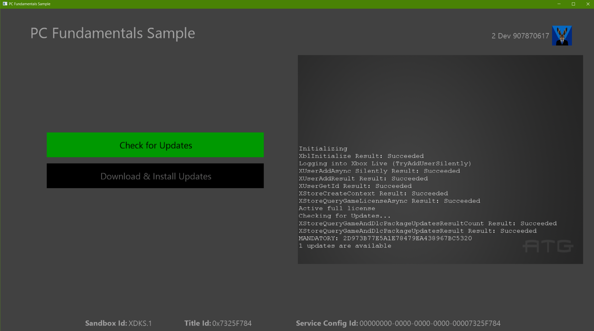

  

#   Windows PC Fundamentals Sample

*This sample is compatible with the Microsoft Game Development Kit (June
2022)*

# 

# Description

This sample demonstrates signing into Xbox Live and making a license
check to ensure that the game is owned by the currently signed in user.
It also performs an update check to ensure the app is up-to-date
compared with the published version in the store.

# Pre-requisites

-   Microsoft GDK (June 2022) Update 2 or later

-   Visual Studio 2019 or later

-   Xbox Test Account signed in first to Xbox app and then Store app in
    Sandbox XDKS.1

> Get a license for the sample in the store with the test account (run\
> `ms-windows-store://pdp/?productid=9NRL15W975GM` or
> `msxbox://game/?productId=9NRL15W975GM)`

# Building the sample

The sample is configured for building with VS2019, but can be upgraded
in-place to VS 2022. This sample is intended for Windows PC only, so
only platform "x64" is available.

# Running the sample

A key characteristic of using the XStore API's is that they require a
valid license in order to function. This is verified with a call to the
licensing service at launch. Without this available, the APIs will
typically return 0x803f6107 indicating that a valid license was not
found.

To obtain a valid license for your test account, run this command to
reach the Store page for the sample's product directly:

Run box (Win+R):

`ms-windows-store://pdp/?productid=9NRL15W975GM`

or

`msxbox://game/?productId=9NRL15W975GM`

Note that you must be in the XDKS.1 sandbox and then sign-in to the Xbox
app\* with your test account before also signing into the Windows Store
with the same test account.

The sample as installed from the store will be properly licensed and
function properly but may represent an older version of the sample. To
have the sample built in Visual Studio work, some additional setup is
required. With the November 2019 GDK and older, running the sample
through F5 will not properly register your debug version and link to the
appropriate license information. Furthermore, a loose deployed build
will also not execute the update download and install scenarios
properly.

## Launching sample

To enable a loose, locally built version you will need to run the wdapp
command in the steps below. This uses the included
MicrosoftGameConfig.mgc to register the built sample with the same name
and identity as the package downloaded from the store which the license
is tied to.

To set up your locally built version of the sample to run do the
following:

1.  [Switch your sandbox to
    XDKS.1](https://docs.microsoft.com/en-us/gaming/xbox-live/xbox-live-sandboxes)

2.  Log into the Xbox app\* with your test account (any test account
    should work in this sandbox)

3.  Log into the Windows Store app with the same test account

4.  Build the sample

5.  Run just using **F5**

\* For the Xbox app, this can either be the Xbox Console Companion app
or the new Xbox App which presents a storefront and has Game Pass
information. For the latter, once you switch to a new account that does
not match the one in the Store app, it will prompt you to reconcile.

## Testing updates

The loose deployed build (as opposed to packaged) will only be able to
check for update availability (i.e.
`XStoreQueryGameAndDlcPackageUpdatesAsync`) if the content ID matches that
of the published package obtained from the store
(1062A2A1-C314-4DDC-94A2-424693687D97). This can be verified in this
registry entry:

`HKEY_CURRENT_USER\\Software\\Microsoft\\Windows\\CurrentVersion\\Store\\ContentId\\41336MicrosoftATG.ATGSimpleLiveSample_dspnxghe87tn0`

This should be set properly if the sample app was fully installed in the
store; otherwise you may need to set it manually if the first app
installation instance was with the loose build.

To actually test the download and applying of the update, **packaged**
builds must be used:

1.  Create v1 package using *createmsixvc.cmd*

2.  *wdapp install \<v1 msixvc\>*

3.  Edit MicrosoftGameConfig.mgc to increment version

4.  Deploy app in Visual Studio to ensure changes is copied to x64/Debug

5.  Create v2 package with new version using *createmsixvc.cmd*

6.  *wdapp update \<v2 msixvc\> /m*

At this point v2 is staged as an available mandatory update. Now when v1
is launched (installed in step 2), will detect an available update and
the Download & Install button will be displayed. Clicking on this button
will terminate the app and simulate updating the game.

Once update is complete, launching the title will result in v2 being
run. You can verify the version that is installed by running in
powershell:

`get-appxpackage 41336MicrosoftATG.ATGSimpleLiveSample`

This is the only update flow that is testable. Due to signing
differences, it will not be able to detect any published store package
as an update even though it has a higher version. Store packages will
only update to higher version store packages.

# Implementation notes

Note that if multiple users are signed in, the StoreContext will be
assigned to the latest account in the user changed callback, which may
or may not match the account that is displayed in the sample. Store
operations really do not work well in multi-user scenarios, so assigning
the StoreContext to the account that presses A is typically appropriate.
Signing in using the Xbox (beta) app will be the best way to detect and
ensure account consistency.

# Privacy statement

When compiling and running a sample, the file name of the sample
executable will be sent to Microsoft to help track sample usage. To
opt-out of this data collection, you can remove the block of code in
Main.cpp labeled "Sample Usage Telemetry".

For more information about Microsoft's privacy policies in general, see
the [Microsoft Privacy
Statement](https://privacy.microsoft.com/en-us/privacystatement/).

# Update history

**Initial Release:** April 2019

**Updated:** January 2020

**Updated:** June 2022

**Converted to use 'stock' x64 instead of Gaming.Desktop.x64:** November
2022
