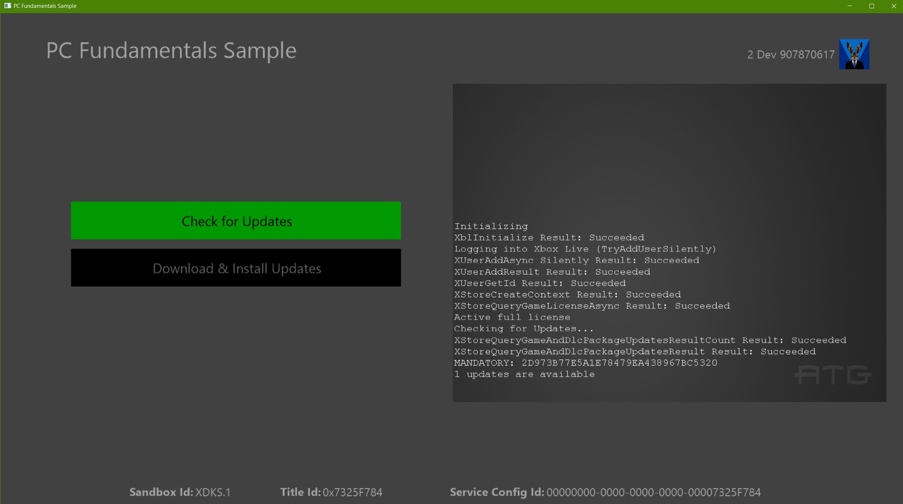

  

#   PC 기본 사항 샘플

*이 샘플은 Microsoft 게임 개발 키트와 호환됩니다(2019년 11월).*

# 

# 설명

이 샘플에서는 Xbox Live에 로그인하고 현재 로그인한 사용자가 해당 게임을
소유하고 있음을 확인하기 위한 라이선스 확인 방법을 보여 줍니다. 또한
스토어의 게시된 버전과 비교하여 앱이 최신 상태인지 확인하는 업데이트
검사도 수행합니다.

# 필수 구성 요소

-   Windows SDK 10.0.18362.1

-   Microsoft GRDK 190500(2019년 5월) 10.1.18362.1021

-   Visual Studio 2017

-   Xbox 앱에 먼저 로그인한 다음, Sandbox XDKS.1의 스토어 앱에
    로그인하는 데 사용한 Xbox 테스트 계정

> 테스트 계정을 사용하여 스토어에서 샘플에 대한 라이선스 받기(\
> `ms-windows-store://pdp/?productid=9NRL15W975GM` 실행)

# 샘플 빌드

이 샘플은 VS2017을 사용하여 빌드하도록 구성되었습니다. 이 샘플은 PC
전용이므로 플랫폼 "Gaming.Desktop.x64"만 사용할 수 있습니다.

# 샘플 실행

XStore API를 사용하는 경우의 주요 특징은 작동을 위해 유효한 라이선스가
있어야 한다는 것입니다. 유효한 라이선스가 있는지는 시작할 때 라이선싱
서비스가 호출되면서 확인됩니다. 이 서비스를 사용할 수 없으면 API는
일반적으로 유효한 라이선스를 찾지 못했음을 나타내는 0x803f6107을
반환합니다.

테스트 계정에 대한 유효한 라이선스를 얻으려면 이 명령을 실행하여 샘플
제품의 스토어 페이지로 직접 연결합니다.

`ms-windows-store://pdp/?productid=9NRL15W975GM`

XDKS.1 샌드박스에 있어야 하며, 테스트 계정으로 Windows 스토어에
로그인하기 전에 같은 테스트 계정으로 Xbox 앱\*에 로그인해야 합니다.

스토어에서 설치된 샘플은 제대로 사용이 허가되고 적절히 작동하지만 이전
버전의 샘플을 나타낼 수 있습니다. Visual Studio에 기본 제공되는 샘플을
사용하려면 몇 가지 추가 설정이 필요합니다. 2019년 11월 GDK를 사용하는
경우 F5 키를 통해 샘플을 실행하면 디버그 버전이 제대로 등록되지 않고
해당 라이선스 정보에 연결되지 않습니다. 또한 느슨하게 배포된 빌드에서는
업데이트 다운로드 및 설치 시나리오가 제대로 실행되지 않습니다.

## 샘플 시작

로컬로 빌드된 느슨한 버전을 사용하도록 설정하려면 아래 단계에서
add-appxpackage 명령을 실행해야 합니다. 이렇게 하면 빌드된 샘플은 포함된
MicrosoftGame.config를 사용하여 라이선스가 연결된 스토어에서 다운로드한
패키지와 동일한 이름 및 ID로 등록됩니다.

마지막으로 2019년 11월 GDK의 경우 라이선스가 제대로 작동하려면 시작
메뉴(또는 고정된 경우 작업 표시줄)에서 앱을 시작해야 합니다. F5 키를
사용하거나 .exe를 직접 실행할 수 없습니다. 이 경우 오류 0x803f6107이
발생합니다.

로컬로 빌드된 샘플 버전을 실행하도록 설정하려면 다음을 수행합니다.

1.  [샌드박스에서 XDKS.1로
    전환](https://docs.microsoft.com/en-us/gaming/xbox-live/xbox-live-sandboxes)

2.  테스트 계정으로 Xbox 앱\*에 로그인(모든 테스트 계정이 이
    샌드박스에서 작동함)

3.  동일한 테스트 계정을 사용하여 Windows 스토어 앱에 로그인

4.  샘플 빌드

5.  **2019년 11월 GDK보다 최신**: F5

6.  **2019년 11월 GDK**:

    a.  2017 Visual Studio 명령 프롬프트 열기

    b.  위에서 설명한 대로 다음을 실행하여 앱 등록\
        wdapp register \[Gaming.Desktop.x64\\Debug 폴더의 절대 경로\]

    c.  시작 메뉴에서 앱 시작(F5 키를 누르거나 .exe를 직접 실행하면
        스토어 API의 결과를 확인할 때 오류 0x803f6107이 반환됨)

    d.  디버거 연결(필요한 경우)

\* Xbox 앱의 경우 Xbox Console Companion 앱 또는 상점을 제공하고 Game
Pass 정보를 포함하는 새로운 Xbox 앱일 수 있습니다. 후자의 경우, 스토어
앱에 있는 계정과 일치하지 않는 새 계정으로 전환하면 조정하라는 메시지가
표시됩니다.

## 업데이트 테스트

느슨하게 배포된 빌드(패키지된 빌드와 반대됨)는 콘텐츠 ID가 매장에서
가져온 게시된 패키지의 콘텐츠 ID와 일치하는 경우에만 업데이트 가능
여부를 확인할 수
있습니다(예:XStoreQueryGameAndDlcPackageUpdatesAsync)(1062A2A1-C314-4DDC-94A2-424693687D97).
이 내용은 다음 레지스트리 항목에서 확인할 수 있습니다.

`HKEY_CURRENT_USER\\Software\\Microsoft\\Windows\\CurrentVersion\\Store\\ContentId\\41336MicrosoftATG.ATGSimpleLiveSample_dspnxghe87tn0`

스토어에 샘플 앱을 완전히 설치한 경우 제대로 설정되고, 그러지 않은 경우
첫 번째 앱 설치 인스턴스가 느슨한 빌드를 사용하는 경우 수동으로 설정해야
할 수 있습니다.

업데이트의 다운로드 및 적용을 실제로 테스트하려면 다음과 같이
**패키지된** 빌드를 사용해야 합니다.

1.  *createmsixvc.cmd*를 사용하여 v1 패키지 만들기

2.  *wdapp install \<v1 msixvc\>*

3.  microsoftgame.config를 편집하여 버전 늘리기

4.  변경 내용이 Gaming.Desktop.x64/Debug에 복사되도록 Visual Studio에서
    앱 배포

5.  *createmsixvc.cmd*를 사용하여 새 버전으로 v2 패키지 만들기

6.  *wdapp update \<v2 msixvc\> /m*

이때 v2는 사용 가능한 필수 업데이트로 스테이징됩니다. 이제 2단계에서
설치한 v1을 시작하면 사용 가능한 업데이트가 검색되고, 다운로드 및 설치
단추가 표시됩니다. 이 단추를 클릭하면 앱이 종료되고 게임 업데이트가
시뮬레이트됩니다.

업데이트가 완료되고 난 후에 타이틀을 시작하면 v2가 실행됩니다.
Powershell에서 실행하여 설치된 버전을 확인할 수 있습니다.

`get-appxpackage 41336MicrosoftATG.ATGSimpleLiveSample`

이것이 테스트 가능한 유일한 업데이트 흐름입니다. 서명 차이 때문에 게시된
저장소 패키지가 더 상위 버전을 포함하더라도 업데이트로 감지될 수
없습니다. 저장소 패키지는 상위 버전 저장소 패키지로만 업데이트됩니다.

# 구현 참고 사항

여러 사용자가 로그인한 경우 StoreContext는 사용자 변경 콜백의 최근
계정에 할당되고, 이 계정은 샘플에 표시되는 계정과 다를 수 있습니다.
Store 작업은 여러 사용자 시나리오에서 제대로 작동하지 않으므로
일반적으로 A를 누르는 계정에 StoreContext를 할당하는 것이 적절합니다.
Xbox(베타) 앱을 사용하여 로그인하는 것이 계정 일관성을 감지하고 보장하는
가장 좋은 방법입니다.

# 개인정보처리방침

샘플을 컴파일하고 실행할 때 샘플 사용을 추적하는 데 도움이 되도록 샘플
실행 파일의 파일 이름이 Microsoft에 전송됩니다. 이 데이터 수집을
옵트아웃하려면 Main.cpp에서 \"샘플 사용 원격 분석\"이라고 레이블이
지정된 코드 블록을 제거할 수 있습니다.

Microsoft의 일반 개인정보취급방침에 대한 자세한 내용은 [Microsoft
개인정보처리방침](https://privacy.microsoft.com/en-us/privacystatement/)을
참조하세요.

# 업데이트 기록

**초기 릴리스:** 2019년 4월

**업데이트 날짜:** 2020년 1월
