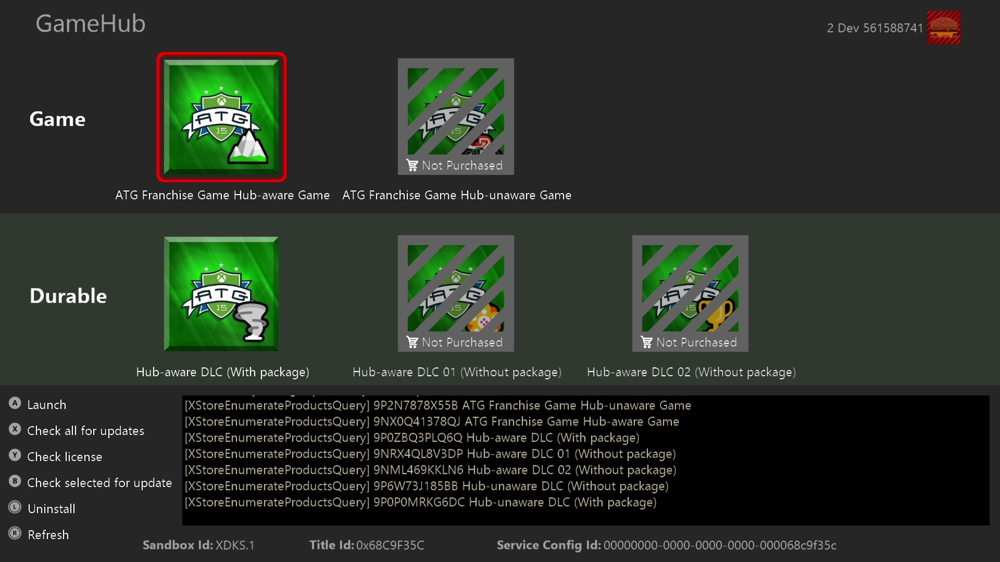
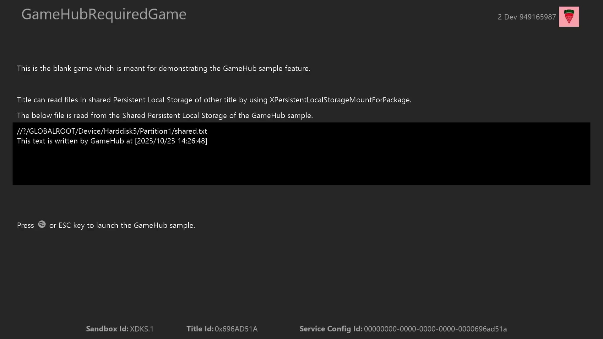
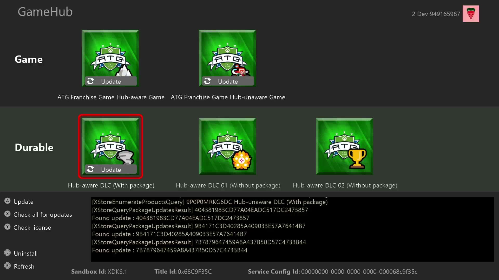

#   Franchise Game Hub sample

このサンプルは Microsoft GDK (October 2023) と互換性があります。

# 説明

フランチャイズ ハブとは、パブリッシャーが関連タイトルを厳選して提供することで、ユーザーをゲーム間で共有体験させる方法です。
これは、関連するタイトルを取得、インストール、起動するための起点として機能し、関連するタイトルが使用できる永続的なローカルストレージ（PLS）スペースをホストします。

このサンプルはユーザー体験で期待される多くの処理をどのように実装するかをデモンストレーションします。
３つのプロジェクトから構成されています:
- ゲームハブ製品 (GameHub) 関連するタイトルを表示しそれぞれに何ができるかを示します。
- Hub-aware 製品 (RequiredGame) 起動するためにはゲームハブが要求され、ハブによって書き込まれた共有データを読むことができます。
- Hub-unaware 製品 (RelatedGame) 起動するためにゲームハブは必要がない、古いタイトルを表します。ゲームハブに関連付けられることが期待されていますが、古い GDK によって出荷済である（想定のため）ゲームハブ固有のフィールドとAPIを使用することはできません。

# サンプルのビルド

Xbox Series X|S devkit を使用している場合、アクティブソルーションプラットフォームに`Gaming.Xbox.Scarlett.x64`を設定してください。

Xbox One devkit を使用している場合、アクティブソルーションプラットフォームに`Gaming.Xbox.XboxOne.x64`を設定してください。

Windows PC を使用している場合、アクティブソルーションプラットフォームに`Gaming.Desktop.x64`を設定してください。
注：コードはコンパイルできますが、フランチャイズゲームハブは主にコンソール向けの機能であり、いくつかの機能は動作しない場合があります。

*詳細については、GDK ドキュメントの* __Running samples__*を参照してください。*

# サンプルの実行

このサンプルは XDKS.1 サンドボックスで動作するように構成されています。
購入やインストール動作を行うためにテストアカウントが必要です。
全ての @xboxtest.com テストアカウントは XDKS.1 サンドボックスで使用可能です。

上段はゲームハブに関連するゲームを表示しており、この例では２つあります。
各タイトルが選択されると、関連付けられたアドオンが下に表示されます。
それぞれは購入することができ、それがゲームやパッケージ付きDLCの場合にはインストールもできます。

インストール済であれば、各ゲームは起動することができます。
Hub-aware ゲームは共有 PLS に書き込まれたファイルの中身を表示することができ、ハブに戻ることが出来るようになっています。

Hub-unaware ゲームは起動することはできますが、それがハブから起動されたのかどうか認識していません。

これらは全て Visual Studio デバッグ実行を通じてゲームハブを使用することができますが、各プロジェクトをパッケージ化するためのスクリプトも用意してあります。
- `makepcpkg.cmd`
- `makescarlett.cmd`
- `makexboxone.cmd`

パッケージを作成したあとは、それぞれ`xbapp install`にてインストールしてください。
これにより、ストアから取得してインストールしなくても、ローカルでビルドされたパッケージと対話することができます。

アップデートをテストしようとする場合に重要なことですが、ローカルビルド（デプロイまたはパッケージ）はストアビルドにアップデートすることはできません。
このため、UpdateTesting ディレクトリにスクリプトの個別のセットを用意しています：
- `buildpackages.cmd`: 関連ゲームと DLC それぞれの v100 と v200 バージョンのパッケージをビルドします。
- `installandstageupdates.cmd`: v100 パッケージに`xbapp install`を行い、v200 に`xbapp update /a`を行います。これによりアップデート可能な状態をシミュレートします。

この結果、ゲームは各アップデート可能な状態を反映し、アップデートの流れを有効にします。

# 実装メモ

`XPackageEnumeratePackages`は`ThisAndRelated`と`ThisPublisher`スコープで同じ結果を返すように見えます。
違いを見るには、XDKS.1 に存在する他のサンプルの一つをインストールしてください。例：InGameStore, DownloadableContent.

RelatedGame (hub-unaware)を GameHub に関連付けるには、GameHub の microsoftgame.config にある`RelatedProduct`ノードを使用します。

RequiredGame (hub-aware)を GameHub に関連付けるには、microsoftgame.config において GameHub の`FranchiseGameHubId`と RequiredGame の`AssociatedFranchiseGameHubId`を同じ値にします。

鍵となる違いは、hub-unaware ゲームはゲームハブで参照されるタイトルとして含ませるために再パブリッシュしたくないということと、hub-aware は開始時からフランチャイズゲームハブシナリオを想定して作成されることです。これはまた hub-aware ゲームがゲームハブに戻ることができる理由でもあります。hub-aware ゲームは`XLaunchUri`で戻るために必要なゲームハブのタイトルIDを知っているはずです。

October 2023リカバリーではフランチャイズゲームハブがどのように動くかを示す UI の変更がまだ有効になっていません。hub-aware ゲームはマイゲームに表示されず、ゲームハブ内からしかインストール及び起動できないというのが本来の挙動になります。

ゲームハブと関連するゲームが同じ GDK でビルドされている必要はありません。
RelatedGame は October 2023 よりも前の GDK でビルドするように設定することができます。
RequiredGame と GameHub は October 2023 の新しい API と microsoftgame.config フィールドに依存するため、それはできません。

`XStoreEnumerateProductsQuery`が実行された時に`XStoreProductsQueryHasMorePages`が呼ばれないのは意図的なものです。
まず、このサンプルはとても少数のプロダクトしか含みません。
次に、October 2023 から `XStoreQueryAssociatedProducts` や `XStoreQueryAssociatedProductsForStoreId` に渡す maxItems が単に拡張されため、すべてのプロダクトが Result 関数のクエリハンドルで返されます。
コールバックは、すべてのプロダクトが列挙されている場合にのみヒットしますが、もちろん、多くのプロダクトを含むタイトルには時間がかかる場合があります。

# 既知の問題

PC での機能はプロトタイプ版と考えてください。このサンプルはコンソール向けです。

オフラインではハブは DLC を区別できません。（`XStoreQueryAssociatedProductsForStoreId` はオフラインで動作しません）

`XStoreQueryGameAndDlcPackageUpdates` 及び `XStoreQueryPackageUpdates` に複数の ID を渡すと、`xbapp update` 実行下で一貫したアップデート可能状態を返しません。

`XStoreDownloadAndInstallPackageUpdates` を通してアップデートのインストールを開始して、`XPackageCreateInstallationMonitor`で監視している時、`XPackageGetInstallationProgress` は途中で`completed` = true を返します。

# 更新履歴

**初期リリース:** October 2023

# プライバシーに関する声明

サンプルをコンパイルして実行する場合、サンプルの実行可能ファイルのファイル名は、サンプルの使用状況を追跡するためにマイクロソフトに送信されます。このデータ収集をオプトアウトする場合、Main.cpp の "Sample Usage Telemetry" とラベルされたコードブロックを削除することができます。

マイクロソフトの一般的なプライバシーポリシーについての詳細は、 [Microsoft Privacy Statement](https://privacy.microsoft.com/en-us/privacystatement/)をご参照ください。
