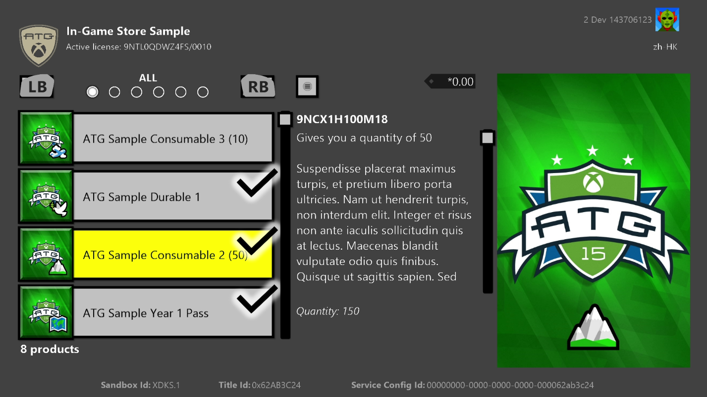
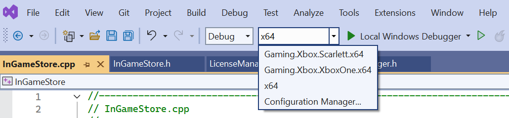
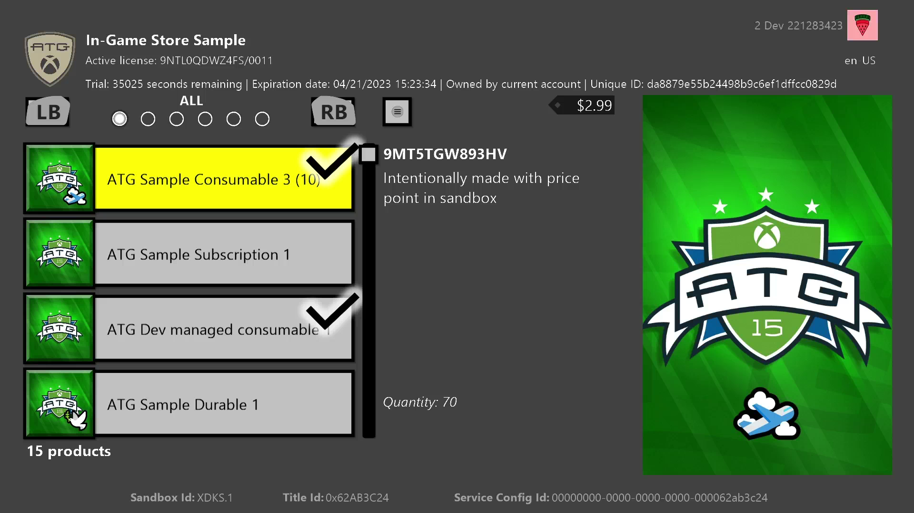
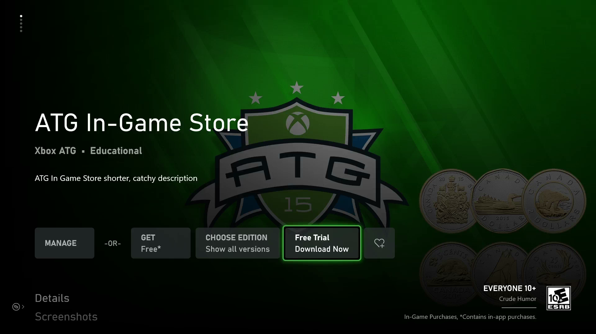
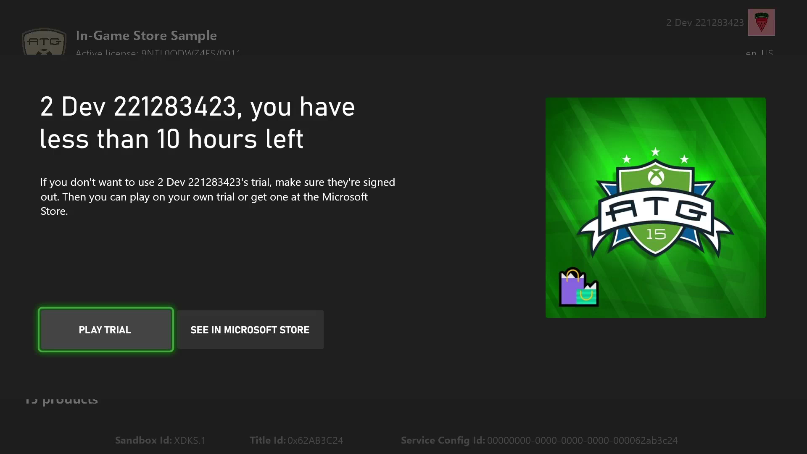
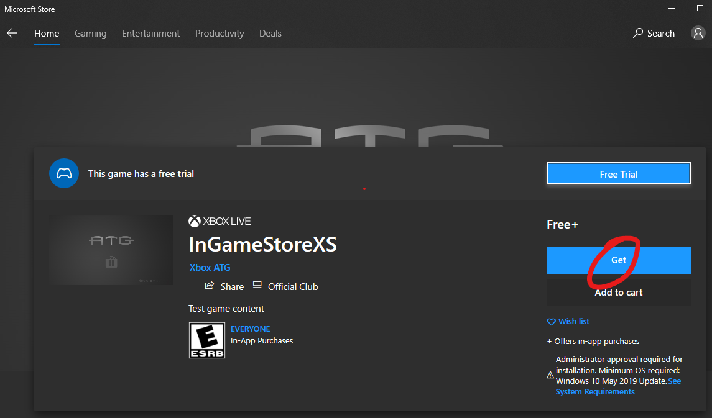
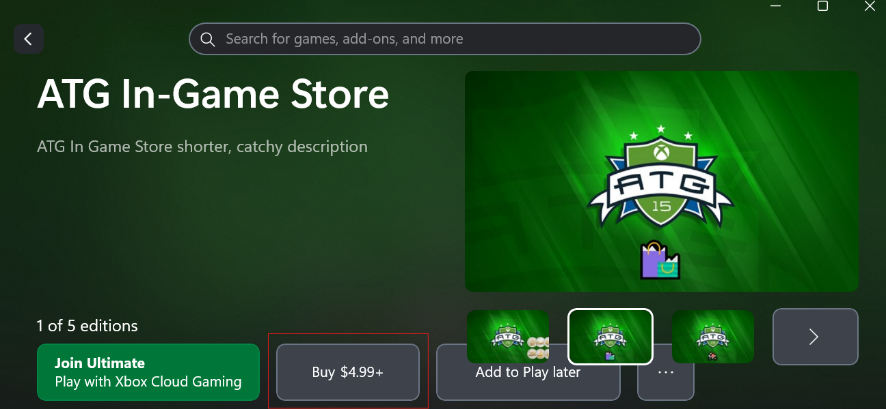

# In-Game Store Sample

This sample is compatible with the Microsoft Game Development Kit (October 2025 and later).

#

# Description

The __In-Game Store__ sample demonstrates client-based APIs ([XStore](https://learn.microsoft.com/en-us/gaming/gdk/_content/gc/reference/system/xstore/xstore_members)) for presenting and operating an in-game storefront.
You can retrieve the game license, query for add-on content available for purchase, retrieve entitled products that the user has already purchased, purchase new content, and license durable products.
See [Impentation notes](#implementation-notes) for details.



# Building the sample

This sample supports Xbox Series X|S (Scarlett), Xbox One, and x64 (Desktop).
Select the target config in the dropdown to build.



*For more information, see __Running samples__, in the GDK documentation.*

# Running the sample

This sample exercises several API that are either specific to an item (purchase, license, etc.) or apply universally for all add-ons (show associated products, query entitled products, etc.).
Select an item in the product list to bring up the item-specific menu; select the menu button (menu button on controller) for the universal menu.

As of June 2023 GDK, the sample no longer requires a content ID or EKBID override specified in the the MicrosoftGameConfig.mgc, nor an account that is entitled to the base game product to run.
The overrides and an entitled account are now only needed for exercising trial scenarios.

To configure the sample to use a real license, see [How to use a real license](#how-to-use-a-real-license).

To configure the sample to run as your own title, see [Pointing sample to your title](#pointing-sample-to-your-title).

# Testing trials (Xbox only)



This sample can run in trial mode, which requires the sample to be configured to use a real license.
The sample is configured with a usage-limited trial that expires after 10 hours of title uptimes.

When the sample operates with a trial license, the product list will include an offer for the base game.
The game license can be upgraded from trial->full by selecting the 'Purchase' option for this offer and completing the in-game purchase flow.

Trial configuration and limits are configured in Partner Center, and requires the title to use the 'Restrictive Licensing' policy.
Contact your Microsoft Account Representative for more details.

Testing trials in sandbox is currently only supported on Xbox console.
On PC, the Xbox App does not expose a 'Free Trial' button.
When running in RETAIL on PC, the Microsoft Store app will show a 'Free Trial' button for games that have a trial configured.

In order to execute the sample in trial mode:

1. Ensure no other account with a license to the sample product is signed in and/or sharing a game license via 'Home Xbox' on console or 'Offline permissions' on PC.

2. Obtain a trial license with a test account.


3. Download the store package fully.

4. Launch the store package, a TCUI should appear stating the approximate gameplay time remaining.



In order to sideload a development build that runs in trial mode:

1. With the package installed in step 3 above, obtain content ID and EKBID.

    a.  __IMPORTANT:__ In this scenario it is necessary to use the __actual__ EKBID from a package downloaded by a trial license owner (i.e. `xbapp getekbid`).

2. Add override values to the sample's MicrosoftGameConfig.mgc (to run this sample in trial mode, set ContentIdOverride to 2797FA46-A93B-494C-AD80-B67C9FCA939F and EKBIDOverride to 37E80840-6BE0-46F8-8EDB-92F877056087).

3. Uninstall the store package, build and deploy.

4. Launch (F5 or from Start menu), observe trial attributes should show in debug console and UI.

In order to see the TCUI trial notification, you need to use a packaged build.

There are two important attributes to check when in trial mode:

- `isTrialOwnedByThisUser`: for usage-based trials, check this to ensure that the game was launched by the user whose account acquired the trial.
If this is not checked, then users can obtain the trial with new accounts and continue playing indefinitely with the original account.

- `trialUniqueId`: this is specific to each trial instance (i.e. tied to each account).
Use this to persist in save game data to ensure that no other account's trial (which will have a different `trialUniqueId`) can read from the save and continue it.

# Pointing sample to your title

You can redirect the sample to use your title configuration in order to test and troubleshoot issues related to product enumeration, purchase, entitlements, and licensing for your game and add-ons.

Note, if you use the same App Identity as your real game, the sample may take the place of an already installed build of your game.
As a result, your title may require reinstallation of your real game after testing with the sample.

1. From your title's MicrosoftGameConfig.mgc. copy over:

    a.  __PC Only__: Identity node; version doesn't matter

    b.  Title ID

    c.  Store ID

    d.  MSA App ID

2. Rebuild and deploy

3. Launch (in your developer sandbox)

We recommend you do a clean rebuild and uninstall all previous installations of the sample that point to other titles.

If you encounter issues on console, do an xbapp list /d on the deployment and ensure that all values match the expected values for your title, aside from the names and version numbers you hadn't changed.

```txt
41336MicrosoftATG.InGameStoreXS_1.0.0.0_neutral\_\_dspnxghe87tn0
Folder:
xD:\\Drives\\Retail\\41336MicrosoftATG.InGameStoreXS_dspnxghe87tn0
Drive: Retail
ContentId: {2797FA46-A93B-494C-AD80-B67C9FCA939F}
ProductId: {4C544E39-5130-3044-C057-5A3446536A00}
EKBID: {37E80840-6BEE-46F8-8EDB-92F877056087}
DisplayName: ATG In-Game Store Sample
41336MicrosoftATG.InGameStoreXS_dspnxghe87tn0!Game
xD:\\Drives\\Retail\\41336MicrosoftATG.InGameStoreXS_dspnxghe87tn0\\InGameStore.exe
```

On PC, you can check the installed app details with get-appxpackage in powershell

```txt
Name : 41336MicrosoftATG.InGameStoreXS
Publisher : CN=A4954634-DF4B-47C7-AB70-D3215D246AF1
Architecture : X64
ResourceId :
Version : 1.0.0.0
PackageFullName :
41336MicrosoftATG.InGameStoreXS_1.0.0.0_x64\_\_dspnxghe87tn0
InstallLocation :
E:\\Repos\\ATGgit\\gx_dev\\Samples\\Live\\InGameStore\\x64\\Debug
IsFramework : False
PackageFamilyName : 41336MicrosoftATG.InGameStoreXS_dspnxghe87tn0
PublisherId : dspnxghe87tn0
IsResourcePackage : False
IsBundle : False
IsDevelopmentMode : True
NonRemovable : False
IsPartiallyStaged : False
SignatureKind : None
Status : Ok
```

# Implementation notes

If multiple users are signed in, the account picker will appear and the StoreContext will be assigned to the selected user.

## Paging

Any API that returns `XStoreProducts` to enumerate can be called with a page size parameter.
Note, this does not correspond to the number of service requests the title makes (this is handled  independently).
For large catalogs, this is useful for segmenting results so the enumeration callback can execute at a more regular interval.
Paging can behave differently between sandbox and RETAIL, so it's important that you fully test your implementation.
To see how paging is used in the sample, check __InGameStore.cpp__ for `QueryCatalog`, `QueryCollections`, and `QueryNextPage`.

## Consumables

The sample's method: `CopyToUIProduct` assigns a quantity value from the `XStoreProduct`.
Consumables theoretically can be configured for multiple SKUs, each of which can be individually purchased and have a separate quantity assigned to it.
The code will simply add them up to present a single quantity.
In practice, consumables will only have a single SKU and the quantity will simply correspond to the product.

Even though the quantity value is obtained and displayed from the queried product results, we recommend obtaining the consumable quantity using a B2B call from a title service.
The collections service endpoints (b2blicensepreview and publisherquery) are the recommended way to do this.

For more information, see [Managing consumable products from your service](https://learn.microsoft.com/en-us/gaming/gdk/docs/store/commerce/service-to-service/xstore-managing-consumables-and-refunds).

## Durable Licensing

Even if a game does not include an in-game storefront, if it supports durable add-ons, then licensing is required.
For more information, see [Granting players access to add-on content](https://learn.microsoft.com/en-us/gaming/gdk/docs/store/commerce/fundamentals/xstore-granting-access-to-content).

For an example of how to license durables (with or without packages), see __LicenseManager.cpp__.
This class provides methods that support the recommended flow for managing licensed content:

1. Preview the license
2. Acquire the license
3. Check if the license is valid
4. Register the license for license lost events
5. If the license is lost, unregister for license lost events and close the license handle

`LicenseManager` is designed to be a standalone class that can be expanded to fit a developer's needs.
All public methods are used by __InGameStore.cpp__ for demonstration and testing purposes.
`AcquireDurableLicenses` serves as a simplified example of bulk licensing that many titles perform early after launch.
It can be called via the 'Acquire Durable licenses' button in the universal menu.
The sample uses a hardcoded list of storeIds to pass to the function, which is populated during __InGameStore.cpp__ initialization.
If the sample has been configured to run as your own title, update this list to reference your own durable products.

# Known issues

For common issues encountered with XStore, see [Troubleshooting XStore development](https://learn.microsoft.com/en-us/gaming/gdk/docs/store/commerce/getting-started/xstore-troubleshooting).

When testing in a PC sandbox environment, `XStoreShowAssociatedProductsUIAsync` and `XStoreShowProductPageUIAsync` (called by `ShowAssociatedProducts` and `ShowProductPage` in the sample) will fail to display content in the store because MSOW does not support sandboxes.
When these methods are called, MSOW will display: "The thing you're looking for isn't here".
These methods do behave as expected when running in RETAIL on PC and for all console environments.

On console, `XStoreShowRateAndReviewUIAsync` (used by `ShowRateAndReview` in the sample) will immediatley return E_ABORT, because the TCUI has been removed from the console store.
We recommend showing the product page instead (`XStoreShowProductPageUIAsync`), which includes an option to rate the game.

If the number of products approaches 200, there may not be sufficient resources to support texture allocation and an exception will occur.
This also happens if navigating between tabs as new textures are assigned to the list items.
If this is a problem, adjust the below line found in __InGameStore.cpp__ to increase the limit:

```cpp
auto styleRenderer = std::make_unique<UIStyleRendererD3D>(*this, 200, os.right, os.bottom);
```

# How to use a real license

To obtain a valid license for the sample for your test account, ensure you are in sandbox __XDKS.1__ (any @xboxtest.com account can access this sandbox), then go the store page for the sample product to acquire a license:

__Console:__

In a Gaming command prompt: `xbapp launch ms-windows-store://pdp/?productid=9NTL0QDWZ4FS`



__PC:__

Run box (Win+R): `msxbox://game/?productId=9NTL0QDWZ4FS` to view the sample's PDP page in the Xbox App.



Select "Get" (if the product is free) or "Buy" (for products with a non-zero price) to obtain a product license for the account.
It is not necessary to wait for the download to complete.

Note: The sample installed from the store will be properly licensed and functional, but may represent a different version of the sample.

__Xbox only:__ A __locally deployed build__ (i.e. push or run from PC) will use a test license by default.
Add the following lines to the MicrosoftGameConfig.mgc to allow the sample to use the real license obtained from the store purchase in the step above.

```xml
<DevelopmentOnly>
  <ContentIdOverride>2797FA46-A93B-494C-AD80-B67C9FCA939F</ContentIdOverride>
  <EKBIDOverride>00000000-0000-0000-0000-000000000001</EKBIDOverride>
</DevelopmentOnly>
```

Content ID must match the value assigned to the package that was submitted to the sandbox.

EKBID can be anything other than all zeroes or the default 33EC8436-5A0E-4F0D-B1CE-3F29C3955039.

A __locally packaged build__ (i.e. not installed from store) will also use a test license by default, and the overrides present in the MicrosoftGameConfig.mgc will not be used.
Licensing local packages will require four things:

1. __Identity name__ and __publisher__ in MicrosoftGameConfig.mgc matches values assigned to your title in Partner Center.

2. __Store ID__ in MicrosoftGameConfig.mgc matches your title's value in Partner Center.

3. Package built with __content ID__ (makepkg pack called with /contentId) that matches the value assigned to the package when it was ingested to sandbox.

4. __EKBID__ set to a GUID that is not all zeroes or the default value after package installation:

> xbapp setekbid *\<pfn\>* {*\<EKBIDOverride value\>*}
>
> \<pfn\> is the installed package full name or package family name
>
> Ensure you have the braces around the EKBID, e.g.
>
> xbapp setekbid
> 41336MicrosoftATG.InGameStoreXS_1.0.0.0_neutral\_\_dspnxghe87tn0
> {00000000-0000-0000-0000-000000000001}
>
> or
>
> xbapp setekbid 41336MicrosoftATG.InGameStoreXS_dspnxghe87tn0!Game
> {00000000-0000-0000-0000-000000000001}

The best way to obtain the content ID, proper EKBID (not required for full game licensing), and PFN is to install the package from the store when running in the target sandbox.
After installation, run xbapp list /d to get the package's details.

```txt
Registered Applications by Package Full Name:
41336MicrosoftATG.InGameStoreXS_1.0.0.0_neutral\_\_dspnxghe87tn0
Install
Drive: Retail
Size: 0.28 GB.
ContentId: {2797FA46-A93B-494C-AD80-B67C9FCA939F}
ProductId: {4C544E39-5130-3044-C057-5A3446536A00}
EKBID: {37E80840-6BEE-46F8-8EDB-92F877056087}
DisplayName: ATG In-Game Store Sample
41336MicrosoftATG.InGameStoreXS_dspnxghe87tn0!Game
```

These values can also be seen onscreen by selecting 'Menu' on the installed title's tile in 'My Games' and looking at 'File Info'.

EKBID is visible upon package registration (i.e.'Ready to Launch'), so if your title's package is large, the remaining download can be cancelled after you have obtained the EKBID and intend to deploy or sideload your development build instead.
The exact EKBID is not strictly needed unless you wish to test trial scenarios (see below).

## Explanation

On Xbox console, a license is obtained using a combination of the content ID, product ID and EKBID.
For builds not obtained through consumer channels (i.e. from the Microsoft Store or retail), these attributes must be manually applied to match the title's package submission to a sandbox.

Loose file deploys are unlicensed and are not associated with a real content ID.
Use the override values in the MicrosoftGameConfig.mgc to apply real IDs to local builds.

Locally built packages can be created with the correct content ID and a non-test EKBID can be set after package installation.
Set content ID + EKBID to mimic how licensing works with a package obtained from the store.

Product ID is derived from the Store ID so it never needs to be manually set, just ensure that you use the correct Store ID in the MicrosoftGameConfig.mgc.

All these steps still require that a product be configured and published to the sandbox.
Content ID is assigned upon initial submission of a package for the product.

On PC, the license is generated from the combination of App Identity and the content ID, setting these to match the canonical values of a published product available in the same sandbox will suffice to allow the sample to run in a licensed state.

For more information, see [Enabling license testing](https://learn.microsoft.com/en-us/gaming/gdk/docs/store/commerce/getting-started/xstore-licensing-setup).

# Privacy statement

When compiling and running a sample, the file name of the sample executable will be sent to Microsoft to help track sample usage.
To opt-out of this data collection, you can remove the block of code in Main.cpp labeled "Sample Usage Telemetry".

For more information about Microsoft's privacy policies in general, see the [Microsoft Privacy
Statement](https://privacy.microsoft.com/en-us/privacystatement/).

# Update history

__Initial Release:__ April 2019

__Update:__ April 2020

__Update:__ May 2020

__Update:__ September 2020

__Update:__ June 2021

__Update:__ June 2022

__Update:__ June 2023

__Update:__ January 2024

__Update:__ April 2026
