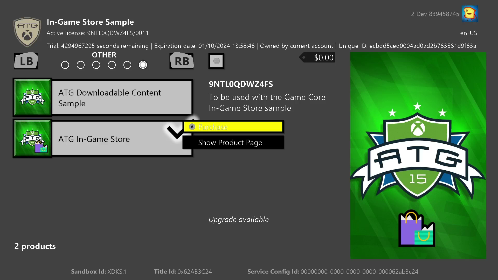
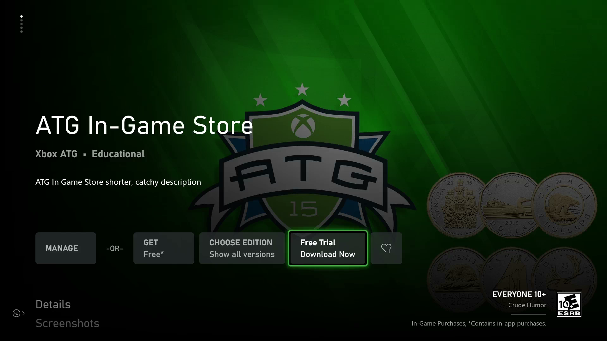
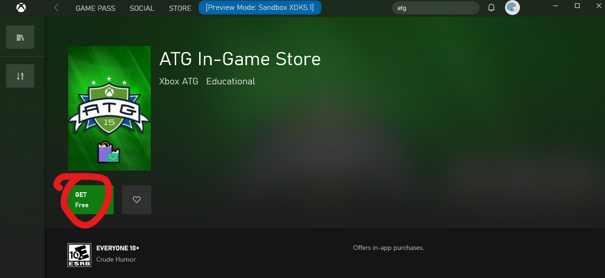

  

#   In-Game Store Sample

*This sample is compatible with the Microsoft Game
Development Kit (June 2023)*

# 

# Description

This sample demonstrates the client-based operations used in presenting
and operating an in-game storefront. This also shows how to examine game
license information, including how to enable and check for trial status.


# Building the sample

This sample supports Xbox One, Xbox Series X|S, and Desktop. Select the
config in the dropdown to build.


*For more information, see* __Running samples__, *in the GDK documentation.*

# Running the sample

The example exercises several API that are either specific to an item
(purchase, license, etc.) or universally (show associated products,
query entitled products, etc.). Select an item in the product list to
bring up the item-specific menu; select the menu button (menu button on
controller) for the universal menu.

As of June 2023 GDK, the sample no longer requires a content ID or EKBID 
override specified in the the MicrosoftGameConfig.mgc, nor an account 
that is entitled to the base game product. The overrides and an entitled 
account are now only needed for exercising trial scenarios.

To configure the sample to use a real license, follow the instructions 
in the section [How to use a real license](#how-to-use-a-real-license).

# Testing trials (Xbox only)



This sample can also be run in trial mode. 
This requires the sample to be configured to use a real license. 
This uses a product that is configured with a usage-based trial that expires after 10 hours of 
title uptimes.

When the game is operating with a trial license, the product list will include an offer for the base game.
The game license can be upgraded from trial->full by selecting the 'Purchase' option for this offer and completing the in-game purchase flow.

Trial configuration and limits are configured in Partner Center, and
requires the title to use the Restrictive Licensing policy.
Contact your Microsoft Account Representative for more details.

Trials are only currently supported on Xbox. The Store page on PC for
this product will not show a trial acquisition button.

In order to execute in trial mode:

1.  Ensure no other account with any license to the sample product is
    signed in (or present in the case the console is set as Home Xbox
    for any owner account)

2.  Obtain a trial license with a test account



3.  Download store package fully

4.  Launch the store package, a TCUI should show up stating the
    approximate gameplay time remaining


In order to sideload development build that runs in trial mode:

1.  With the package installed in step 3 above, obtain content ID and
    EKBID

    a.  **IMPORTANT:** In this scenario it is necessary to use the
        **actual** EKBID from a package downloaded by a trial license
        owner (i.e. `xbapp getekbid`)

2.  Add override values to development build's MicrosoftGameConfig.mgc

3.  Uninstall store package, build and deploy

4.  Launch (F5 or from Start menu), observe trial attributes should show
    in debug and UI

In order to see the TCUI trial notification, you need to use a packaged
build.

There are two important attributes to check when in trial mode,
depending on platform and scenario:

-   isTrialOwnedByThisUser: for usage-based trials, check this to ensure
    that the game was launched by the user whose account acquired the
    trial. If this is not checked, then users can obtain the trial with
    new accounts and continue playing indefinitely with the first
    account.

-   trialUniqueId: this is specific to each trial instance, i.e. for an
    account. Use this to persist in save game data to ensure that no
    other account's trial (which will have a different trialUniqueId)
    can read from the save and continue it.

# Pointing sample to your title

You can redirect the sample to use your title configuration in order to
test and troubleshoot product enumeration and purchase functionality
related to your addons. 

Note if you use the same App Identity this may take the place of any
installed build, so be aware as installing the sample as your title
may incur subsequent reinstallation of your real game build.

1.  From your title's MicrosoftGameConfig.mgc. copy over

    a.  **PC Only**: Identity node; version doesn't matter

    b.  Title ID

    c.  Store ID

    d.  MSA App ID (if using <Game configVersion="1">)
 
3.  Rebuild and deploy

4.  Launch (in your developer sandbox)

It is recommended you do a clean rebuild and uninstall all previous
installations of the sample that points to any other title.

If you encounter issues on Xbox, do an xbapp list /d on the deployment
and ensure that all values match the expected values of your title's,
aside from the names and version numbers you hadn't changed. 

```txt
41336MicrosoftATG.InGameStoreXS_1.0.0.0_neutral\_\_dspnxghe87tn0
Folder:
xD:\\Drives\\Retail\\41336MicrosoftATG.InGameStoreXS_dspnxghe87tn0
Drive: Retail
ContentId: {2797FA46-A93B-494C-AD80-B67C9FCA939F}
ProductId: {4C544E39-5130-3044-C057-5A3446536A00}
EKBID: {37E80840-6BEE-46F8-8EDB-92F877056087}
DisplayName: ATG In-Game Store Sample
41336MicrosoftATG.InGameStoreXS_dspnxghe87tn0!Game
xD:\\Drives\\Retail\\41336MicrosoftATG.InGameStoreXS_dspnxghe87tn0\\InGameStore.exe
```

On PC, you can check the installed app details with get-appxpackage in
powershell

```txt
Name : 41336MicrosoftATG.InGameStoreXS
Publisher : CN=A4954634-DF4B-47C7-AB70-D3215D246AF1
Architecture : X64
ResourceId :
Version : 1.0.0.0
PackageFullName :
41336MicrosoftATG.InGameStoreXS_1.0.0.0_x64\_\_dspnxghe87tn0
InstallLocation :
E:\\Repos\\ATGgit\\gx_dev\\Samples\\Live\\InGameStore\\Gaming.Desktop.x64\\Debug
IsFramework : False
PackageFamilyName : 41336MicrosoftATG.InGameStoreXS_dspnxghe87tn0
PublisherId : dspnxghe87tn0
IsResourcePackage : False
IsBundle : False
IsDevelopmentMode : True
NonRemovable : False
IsPartiallyStaged : False
SignatureKind : None
Status : Ok
```

# Implementation notes

If multiple users are signed in, the account picker will show and the
StoreContext will be assigned to selected user.

## Paging

Any of the API that returns `XStoreProducts` to enumerate can be called
with a page size parameter. Note that this does not correspond to the
number of service requests the title makes (this is handled 
independently). This is useful for segmenting your results so the
enumeration callback can execute at a more regular interval for large 
catalogs.

## Consumables

This sample in `CopyToUIProduct` assigns a quantity value from the
`XStoreProduct`. Consumables theoretically can be configured for multiple
SKUs, each of which can be individually purchased and have a separate
quantity assigned to it. The code will simply add them up to present a
single quantity. In practice, consumables will only have a single SKU
and the quantity will simply correspond to the product.

Even though the quantity value is obtained and displayed from the
queried product results, it is recommended to obtain the consumable
quantity using a B2B call from a title service. The collections service
and the b2blicensepreview and publisherquery endpoints are the
recommended way to do this.

Please refer to the documentation on collections for more details.

# Known issues

`XStoreRegisterPackageLicenseLost` may give an exception for PC when
called on an `XStoreLicenseHandle` for a Durable (without package) type.
This is known issue at least with Microsoft.GamingServices version
2.53.17003.0 and is being investigated. Comment it out to bypass.

If the number products of approaches 200, there may not be sufficient
resources to support texture allocation and an exception will occur.
This also happens if navigating between tabs as new textures are
assigned to the list items. If this is a problem, adjust the below line
to increase the limit:

```cpp
auto styleRenderer = std::make_unique<UIStyleRendererD3D>(*this, 200);
```

# How to use a real license

To obtain a valid license for the sample for your test account, ensure
you are in sandbox **XDKS.1** (any developer account can use this
sandbox), then go the store page for the sample product to acquire a
license:

**Xbox:**

In Gaming command prompt: `xbapp launch ms-windows-store://pdp/?productid=9NTL0QDWZ4FS`

**PC:**

Run box (Win+R):

`ms-windows-store://pdp/?productid=9NTL0QDWZ4FS`

or

`msxbox://game/?productId=9NTL0QDWZ4FS`

Select "Get" to obtain a product license for the account. It is not
necessary to wait for the download to complete:




The sample as installed from the store will be properly licensed and
function properly, but may represent an older version of the sample.

**Xbox only:** A **locally deployed build** (i.e. push or run from PC)
will not be licensable by default. Add the following lines to the 
MicrosoftGameConfig.mgc to allow the sample to be able to recognize
a license in the above step.

```xml
<DevelopmentOnly>
  <ContentIdOverride>2797FA46-A93B-494C-AD80-B67C9FCA939F</ContentIdOverride>
  <EKBIDOverride>00000000-0000-0000-0000-000000000001</EKBIDOverride>
</DevelopmentOnly>
```

Content ID must match that assigned to the package submitted the sandbox
in Partner Center.

EKBID can be anything other than all zeroes or the default
33EC8436-5A0E-4F0D-B1CE-3F29C3955039.

A **locally built packaged build** (i.e. not installed from store) will
also not be licensable, and the overrides present in the
MicrosoftGameConfig.mgc will also not apply. Licensing will require four
things:

1.  **Identity name** and **publisher** that matches the one assigned to
    your title in Partner Center

2.  **Store ID** that matches your title's

3.  Package built with **content ID** that matches the one assigned to
    the ingested package in sandbox

4.  **EKBID** set to a GUID that is not all zeroes or the default value:

> xbapp setekbid *\<pfn\>* {*\<EKBIDOverride value\>*}
>
> \<pfn\> is the installed package full name or package family name
>
> Ensure you have the braces around the EKBID, e.g.
>
> xbapp setekbid
> 41336MicrosoftATG.InGameStoreXS_1.0.0.0_neutral\_\_dspnxghe87tn0
> {00000000-0000-0000-0000-000000000001}
>
> or
>
> xbapp setekbid 41336MicrosoftATG.InGameStoreXS_dspnxghe87tn0!Game
> {00000000-0000-0000-0000-000000000001}

The best way to obtain the content ID, the proper EKBID (not required),
and PFN is to install the ingested and published package from sandbox
and then running xbapp list /d

```txt
Registered Applications by Package Full Name:
41336MicrosoftATG.InGameStoreXS_1.0.0.0_neutral\_\_dspnxghe87tn0
Install
Drive: Retail
Size: 0.28 GB.
ContentId: {2797FA46-A93B-494C-AD80-B67C9FCA939F}
ProductId: {4C544E39-5130-3044-C057-5A3446536A00}
EKBID: {37E80840-6BEE-46F8-8EDB-92F877056087}
DisplayName: ATG In-Game Store Sample
41336MicrosoftATG.InGameStoreXS_dspnxghe87tn0!Game
```

These values can also be seen onscreen by selecting Menu on the
installed title's tile in My Games and looking at File Info.

In the case of EKBID, this is visible upon package registration, i.e.
Ready to Launch, so if your title's package is large, this can be
cancelled at this time once you have the EKBID and intend to deploy or
sideload your development build instead. This is not strictly needed
unless you wish to test trial scenarios (see below).

## Explanation

On Xbox, a license is obtained using a combination of the content ID,
product ID and the EKBID. For builds not obtained through consumer
channels (i.e. from the Microsoft Store or from retail), these
attributes must be manually applied to match that of that title's
package submission to a sandbox.

Loose file deploys are unlicensed and are not associated with a real
content ID. The override values in the MicrosoftGameConfig.mgc is how to
apply the real IDs to local builds.

Locally built packages can be created with the correct content ID and
applying a non-test EKBID to this installed package will allow the
proper combination to mimic a package obtained from store.

Product ID is derived from the Store ID so this never needs to be
manually set, only that you use the correct Store ID.

All these steps still require a product be configured and published to
the sandbox. Content ID is assigned upon initial submission of a package
for the product. See the Packages section in Partner Center to find this.

On PC, the license is generated from the combination of app identity and
the content ID, having these match the canonical values of a published
product available in the same sandbox will suffice to allow the sample
to run in licensed state.

# Privacy statement

When compiling and running a sample, the file name of the sample
executable will be sent to Microsoft to help track sample usage. To
opt-out of this data collection, you can remove the block of code in
Main.cpp labeled "Sample Usage Telemetry".

For more information about Microsoft's privacy policies in general, see
the [Microsoft Privacy
Statement](https://privacy.microsoft.com/en-us/privacystatement/).

# Update history

**Initial Release:** April 2019

**Update:** April 2020

**Update:** May 2020

**Update:** September 2020

**Update:** June 2021

**Update:** June 2022

**Update:** June 2023

**Update:** January 2024
