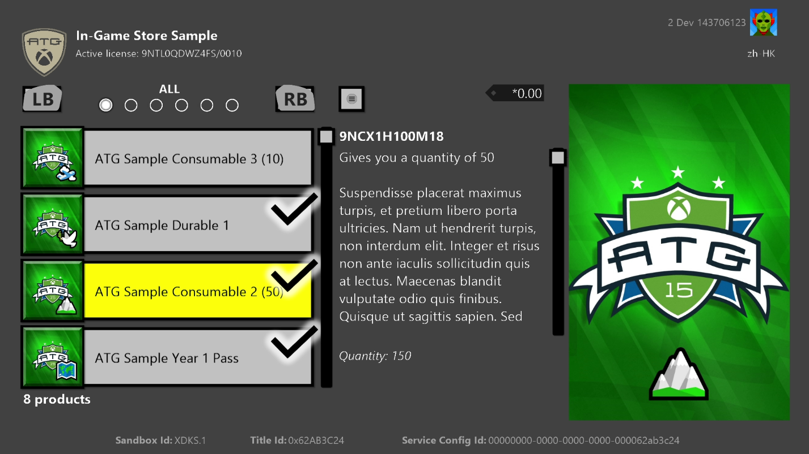
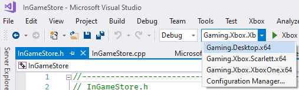

  

#   InGameStore と試行版サンプル

*このサンプルは、Microsoft ゲーム開発キットのプレビュー (2019 年 11 月)
に対応しています。*

# 

# 説明

このサンプルでは、ゲーム内のネットショップを表示および操作するときに使用するクライアント
ベースの操作について示します。また、試行版ステータスの適用と確認を含め、ゲームのライセンス情報を検証する方法についても説明します。

# サンプルの作成

Project Scarlett を使用している場合は、Gaming.Xbox.Scarlett.x64
プラットフォーム構成をプロジェクトに追加する必要があります。この操作は、*構成マネージャー*を使って行うことができます。\[アクティブなソリューション
プラットフォーム\] で \[構成マネージャー\] オプションを選択し、次に
\[新規作成\...\]
を選択します。\[新しいプラットフォームの入力または選択\] を
Gaming.Xbox.Scarlett.x64 に、\[設定のコピー元\] を
Gaming.Xbox.XboxOne.x64 に設定します。次に \[OK\] を選択します。

*詳細については、*GDK ドキュメントの
「サンプルの実行」を参照してください。

# サンプルの実行

XStore API
の使用に関する主な特徴は、機能させるには有効なライセンスが求められるという点です。詳細については、「XStore
API をテストするための製品のセットアップ」を参照してください。

ライセンスは、ゲームの起動時にライセンス
サービスの呼び出しにより確認されます。これが利用できない場合、XStore API
は一般に、有効なライセンスが見つからないことを示す 0x803f6107
(IAP_E\_UNEXPECTED) を返します。

テスト用アカウントのサンプルに必要な有効なライセンスを取得するには、サンドボックス
**XDKS.1** を使用していることを確認して以下のいずれかを実行します
(開発者アカウントであればこのサンドボックスを使用できます)。

1.  このコマンドを実行して、サンプル製品の Microsoft Store
    ページに直接アクセスします。

xbapp launch ms-windows-store://pdp/?productid=9NTL0QDWZ4FS

または

2.  サンプルがストアからインストールされている場合、\[マイ ゲーム &
    アプリ\] \> \[ゲーム & アドオンの管理\] \> \[Microsoft Store
    で確認\] を選択して製品タイトルに移動します。

\[取得\]
を選択して、アカウントの製品ライセンスを取得します。ダウンロードが完了するまで待機する必要はありません
(EKBID が不明の場合を除き、以下を参照)。

ストアからインストールされたサンプルは、正しくライセンスが付与され、機能しますが、旧バージョンのサンプルを表示する場合があります。

**ローカルに展開されたビルド** (つまり、PC からプッシュまたは実行)
には、既定ではライセンスを取得できませんが、microsoftgame.config
にコンテンツ ID と EKBID
の開発専用の上書き値が含まれている場合は、適切にライセンスを取得して
XStore API を使用することができます。このサンプルの microsoftgame.config
のセクションに注意してください。

\<DevelopmentOnly\>

\<ContentIdOverride\>2797FA46-A93B-494C-AD80-B67C9FCA939F\</ContentIdOverride\>

\<EKBIDOverride\>37E80840-6BEe-46F8-8EDB-92F877056087\</EKBIDOverride\>

\</DevelopmentOnly\>

この設定が完了し、製品にライセンスを取得したアカウントを使うと、サンプルはライセンス取得済みの状態で実行されます。

**ローカルに構築されたパッケージ ビルト**
(つまりストアからインストールされていない)
にもライセンスを取得できません。また、microsoftgame.config
に表示された上書き値も適用されません。ライセンスの取得には次の 4
つが必要です。

1.  パートナー センターでタイトルに割り当てられたものと一致する ID
    名とパブリッシャー

2.  ユーザーのタイトルと一致する Store ID

3.  サンドボックスで取り込まれたパッケージに割り当てられたものと一致するコンテンツ
    ID で構築されたパッケージ

4.  ストア ビルドに関連付けられている上書き値に設定された EKBID:

> xbapp setekbid *\<pfn\>* {*\<EKBIDOverride value\>*}
>
> \<pfn\> はインストールされたパッケージの完全な名前か、パッケージ
> ファミリの名前です
>
> 以下のように EKBID の周囲に中括弧があることを確認します。
>
> xbapp setekbid
> 41336MicrosoftATG.InGameStoreXS_1.0.0.0_neutral\_\_dspnxghe87tn0
> {37E80840-6BEe-46F8-8EDB-92F877056087}
>
> または
>
> xbapp setekbid 41336MicrosoftATG.InGameStoreXS_dspnxghe87tn0!Game
> {37E80840-6BEe-46F8-8EDB-92F877056087}

コンテンツ ID、EKBID、および PFN
を取得する最適な方法は、サンドボックスから取り込まれ、発行されたパッケージをインストールした後、xbapp
list /d を実行することです。

パッケージの完全な名前で登録されたアプリケーション:

41336MicrosoftATG.InGameStoreXS_1.0.0.0_neutral\_\_dspnxghe87tn0

Install

Drive:Retail

Size:0.28 GB.

ContentId: {2797FA46-A93B-494C-AD80-B67C9FCA939F}

ProductId: {4C544E39-5130-3044-C057-5A3446536A00}

EKBID: {37E80840-6BEE-46F8-8EDB-92F877056087}

DisplayName:ATG In-Game Store Sample

41336MicrosoftATG.InGameStoreXS_dspnxghe87tn0!Game

これらの値は、画面で \[マイ ゲーム\]
のインストールされているタイトルのタイルのタイルの \[メニュー\]
を選択して、\[ファイル情報\] で確認することもできます。

EKBID の場合、これはパッケージ登録時、つまり、「Ready to Launch
(実施準備済み)」のときに表示されます。そのため、タイトルのパッケージが大きい場合、EKBID
があり、代わりに開発ビルドを展開またはサイドロードしたら、この時点でキャンセルできます。

## 説明

ライセンスは、コンテンツ ID、製品 ID、EKBID
の組み合わせで取得されます。消費者向けチャネルを介して
(つまり、Microsoft Store または小売り店から)
取得されなかったビルドの場合、これらの属性を手動で適用し、タイトルのパッケージ提出の属性をサンドボックスに一致させる必要があります。

ルーズ
ファイルのデプロイはライセンスで許可されておらず、実際のコンテンツ ID
に関連付けられていません。microsoftgame.config の上書き値は、実際の ID
をローカル ビルドに適用する方法です。

ローカルに構築されたパッケージは、正しいコンテンツ ID
を使用して作成できます。このインストールされたパッケージに EKBID
を適用すると、ストアから取得されたパッケージを模倣する適切な組み合わせが可能となります。

製品 ID は、Store ID
から取得されるため、手動で設定する必要はありません。必要なのは正しいストア
ID を使用することのみです。

これらの手順を実行するには、製品を構成し、サンドボックスに発行する必要があります。提出後にコンテンツ
ID
を検索する場所については、アカウント担当者にお問い合わせください。コンテンツ
ID はサンドボックスごとに異なる場合があります。

# 試用版のテスト

このサンプルは、試用版モードでも実行できます。このサンプルが既定に指定する製品は、使用率ベースの試用版で構成されています。取得後、ライセンス所有者には
10 時間のタイトル稼働時間が提供されます。この稼働時間はパートナー
センターで構成されており、タイトルは制限付きのライセンス
ポリシーを使用するように求められます。詳細については、Microsoft
アカウント担当者にお問い合わせください。

試行版モードで実行する方法:

1.  サンプル製品のライセンスを保有する他のアカウントがサインインしていないこと、またはコンソールが任意の所有者アカウントのホーム
    Xbox に設定されている場合は存在しないことを確認します

2.  テスト用アカウントで使用する試用版ライセンスを取得します

3.  ストア パッケージをすべてダウンロードします

4.  ストア パッケージを起動すると、TCUI
    が表示され、おおよその残りプレー時間が表示されます

試用版モードで実行する開発ビルドをサイドロードする方法:

1.  上記の手順 3 でインストールしたパッケージで、コンテンツ ID と EKBID
    を取得します

2.  開発ビルドの microsoftgame.config の上書き値を更新して一致させます

3.  ストア パッケージをアンインストールし、構築および展開します

4.  起動して、試用版の属性がデバッグと UI に表示されることを確認します

TCUI 試用版通知を確認するには、makepkg を使用してパッケージ
ビルドを追加で作成し、xbapp インストールでインストールする必要があります

この試用版モードでは、完全版へのアップセルを円滑にするため、サンプル製品自体を示したカタログに追加のアイテムが表示されます。

プラットフォームやシナリオに応じて、次の 2
つの重要な属性を確認してください。

-   isTrialOwnedByThisUser:
    使用率ベースの試用版では、このチェックボックスをオンにして、ゲームが試用版のアカウントを保有するユーザーによって起動されたことを確認するようにします。オフにした場合、ユーザーは新しいアカウントを使用して試用版を取得し、最初のアカウントを使用して無期限にプレイを続けることができます。

-   trialUniqueId:
    これは各試用版のインスタンス、つまりアカウントに固有です。これを使用して保存ゲーム
    データに保持すると、他のアカウントの試用版 (別の trialUniqueId
    を保有) は、この保存データから読み込み、続けることができません。

# サンプルに自分のタイトルを指定させる

サンプルを自分のタイトル構成にリダイレクトすると、自分のアドオンに関連する製品の列挙および購入機能をテストおよびトラブルシューティングできます。これは、インストールされている任意のビルドに置き換わることに注意してください。そのため、サンプルをタイトルとしてインストールすると、後に再インストールのコストが発生する場合があります。

1.  サンドボックス用にプロビジョニングされていて、タイトルを保有するテスト用アカウントを使用する

2.  自分のタイトルの microsoftgame.config. から、以下をコピーする

    a.  ID ノード (バージョンは問わない)

    b.  タイトル ID

    c.  Store ID

    d.  ContentIdOverride および EKBIDOverride

3.  再構築して展開する

4.  起動する (開発者用サンドボックスを使用)

クリーンな再構築を実行し、他のタイトルを指定するサンプルの過去のインストールをすべてアンインストールすることをお勧めします。

問題が発生した場合は、展開時に xbapp list /d
を実行して、変更していない名前とバージョン番号を除き、すべての値が使用しているタイトルの予測値と一致することを確認します。PFN
のアプリ ID
とパブリッシャーの関数であるサフィックスが一致することを確認します。

# 実装に関する注意事項

複数のユーザーがサインインしている場合は、アカウントの選択が表示され、選択したユーザーに
StoreContext が割り当てられます。

## ページング

XStoreProducts を返して列挙する API のいずれかをページ サイズ
パラメーターで呼び出すことができます。このサンプルでは、ページ
サイズを人為的に低く設定して、ページング処理コードを実行します。妥当なページ
サイズは 25 です。これは、タイトルが作成するサービス
リクエスト数には対応しないことに注意してください
(自動的に処理されます)。これは、結果をセグメント化する場合に便利です。列挙型コールバックは、大規模なカタログに対して、より一定した間隔で実行できるようになります。

## コンシューマブル

CopyToUIProduct のこのサンプルは、XStoreProduct
からの数量値を割り当てます。コンシューマブルは理論上、複数の SKU
に対して構成でき、それぞれ個別に購入し、個別の数量を割り当てることが可能です。このコードはそれらを合算し、1
つの数量で提示します。実際、コンシューマブルには SKU が 1
つのみが含まれ、この数量は製品に対応しています。

照会した製品結果から数量値を取得して表示した場合でも、コンシューマブルは、タイトル
サービスからの b2b
呼び出しにより取得することをお勧めします。これを実行する方法として、コレクション
サービスと b2blicensepreview
エンドポイントをお勧めします。詳細については、コレクションのドキュメントを参照してください。

# 既知の問題

このサンプルの基となる以前の InGameStore (WSS) では、アプリの UI
でダウンロードされた画像が使用されていました。 この機能は、Microsoft
Game Core バージョンにまだ移植されていないため、すべての製品で、ATG
画像のプレースホルダーが表示されます。

現在、Gaming.Desktop.x64 ビルドは機能しません。
このサンプルのデスクトップ バージョンについては、InGameStore_Desktop
を参照してください。

# プライバシーに関する声明

サンプルをコンパイルして実行すると、サンプルの使用状況を追跡するため、サンプル実行可能ファイルのファイル名が
Microsoft に送信されます。このデータ収集を無効にするには、「Sample Usage
Telemetry」とラベル付けされた Main.cpp
内のコードのブロックを削除します。

Microsoft のプライバシーに関する声明の詳細については、「[Microsoft
のプライバシーに関する声明](https://privacy.microsoft.com/en-us/privacystatement/)」を参照してください。

# 更新履歴

**初期リリース:**2019 年 4 月

**更新:**2020 年 4 月
