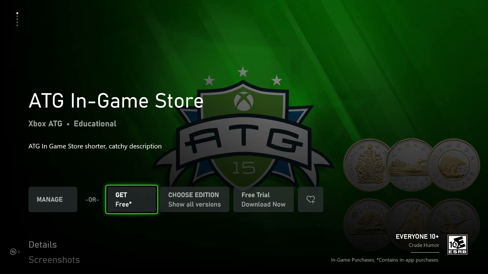

  

#   InGameStore 및 평가판 샘플

*이 샘플은 Microsoft 게임 개발 키트 미리 보기와 호환됩니다(2019년
11월).*

# 

# 설명

이 샘플에서는 게임 내 상점를 제공하고 운영하는 데 사용되는 클라이언트
기반 작업을 보여 줍니다. 또한 평가판을 적용하고 평가판 상태를 확인하는
방법을 비롯하여 게임 라이선스 정보를 검토하는 방법도 보여 줍니다.

# 샘플 빌드하기

Project Scarlett을 사용하는 경우에는 프로젝트에 Gaming.Xbox.Scarlett.x64
플랫폼 구성을 추가해야 합니다. *Configuration Manager*를 통해 이 작업을
수행할 수 있습니다. "활성 솔루션 플랫폼"에서 "Configuration Manager"
옵션을 선택하고 "새로 만들기\..."를 선택합니다. "새 플랫폼 입력 또는
선택"을 Gaming.Xbox.Scarlett.x64로 설정하고 "다음에서 설정 복사"를
Gaming.Xbox.XboxOne.x64로 설정합니다. 그런 다음, 확인을 선택합니다.

*자세한 내용은 GDK 문서에서* 샘플 실행하기*를 참조하세요.*

# 샘플 실행하기

XStore API 사용의 주요 특징은 기능을 발휘하려면 유효한 라이선스가 있어야
한다는 것입니다. 자세한 내용은 "XStore API를 테스트하기 위한 제품
설정"이라는 제목의 GDK 문서를 참조하세요.

유효한 라이선스가 있는지는 게임이 시작될 때 라이선싱 서비스가 호출되면서
확인됩니다. 이 서비스를 사용할 수 없으면 XStore API는 일반적으로 유효한
라이선스를 찾지 못했음을 나타내는 0x803f6107(IAP_E\_UNEXPECTED)을
반환합니다.

테스트 계정을 위해 샘플에 대한 유효한 라이선스를 얻으려면 샌드박스
**XDKS.1**(모든 개발자 계정에서 이 샌드박스를 사용할 수 있음)을 사용하고
있는지 확인합니다. 그런 다음

1.  다음 명령을 실행하여 샘플 제품의 스토어 페이지로 직접 연결합니다.

xbapp launch ms-windows-store://pdp/?productid=9NTL0QDWZ4FS

또는

2.  스토어를 통해 샘플을 설치한 경우, 내 게임 및 앱 \> 게임 및 추가 기능
    관리 \> Microsoft Store에서 보기에서 제품 타일로 이동합니다.

"가져오기"를 선택하여 계정에 대한 제품 라이선스를 구합니다. 다운로드가
완료될 때까지 기다릴 필요는 없습니다(EKBID가 알려지지 않은 경우에는
다음을 참조하세요).

스토어에서 설치된 샘플은 제대로 사용이 허가되고 적절히 작동하지만 이전
버전의 샘플을 나타낼 수 있습니다.

**로컬 배포 빌드**(즉, PC에서 푸시 또는 실행)는 기본적으로 사용이 허가될
수 없지만, microsoftgame.config에 콘텐츠 ID와 EKBID에 대한 개발 전용
재정의 값이 포함되어 있는 경우에는 올바로 사용 허가를 받고 XStore API를
작동할 수 있습니다. 다음 샘플의 microsoftgame.config에서 이 섹션을
확인하세요.

\<DevelopmentOnly\>

\<ContentIdOverride\>2797FA46-A93B-494C-AD80-B67C9FCA939F\</ContentIdOverride\>

\<EKBIDOverride\>37E80840-6BEe-46F8-8EDB-92F877056087\</EKBIDOverride\>

\</DevelopmentOnly\>

이 상태가 유지되고 제품 사용이 허가된 계정과 함께 사용하는 경우, 샘플은
사용 허가된 상태로 실행됩니다.

**로컬 빌드된 패키지 빌드**(즉, 스토어에서 설치되지 않음) 역시 사용
허가될 수 없으며, microsoftgame.config에서의 재정의도 적용되지 않습니다.
라이선싱에는 네 가지 항목이 필요합니다.

1.  파트너 센터에서 자신의 타이틀에 할당된 것과 일치하는 ID 이름 및
    게시자

2.  사용자 타이틀과 일치하는 스토어 ID

3.  샌드박스에 수집된 패키지에 할당된 것과 일치하는 콘텐츠 ID로 빌드된
    패키지

4.  스토어 빌드와 연결된 재정의 값으로 설정된 EKBID:

> xbapp setekbid *\<pfn\>* {*\<EKBIDOverride value\>*}
>
> \<pfn\>은 설치된 패키지 전체 이름 또는 패키지 제품군 이름
>
> EKBID 주변에 다음과 같이 괄호가 있는지 확인합니다.
>
> xbapp setekbid
> 41336MicrosoftATG.InGameStoreXS_1.0.0.0_neutral\_\_dspnxghe87tn0
> {37E80840-6BEe-46F8-8EDB-92F877056087}
>
> 또는
>
> xbapp setekbid 41336MicrosoftATG.InGameStoreXS_dspnxghe87tn0!Game
> {37E80840-6BEe-46F8-8EDB-92F877056087}

콘텐츠 ID, EKBID및 PFN을 구하는 최선의 방법은 샌드박스에서 수집 및
게시된 패키지를 설치한 다음 xbapp list/d를 실행하는 것입니다.

패키지 전체 이름으로 등록된 응용 프로그램:

41336MicrosoftATG.InGameStoreXS_1.0.0.0_neutral\_\_dspnxghe87tn0

Install

Drive: Retail

Size: 0.28 GB.

ContentId: {2797FA46-A93B-494C-AD80-B67C9FCA939F}

ProductId: {4C544E39-5130-3044-C057-5A3446536A00}

EKBID: {37E80840-6BEE-46F8-8EDB-92F877056087}

DisplayName: ATG In-Game Store Sample

41336MicrosoftATG.InGameStoreXS_dspnxghe87tn0!Game

이 값은 내 게임에 설치된 타이틀의 타일에 있는 메뉴를 선택하고 파일
정보를 확인하여 화면에도 표시할 수 있습니다.

EKBID의 경우 패키지 등록 시(예: 시작 준비) 이를 확인할 수 있으므로,
타이틀의 패키지가 클 경우 EKBID가 있고 개발 빌드를 대신 배포하거나
사이드로드하려는 경우 지금 취소할 수 있습니다.

## 설명

라이선스는 콘텐츠 ID, 제품 ID, EKBID의 조합을 사용하여 얻습니다. 소비자
채널을 통해(즉, Microsoft Store 또는 소매에서) 입수한 것이 아닌 빌드의
경우, 이러한 특성을 수동으로 적용하여 해당 타이틀의 패키지를 샌드박스에
전송할 때와 특성이 일치하도록 만들어야 합니다.

느슨한 파일 배포는 사용이 허가되지 않으며 실제 콘텐츠 ID와 연결되지
않습니다. Microsoftgame.config의 재정의 값은 로컬 빌드에 실제 ID를
적용하는 방법입니다.

로컬에서 빌드된 패키지를 올바른 콘텐츠 ID로 만들 수 있으며, 이 설치된
패키지에 EKBID를 적용하면 적절한 조합이 스토어에서 얻은 패키지를
모방하도록 만들 수 있습니다.

제품 ID는 스토어 ID에서 파생되므로, 올바른 저장소 ID를 사용하기만 한다면
수동으로 설정할 필요가 전혀 없습니다.

이러한 모든 단계를 실행하려면 제품을 구성하여 샌드박스에 게시해야
합니다. 제출한 후에는 계정 담당자에게 문의하여 콘텐츠 ID를 찾을 위치를
확인하세요. 콘텐츠 ID는 샌드박스마다 다를 수 있습니다.

# 평가판 테스트

이 샘플은 평가판 모드에서도 실행할 수 있습니다. 이 샘플이 기본이 되는
제품은 사용 현황 기반의 평가판을 사용하여 구성됩니다. 즉, 구입하면
사용권자는 10시간 동안 타이틀을 가동할 수 있게 됩니다. 이 가동 시간은
파트너 센터에서 구성되며, 이 경우 타이틀이 제한적 라이선싱 정책을
사용해야 합니다. 자세한 내용은 Microsoft 계정 담당자에게 문의하세요.

평가판 모드로 실행하려면:

1.  샘플 제품에 대한 라이선스를 포함하는 다른 계정이 로그인되어 있지
    않거나, 소유자 계정에 대해 본체가 Home Xbox로 설정되어 있어야
    합니다.

2.  테스트 계정을 사용하여 평가판 라이선스 받기

3.  스토어 패키지 전체 다운로드

4.  스토어 패키지를 시작하면, TCUI는 남아 있는 대략적인 게임 플레이
    시간을 표시해야 합니다.

평가판 모드로 실행되는 개발 빌드를 사이드로드하려면:

1.  위 3단계에서 패키지를 설치한 경우 콘텐츠 ID와 EKBID를 받습니다.

2.  개발 빌드의 microsoftgame.config 재정의 값을 업데이트하여
    일치시킵니다.

3.  스토어 패키지, 빌드 및 배포 제거

4.  시작하고, 평가판 특성이 디버그 및 UI에 표시되는지 관찰합니다.

TCUI 평가판 알림을 보려면 추가로 Makepkg를 사용하여 패키지 빌드를 만들고
xbapp install을 사용하여 설치해야 합니다.

평가판 모드에서는 전체 게임에 대한 업셀을 촉진하기 위해 샘플 제품 자체를
보여 주는 카탈로그에 추가 항목이 표시됩니다.

평가판 모드인 경우 플랫폼 및 시나리오에 따라 다음과 같은 두 가지 중요한
특성을 확인합니다.

-   isTrialOwnedByThisUser: 사용 현황 기반의 평가판인 경우 이를 확인하여
    평가판을 얻은 계정의 사용자가 게임을 시작한 것인지 확인합니다. 이를
    확인하지 않으면 사용자는 새 계정을 사용하여 평가판을 얻은 다음 첫
    번째 계정으로 계속해서 무한 플레이할 수 있습니다.

-   trialUniqueId: 이것은 각 평가판 인스턴스(즉, 계정의 경우)에 따라
    다릅니다. 이 방법을 사용하여 게임 저장 데이터에서 지속적으로 다른
    계정의 평가판(다른 trialUniqueId를 포함하는)이 저장에서 읽고 계속할
    수 없도록 합니다.

# 타이틀에 샘플 리디렉션

추가 기능과 관련된 제품 열거 및 구매 기능을 테스트하고 문제를 해결하기
위해 샘플을 리디렉션하여 타이틀 구성을 사용할 수 있습니다. 이 경우
설치된 빌드를 대신하게 되므로, 샘플을 타이틀로 설치하면 후속 재설치
비용이 발생할 수 있습니다.

1.  Sandbox에 맞게 프로비전되어 타이틀을 소유하는 테스트 계정 사용

2.  타이틀의 microsoftgame.config에서 복사

    a.  ID 노드, 버전은 중요하지 않음

    b.  타이틀 ID

    c.  스토어 ID

    d.  ContentIdOverride 및 EKBIDOverride

3.  다시 빌드 및 배포

4.  시작(개발자 샌드박스에서)

새로 다시 빌드하고 다른 타이틀을 가리키는 샘플의 이전 설치를 모두
제거하는 것이 좋습니다.

문제가 발생하는 경우, 배포 시 xbapp list /d를 수행하고 사용자가 변경하지
않은 이름과 버전 번호를 제외하고 모든 값이 사용자 타이틀의 예상 값과
일치하는지 확인합니다. 게시자의 기능인 접미사뿐만 아니라 앱 ID에 대해
PFN이 일치하는지 확인합니다.

# 구현 참고 사항

여러 사용자가 로그인한 경우 계정 선택기가 표시되고 StoreContext가 선택한
사용자에게 할당됩니다.

## 페이징

열거할 XStoreProducts를 반환하는 모든 API를 페이지 크기 매개 변수와 함께
호출할 수 있습니다. 이 샘플은 페이지 크기를 인위적으로 낮게 설정하여
페이징 처리 코드를 실행합니다. 보다 합리적인 페이지 크기는 25입니다.
이것은 타이틀에서 발생하는 서비스 요청 수와 일치하지 않습니다(자동으로
처리됨). 이 기능은 열거 콜백이 큰 카탈로그의 경우보다 정기적으로
실행되도록 결과를 세그먼트화하는 데 유용합니다.

## 소모품

CopyToUIProduct의 이 샘플은 XStoreProduct에서 수량 값을 할당합니다.
이론상 여러 SKU용으로 소모품을 구성할 수 있으며, 각 SKU를 개별적으로
구입하여 별도의 수량을 할당할 수 있습니다. 코드는 소모품을 추가하여 단일
수량으로 표시합니다. 실제로 소모품에는 SKU가 하나뿐이므로 수량은
제품에만 해당합니다.

수량 값을 가져와 쿼리된 제품 결과에서 표시할 수 있지만, 타이틀
서비스에서 b2b 호출을 사용하여 소모품 수량을 구하는 것이 좋습니다.
컬렉션 서비스와 b2blicensepreview 끝점은 이 작업을 수행하는 데 권장되는
방법입니다. 자세한 내용은 컬렉션에 대한 문서를 참조하세요.

# 알려진 문제

이 샘플이 파생되었던 이전 InGameStore(WSS)는 앱의 UI에서 다운로드한
스토어 이미지를 활용했습니다. 이 기능은 아직 Microsoft Game Core
버전으로 이식되지 않았기 때문에 모든 제품이 자리 표시자 ATG 이미지로
표시됩니다.

Gaming.Desktop.x64 빌드는 현재 작동하지 않습니다. 이 샘플의 데스크톱
버전에 대한 자세한 내용은 InGameStore_Desktop을 참조하세요.

# 개인정보처리방침

샘플을 컴파일하고 실행할 때 샘플 사용을 추적하는 데 도움이 되도록 샘플
실행 파일의 파일 이름이 Microsoft에 전송됩니다. 이 데이터 수집을
옵트아웃하려면 Main.cpp에서 \"샘플 사용 원격 분석\"이라고 레이블이
지정된 코드 블록을 제거할 수 있습니다.

Microsoft의 일반 개인정보처리방침에 대한 자세한 내용은 [Microsoft
개인정보처리방침](https://privacy.microsoft.com/en-us/privacystatement/)을
참조하세요.

# 업데이트 기록

**초기 릴리스:** 2019년 4월

**업데이트:** 2020년 4월
