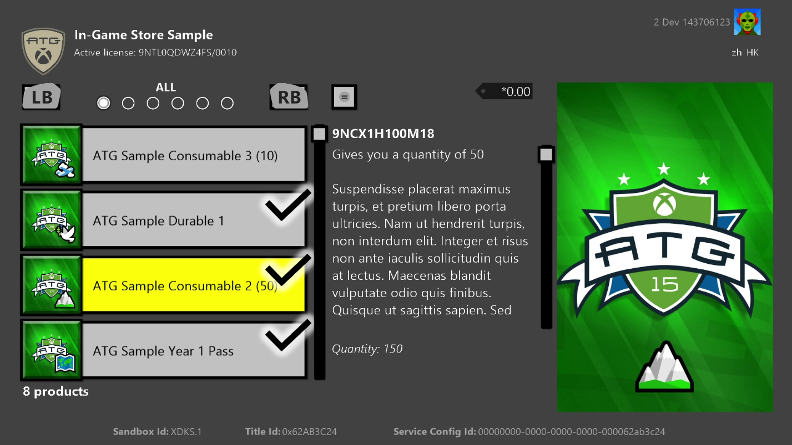
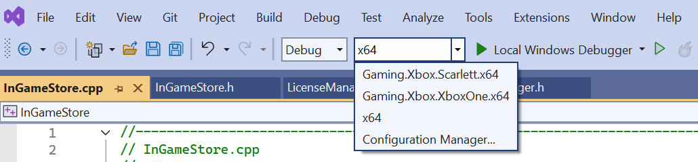
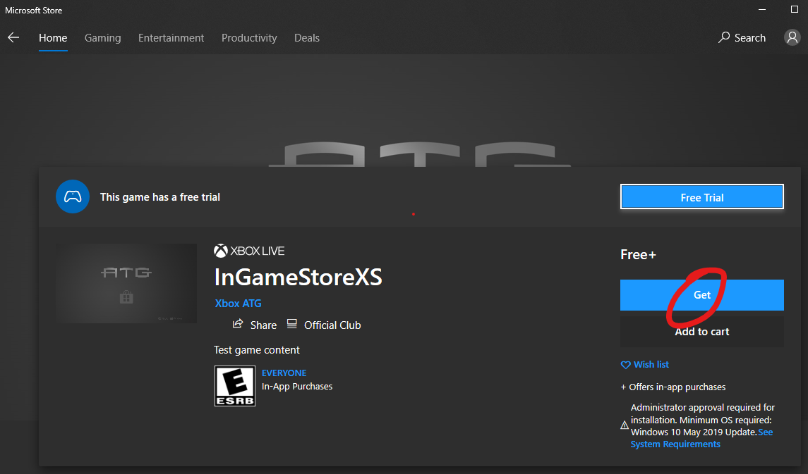

  

#   InGameStore 和试用版示例

此示例与 Microsoft 游戏开发工具包预览版（2019 年 11 月）兼容

# 

# 说明

此示例演示了用于呈现和操作游戏店面的基于客户端的操作。此外，还说明了如何检查游戏许可证信息，包括如何申请和查询试用状态。

# 构建示例

如果使用 Project Scarlett，你需要将 Gaming.Xbox.Scarlett.x64
平台配置添加到项目中。可以通过 Configuration Manager
执行此操作：选择"活动解决方案平台"下的"Configuration
Manager"选项，然后选择"新建..."。将"键入或选择新平台"设置为
Gaming.Xbox.Scarlett.x64，将"从此处复制设置"设置为
Gaming.Xbox.XboxOne.x64。然后选择"确定"。

有关详细信息，请参阅 GDK 文档中的"运行示例"。

# 运行示例

使用 XStore API
的一个关键特点是，它们需要有效的许可证才能正常工作。有关完整的详细信息，请参阅题为《设置产品以测试
XStore API》的 GDK 文档部分。

在启动游戏时，会通过调用许可服务对许可证进行验证。通常，如果没有有效的许可证，XStore
API 将返回 0x803f6107 (IAP_E\_UNEXPECTED)，表示找不到有效的许可证。

要为示例中的测试帐户获取有效许可证，请确保你位于 XDKS.1
沙盒中（任何开发人员帐户都可以使用此沙盒），然后

1.  运行以下命令以直接访问示例产品的"应用商店页面"：

xbapp launch ms-windows-store://pdp/?productid=9NTL0QDWZ4FS

或

2.  借助通过应用商店安装的示例，转到"我的游戏和应用"\>"管理游戏和附加内容"\>"在
    Microsoft Store 中查看"中的产品磁贴。

选择"获取"以获取帐户的产品许可证。无需等待下载完成（除非 EKBID
未知，请参阅下文）。

从应用商店安装的示例将获得适当的许可并正常运行，但可能代表示例的旧版本。

默认情况下，本地部署的内部版本（即从电脑推送或从电脑运行）将不被许可，但如果
microsoftgame.config 包含仅替代内容 ID 和 EKBID
的值的开发，则它将能够正确获得许可并允许 XStore API
正常工作。请注意此示例中 microsoftgame.config 中的以下部分：

\<DevelopmentOnly\>

\<ContentIdOverride\>2797FA46-A93B-494C-AD80-B67C9FCA939F\</ContentIdOverride\>

\<EKBIDOverride\>37E80840-6BEe-46F8-8EDB-92F877056087\</EKBIDOverride\>

\</DevelopmentOnly\>

设置就绪后，与产品的许可帐户结合使用，示例将在许可状态下运行。

本地生成的打包内部版本（即未从应用商店安装）也不会获得许可，并且
microsoftgame.config 中的替代也将不适用。许可将需要以下四项：

1.  与分配到"合作伙伴中心"的标题的标识名称和发布者相匹配的标识名称和发布者

2.  与标题的 Store ID 相匹配的 Store ID

3.  使用与分配到沙盒中引入的包的内容 ID 相匹配的内容 ID 生成的包

4.  EKBID 设置为与应用商店内部版本关联的替代值：

> xbapp setekbid \<pfn\> {\<EKBIDOverride value\>}
>
> \<pfn\> 是安装包的完整名称或包系列名称
>
> 确保用括号括住 EKBID，例如
>
> xbapp setekbid
> 41336MicrosoftATG.InGameStoreXS_1.0.0.0_neutral\_\_dspnxghe87tn0
> {37E80840-6BEe-46F8-8EDB-92F877056087}
>
> 或
>
> xbapp setekbid 41336MicrosoftATG.InGameStoreXS_dspnxghe87tn0!Game
> {37E80840-6BEe-46F8-8EDB-92F877056087}

获取内容 ID、EKBID 和 PFN 的最佳方法是从沙盒安装引入和发布的包，然后运行
xbapp list /d

按包完整名称注册的应用程序：

41336MicrosoftATG.InGameStoreXS_1.0.0.0_neutral\_\_dspnxghe87tn0

Install

Drive:Retail

Size:0.28 GB.

ContentId: {2797FA46-A93B-494C-AD80-B67C9FCA939F}

ProductId: {4C544E39-5130-3044-C057-5A3446536A00}

EKBID: {37E80840-6BEE-46F8-8EDB-92F877056087}

DisplayName:ATG In-Game Store Sample

41336MicrosoftATG.InGameStoreXS_dspnxghe87tn0!Game

还可以在屏幕上看到这些值，方法是在"我的游戏"中已安装标题的磁贴上选择"菜单"，然后查看"文件信息"。

就 EKBID
而言，这在包注册后（即准备启动时）可见，因此，如果标题的包很大，那么在拥有
EKBID 并打算改为部署或旁加载开发内部版本，就可以在此时取消上述值。

## 解释

将内容 ID、产品 ID 和 EKBID
结合使用可获得许可证。对于不是通过消费者渠道（例如从 Microsoft Store
或零售渠道）获得的内部版本，必须手动应用这些属性，以匹配将该标题的包提交到沙盒的属性。

松散文件部署是未经许可的，并且不与实际内容 ID 关联。microsoftgame.config
中的替代值指如何将实际 ID 应用于本地内部版本。

可以使用正确的内容 ID 创建本地生成的包，并且将 EKBID
应用于此已安装的包，这将允许进行适当的合并来模仿从应用商店获取的包。

产品 ID 派生自 Store ID，因此无需手动设置，只需使用正确的 Store ID。

所有这些步骤仍需要配置产品并将其发布到沙盒。请与帐户代表联系，以了解在提交后可在何处查找内容
ID。每个沙盒的内容 ID 均不同。

# 测试试用版

此示例还可在试用模式下运行。此示例指为默认的产品配置有基于使用情况的试用版，即获得许可后，许可接受方将拥有
10
个小时的标题正常运行时间。这一正常运行时间在"合作伙伴中心"中进行配置，并且要求标题使用限制性许可策略。有关更多详细信息，请与
Microsoft 帐户代表联系。

为了在试用模式下执行，请：

1.  确保没有任何其他拥有该示例产品的任何许可证的帐户登录，或者在控制台被设置为任何所有者帐户的家用
    Xbox的情况下，确保没有其他帐户

2.  通过测试帐户获取试用许可证

3.  完全下载应用商店包

4.  启动应用商店包，应该会显示出一个 TCUI，说明大概剩余多少游戏时间

为了旁加载在试用模式下运行的开发内部版本，请执行以下操作：

1.  在上述步骤 3 中安装包后，获取内容 ID 和 EKBID

2.  更新开发内部版本的 microsoftgame.config 要匹配的替代值

3.  卸载应用商店包，生成并部署

4.  启动并观察应在调试和 UI 中显示的试用属性

若要查看 TCUI 试用通知，需要另外使用 makepkg
创建一个打包的内部版本，然后使用 xbapp install 进行安装

在试用模式下，目录中会出现一个表示示例产品本身的附加项，以便加售完整游戏。

在试用模式下，需要检查两个重要的属性，具体取决于平台和方案：

-   isTrialOwnedByThisUser：对于基于使用情况的试用版，请选中此项，以确保游戏是由其帐户获得试用版的用户启动的。如果未选中此项，那么用户可以用新帐户获得试用版，然后用第一个帐户继续无限期地玩下去。

-   trialUniqueId：这特定于每个试用实例，即一个帐户。使用此项来持久保存游戏数据，以确保没有其他帐户的试用（这将具有一个不同的
    trialUniqueId）可以从保存中读取数据并继续玩游戏。

# 将示例指向标题

可以重定向示例以使用标题配置，以便测试与附加内容相关的产品枚举和购买功能，并对其进行故障排除。请注意，这将取代任何已安装的内部版本，因此，你应了解，安装示例作为标题可能会导致后续重新安装成本。

1.  使用一个为沙盒预配并拥有标题的测试帐户

2.  在标题的 microsoftgame.config 中，复制

    a.  标识节点；版本无影响

    b.  标题 ID

    c.  Store ID

    d.  ContentIdOverride 和 EKBIDOverride

3.  重新生成和部署

4.  启动（在开发人员沙盒中）

建议进行彻底的重新生成，并卸载之前所有指向任何其他标题的示例的安装。

如果遇到问题，请在部署时执行 xbapp list
/d，并确保除未更改的名称和版本号外，所有值均与标题的预期值匹配。确保 PFN
与应用标识和后缀均匹配，这是发布者的一个功能。

# 实现说明

请注意，如果登录了多个用户，则将显示帐户选取器，并将 StoreContext
分配给所选用户。

## 分页

可以使用页面大小参数调用返回要枚举的 XStoreProducts 的任何
API。本示例通过人为地将页面大小设置为较小来执行分页处理代码。更合理的页面大小为
25。请注意，这与标题提出的服务请求数量不符（这是自动处理的）。这有助于对结果进行细分，因此对于大型目录，可以更有规律的间隔来执行枚举回叫。

## 易耗品

CopyToUIProduct 中的这个示例从 XStoreProduct
中分配一个数量值。理论上，易耗品可以配置多个 SKU，每个 SKU
都可以单独购买，并为其分配单独的数量。该代码将简单地将它们加起来以显示单个数量。实际上，易耗品将只有一个
SKU，而数量仅与产品相对应。

即使从查询的产品结果中获取并显示了数量值，也建议使用标题服务的 b2b
调用来获取消耗量。推荐使用集合服务和 b2blicensepreview
终结点来执行此操作。请参阅有关集合的文档以了解更多详细信息。

# 已知问题

之前的 InGameStore (WSS)（从中派生此示例）在应用的 UI
中使用了下载的应用商店图像。 这个功能尚未移植到 Microsoft Game Core
版本中，因此，所有产品都会显示占位符 ATG 图像。

Gaming.Desktop.x64 内部版本当前无法正常工作。
有关此示例的桌面版本，请参阅 InGameStore_Desktop。

# 隐私声明

在编译和运行示例时，会将示例可执行文件的文件名发送给
Microsoft，用于帮助跟踪示例使用情况。要选择退出此数据收集，你可以删除
Main.cpp 中标记为"示例使用遥测"的代码块。

有关 Microsoft 的一般隐私策略的详细信息，请参阅《[Microsoft
隐私声明](https://privacy.microsoft.com/en-us/privacystatement/)》。

# 更新历史记录

初始发布：2019 年 4 月

更新时间：2020 年 4 月
