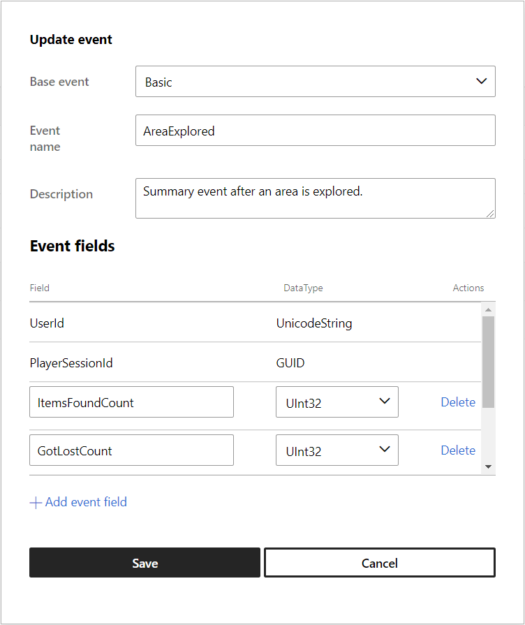
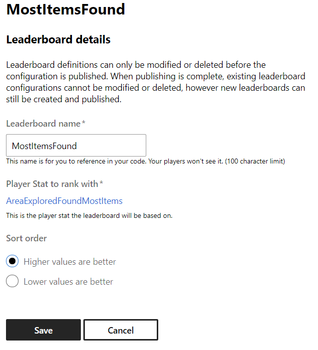

  

#   Event-based Leaderboard Sample

*This sample is compatible with the Microsoft Game Development Kit with
Xbox Extensions (March 2022)*

# 

# Description

The leaderboards sample demonstrates the usage of Xbox Live Leaderboards
with Events-Based stats (previously referred to as Stats 2013).

# Building the sample

-   If using an Xbox One devkit, set the active solution platform to
    Gaming.Xbox.XboxOne.x64.

-   If using an Xbox Series X|S devkit, set the active solution platform
    to Gaming.Xbox.Scarlett.x64.

-   If build and run for desktop, set the active solution platform to
    Gaming.Desktop.x64.

*For more information, see* __Running samples__, *in the GDK documentation.*

# Running the sample

-   You will need an Xbox Live test account signed in to send player
    stats and view *Social Leaderboards*

-   Xbox One devkit: set the console's sandbox to XDKS.1

*NOTE: You will need more than one test account, friended with each
other both having sent stats from the sample to see more than one user
listed in Social Leaderboards queries*

# Sample Setup in Partner Center

*Leaderboards* make use of Player Stats combined with Player Stat Rules
to rank players. To make a Leaderboard, you must first define the Player
Stats, Stat Rules and Leaderboard in Partner Center. This section
documents how the Leaderboards Sample was configured in Partner Center.

1.  Create a Player Stat

2.  Create one or more Stat Rules which aggregate that stat

3.  Create a leaderboard that ranks players based on a stat rule

*NOTE: These images reflect the layout of Partner Center at the time
this sample was written.*

## Creating An Event

When creating a new event, consider what other fields might be relevant
to the user at the time the event is fired. While you can only aggregate
on a single field, you can request additional columns to be returned in
a leaderboard query. More on this when we create a Stat Rule.

4 fields were added to this event: *ItemsFoundCount (UInt32)*,
*GotLostCount (UInt32)*, *Environment (Unicode String)* and
*DistanceTraveled (UInt32)*

## Creating A Stat Rule

Stat rules indicate which field will be aggregated and how. Adding
fields to the stat metadata allows you to designate additional fields as
includable when querying with the stat value. In this case, we are
interested in what the Environment and Distance Traveled values were at
the time they collected the most items.

*NOTE: When SUM aggregation is used, the metadata fields will be set to
the values of the last event received*

If you wish to create a leaderboard that aggregates on a specific value
of a field (such as a level, area, weapon, etc.), then that field should
be included in the "Event fields added to the stat rule" section. See
*MostTraveledMaze* below.

## Creating Leaderboards

The leaderboard for *MostItemsFound* is defined using the following
parameters.

 

# Implementation notes

- `LeaderboardsEventBased.cpp` contains code relevant to producing and querying stats and leaderboards.
- While the implementation allows for both Global and Social leaderboards to be queried, the only real difference between them is setting an enum value passed into the query and including a XUID to indicate who's friends should be included in the result list.
- The Title-managed leaderboard API works differently from the Event-based leaderboard API. Due to these differences, it is recommended for your title to use Event-based stats if possible.
  - For general documentation on the reasoning and differences between Title-managed stats and Event-based stats, refer to this [documentation](https://learn.microsoft.com/en-us/gaming/gdk/_content/gc/live/features/player-data/stats-leaderboards/live-stats-eb-vs-tm).
- The sample also demonstrates querying of stat values directly.

# Known issues

Some global leaderboard rankings listed in the "Times Lost" category
were set while still tweaking the gameplay simulation and aren't
achievable without modifying the code. I left this as a reminder to
developers when designing their stats -- they can't be changed without
resetting the stat/leaderboard, which would cause players to lose their
progress.

# Privacy statement

When compiling and running a sample, the file name of the sample
executable will be sent to Microsoft to help track sample usage. To
opt-out of this data collection, you can remove the block of code in
Main.cpp labeled "Sample Usage Telemetry".

For more information about Microsoft's privacy policies in general, see
the [Microsoft Privacy
Statement](https://privacy.microsoft.com/en-us/privacystatement/).

# Update history

**Update:** March 2025 - Updatine Implementation notes section

**Update:** July 2022

**Update:** June 2022

**Update:** March 2022

**Initial Release:** October 2019
