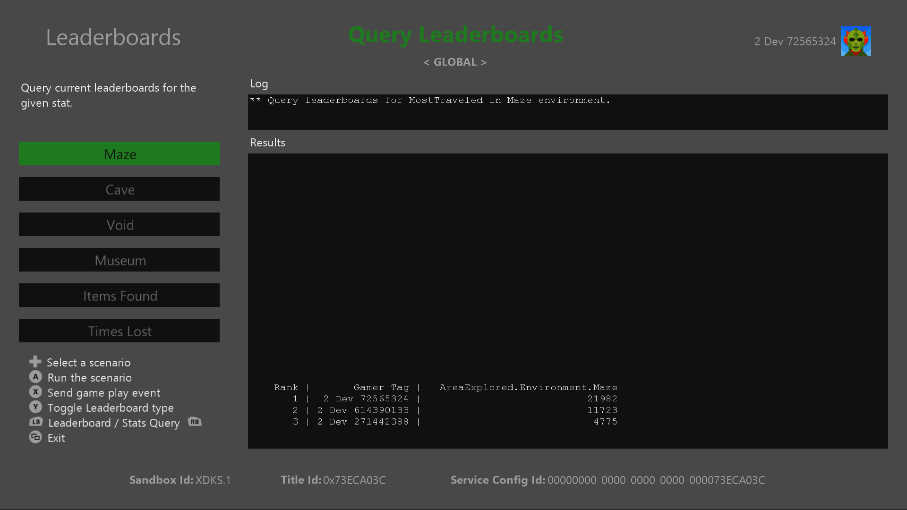
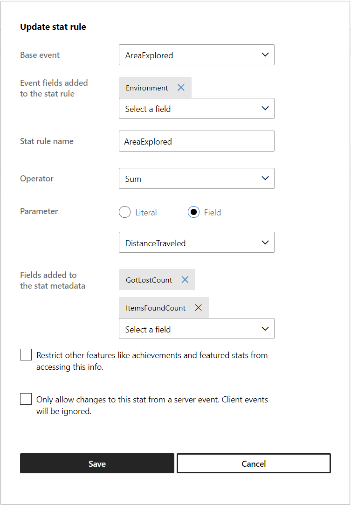
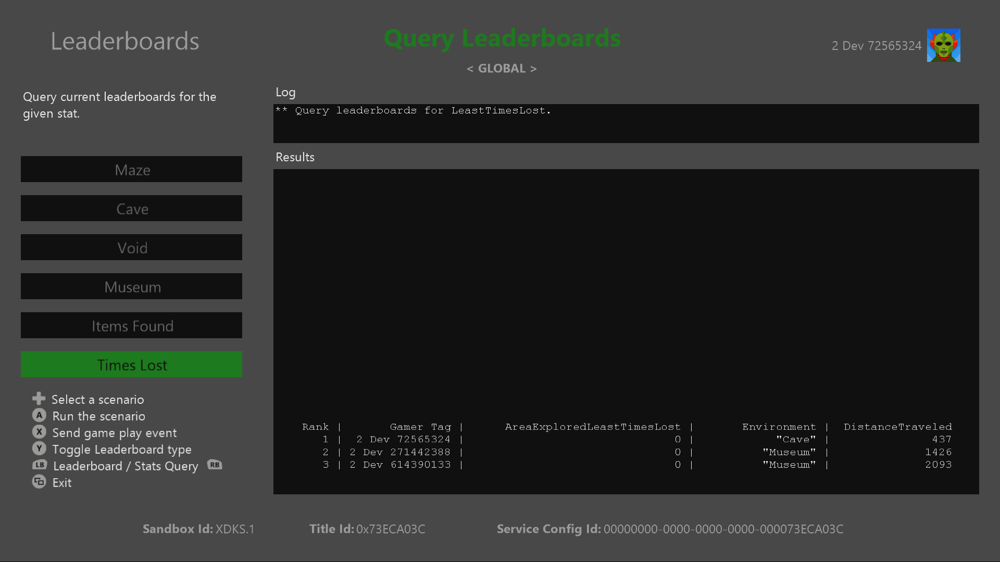

  

#   ランキングのサンプル

*このサンプルは、Microsoft ゲーム開発キットのプレビュー (2019 年 11 月)
に対応しています。*

# 

# 説明

ランキングのサンプルは、イベント ベースの統計 (以前の名称は Stats 2013)
を利用した Xbox Live ランキングの使用例を示します。

# サンプルのビルド

Xbox One の devkit を使用している場合は、アクティブなソリューション
プラットフォームを Gaming.Xbox.XboxOne.x64 に設定します。

Project Scarlett を使用している場合は、アクティブなソリューション
プラットフォームを Gaming.Xbox.Scarlett.x64 に設定します。

*詳細については、GDK
ドキュメント*の「サンプルの実行」を*参照してください*。

# サンプルの実行

-   プレイヤーの統計を送信し、*ソーシャル
    ランキング*を表示するには、Xbox Live テスト
    アカウントにサインインする必要があります

-   Xbox One devkit: コンソールのサンドボックスを XDKS.1 に設定します

*注:ソーシャル* ランキング
*クエリでリストされた複数ユーザーを表示するには、サンプルから統計を送信している友達登録された複数のテスト
アカウントが必要です*

# パートナー センターでのサンプルのセットアップ

*ランキング*では、プレイヤー統計とプレイヤー統計ルールを組み合わせて使用して、プレイヤーをランク付けします。
ランキングを作成するには、最初にパートナー
センターでプレイヤー統計、統計ルール、およびランキングを定義する必要があります。
このセクションでは、パートナー センターでのランキング
サンプルの構成方法について説明します。

1.  プレイヤー統計を作成する

2.  その統計を集計する 1 つ以上の統計ルールを作成する

3.  統計ルールに基づきプレイヤーをランク付けしたランキングを作成する

*注:これらの画像は、このサンプルを作成した時点でのパートナー
センターのレイアウトを反映しています。*

## イベントを作成する

新しいイベントを作成する場合、イベント発生時に他のどのフィールドがユーザーに関連するかを考慮してください。
集計できるのは 1 つのフィールドのみですが、ランキング
クエリで追加の列を返すように要求できます。
これについては、統計ルールを作成するときに詳しく説明します。

このイベントには、次の 4
つのフィールドが追加されています:*ItemsFoundCount
(UInt32)*、*GotLostCount (UInt32)*、*Environment (Unicode String)*
および *DistanceTraveled (UInt32)*

## 統計ルールを作成する

統計ルールは、どのフィールドをどのように集計するかを示します。統計メタデータにフィールドを追加すると、統計値をクエリするときに、追加フィールドを指定できます。
この場合、最も多くのアイテムを収集したときに、環境 (Environment)
と旅行距離 (Distance Traveled) の値がどうであったかに関心があります。

*注:SUM 集計を使用する場合、メタデータ
フィールドには、最後に受信したイベントの値に設定されます。*

特定のフィールド値 (レベル、エリア、武器など)
を集計するランキングを作成する場合は、そのフィールドを \[Event fields
added to the stat rule\]\\(統計ルールに追加するイベント フィールド\\)
セクションに含める必要があります。
以下の「*MostTraveledMaze*」を参照してください。

## ランキングを作成する

次のパラメーターを使用して、*MostItemsFound*
用のランキングを定義します。

 

# 実装に関する注意事項

-   この実装では、グローバル ランキングとソーシャル
    ランキングの両方をクエリできますが、両者の実際の相違点は、クエリに渡される列挙型の値を設定すること、および誰のフレンドを結果リストに含めるかを示す
    XUID 値を追加することだけです。

-   このサンプルでは、統計値を直接クエリする実例も示しています。

*注:Leaderboards.cpp
には、統計とランキングの作成とクエリに関連するコードが含まれています。*

# 既知の問題

\[Times Lost\]\\(時間ロスト\\) カテゴリにリストされる一部のグローバル
ランキングはゲームプレイのシミュレーションがまだ調整中に設定されるため、実際にコードを変更しないと実現できません。
この情報は、開発者が統計情報を設計する際のリマインダーとして残してあります。統計/ランキングをリセットしないと統計は変更できませんが、それにより、プレーヤーは進行状況を失うことになります。

# プライバシーに関する声明

サンプルをコンパイルして実行すると、サンプルの使用状況を追跡するため、サンプル実行可能ファイルのファイル名が
Microsoft に送信されます。このデータ収集を無効にするには、「Sample Usage
Telemetry」とラベル付けされた Main.cpp
内のコードのブロックを削除します。

Microsoft のプライバシー方針の詳細については、「[Microsoft
プライバシーに関する声明](https://privacy.microsoft.com/en-us/privacystatement/)」を参照してください。

# 更新履歴

**初期リリース:**2019 年 10 月
