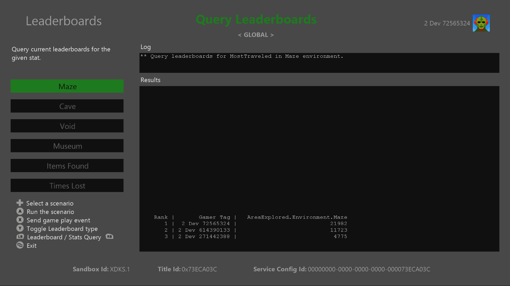
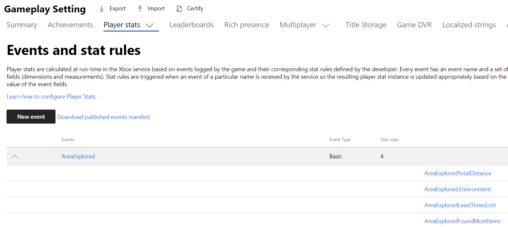
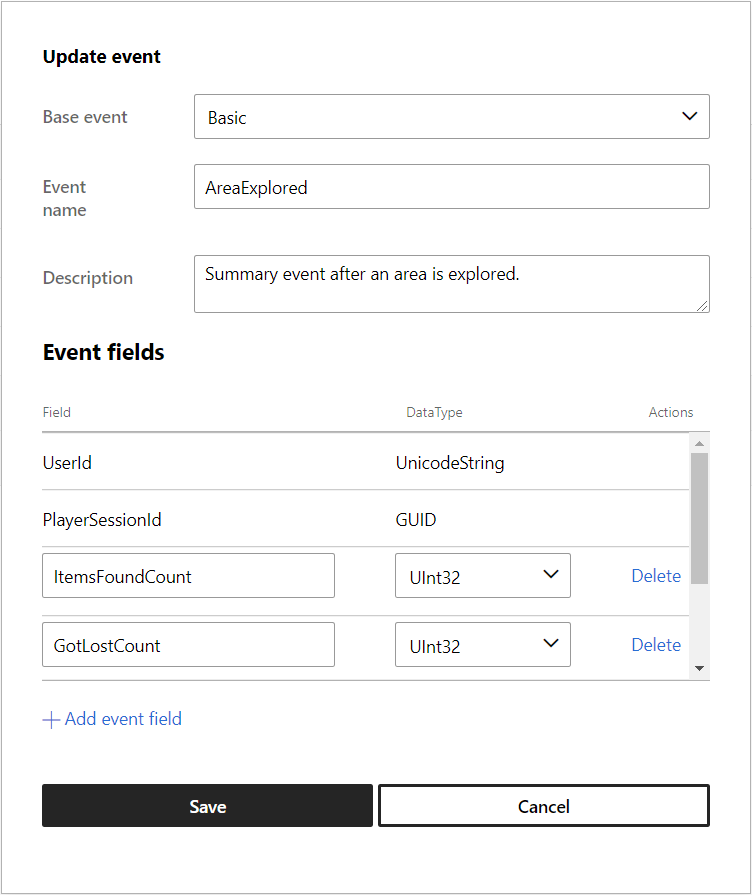
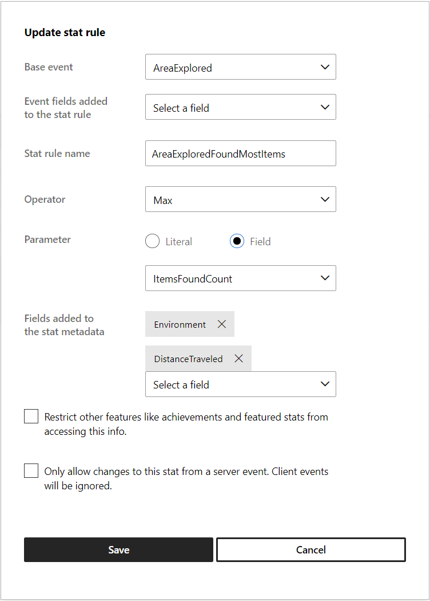
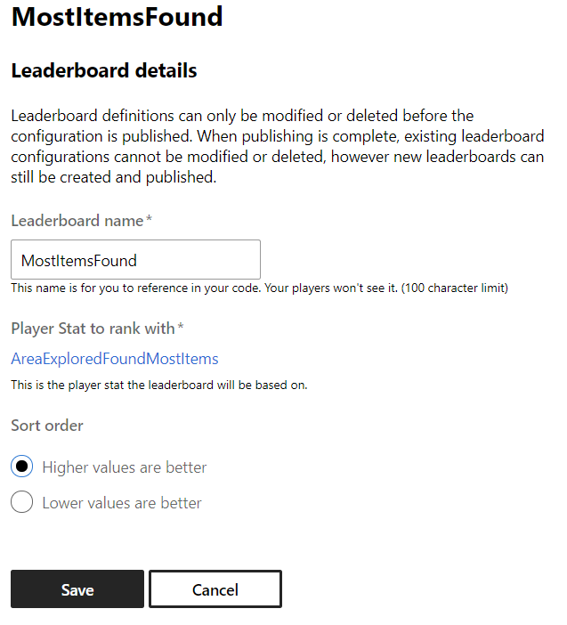
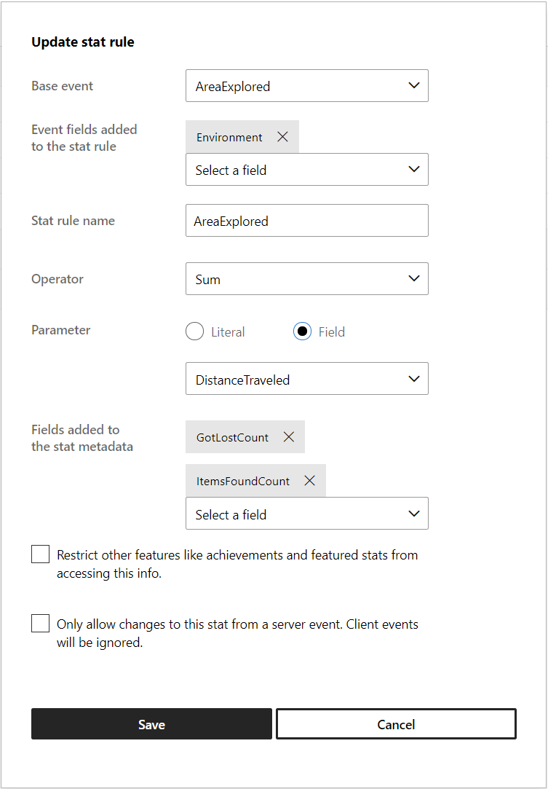
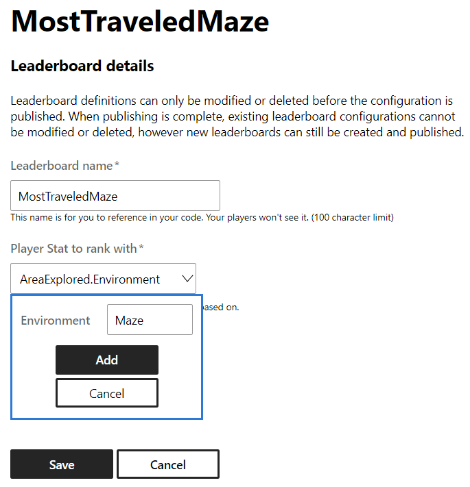
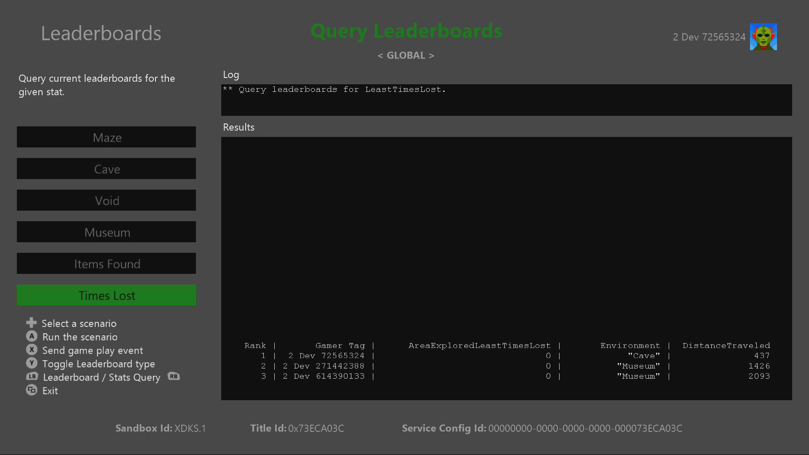

  

#   순위표 샘플

이 샘플은 Microsoft 게임 개발 키트 미리 보기와 호환됩니다(2019년 11월).

# 

# 설명

순위표 샘플은 이벤트 기반 통계(구 통계 2013)를 사용하여 Xbox Live 순위표
사용을 안내합니다.

# 샘플 빌드하기

Xbox One 개발 키트를 사용하는 경우 활성 솔루션 플랫폼을
Gaming.Xbox.XboxOne.x64로 설정하세요.

Project Scarlett을 사용하는 경우 활성 솔루션 플랫폼을
Gaming.Xbox.Scarlett.x64로 설정하세요.

*자세한 내용은 GDK 문서에서* 샘플 실행하기*를 참조하세요.*

# 샘플 실행하기

-   플레이어 통계를 보내고 소셜 순위표를 보려면 Xbox Live 테스트 계정에
    로그인해야 합니다.

-   Xbox One devkit: 콘솔의 샌드박스를 XDKS.1로 설정

참고: 소셜 순위표 쿼리에 나열된 2명 이상의 사용자를 보려면 서로 친구
상태이며 샘플에서 통계를 보낸 2개 이상의 테스트 계정이 필요합니다.

# 파트너 센터에서 샘플 설정하기

순위표는 플레이어의 순위를 정하기 위한 플레이어 통계 규칙과 함께
플레이어 통계를 사용합니다. 순위표를 만들려면 우선 파트너 센터에서
플레이어 통계, 통계 규칙 및 순위표를 정의해야 합니다. 이 섹션에서는
순위표 샘플이 파트너 센터에서 어떻게 구성되었는지 보여 줍니다.

1.  플레이어 통계를 만듭니다.

2.  해당 통계를 집계하는 1개 이상의 통계 규칙을 만듭니다.

3.  통계 규칙에 따라 플레이어의 순위를 정하는 순위표를 만듭니다.

참고: 이 이미지에는 샘플을 작성할 당시 파트너 센터의 레이아웃이
반영됩니다.

## 이벤트 만들기

새 이벤트를 만드는 경우, 해당 이벤트가 발생하는 시점에 사용자와 관련이
있는 다른 필드가 있는지 떠올려 보세요. 단일 필드에서만 집계할 수 있지만
순위표 쿼리에서 반환할 열을 추가로 요청할 수 있습니다. 통계 규칙을 만들
때 더 자세히 알아보겠습니다.

이 이벤트에 필드 4개 *ItemsFoundCount(UInt32)*, *GotLostCount(UInt32)*,
*Environment(Unicode String), DistanceTraveled(UInt32)*를 추가했습니다.

## 통계 규칙 만들기

통계 규칙은 집계되는 필드와 집계 방법을 나타냅니다. 통계 메타데이터에
필드를 추가하면 통계 값으로 쿼리할 때 추가 필드를 포함하도록 지정할 수
있습니다. 이 경우, Environment 및 Distance Traveled 필드가 가장 많은
항목을 수집하는 시점의 값이 중요합니다.

참고: *SUM* 집계를 사용하는 경우 메타데이터 필드가 마지막에 수신한
이벤트의 값으로 설정됩니다.

필드(예: 레벨, 영역, 무기 등)의 특정 값을 집계하는 순위표를 만들려면
해당 필드가 "통계 규칙에 추가된 이벤트 필드" 구역에 포함되어야 합니다.
아래 *MostTraveledMaze*를 참조하세요.

## 순위표 만들기

다음 매개 변수를 사용하여 *MostItemsFound*의 순위표를 정의합니다.

 

# 구현 참고 사항

-   이 구현에서는 글로벌 및 소셜 순위표를 모두 쿼리할 수 있지만, 쿼리로
    전달되는 열거형 값 설정과 목록에 어떤 사용자의 친구를 포함해야
    하는지 나타내기 위한 XUID 포함에 차이가 있습니다.

-   이 샘플은 통계 값을 직접 쿼리하는 방법도 보여 줍니다.

참고: *Leaderboards.cpp*에는 통계 및 순위표를 생성하고 쿼리하는 데
관련된 코드가 포함됩니다.

# 알려진 문제

게임 플레이 시뮬레이션을 계속 수정하는 동안 "패배 횟수" 범주에 나열된
일부 글로벌 순위표가 설정되나, 실제로 코드를 수정하지 않으면 설정되지
않습니다. 이 문제를 개발자가 통계를 설계할 때 확인할 수 있도록
알려드립니다. 통계/순위표를 다시 설정하지 않으면 통계를 변경할 수 없으며
이에 따라 플레이어가 진행한 내용이 손실될 수 있습니다.

# 개인정보처리방침

샘플을 컴파일하고 실행할 때 샘플 사용을 추적하는 데 도움이 되도록 샘플
실행 파일의 파일 이름이 Microsoft에 전송됩니다. 이 데이터 수집을
옵트아웃하려면 Main.cpp에서 \"샘플 사용 원격 분석\"이라고 레이블이
지정된 코드 블록을 제거할 수 있습니다.

Microsoft의 일반 개인정보처리방침에 대한 자세한 내용은 [Microsoft
개인정보처리방침](https://privacy.microsoft.com/en-us/privacystatement/)을
참조하세요.

# 업데이트 기록

**최초 릴리스:** 2019년 10월
