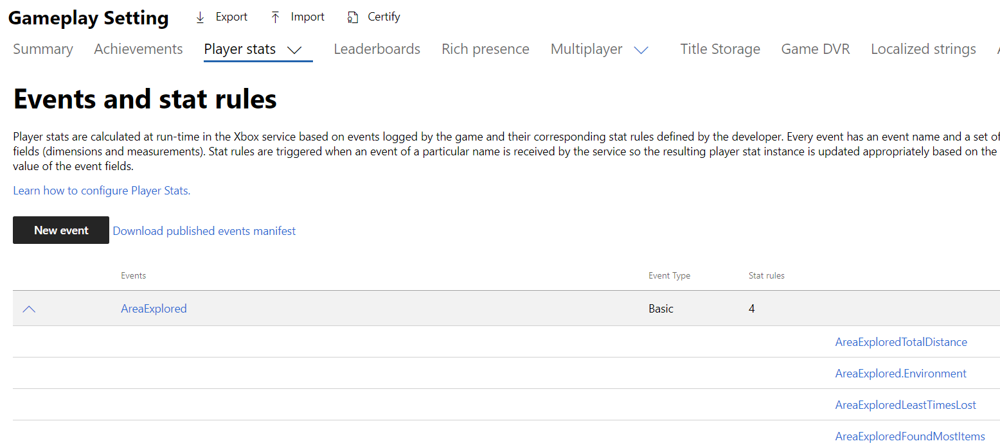
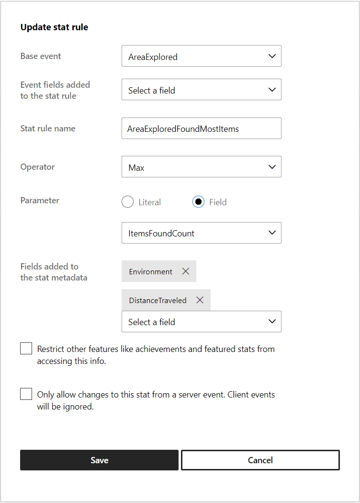
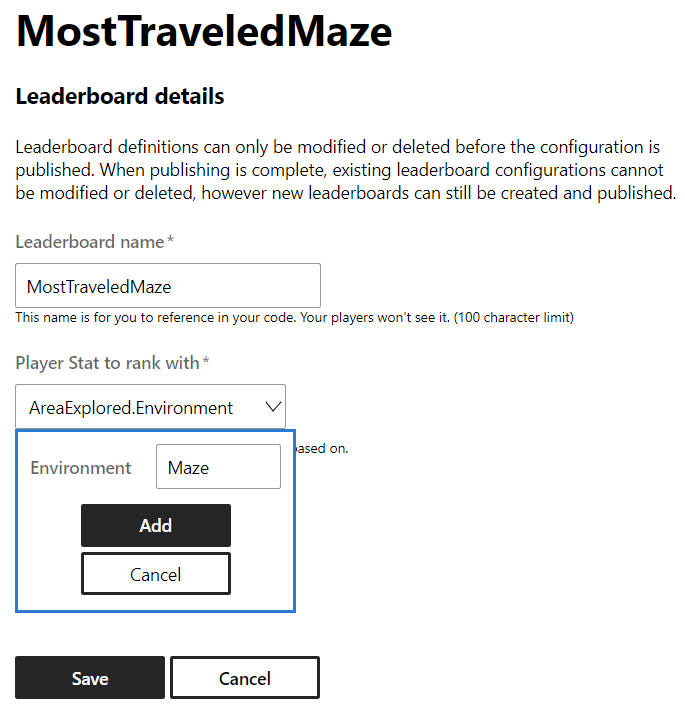

  

#   排行榜示例

此示例与 Microsoft 游戏开发工具包预览版（2019 年 11 月）兼容

# 

# 说明

该排行榜示例展示了 Xbox Live 排行榜与基于事件的统计信息（以前称为 Stats
2013）的使用情况。

# 构建示例

如果使用 Xbox One 开发工具包，请将活动解决方案平台设置为
Gaming.Xbox.XboxOne.x64。

如果使用 Project Scarlett，请将活动解决方案平台设置为
Gaming.Xbox.Scarlett.x64。

有关详细信息，请参阅 GDK 文档中的"运行示例"。

# 运行示例

-   需要登录 Xbox Live 测试帐户才能发送玩家统计信息并查看社交排行榜

-   Xbox One 开发工具包：将控制台的沙盒设置为 XDKS.1

注释：你将需要多个测试帐户，并且彼此互为好友，且每个帐户都已经发送了示例中的统计信息，才能看到"社交排行榜"查询中列出了多个用户

# "合作伙伴中心"中的示例设置

排行榜利用玩家统计信息和玩家统计信息规则来对玩家进行排名。
若要制作排行榜，必须先在"合作伙伴中心"中定义玩家统计信息、统计信息规则和排行榜。
此部分介绍如何在"合作伙伴中心"中配置排行榜示例。

1.  创建玩家统计信息

2.  创建一个或多个聚合该统计信息的统计信息规则

3.  创建基于统计信息规则对玩家进行排名的排行榜

注释：这些图像反映了编写此示例时"合作伙伴中心"的布局。

## 创建事件

创建新事件时，请考虑触发事件时与用户相关的其他字段。
虽然你只能针对单个字段上进行聚合，但是可以请求在排行榜查询中返回其他列。
有关详细信息，将在创建统计信息规则时介绍。

已将 4 个字段添加到此事件：ItemsFoundCount (UInt32)、GotLostCount
(UInt32)、Environment（Unicode 字符串）和 DistanceTraveled (UInt32)

## 创建统计信息规则

统计信息规则指示将聚合哪个字段以及如何聚合。将字段添加到统计信息元数据后，你可以在使用统计信息值进行查询时将其他字段指定为可包括在内。
在这种情况下，我们想知道的是，在收集到最多项时，"环境"和"旅行距离"值是多少。

注释：使用 SUM 聚合时，元数据字段将设置为收到的最后一个事件的值

如果想要创建一个基于字段（例如级别、区域、武器等）的特定值聚合的排行榜，然后该字段应包括在"添加到统计信息规则的事件字段"部分中。
请参阅下面的 MostTraveledMaze。

## 创建排行榜

使用以下参数定义 MostItemsFound 的排行榜。

 

# 实现说明

-   虽然该实现允许查询全球排行榜和社交排行榜，但它们之间的唯一真正区别是设置了传递给查询的枚举值，并且包括一个
    XUID 来指示应将谁的朋友包括在结果列表中。

-   此示例还直接演示了如何查询统计信息值。

注释：Leaderboards.cpp 包含与生成和查询统计信息和排行榜有关的代码

# 已知问题

在"Times
Lost"类别中列出的一些全球排行榜排名是在调整游戏模拟时设置的，在不修改代码的情况下实际上是无法实现的。
我提出这一点，是为了在开发人员设计自己的统计信息时提醒他们，若不重置统计信息/排行榜，统计信息是无法更改的。若重置，将导致玩家的进度丢失。

# 隐私声明

在编译和运行示例时，会将示例可执行文件的文件名发送给
Microsoft，用于帮助跟踪示例使用情况。要选择退出此数据收集，你可以删除
Main.cpp 中标记为"示例使用遥测"的代码块。

有关 Microsoft 的一般隐私策略的详细信息，请参阅《[Microsoft
隐私声明](https://privacy.microsoft.com/en-us/privacystatement/)》。

# 更新历史记录

初始发布：2019 年 10 月
