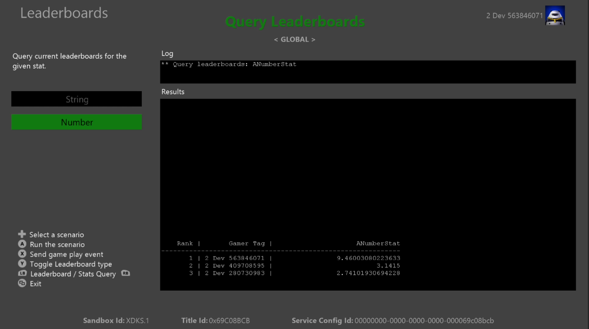
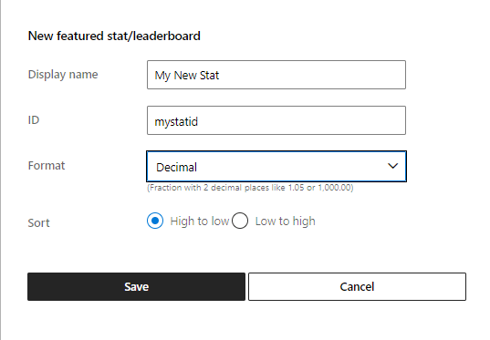
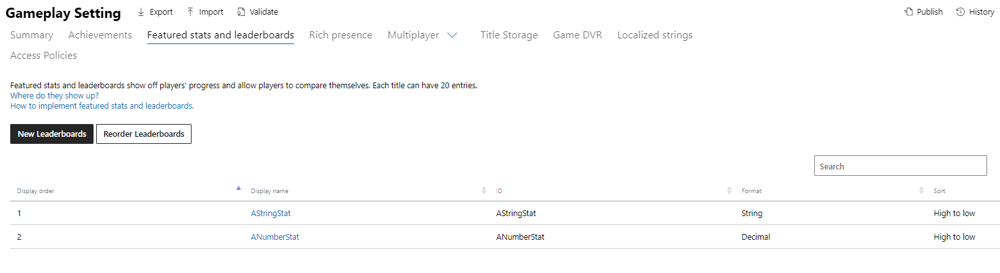

  

#   순위표 샘플

*이 샘플은 Xbox 확장 기능이 포함된 Microsoft 게임 개발 키트(2022년
10월)와 호환됩니다*.

# 

# 설명

순위표 샘플은 타이틀 관리 통계(이전에는 Stats 2017이라고 함)가 있는 Xbox
Live 순위표의 사용을 보여줍니다.

# 샘플 빌드

Xbox One 개발 키트를 사용하는 경우 활성 솔루션 플랫폼을
Gaming.Xbox.XboxOne.x64로 설정합니다.

Xbox Series X|S 개발 키트를 사용하는 경우 활성 솔루션 플랫폼을
Gaming.Xbox.Scarlett.x64로 설정합니다.

*자세한 내용은 GDK 설명서에서* 샘플 실행을 *참조하세요.*

# 샘플 실행

-   플레이어 통계를 보내고 *소셜 순위표를 보려면* Xbox Live 테스트
    계정에 로그인해야 합니다.

-   Xbox One devkit: 콘솔의 샌드박스를 XDKS.1로 설정

*참고: 소셜 순위표 쿼리에 나열된 두 명 이상의 사용자를 보려면 샘플에서
통계를 보낸 서로 친구가 된 둘 이상의 테스트 계정이 필요합니다.*

# 파트너 센터 샘플 설정

이벤트 기반 통계를 기준으로 하는 순위표와 달리 타이틀 관리 추천 통계와
순위표는 동시에 정의됩니다.

1.  통계에 대한 새 순위표 만들기

2.  통계 정보를 입력합니다.

ID 필드는 클라이언트에서 업로드할 때 통계를 참조하는 데 사용할 것입니다.

참고: 통계에 대한 문자열 유형을 선택할 때 순위표에서 사용할 수 없으므로
정렬 모드는 중요하지 않습니다. 대신 서버에서 쿼리만 받습니다.

다음은 이 샘플에 대해 정의된 통계입니다.

*참고: 이 이미지는 이 샘플이 작성되었을 때의 파트너 센터 레이아웃을
반영합니다.*

# 개인정보 처리방침

샘플을 컴파일하고 실행하는 경우 샘플 사용량을 추적할 수 있도록 샘플 실행
파일의 파일 이름이 Microsoft에 전송됩니다. 이 데이터 수집을
옵트아웃하려면 \"샘플 사용량 원격 분석\"으로 레이블이 지정된
Main.cpp에서 코드 블록을 제거할 수 있습니다.

Microsoft의 개인정보 정책에 대한 자세한 내용은 [Microsoft 개인정보
처리방침](https://privacy.microsoft.com/en-us/privacystatement/)을
참조하세요.

# 업데이트 기록

**초기 릴리스:** 2021년 1월
