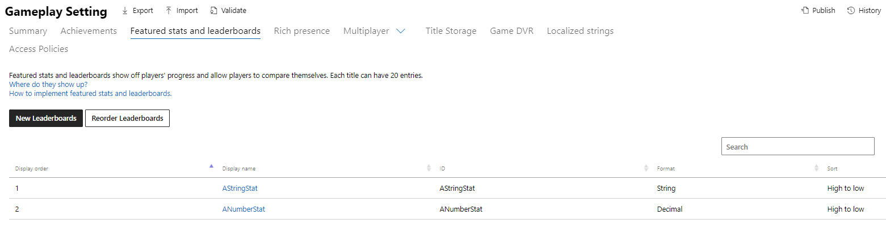

  

#   排行榜示例

*此示例与带 Xbox 扩展的 Microsoft 游戏开发工具包（2020 年 11 月）兼容*

# 

# 说明

排行榜示例演示了使用游戏管理的统计信息（以前称为 Stats 2017）的 Xbox
Live 排行榜。

# 生成示例

如果使用 Xbox One 开发工具包，请将活动解决方案平台设置为
Gaming.Xbox.XboxOne.x64。

如果使用 Xbox Series X|S 开发工具包，请将活动解决方案平台设置为
Gaming.Xbox.Scarlett.x64。

*有关详细信息，请参阅 GDK 文档中的*"运行示例"*。*

# 运行示例

-   你需要一个已登录的 Xbox Live
    测试帐户来发送玩家统计信息并查看*社交排行榜*

-   Xbox One 开发工具包：将主机的沙盒设置为 XDKS.1

*注意：你将需要多个测试帐户，这些账户互相加为好友，且都已从示例发送统计信息，以便查看社交排行榜查询中列出的多个用户*

# 合作伙伴中心中的示例安装

与以基于事件的统计信息为基础的排行榜不同，游戏管理的精选统计信息和排行榜是同时定义的。

1.  创建用于统计信息的新排行榜

2.  填写统计信息

从客户端上传时，ID 字段将用于引用统计信息。

注意：为统计信息选择字符串类型时，排序模式并不重要，因为它们不能在排行榜中使用。
而只是从服务器对它们进行查询。

下面是为此示例定义的统计信息。

*注意：这些图像反映了编写此示例时合作伙伴中心的布局。*

# 隐私声明

在编译和运行示例时，示例可执行文件的文件名将发送给
Microsoft，以帮助跟踪示例使用情况。若要选择退出此数据收集，你可以删除
Main.cpp 中标记为"示例使用遥测"的代码块。

有关 Microsoft 的一般隐私策略的详细信息，请参阅 [Microsoft
隐私声明](https://privacy.microsoft.com/en-us/privacystatement/)。

# 更新历史记录

**初始版本：**2021 年 1 月
