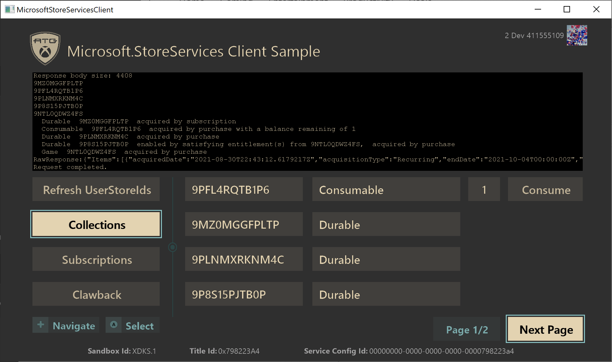
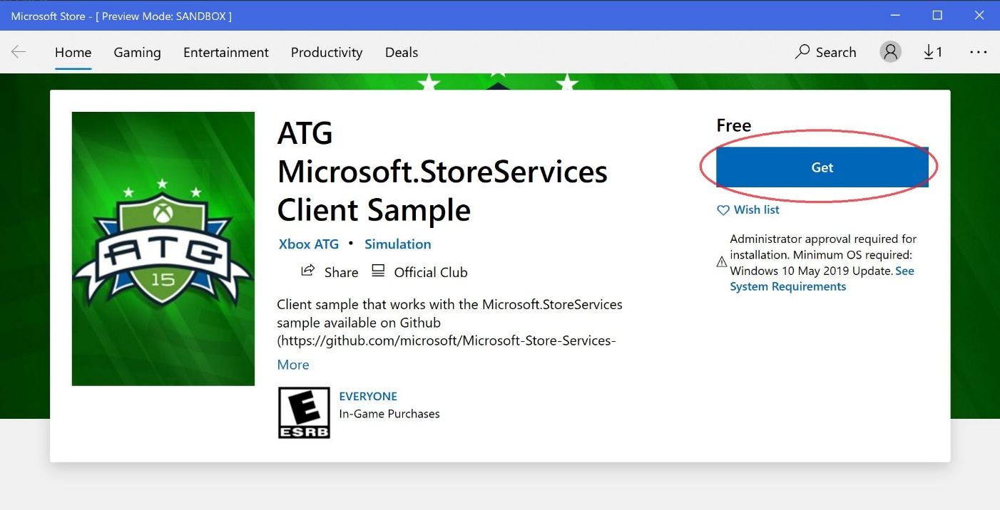
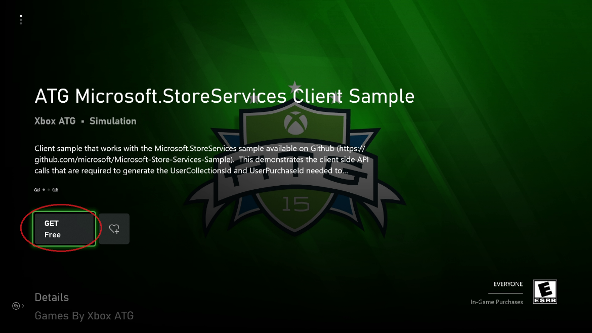

  

#   Microsoft.StoreServices Client のサンプル

*このサンプルは Microsoft Game Development Kit (QFE5 2021 年 4 月)
と互換性があります*

# 

# 説明

このサンプルでは、 Microsoft Store
サービスを使用したサービス間の承認と製品管理を目的に
[Microsoft.StoreServices
サンプル](https://github.com/microsoft/Microsoft-Store-Services-Sample)で使用されるクライアント
ベースの操作について説明します。 具体的には、[サービス間認証の User
Store ID の要求
(microsoft.com)](https://developer.microsoft.com/en-us/games/xbox/docs/gdk/xstore-requesting-a-userstoreid)
で概説されているように、User Store ID を取得して使用する方法



# サンプルのビルド

このサンプルは、デスクトップ けでなく、Xbox One、Scarlett
もサポートしています。ビルドする設定をドロップダウンで選択します。


*詳細については、GDK
のドキュメントの*「サンプルの実行」*を参照してください。*

# サンプルの実行

このサンプルは、[Microsoft.StoreServices
サンプル](https://github.com/microsoft/Microsoft-Store-Services-Sample)と連携するように設計されており、お客様のサービスが
Microsoft Store
サービスで認証できるようにするために必要なクライアント側での必須のフローと
API を実行します。 XDKS.1 でサンプルを実行する場合、ATG が XDKS.1
のサンプル製品で使用するために保持する Microsoft.StoreServices
サンプルのバージョンを呼び出して作用するように事前に構成されています。

クライアント サンプルは、同 Service
サンプルと作用して特定のアクションを要求し、同 Service
サンプルによって実行されたアクションの結果を表示します。
たとえば、アカウントが所有するアイテムの表示、消耗製品のフルフィルメント、サブスクリプションの管理、払い戻しを検出するための消耗フルフィルメントの追跡。

このクライアントによる XStore API
の使用に関する主な特徴は、それらが機能するために有効なライセンスが必要であることです。詳細については、GDK
のドキュメントの「XStore API
をテストするための製品のセットアップ」というタイトルのセクションを参照してください。

ゲームの起動時にライセンス
サービスを呼び出してライセンスを検証します。これができない場合、XStore
API (XStoreGetUserCollectionsIdAsync および
XStoreGetUserPurchaseIdAsync)
は、有効なライセンスが見つからなかったことを示す 0x803f6107
(IAP_E\_UNEXPECTED) を返します。

テスト
アカウント用のサンプルの有効なライセンスを取得するには、サンドボックス
**XDKS.1** にいることを確認し
(すべての開発者アカウントでこのサンドボックスが使用できます)、サンプル製品のストア
ページに移動して**「取得する」**を選択します。ダウンロードが完了するまで待つ必要はありません。

このサンプルのストア ページに直接移動するには、次のショートカット
コマンドを使用します。

**PC:**

Run box (Win+R):

`ms-windows-store://pdp/?productid=9MXL21XPWWWK`

or

`msxbox://game/?productId=9MXL21XPWWWK`



****

**Xbox:**

Visual Studio ゲーム コマンド プロンプトでは、次のようになります。\
`xbapp launch ms-windows-store://pdp/?productid=9MXL21XPWWWK`



ストアからインストールされたサンプルは、適切なライセンスが付与され、適切に機能しますが、旧バージョンのサンプルを表す場合があります。

これで、サンプルは XDKS.1 サンドボックス内の (F5) を使用して Visual
Studio から実行できるようになります。
サンプルを独自のサンドボックスで実行し、テスト用に独自のタイトルとして実行する場合は、以下のセクションで概説するように、MicrosoftGame.Config
ファイルに対して特定の構成変更を行う必要があります。

このサンプルでは、テスト
アカウントが前から既に持っていた消耗品アイテムまたはサブスクリプションを再購入しない限り、サンプル製品を購入する方法は提供されません。
ゲーム内の Microsoft Store
サンプルを使用して、さまざまな製品を購入したり、次のショートカットを使用できます::

**PC:**

Run box (Win+R):

-   **Microsoft Store によって管理される消耗製品:**
    - `ms-windows-store://pdp/?productid=9PFL4RQTB1P6`
    - `ms-windows-store://pdp/?productid=9NCX1H100M18`

-   **パッケージのない耐久アイテム:**
    - `ms-windows-store://pdp/?productid=9N30KZZF4BR9`
    - `ms-windows-store://pdp/?productid=9P23V43P0XZZ`
    - `ms-windows-store://pdp/?productid=9PLRFWZWWF91`

-   **ゲーム:**
    - `ms-windows-store://pdp/?productid=9NTL0QDWZ4FS`

-   **サブスクリプション:**
    - `ms-windows-store://pdp/?productid=9MZ0MGGFPLTP`

**Xbox:**

Visual Studio ゲーム コマンド プロンプトでは、次のようになります。

-   **Microsoft Store によって管理される消耗製品:**
    - `xbapp launch ms-windows-store://pdp/?productid=9PFL4RQTB1P6`
    - `xbapp launch ms-windows-store://pdp/?productid=9NCX1H100M18`

-   **パッケージのない耐久アイテム:**
    - `xbapp launch ms-windows-store://pdp/?productid=9N30KZZF4BR9`
    - `xbapp launch ms-windows-store://pdp/?productid=9P23V43P0XZZ`
    - `xbapp launch ms-windows-store://pdp/?productid=9PLRFWZWWF91`

-   **ゲーム:**
    - `xbapp launch ms-windows-store://pdp/?productid=9NTL0QDWZ4FS`

-   **サブスクリプション:**
    - `xbapp launch ms-windows-store://pdp/?productid=9MZ0MGGFPLTP`

# サンプルをタイトルとして実行する

テストとトラブルシューティングを行うために、サンプルにリダイレクトしてタイトル構成を使用することができます。これはインストール済みのビルドの代わりとなることに注意してください、従って、その後の再インストール
コストを招く可能性があるサンプルをインストールすることをご承知おきください。

1.  サンドボックスにログインして、サンドボックス用にプロビジョニングされたテスト
    アカウントを使用します

2.  テスト
    アカウントはタイトルを所有するため、タイトルを実行するためのデジタル
    ライセンスを持っていることを確認してください

3.  タイトルの microsoftgame.config. からコピーしてください

    a.  ID ノード (バージョンは関係ありません)

    b.  タイトル ID

    c.  Microsoft Store ID

    d.  **Xbox 専用:**ContentIdOverride および EKBIDOverride (下記参照)

4.  再ビルドおよびデプロイ

5.  (開発者のサンドボックスで) を起動します

再ビルドのクリーンを実行し、他のタイトルを示すサンプルの以前のインストールをすべてアンインストールすることをお勧めします。

Xbox で問題が発生した場合は、展開で xbapp list /d
を実行し、変更していない名前とバージョン番号を除き、すべての値がタイトルの期待値と一致するようにしてください。どちらのプラットフォームでも、アプリ
ID と発行元の関数である拡張子に関して PFN
が一致していることを確認してください。

**Xbox 専用:**

**ローカルにデプロイされたビルド** (すなわち、PC からプッシュまたは実行)
は、デフォルト設定でライセンスを取得できませんが、microsoftgame.config
にコンテンツ ID と EKBID
の値をオーバーライドする開発のみが含まれている場合、ライセンスを適切に取得して
XStore API を動作させることができます。このサンプルの
microsoftgame.config 内にあるこのセクションに注意してください。

```xml
<DevelopmentOnly>
  <ContentIdOverride>B8EAB5D1-DE92-4A60-A398-866E51F58532</ContentIdOverride>
  <EKBIDOverride>00000000-0000-0000-0000-000000000001</EKBIDOverride>
</DevelopmentOnly>
```

コンテンツ ID は、パートナー
センターでサンドボックスを提出したパッケージに割り当てられた ID
と一致する必要があります。

EKBID には、すべてゼロ以外の値を指定することも、既定の
33EC8436-5A0E-4F0D-B1CE-3F29C3955039 を指定することもできます。

これが正しい位置に配置されると、製品へのライセンスが付与されたアカウントと組み合わせて、サンプルがライセンスが付与された状態で実行します。

コンテンツ ID、適切な EKBID (必須ではない)、および PFN
を取得する最良の方法は、サンドボックスから取り込まれて発行したパッケージをインストールして
xbapp list /d を実行することです

パッケージの完全な名前で登録済みのアプリケーション:

```txt
41336MicrosoftATG.InGameStoreXS_1.0.0.0_neutral\_\_dspnxghe87tn0
Install
Drive: Retail
Size: 0.28 GB.
ContentId: {2797FA46-A93B-494C-AD80-B67C9FCA939F}
ProductId: {4C544E39-5130-3044-C057-5A3446536A00}
EKBID: {37E80840-6BEE-46F8-8EDB-92F877056087}
DisplayName: ATG In-Game Store Sample
41336MicrosoftATG.InGameStoreXS_dspnxghe87tn0!Game
```

これらの値は、\[マイ ゲーム\] でインストールされているタイトルのタイルの
\[メニュー\] を選択し、 \[ファイル情報\]
を表示することによっても画面上で確認できます。

EKBID の場合、これはパッケージ登録時に表示されるため (\[起動準備完了\]
など)、タイトルのパッケージが大容量である場合は EKBID
を取得した時点でキャンセルが可能で、代わりに開発ビルドをデプロイまたはサイドロードしようとします。

# 実装上の注意

Microsoft アカウント (MSA) の StoreContext ひいては UserStoreID
の関連付けは、アプリが Windows または Xbox
コンソールのどちらで実行されているどうかによって異なります。

-   **Windows PC:**Windows Microsoft Store App にサイン インしている MSA
    (MSA は必ずしも Xbox Live にサイン インしているわけではありません)。

-   **Xbox:** Xbox Live にサイン
    インし、ゲームをアクティブにプレイしている MSA。

これについての詳細は、[「PC での不一致のストア アカウント シナリオの処理
(microsoft.com)」](https://developer.microsoft.com/en-us/games/xbox/docs/gdk/xstore-handling-mismatched-store-accounts)のドキュメントを参照してください

## ページング

\[コレクション\] ページまたは \[サブスクリプション\] ページの結果に 4
つ以上の結果が含まれている場合、\[**次のページ**\]
ボタンが有効になり、返されたすべてのアイテムが確認できます。
現在のページ番号と合計ページも表示されます。

## UserStoreId のリフレッシュ

このボタンは、Service Sample から AAD Access Token
を取得する処理を開始し、それらを使用して、Service Sample に渡して
Microsoft Store Services のサービス間認証を実行する必要がある
UserStoreId (UserCollectionsId および UserPurchaseId) を生成します

詳細については、[「サーバー間認証のための User Store ID を要求する
(microsoft.com)」](https://developer.microsoft.com/en-us/games/xbox/docs/gdk/xstore-requesting-a-userstoreid)を参照してください

## コレクション

\[コレクション\] ページで、Service Sample
によってサービス間クエリが実行され、ユーザーのコレクション
データがチェックされます。 これには、ユーザーが購入したアイテム
(Games、Durables、Consumables など) が含まれます。
クエリ結果に消耗製品が含まれているユーザーの場合は、クライアント
サンプル内で次のアクションが実行できます。

-   **数量を消費する** - 数量が 0 より大きい場合 -
    ユーザーのアカウントからアイテムをフルフィルメントし、ユーザーの消耗品アイテムの購入と、これらのフルフィルメント済みアイテムでユーザーへの払い戻しの可能性がある問題を追跡するために、独自の
    Service データベース上のユーザーの残高に値を追加します。
    この消費は、Service Sample
    に組み込まれている消耗品アイテムとクローバック追跡にも追加されます。

-   **消耗品アイテムをさらに購入する -** 数量が 0 の場合 -
    アプリ内から直接消耗品アイテムをさらに購入し、テストを続行し、同じ消耗品アイテムの複数の購入をシミュレートします。


詳細については、[「サービス (コンテンツ) から製品を管理する
(microsoft.com)」](https://developer.microsoft.com/en-us/games/xbox/docs/gdk/service-to-service-nav)の下にあるセクションを参照してください

## サブスクリプション

\[サブスクリプション\] ページで、Service Sample
によってサービス間クエリが実行され、ユーザーのサブスクリプションがチェックされます。
クエリ結果にサブスクリプション製品が含まれているユーザーの場合は、クライアント
サンプル内で次のアクションが実行できます。

-   **延期 --** 自動更新が有効になっているアクティブなサブスクリプション
    -- これにより、サブスクリプションの自動更新設定がオフになります。
    これにより、ユーザーはサブスクリプションの残りの時間を終了できますが、終了日後に無効になります。

-   **キャンセル --**
    自動更新が無効になっているアクティブなサブスクリプション --
    これにより、ユーザーのサブスクリプションをすぐにキャンセルし、現在の有料サブスクリプションの期間の残り時間に関係なく、アクティブから非アクティブに変更します。

-   **更新** -- 非アクティブなサブスクリプション --
    購入フローを開始して、サブスクリプション製品を再サブスクライブします。


## クローバック

\[クローバック\] ページには、Service Sample
からデータまたはアクションを要求するための次のボタンがあります。

-   **ユーザーの払い戻しの表示** -- Service Sample
    は、現在のユーザーが払い戻されたアイテムを持っているかどうかを確認する呼び出しを実行します。

-   **ユーザー残高の表示** --
    すべてのユーザーに関するサービスで、現在追跡されているフルフィルメント済み消耗品アイテムの残高を表示します。

-   **クローバック キューの表示** --
    現在追跡されている消費取引を表示して、クローバック
    サービスで可能な払い戻しを検索します。

-   **検証タスクの実行** -- Service Sample
    では、クローバック調整を実行して、すべてのユーザーと追跡対象の消耗品アイテムの取引の払い戻しを検索します。


詳細については、[「サービスからの消耗製品と払い戻しの管理
(microsoft.com)」](https://developer.microsoft.com/en-us/games/xbox/docs/gdk/xstore-managing-consumables-and-refunds)を参照してください

# 既知の問題

現在、既知の問題はありません。

# プライバシーに関する声明

サンプルをコンパイルして実行する場合、サンプルの使用状況を追跡するために、サンプル実行ファイルのファイル名が
Microsoft に送信されます。このデータ
コレクションからオプトアウトするには、Main.cpp の「Sample Usage
Telemetry」というラベルの付いたコードのブロックを削除します。

全般的な Microsoft のプライバシー ポリシーの詳細については、「[Microsoft
のプライバシーに関する声明](https://privacy.microsoft.com/en-us/privacystatement/)」を参照してください。

# 更新履歴

**初回リリース:**2021 年 8 月
