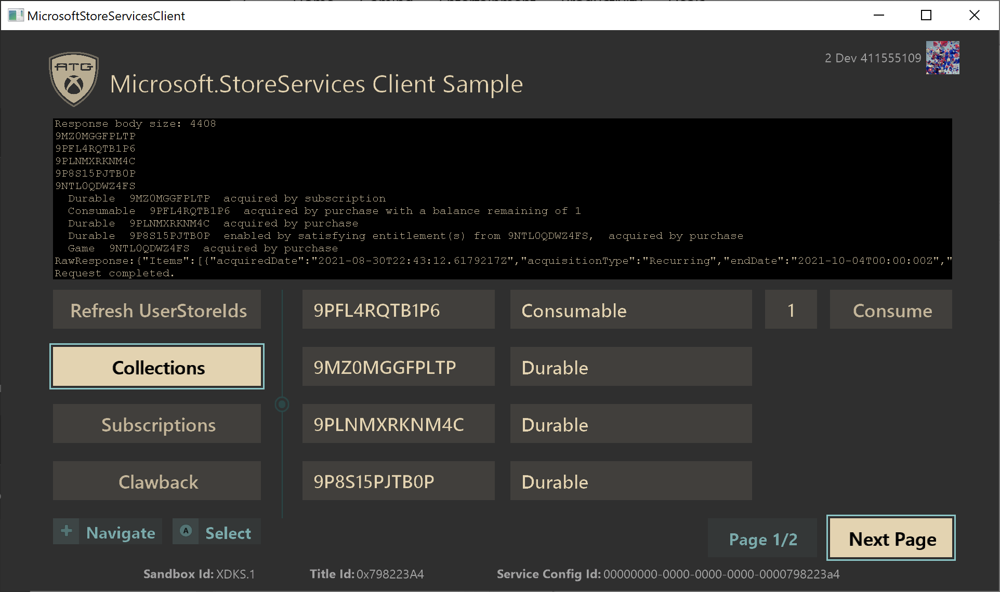
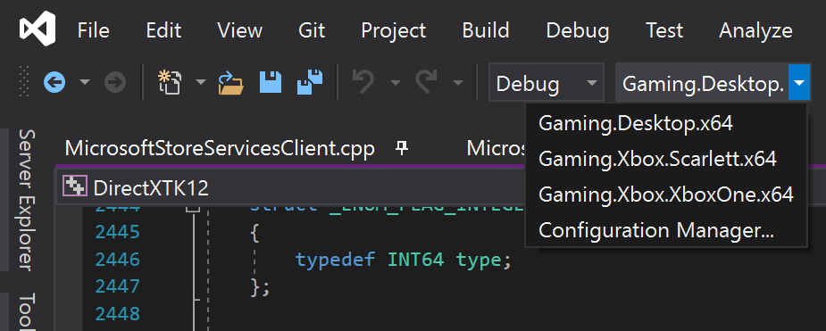
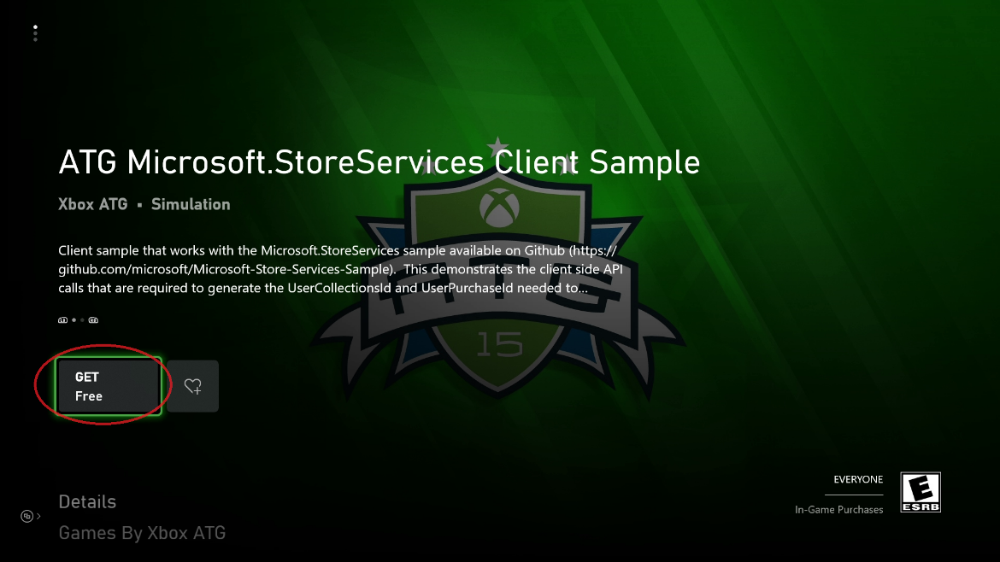
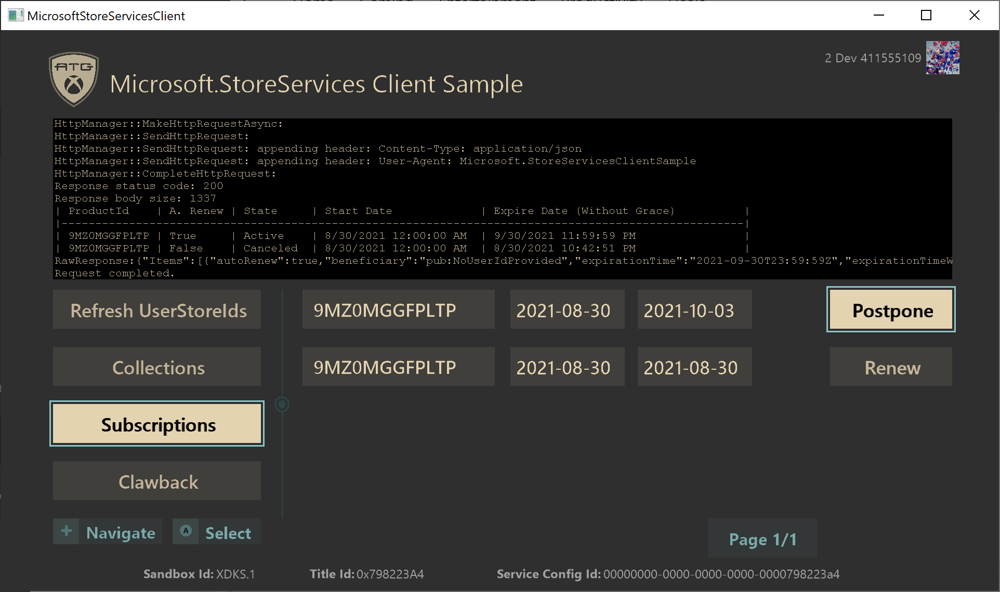
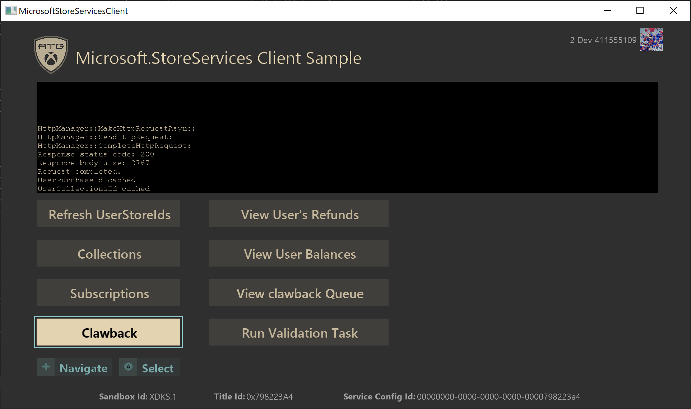

  

#   Microsoft.StoreServices 클라이언트 샘플

*이 샘플은 Microsoft 게임 개발 키트(2021년 4월 QFE5)와 호환됩니다.*

# 

# 설명

이 샘플은 Microsoft Store Services를 통한 서비스 간 인증 및 제품 관리를
위해 [Microsoft.StoreServices
샘플](https://github.com/microsoft/Microsoft-Store-Services-Sample)과
함께 사용되는 클라이언트 기반 작업을 보여줍니다. 특히 [서비스 간 인증을
위한 사용자 저장소 ID
요청(microsoft.com)](https://developer.microsoft.com/en-us/games/xbox/docs/gdk/xstore-requesting-a-userstoreid)에
설명된 대로 사용자 Store ID를 얻고 사용하는 방법

# 샘플 빌드

해당 샘플에서는 데스크톱, Xbox One, Scarlett을 지원합니다. 드롭다운에서
구성을 선택하여 빌드합니다.

*자세한 내용은 GDK 설명서에서* 샘플 실행을 *참조하세요.*

# 샘플 실행

샘플은 [Microsoft.StoreServices
샘플](https://github.com/microsoft/Microsoft-Store-Services-Sample)과
함께 작동하도록 설계되었으며 서비스가 Microsoft Store Services로 인증할
수 있도록 하는 데 필요한 클라이언트 측에서 필요한 흐름과 API를
실행합니다. XDKS.1에서 샘플을 실행할 때 ATG가 XDKS.1의 샘플 제품과 함께
사용하기 위해 유지 관리하는 Microsoft.StoreServices 샘플 버전을 호출하고
상호 작용하도록 사전 구성되어 있습니다.

클라이언트 샘플은 서비스 샘플과 상호 작용하여 특정 작업을 요청하고
서비스 샘플에서 수행한 작업의 결과를 표시합니다. 예를 들어, 계정이
소유한 항목 보기, 소모품 처리, 구독 관리, 환불 감지를 위한 소모품 처리
추적.

이 클라이언트에서 XStore API를 사용하는 주요 특징은 작동하려면 유효한
라이선스가 필요하다는 것입니다. 자세한 내용은 \"XStore API 테스트를 위한
제품 설정\"이라는 제목의 GDK 문서 섹션을 참조하세요.

라이선스는 게임이 시작될 때 라이선스 서비스를 호출하여 확인됩니다.
이것이 없으면 XStore API(XStoreGetUserCollectionsIdAsync 및
XStoreGetUserPurchaseIdAsync)는 유효한 라이선스를 찾을 수 없음을
나타내는 0x803f6107(IAP_E\_UNEXPECTED)을 반환합니다.

테스트 계정에 대한 샘플에 대한 유효한 라이선스를 얻으려면 샌드박스
**XDKS.1**에 있는지 확인하고(모든 개발자 계정이 이 샌드박스를 사용할 수
있음) 샘플 제품의 스토어 페이지로 이동하여 \"**가져오기**\"를
선택합니다. 다운로드가 완료될 때까지 기다릴 필요가 없습니다.

이 샘플의 스토어 페이지로 직접 이동하려면 다음 바로 가기 명령을
사용하세요.

**PC:**

실행 상자(Win+R):

ms-windows-store://pdp/?productid=9MXL21XPWWWK

또는

msxbox://game/?productId=9MXL21XPWWWK

****

**Xbox:**

Visual Studio 게임 명령 프롬프트에서:\
xbapp launch ms-windows-store://pdp/?productid=9MXL21XPWWWK

스토어에서 설치된 샘플은 적절한 라이선스가 부여되고 제대로 작동하지만
샘플의 이전 버전을 나타낼 수 있습니다.

이제 XDKS.1 샌드박스에서 (F5) 키를 사용하여 Visual Studio에서 샘플을
실행할 수 있습니다. 자체 샌드박스에서 샘플을 테스트용 제목으로
실행하려는 경우 아래 섹션에 설명된 대로 MicrosoftGame.Config 파일에 대한
특정 구성 변경을 수행해야 합니다.

샘플은 테스트 계정이 이전에 가지고 있던 소모품 또는 구독을 재구매하지
않는 한 샘플 제품을 구매할 수 있는 방법을 제공하지 않습니다. 게임 내
스토어 샘플을 사용하여 다양한 제품을 구매하거나 다음 단축키를 사용할 수
있습니다.

**PC:**

실행 상자(Win+R):

-   **Store에서 관리하는 소모성 제품:\
    **ms-windows-store://pdp/?productid=9PFL4RQTB1P6\
    ms-windows-store://pdp/?productid=9NCX1H100M18

-   **패키지가 없는 지속성 콘텐츠**\
    ms-windows-store://pdp/?productid=9N30KZZF4BR9\
    ms-windows-store://pdp/?productid=9P23V43P0XZZ\
    ms-windows-store://pdp/?productid=9PLRFWZWWF91

-   **게임:**\
    ms-windows-store://pdp/?productid=9NTL0QDWZ4FS

-   **구독:**\
    ms-windows-store://pdp/?productid=9MZ0MGGFPLTP

**Xbox:**

Visual Studio 게임 명령 프롬프트에서:

-   **Store에서 관리하는 소모성 제품:\
    **xbapp launch ms-windows-store://pdp/?productid=9PFL4RQTB1P6\
    xbapp launch ms-windows-store://pdp/?productid=9NCX1H100M18

-   **패키지가 없는 지속성 콘텐츠**\
    xbapp launch ms-windows-store://pdp/?productid=9N30KZZF4BR9\
    xbapp launch ms-windows-store://pdp/?productid=9P23V43P0XZZ\
    xbapp launch ms-windows-store://pdp/?productid=9PLRFWZWWF91

-   **게임:\
    **xbapp launch ms-windows-store://pdp/?productid=9NTL0QDWZ4FS

-   **구독:**\
    xbapp launch ms-windows-store://pdp/?productid=9MZ0MGGFPLTP

# 샘플을 타이틀로 실행

테스트 및 문제 해결을 위해 타이틀 구성을 사용하도록 샘플을 리디렉션할 수
있습니다. 이 작업은 설치된 빌드 대신 사용되므로 후속 재설치 비용이
발생할 수 있으므로 샘플을 설치해야 합니다.

1.  샌드박스에 로그인하고 샌드박스에 프로비전된 테스트 계정을
    사용합니다.

2.  타이틀 실행을 위한 디지털 라이선스가 있도록 테스트 계정이 타이틀을
    소유하는지 확인합니다.

3.  타이틀의 microsoftgame.config에서 복사

    a.  ID 노드, 버전은 중요하지 않음

    b.  타이틀 ID

    c.  스토어 ID

    d.  **Xbox 전용:** ContentIdOverride 및 EKBIDOverride(아래 참조)

4.  다시 빌드 및 배포

5.  시작(개발자 샌드박스)

다른 타이틀을 가리키는 샘플의 이전 설치를 모두 제거하고 다시 빌드하는
것이 좋습니다.

Xbox에서 문제가 발생하는 경우 배포 시 xbapp list /d를 수행하고 사용자가
변경하지 않은 이름 및 버전 번호 이외에 모든 값이 타이틀의 예상되는 값과
일치하는지 확인합니다. 두 플랫폼 모두에서 앱 ID와 게시자의 함수인
접미사에 대해 PFN이 일치하는지 확인합니다.

**Xbox 전용:**

**로컬로 배포된 빌드**(예: PC에서 푸시 또는 실행)에는 기본적으로
라이선스가 제공되지 않지만 microsoftgame.config에 콘텐츠 ID와 EKBID에
대한 개발 전용 재정의 값이 포함되어 있는 경우 제대로 라이선스가 제공되고
XStore API를 작동할 수 있습니다. 이 샘플의 microsoftgame.config에서 해당
섹션을 참조하세요.

\<DevelopmentOnly\>

\<ContentIdOverride\>2797FA46-A93B-494C-AD80-B67C9FCA939F\</ContentIdOverride\>

\<EKBIDOverride\>00000000-0000-0000-0000-000000000001\</EKBIDOverride\>

\</DevelopmentOnly\>

콘텐츠 ID는 파트너 센터에서 샌드박스를 제출한 패키지에 할당된 ID와
일치해야 합니다.

EKBID는 모두 0이거나 기본 33EC8436-5A0E-4F0D-B1CE-3F29C3955039 이외의
모든 값이 될 수 있습니다.

이 상태가 유지되고 제품에 라이선스가 제공된 계정과 함께 사용하는 경우
샘플은 라이선스가 부여된 상태로 실행됩니다.

콘텐츠 ID, 적절한 EKBID (필수 아님), PFN 을 얻을 수 있는 최적의 방법은
샌드박스에서 수집 및 게시된 패키지를 설치한 다음 xbapp list /d를
실행하는 것입니다.

패키지 전체 이름으로 등록된 응용 프로그램:

41336MicrosoftATG.InGameStoreXS_1.0.0.0_neutral\_\_dspnxghe87tn0

설치

드라이브: 정품

크기: 0.28 GB.

ContentId: {2797FA46-A93B-494C-AD80-B67C9FCA939F}

ProductId: {4C544E39-5130-3044-C057-5A3446536A00}

EKBID: {37E80840-6BEE-46F8-8EDB-92F877056087}

DisplayName: ATG 인게임 스토어 샘플

41336MicrosoftATG.InGameStoreXS_dspnxghe87tn0!Game

이 값은 내 게임에서 설치된 타이틀의 타일에 있는 메뉴를 선택하고 파일
정보를 확인하여 화면에도 표시될 수 있습니다.

EKBID의 경우 패키지를 등록할 때 해당 사항을 확인할 수 있습니다. (예:
실행 준비 완료) 타이틀 패키지가 클 경우 EKBID가 있고 사용자의 개발
빌드를 대신 배포하거나 사이드로드하면 해당 패키지가 취소될 수 있습니다.

# 구현 참고 사항

Microsoft 계정(MSA) StoreContext 및 이에 따라 연결된 UserStoreID는 앱이
Windows에서 실행 중인지 Xbox 콘솔에서 실행 중인지에 따라 다릅니다.

-   **Windows PC:** Windows 스토어 앱에 로그인한 MSA이며, 반드시 Xbox
    Live에 로그인한 MSA는 아닙니다.

-   **Xbox:** Xbox Live에 로그인하여 게임을 활발하게 플레이하는
    MSA입니다.

이에 대한 자세한 내용은 [PC에서 일치하지 않는 스토어 계정 시나리오
처리(microsoft.com)](https://developer.microsoft.com/en-us/games/xbox/docs/gdk/xstore-handling-mismatched-store-accounts)
문서를 참조하세요.

## 페이징

컬렉션 또는 구독 페이지의 결과에 4개 이상의 결과가 포함된 경우 **다음
페이지** 버튼이 활성화되어 반환된 모든 항목을 살펴볼 수 있습니다. 현재
페이지 번호와 총 페이지도 표시됩니다.

## UserStoreId 새로 고침

이 단추는 서비스 샘플에서 AAD 액세스 토큰을 검색하는 프로세스를 시작한
다음, 이를 사용하여 서비스 샘플에 전달해야 하는
UserStoreIds(UserCollectionsId 및 UserPurchaseId)를 생성하여 Microsoft
Store Services에 대한 서비스-서비스 인증을 미리 구성합니다.

자세한 내용은 [서비스 간 인증을 위한 사용자 Store ID
요청(microsoft.com)](https://developer.microsoft.com/en-us/games/xbox/docs/gdk/xstore-requesting-a-userstoreid)을
참조하세요.

## 컬렉션

컬렉션 페이지에서 서비스 샘플은 사용자의 컬렉션 데이터를 확인하기 위해
서비스 간 쿼리를 수행합니다. 여기에는 게임, 내구재 및 소모품과 같이
사용자가 구매한 항목이 포함됩니다. 사용자의 쿼리 결과에 소모품이 있는
경우 클라이언트 샘플 내에서 다음 작업을 수행할 수 있습니다.

-   **수량 사용** - 수량이 0보다 큰 경우 - 사용자 계정에서 항목을
    이행하고 사용자의 소모품 구매를 추적하고 이러한 이행된 항목에 대해
    사용자에게 가능한 환불 문제를 추적하기 위해 자체 서비스
    데이터베이스의 사용자 잔액에 값을 추가합니다. 이 소비는 서비스
    샘플에 기본 제공되는 소모품 및 회수 추적에도 추가됩니다.

-   **소모품 추가 구매** - 수량이 0인 경우 - 앱 내에서 직접 소모품을
    추가 구매하여 테스트를 계속하고 동일한 소모품의 여러 구매를
    시뮬레이션합니다.

자세한 내용은 [서비스(콘텐츠)에서 제품
관리(microsoft.com)](https://developer.microsoft.com/en-us/games/xbox/docs/gdk/service-to-service-nav)
섹션을 참조하세요.

## 구독

구독 페이지에서 서비스 샘플은 사용자의 구독을 확인하기 위해 서비스 간
쿼리를 수행합니다. 사용자의 쿼리 결과에 구독 제품이 있는 경우 클라이언트
샘플 내에서 다음 작업을 수행할 수 있습니다.

-   **연기** -- 자동 갱신이 활성화된 활성 구독 -- 구독의 자동 갱신
    설정을 끕니다. 이를 통해 사용자는 남은 구독 기간을 마칠 수 있지만
    종료 날짜 이후에는 유효하지 않게 됩니다.

-   **취소** -- 자동 갱신이 비활성화된 활성 구독 -- 현재 유료 구독
    기간의 남은 시간에 관계없이 사용자의 구독을 즉시 취소하고 활성에서
    비활성으로 변경합니다.

-   **갱신** -- 비활성 구독 -- 구독 제품을 다시 구독하기 위한 구매
    흐름을 시작합니다.

## 회수

회수 페이지에는 서비스 샘플에서 데이터 또는 작업을 요청할 수 있는 다음
버튼이 있습니다.

-   **사용자의 환불 보기** -- 서비스 샘플은 현재 사용자에게 환불된
    항목이 있는지 확인하기 위해 호출을 수행합니다.

-   **사용자 잔액 보기** -- 모든 사용자에 대해 서비스에서 처리된
    소모품의 현재 추적된 잔액을 봅니다.

-   **회수 큐 보기** -- 현재 추적된 소비 거래를 보고 회수 서비스로
    가능한 환불을 찾습니다.

-   **유효성 검사 작업 실행** -- 서비스 샘플은 모든 사용자의 환불 및
    추적된 소모품 거래를 찾기 위해 회수 조정을 수행합니다.

자세한 내용은 [소모품 관리 및 서비스
환불(microsoft.com)](https://developer.microsoft.com/en-us/games/xbox/docs/gdk/xstore-managing-consumables-and-refunds)을
참조하세요.

# 알려진 문제

현재 알려진 문제가 없습니다.

# 개인정보처리방침

샘플을 컴파일하고 실행하는 경우 샘플 사용량을 추적할 수 있도록 샘플 실행
파일의 파일 이름이 Microsoft에 전송됩니다. 이 데이터 수집을
옵트아웃하려면 \"샘플 사용량 원격 분석\"으로 레이블이 지정된
Main.cpp에서 코드 블록을 제거할 수 있습니다.

Microsoft의 개인정보 정책에 대한 자세한 내용은 [Microsoft 개인정보
처리방침](https://privacy.microsoft.com/en-us/privacystatement/)을
참조하세요.

# 업데이트 기록

**초기 릴리스:** 2021년 8월
