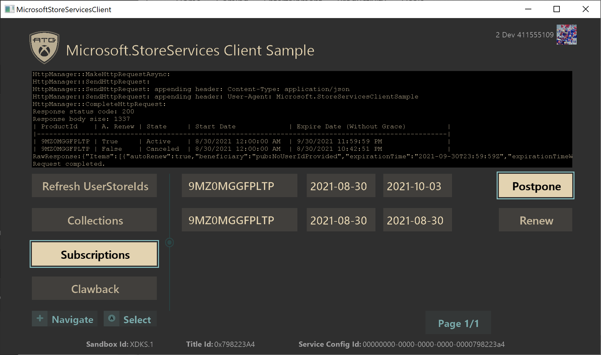
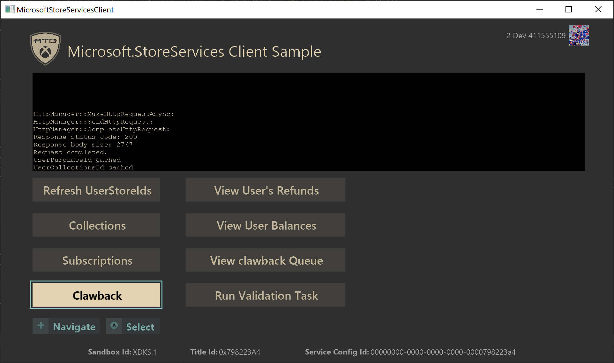

  

#   Microsoft.StoreServices 客户端示例

*此示例兼容于 Microsoft 游戏开发工具包(2021 年 4 月 QFE5)*

# 

# 说明

此示例演示与 [Microsoft.StoreServices
示例](https://github.com/microsoft/Microsoft-Store-Services-Sample)一起使用的基于客户端的操作，这些操作通过
Microsoft Store 服务进行服务到服务授权和产品管理。
具体而言，如何获取和使用用户存储 ID，如[请求某个用户 Store ID
进行服务到服务身份验证
(microsoft.com)](https://developer.microsoft.com/en-us/games/xbox/docs/gdk/xstore-requesting-a-userstoreid)

# 生成示例

此示例支持 Xbox One、Scarlett 和 Desktop。在下拉列表中选择要生成的配置。

*有关详细信息，请参阅 GDK 文档中的*"运行示例"*。*

# 运行示例

该示例旨在与 [Microsoft.StoreServices
示例](https://github.com/microsoft/Microsoft-Store-Services-Sample)配合使用，让你在客户端上练习使用所需的流和
API，以允许服务使用 Microsoft Store 服务进行身份验证。 在 XDKS.1
中运行示例时，已预先将示例配置为调用 Microsoft.StoreServices
示例的版本并与之进行交互，ATG 将该示例用于 XDKS.1 中的示例产品。

客户端示例将与服务示例进行交互，以请求执行具体操作并显示服务示例执行的这些操作的结果。
例如，查看帐户拥有的项目、完成易耗品、管理订阅以及跟踪易耗品履行情况以检测退款。

通过此客户端使用 XStore API
的一个关键特征是它们需要有效的许可证才能正常工作。有关详细信息，请参阅
GDK 文档中标题为"设置你的产品以测试 XStore API"的部分。

在游戏启动时，将通过调用许可服务来验证许可证。如果没有此功能，XStore
API（XStoreGetUserCollectionsIdAsync 和
XStoreGetUserPurchaseIdAsync）会返回 0x803f6107
(IAP_E\_UNEXPECTED)，表明未找到有效的许可证。

若要为测试帐户获取示例的有效许可证，请确保你位于沙盒
**XDKS.1**（任何开发人员帐户都可以使用此沙盒）中，然后转到相同产品的商店页面并选择"**获取**"。无需等待下载完成。

若要直接转到此示例的商店页面，请使用以下快捷方式命令：

**电脑：**

运行框 (Win+R)：

ms-windows-store://pdp/?productid=9MXL21XPWWWK

或者

msxbox://game/?productId=9MXL21XPWWWK

****

**Xbox：**

在 Visual Studio 游戏命令提示中：\
xbapp launch ms-windows-store://pdp/?productid=9MXL21XPWWWK

从商店安装的示例将获得适当的许可并正常运行，但可能代表该示例的旧版本。

现在，该示例应该能够在 XDKS.1 沙盒中使用 (F5) 从 Visual Studio 运行了。
如果计划在自己的沙盒中运行示例，并将其作为自己的游戏进行测试，则需要对
MicrosoftGame.Config 文件进行特定的配置更改，如以下部分所述。

除非重新购买测试帐户以前已经拥有的易耗品或订阅，否则该示例不提供购买示例产品的方式。
你可以使用游戏内应用商店示例购买各种产品或使用以下快捷方式：

**电脑：**

运行框 (Win+R)：

-   **应用商店管理的易耗品：\
    **ms-windows-store://pdp/?productid=9PFL4RQTB1P6\
    ms-windows-store://pdp/?productid=9NCX1H100M18

-   **不带包的耐用品：**\
    ms-windows-store://pdp/?productid=9N30KZZF4BR9\
    ms-windows-store://pdp/?productid=9P23V43P0XZZ\
    ms-windows-store://pdp/?productid=9PLRFWZWWF91

-   **游戏：**\
    ms-windows-store://pdp/?productid=9NTL0QDWZ4FS

-   **订阅：**\
    ms-windows-store://pdp/?productid=9MZ0MGGFPLTP

**Xbox：**

在 Visual Studio 游戏命令提示中：

-   **应用商店管理的易耗品：\
    **xbapp launch ms-windows-store://pdp/?productid=9PFL4RQTB1P6\
    xbapp launch ms-windows-store://pdp/?productid=9NCX1H100M18

-   **不带包的耐用品：**\
    xbapp launch ms-windows-store://pdp/?productid=9N30KZZF4BR9\
    xbapp launch ms-windows-store://pdp/?productid=9P23V43P0XZZ\
    xbapp launch ms-windows-store://pdp/?productid=9PLRFWZWWF91

-   **游戏：\
    **xbapp launch ms-windows-store://pdp/?productid=9NTL0QDWZ4FS

-   **订阅：**\
    xbapp launch ms-windows-store://pdp/?productid=9MZ0MGGFPLTP

# 将示例作为游戏运行

可以重定向示例以使用游戏配置，从而进行测试和故障排除。请注意，这将取代任何已安装的版本。因此，请注意，将示例作为游戏安装可能会产生后续安装费用。

1.  登录沙盒并使用为沙盒预配好的测试帐户

2.  确保测试帐户拥有相应游戏，这样它才拥有数字许可证来运行游戏

3.  从游戏的 microsoftgame.config，复制

    a.  标识节点；版本无关紧要

    b.  游戏 ID

    c.  Store ID

    d.  **仅 Xbox：**ContentIdOverride 和 EKBIDOverride（见下文）

4.  重新生成和部署

5.  启动（在开发人员沙盒中）

建议你执行全新重建并卸载指向任何其他游戏的示例的所有以前安装。

如果你在 Xbox 上遇到问题，请在部署中执行 xbapp list
/d，并确保除了你未更改的名称和版本号外，所有值均与游戏的预期值匹配。对于这两个平台，请确保
PFN 在应用标识以及后缀（这是发布者的功能）方面均匹配。

**仅 Xbox：**

默认情况下，**本地部署的版本**（即从电脑推送或运行）将不被许可，但是如果
microsoftgame.config 包含内容 ID 和 EKBID
的仅开发覆盖值，则它将能够正确许可并允许 XStore API
正常工作。请注意本示例中 microsoftgame.config 中的此部分：

\<DevelopmentOnly\>

\<ContentIdOverride\>2797FA46-A93B-494C-AD80-B67C9FCA939F\</ContentIdOverride\>

\<EKBIDOverride\>00000000-0000-0000-0000-000000000001\</EKBIDOverride\>

\</DevelopmentOnly\>

内容 ID 必须与分配给在合作伙伴中心提交沙盒的软件包的内容 ID 相匹配。

EKBID 可以是除所有零或默认值 33EC8436-5A0E-4F0D-B1CE-3F29C3955039
之外的任何内容。

完成此操作后，并与产品的许可帐户结合使用，示例将以许可状态运行。

获取内容 ID、正确的 EKBID（不是必需的）和 PFN
的最佳方法是从沙盒安装已引入并发布的程序包，然后运行 xbapp list /d

按程序包全名显示已注册的应用程序：

41336MicrosoftATG.InGameStoreXS_1.0.0.0_neutral\_\_dspnxghe87tn0

安装

驱动器：Retail

大小​​：0.28 GB。

ContentId：{2797FA46-A93B-494C-AD80-B67C9FCA939F}

ProductId：{4C544E39-5130-3044-C057-5A3446536A00}

EKBID：{37E80840-6BEE-46F8-8EDB-92F877056087}

DisplayName：游戏内商店示例

41336MicrosoftATG.InGameStoreXS_dspnxghe87tn0!Game

通过在"我的游戏"中选择已安装游戏磁贴上的"菜单"并查看"文件信息"，也可以在屏幕上看到这些值。

对于
EKBID，这在软件包注册（即"准备好启动"）时可见，因此如果你的安装的程序包很大，则在你拥有
EKBID 并打算部署或旁加载你的开发内部版本后，此时可以取消此操作。

# 实施说明

Microsoft 帐户 (MSA) StoreContext 以及 UserStoreID 的关联取决于应用是在
Windows 上还是在 Xbox 主机上运行。

-   **Windows 电脑：**已登录到 Windows 应用商店应用的
    MSA，不一定是已登录到 Xbox Live 的 MSA。

-   **Xbox：** 已登录 Xbox Live 并且正在主动玩游戏的 MSA。

有关详细信息，请参阅文档[处理电脑上不匹配的 Microsoft Store 帐户场景
(microsoft.com)](https://developer.microsoft.com/en-us/games/xbox/docs/gdk/xstore-handling-mismatched-store-accounts)

## 分页

如果"集锦"或"订阅"页面的结果包含超过 4
个结果，则将启用"**下一页**"按钮以允许你浏览返回的所有项。
还会显示当前页数和总页数。

## Refresh UserStoreIds

此按钮将开始从服务示例检索 AAD
访问令牌的过程，然后使用这些令牌生成需要传递给服务示例的
UserStoreId（UserCollectionsId 和 UserPurchaseId），以便为 Microsoft
Store 服务执行服务到服务身份验证

有关详细信息，请参阅[请求一个用户 Store ID 用于服务间身份验证
(microsoft.com)](https://developer.microsoft.com/en-us/games/xbox/docs/gdk/xstore-requesting-a-userstoreid)。

## 集锦

在"集锦"页面上，服务到服务查询由服务示例执行，用于检查用户的集锦数据。
这些数据包括用户购买的项目，如游戏、耐用品和易耗品。
如果用户的查询结果中包含易耗品，则可以在客户端示例中执行以下操作：

-   **使用数量 -** 如果数量大于 0 -
    则从用户的帐户消耗该项目，并将值添加到用户在我们自己的服务数据库中的余额，用于跟踪该用户的易耗品购买记录，以及该用户已经使用的项目可能遇到的退款问题。
    此使用也会添加到服务示例内置的易耗品和 Clawback 跟踪中。

-   **购买更多易耗品** - 如果数量为 0 -
    则直接从应用内购买更多易耗品，以继续测试和模拟同一易耗品的多次购买。

有关详细信息，请参阅[管理服务（内容）提供的产品
(microsoft.com)](https://developer.microsoft.com/en-us/games/xbox/docs/gdk/service-to-service-nav)

## 订阅

在"订阅"页面上，服务到服务查询由服务示例执行，用于检查用户的订阅数据。
如果用户的查询结果中包含订阅产品，则可以在客户端示例中执行以下操作：

-   **推迟 --** 启用了自动续订的活动订阅 -
    这样会关闭订阅的自动续订设置。
    此操作允许用户完成其订阅的剩余时间，但在结束日期后会失效。

-   **取消** - 禁用了自动续订的活动订阅 -
    这样会立即取消用户的订阅，并将其从活动状态更改为不活动状态，无论用户当前已付款的订阅期还剩下多少时间。

-   **续订 -** 不活动的订阅 - 启动购买流程以重新订阅相关订阅产品。

## Clawback

在"Clawback"页面上，可以使用以下按钮从服务示例请求数据或操作：

-   **查看用户的退款** -
    服务示例会执行一次调用，检查当前用户是否拥有任何已退款项目。

-   **查看用户余额** --
    查看当前跟踪到的所有用户在相关服务上面已使用的易耗品余额。

-   **查看 Clawback 队列 -** 查看当前跟踪到的使用交易，寻找可能存在的
    Clawback 服务退款。

-   **运行验证任务**-- 服务示例将预先设置 Clawback
    对帐，以查找所有用户和跟踪的易耗品交易的退款。

有关详细信息，请参阅[在服务中管理易耗品和退款
(microsoft.com)](https://developer.microsoft.com/en-us/games/xbox/docs/gdk/xstore-managing-consumables-and-refunds)。

# 已知问题

当前没有已知问题。

# 隐私声明

在编译和运行示例时，示例可执行文件的文件名将发送给
Microsoft，以帮助跟踪示例使用情况。若要选择退出此数据收集，你可以删除
Main.cpp 中标记为"示例使用遥测"的代码块。

有关 Microsoft 的一般隐私策略的详细信息，请参阅 [Microsoft
隐私声明](https://privacy.microsoft.com/en-us/privacystatement/)。

# 更新历史记录

**初始版本：**2021 年 8 月
