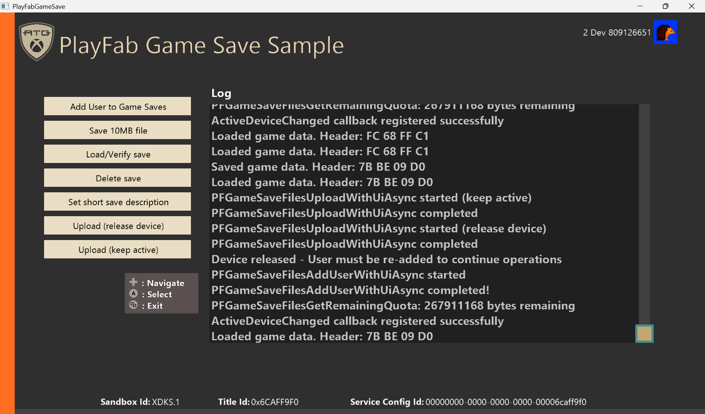

_This sample is compatible with the October 2025 GDK_

# PlayFab Game Saves

## Description
PlayFab Game Saves is a cloud-based save data management system provided by the PlayFab Services SDK. Players can save their game progress to the cloud and seamlessly access it across multiple devices.

The Game Save Files API automatically handles cloud synchronization, data conflict resolution, and the complexity of device management. Game developers can focus on save-data logic, while PlayFab manages the cloud infrastructure, storage capacity, and multi-device coordination.

This sample is a basic implementation example for integrating cloud save functionality into Xbox and Windows games built with the GDK using the PFGameSave API.

## Setting up PlayFab Game Saves

### Accessing PlayFab Manager
As an initial setup step, follow the instructions below:

- Access PlayFab Manager (https://developer.playfab.com/) and select the relevant title
- From the left menu, select **Progression** > **Game Saves**

**If you cannot access Game Saves:**

- Select **Add to Waitlist**
- Inform your developer partner manager of the following:
  - That the request to use the Game Save feature and the Waitlist registration have been completed
  - Your PlayFab Title ID

**Required setting: Disable Player Creation**

This sample assumes that all users authenticate with PlayFab through Xbox sign-in.
To avoid PlayFab automatically creating player accounts that are not associated with an Xbox-authenticated identity, all options under 'Disable Player Creations' must be checked.

(PlayFab Game Manager > Settings > API Features)

This setting is required for all titles that utilize PlayFab Game Saves.

**Important**: Update the `PLAYFAB_TITLE_ID` constant in `PlayFabGameSave.h` with your own PlayFab Title ID before building.

## Building the sample
This sample uses the PlayFab.Services.C extension library and the PlayFab Game Saves API. It was created with Visual Studio 2022 and can be built with Visual Studio 2019 or later.

**Build requirements:**

- October 2025 GDK or later
- Visual Studio 2019 or Visual Studio 2022 or later

## Using the sample

This sample is intended to be run in the **XDKS.1** sandbox. Because it uses the `PFGameSave` API, prepare a **test account** that can sign in to XDKS.1.

In addition to the Xbox title ID, you also need the PlayFab title ID. Check the PlayFab title ID in PlayFab Manager.

For details about creating a title and the required IDs, see [PlayFab Quickstart](https://learn.microsoft.com/ja-jp/gaming/playfab/gamemanager/quickstart).

## Running the sample

**Sandbox setup:**

- Set the sandbox of the Xbox development kit and Windows to `XDKS.1`

**Sign-in:**

- **On Windows:**
  - In the Microsoft Store and the Xbox app, sign in with a test account that can sign in to the `XDKS.1` sandbox
- **On Xbox development kit:**
  - From the Xbox guide button, sign in with a test account to the `XDKS.1` sandbox

If you sign in in advance, when you start the sample it will automatically sign in to the Xbox network and PlayFab. Until sign-in is complete, all buttons are disabled.

## Sample implementation details
Set the sandbox on the Xbox development kit and Windows to XDKS.1. Next, on Windows sign in to the sandbox in MicrosoftStore and the Xbox app using a test account that can sign in to that sandbox. On Xbox, sign in with a test account using the Xbox guide button, etc.

If you sign in in advance, when you start the sample it will automatically sign in to the Xbox network and PlayFab. Until sign-in is complete, all buttons are disabled.

**Button functions:**

- **Add User:**
  - Registers the user with the GameSave system (`PFGameSaveFilesAddUserWithUiAsync`)
  - Gets the save-folder path and the remaining cloud storage quota
  - If existing save data exists, it is automatically loaded and output to the log
  - Registers the active device change callback
  
  This operation syncs save data from the cloud. If save conflicts or active device contention are detected, the system will display resolution dialogs automatically (stock UI on Xbox/Windows).

- **Data Save:**
  - Generates 512 KB of random data and saves it locally as `savegame.dat`

- **Data Load:**
  - Loads the locally saved save data and outputs it to the log

- **Data Delete:**
  - Deletes the local save file

- **Set Description:**
  - Sets a timestamped description on the save data (`PFGameSaveFilesSetSaveDescriptionAsync`)
  - Example: `"Saved 2026-02-09 14:30:45"`

- **Upload (Release Device):**
  - Uploads the local save to the cloud, then deactivates this device
  - After upload completes, Add User is required again

- **Upload (Keep Active):**
  - Uploads the local save to the cloud while keeping this device active
  - Save-data operations can continue

**Device state management:**

- If another device becomes active, `PFGameSaveFilesSetActiveDeviceChangedCallback` automatically notifies you
- Because the state is reset, you can resume operations by running Add User again

## Limitations
In the extension library, errors from the service are returned as HRESULT values (defined in PFErrors.h). In many cases, HRESULT codes are not as useful as the underlying error codes provided by PlayFab.

We recommend using a web debugging tool such as [Fiddler](https://developer.microsoft.com/en-us/games/xbox/docs/gdk/fiddler-setup-networking) to view detailed error messages from the service.

## Update history
February 2026: Initial release

## Privacy Statement
When you compile and run this sample, the name of the sample executable file is sent to Microsoft to track sample usage. To opt out of this data collection, remove the block of code labeled "Sample Usage Telemetry" in Main.cpp.

For details about Microsoft's general privacy policy, see the [Microsoft Privacy Statement](https://privacy.microsoft.com/en-us/privacystatement/).

## Related documentation

This sample is intended as a learning resource that demonstrates a minimal end-to-end flow for integrating PlayFab Game Saves on Xbox and Windows.
For a deeper understanding of the overall system behavior, supported scenarios, and edge cases that are not fully covered by this sample, refer to the official PlayFab Game Saves documentation below.

- **PlayFab Game Saves Overview**  
  Provides a high-level overview of PlayFab Game Saves, including supported platforms, core concepts, and overall system behavior.  
  https://learn.microsoft.com/gaming/playfab/player-progression/game-saves/overview

- **Game Saves Quickstart**  
  Walks through the complete setup and integration flow, including initialization, cloud synchronization, uploads, and basic error handling.  
  https://learn.microsoft.com/gaming/playfab/player-progression/game-saves/quickstart

- **Save Conflicts**  
  Explains how save data conflicts are detected and resolved, including the concept of atomic units and the user-facing resolution flow.  
  https://learn.microsoft.com/gaming/playfab/player-progression/game-saves/conflicts

- **Active Device Changes**  
  Describes how Game Saves handles scenarios where a player switches devices during a session, and how titles should respond using active device change callbacks.  
  https://learn.microsoft.com/gaming/playfab/player-progression/game-saves/activedevicechanges

- **Offline Mode**  
  Describes how PlayFab Game Saves behaves when network connectivity is unavailable, including offline limitations and recovery behavior.  
  https://learn.microsoft.com/gaming/playfab/player-progression/game-saves/offline
