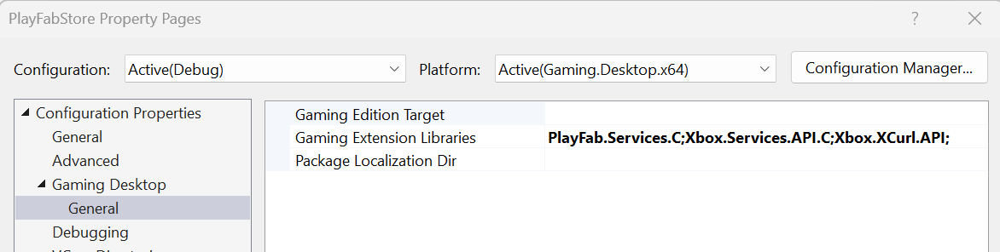
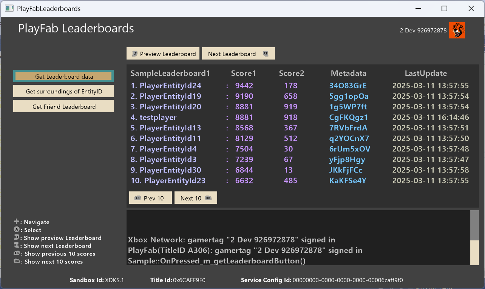
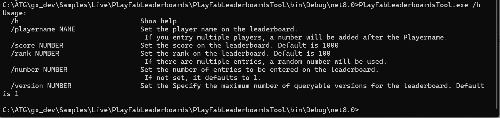

_このサンプルは October 2024 GDK と互換性があります_

# PlayFab リーダーボード

## 説明
PlayFab のリーダーボード(v2)に登録されたリーダーボードのデータを表示するサンプルです。

Xbox、Windows で動作するアプリケーション（PlayFabLeaderboards.exe）は、 PlayFab の リーダーボードに登録された EntityID を読み込んで閲覧できるシンプルなサンプルとなっています。
実装されている機能は 複数の PlayFab リーダーボードから、マルチカラムのスコア、メタデータ、更新時間です。これらを10人ずつ表示します。また、コード内で指定したPlayerID の前後 5位のプレイヤーのランキングと、フレンドのランキングを取得して表示する機能もあります。

このサンプルは PlayFab リーダーボードの読み込み方法を参考にしていただものとなっております。（後述いたしますが、補足の機能として リーダーボードの作成と PlayerEntity の書き込みを行えるツールも一緒に提供しています）statistics を利用したクライアントからの書き込みはチートの観点から注意が必要になるため、このサンプルでは実装していません。フィードバックがありましたら将来的にこのサンプルの更新を検討いたします。

通常、リーダーボードの作成は PlayFab Manager（https://developer.playfab.com/） からであったり、作成およびデータの登録は開発者様の Web service から 行っていただきます。

しかしながら、このサンプルでは簡易的にリーダーボードの情報を閲覧するためにあくまでサポート機能となりますが、コマンドラインのツール（PlayFabLeaderboardsTool.exe）を提供しております。
このツールをご利用いただくことで簡単に複数人の PlayerEntity を Windows のコマンドラインから PlayFab のリーダーボードに登録することが可能になります。
ツールの機能としてはリーダーボードを自動で2つ作成し、特定のプレイヤーID 1人のスコアを登録するか、指定した人数分 PlayerEntityIDに数字をつけたEntityID のスコアをランダムで登録します。
これらはツールで提供されているオプションのヘルプを参照してください。

アプリケーションとツールは同じリーダーボード名を使うようにハードコーディングしております。この部分を変更したい場合はコードを参照、編集していただく必要があります。

## サンプルのビルド

このサンプルでは、PlayFab.Services.C 拡張ライブラリと新たに追加された PlayFab Leaderboard API を使用します。 このサンプルをビルドするには、October 2024 GDK (以降) をターゲットにする必要があります。Visual Studio 2019 および 2022以降をご利用ください。このサンプルは Visual Studio 2022で作成されました。

## サンプルの使用方法

このサンプルは、サンドボックス **XDKS.1** で実行することを目的としています。 `PFLeaderboards` API を使用するため、XDKS.1 にサインインできる テスト アカウント をご用意ください。また、Xbox タイトルのタイトルIDだけでなく、PlayFab のタイトルIDが必要になります。 PlayFab のタイトルID は PlayFab Manager で ご確認ください。

タイトルの作成や必要な ID の詳細については、「[クイック スタート ランキング](https://learn.microsoft.com/en-us/gaming/playfab/features/new-leaderboards-statistics/leaderboards/quickstart-leaderboards)」を参照してください。

## 実装の詳細

### PlayFab 認証

Xbox、Windows のアプリケーション、および 提供しているツールで利用している PlayFab リーダーボードの APIの呼び出しが必要です。これは [LoginWithXbox](https://learn.microsoft.com/en-us/rest/api/playfab/client/authentication/login-with-xbox) 認証をラップする [PlayFabResources](..\..\..\Kits\PlayFabGDK\PlayFabResources.h) ヘルパー クラスによって容易になります。 XToken を要求するには、パートナー センターを介して発行された Xbox Live が有効な製品が必要です。

プレイヤーが Xbox Live に正常にサインインすると、PlayFab リーダーボード サービスを利用できます。

## 利用方法

上述したように通常はリーダーボードへのデータ登録は開発者様の Web service から行っていただく形となりますが、このサンプルではリーダーボードの作成と登録をコマンドラインツールで行っていただき、そのデータを Xbox、Windowsのクライアントアプリケーションで読み込んで表示するフローとなっています。
何も登録せずにクライアントアプリケーションを起動してもデータの読み込みができないため、リーダーボードの表示はされません。

以下にクライアントアプリケーションでリーダーボードデータを表示する手順を記載いたします。
  
  1,\Live\PlayFabLeaderboards\PlayFabLeaderboardsTool フォルダの Program.cs を開いて、PlayFab Manager で生成したDEVELOPER_SECRETKEY と PlayFab タイトルID を設定してビルド
  （注意：本来リーダーボードへの書き込みは 信頼できる Web service から行っていただくため、developer secretkey はユーザーが編集できるクライアントにハードコーディングしないようしてください。このツールサンプルはリーダーボードの作成と書き込みの補助ツールです ）
  
  2,コマンドプロンプトを起動

  3,ビルドした PlayFabLeaderboardsTool.exe を実行
    
    例1:PlayFabLeaderboardsTool.exe /h (ツールのヘルプ表示)
    
    例2:PlayFabLeaderboardsTool.exe /number 100 (PlayerEntityID を 100 個登録)
    
    例3:PlayFabLeaderboardsTool.exe /playername testplayer1 /score 1000 (リーダーボードに testplayer1 でスコア 1000 を書き込む)

  4,\Live\PlayFabLeaderboards フォルダの PlayFabLeaderboards.h の PLAYFAB_TITLE_ID にPlayFab タイトルID を設定

  5,PlayFabLeaderboards の MicrosoftGameConfig.mgc のタイトルID と SCID を貴社タイトルの情報に変更してビルド

  6,ビルドした PlayFabLeaderboards.exe を Xbox および PC で起動

  クライアントアプリケーションの操作方法：
    -左にある「Get Leaderboard data」ボタンを押下することで、SampleLeaderboard1 にツールで登録したデータを取得します
    -LT ボタン、RT ボタンで SampleLeaderboard1 と SampleLeaderboard2 を切り替えます
    -LB ボタン、RB ボタンで リーダーボードを 10 人単位で更新します
    -左にある「Get surroundings of EntityID」を押下すると、コード内で指定した PlayerID の前後5位のランキングの場所を取得して表示します
　　  クライアントアプリケーションのコードで PayerID は、ツールで複数人数を登録した場合に自動生成される ”PlayerEntityId1” でハードコーディングされています。
　　  リーダーボードに ”PlayerEntityId1” が登録されていない場合はこの機能は動作しません。
    
    -左にある「Get Friend Leaderboard」を押下するとXbox のフレンドを含めたフレンドのデータだけを取得します。最大で25人までです。
　　  フレンドのデータは、PlayFab Manager でご確認いただける Title player account ID をマニュアルで登録していただく必要があります。
　　  Title player account ID は、Xbox Live アカウントでサインして該当の PlayFab タイトルID のアプリケーションで、 PlayFab にサインインすることで PlayFab Manager の Playersからご確認いただけます。 登録する Xboxアカウント同士は事前にフレンド登録をしてください。

## 制限事項
このサンプルではリーダーボード名を ”SampleLeaderboard1” と ”SampleLeaderboard2”と設定しています。別の名前で作成している場合はコードを修正してください。

このサンプルには statistics の機能が含まれていません。statistics をご利用いただく場合は PlayFab Manager > Settings > API Features > Allow client to post player statistics を有効にする必要があります。ただ、上述したようにこのサンプルでは実装されておりません。

このサンプルでは、PlayFab.Services.C 拡張ライブラリを介して PlayFab サービスと通信する方法を示します。 このライブラリは GDK 以外のプラットフォームでは使用できず、1 つのプレイヤー ログイン メソッド (`PFAuthenticationLoginWithXUserAsync`) のみが提供されます。 クライアント API (プレイヤー エンティティ キーを使用するもの) のみがサポートされており、Economy v1 機能はサポートされていません。

GDK に含めることで、開発者は [XAsync](https://developer.microsoft.com/en-us/games/xbox/docs/gdk/async-library-xasync) 呼び出しパターンを使用して PlayFab を呼び出すようになりました。 このサンプル内のほとんどの呼び出しではコールバックを使用して完了を判断しますが、関数を同期的に呼び出す (場合によっては推奨される) 可能性があります。 この方法は、`PFAuthenticationLoginWithXUserAsync` および [XAsyncGetStatus](https://developer.microsoft.com/en-us/games/xbox/docs/gdk/xasyncgetstatus) (wait = true) の呼び出しによって示されます。

拡張機能ライブラリでは、サービスからのエラーは HRESULT (PFErrors.h で定義) として返されます。 多くの場合、HRESULT コードは、PlayFab が提供する基になるエラー コードほど有益ではありません。 [Fiddler](https://developer.microsoft.com/en-us/games/xbox/docs/gdk/fiddler-setup-networking) などの Web デバッグ ツールを使用して、サービスからの詳細なエラー メッセージを確認することをお勧めします。

## 更新履歴
2025 年 5 月: 初期リリース

## プライバシーに関する声明
サンプルをコンパイルして実行する場合、サンプルの使用状況を追跡するために、サンプルの実行可能ファイルのファイル名が Microsoft に送信されます。 このデータ コレクションからオプトアウトするには、Main.cpp の「Sample Usage Telemetry」というラベルの付いたコードのブロックを削除します。

全般的な Microsoft のプライバシー ポリシーの詳細については、「[Microsoft のプライバシーに関する声明](https://privacy.microsoft.com/en-us/privacystatement/)」を参照してください。

