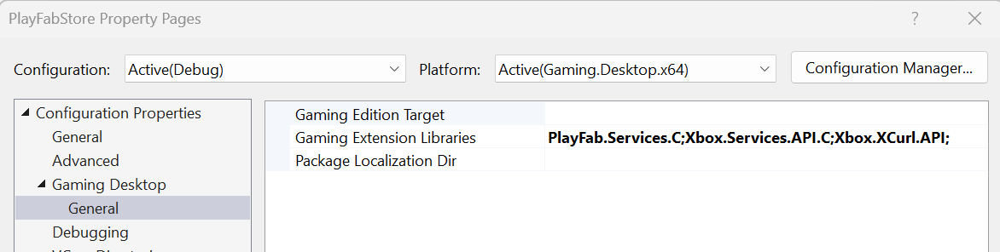
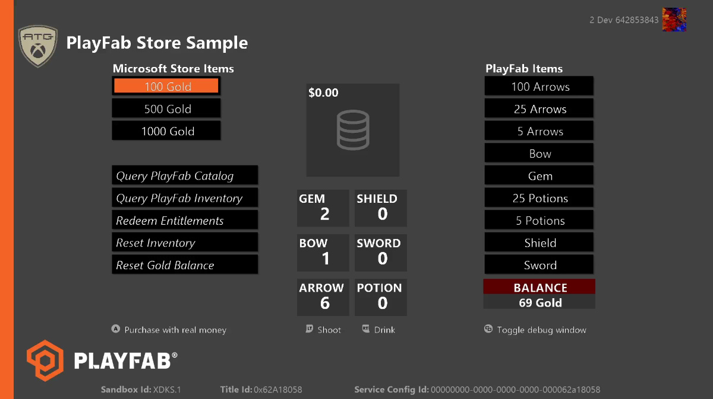
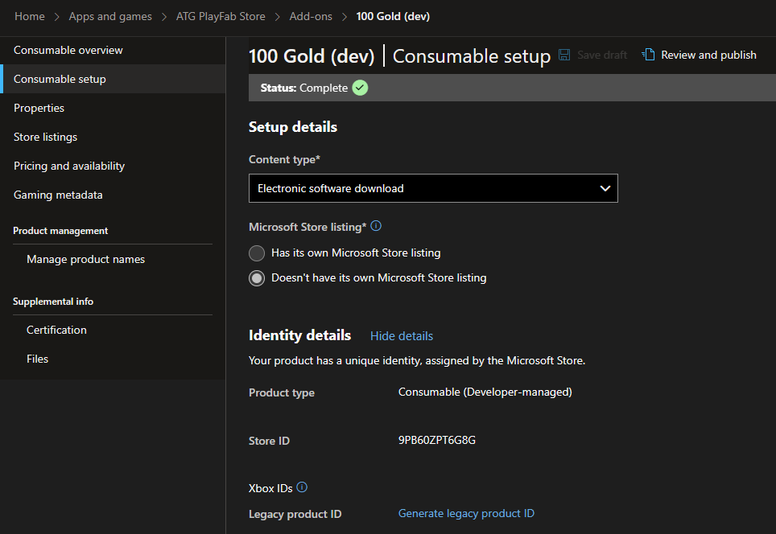
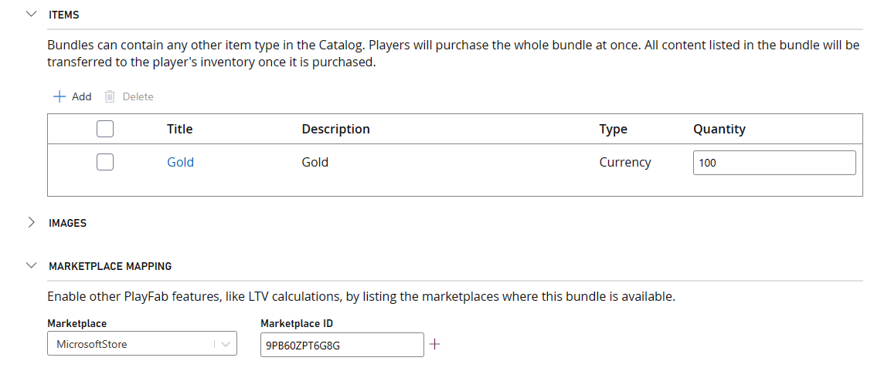
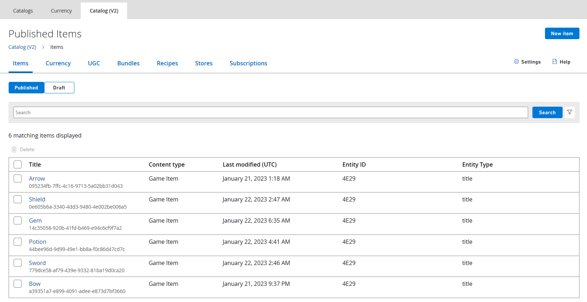
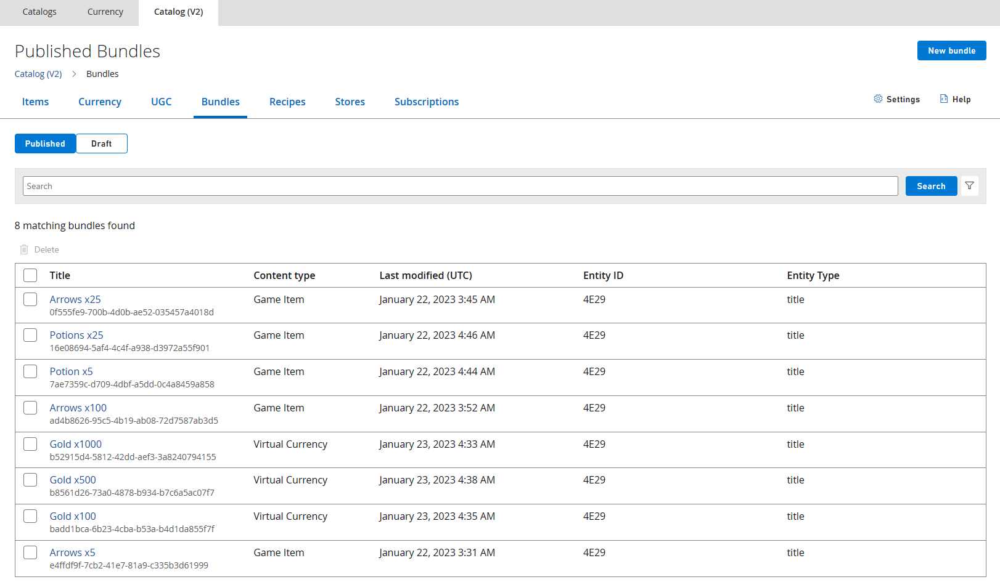

_This sample is compatible with March 2023 GDK_

# PlayFab Store

## Description
Many games employ microtransaction economies.
Often these are managed by services that the developer implements that ensure transactions are secure and ownership is server-authoratitive.
PlayFab offers features that provide the same security and authority without the overhead of setting up these services.

This sample demonstrates how to combine Microsoft Store purchases with [PlayFab Economy (v2)](https://learn.microsoft.com/en-us/gaming/playfab/features/economy-v2/) to implement an in-game catalog of virtual currency and items managed by PlayFab services.
It is intended to be run in sandbox **XDKS.1** with a valid test account, see [Using this sample](#using-the-sample).

This sample utilizes the [Inventory](https://learn.microsoft.com/en-us/rest/api/playfab/economy/inventory?view=playfab-rest) and [Catalog](https://learn.microsoft.com/en-us/rest/api/playfab/economy/catalog?view=playfab-rest) API for PlayFab Economy v2 and the PlayFab Services extension library (PlayFab.Services.C) available with the March 2023 GDK.

For Economy v1 and XPlatCppSDK usage, refer to the version of this sample that shipped with the October 2022 GDK.

## Building the sample

This sample uses the PlayFab.Services.C extension library. 
To build this sample, you must target the March 2023 GDK (or later).

## Using the sample

This sample is intended to be run in sandbox **XDKS.1**.
Because it uses `XStore` API, make sure that the test account being used (all test accounts can sign into XDKS.1) is entitled to the sample product 9N4J3231RQJT.

See [Enabling XStore development and testing](https://learn.microsoft.com/en-us/gaming/gdk/_content/gc/commerce/getting-started/xstore-product-testing-setup) for more details.

Select an item from the left column to purchase virtual currency from the Microsoft Store.
The balance will be updated at the bottom right.

With this virtual currency, purchase items from the PlayFab catalog (right column), whose balance will be reflected in the player's inventory (center column).

Arrows and potions, which can be purchased in bundles of different amounts, can be consumed.

Specific PlayFab operations can also be selected and run independently on demand, whose output can be seen onscreen by toggling the debug panel, as well as with all general debug prints.

|Action|Gamepad|
|-|-|
|Purchase Item/Execute operation|A|
|Consume arrow|LT|
|Consume potion|RT|
|Toggle debug panel|View|

## Implementation details

### PlayFab authentication

[RedeemMicrosoftStoreInventoryItems](https://learn.microsoft.com/en-us/rest/api/playfab/economy/inventory/redeem-microsoft-store-inventory-items) (`PFInventoryRedeemMicrosoftStoreInventoryItemsAsync`) and all other [Inventory](https://learn.microsoft.com/en-us/rest/api/playfab/economy/inventory?view=playfab-rest) functions require a valid PlayFab login instance.
This is facilitated by the [PlayFabResources](..\..\..\Kits\PlayFabGDK\PlayFabResources.h) helper class which wraps the required [LoginWithXbox](https://learn.microsoft.com/en-us/rest/api/playfab/client/authentication/login-with-xbox) authentication that uses API provided by the PlayFab extension library.
Being able to request an XToken requires an Xbox Live enabled product that has been published via Partner Center.

After a player successfully signs into Xbox Live and PlayFab, Catalog and Inventory items can be retrieved from the service.

### Microsoft Store integration

This sample offers two sets of purchasable items.
The left-hand side offers different denominations of virtual currency (Gold) that is to be purchased with real money.
These are set up and configured in Partner Center, and are enumerated and purchased using [XStore](https://learn.microsoft.com/en-us/gaming/gdk/_content/gc/reference/system/xstore/xstore_members) API.

These are set up as **Developer-managed** consumables as this is what `RedeemMicrosoftStoreInventoryItems` currently supports (more on this below).
Unlike Store-managed consumables, this type lacks a quantity field, and the user will be unable to purchase the same item again until after it has been redeemed by PlayFab.

Once a real money product is successfully purchased, `RedeemMicrosoftStoreInventoryItems` will be called, which is how PlayFab reconciles real money purchases with PlayFab items.

### PlayFab Economy integration

PlayFab maps Microsoft Store purchases to bundles that have the **Marketplace Mapping** configurations set. 
The Marketplace ID corresponds to the Store ID of the consumable in Partner Center.
The following figure is from PlayFab Game Manager Catalog (v2), showing a currency bundle with the Marketplace ID that matches the Store ID seen in the Identity Details of the Partner Center figure above.

This means that if `RedeemMicrosoftStoreInventoryItems` finds a quantity of this Microsoft Store consumable with Store ID 9PB60ZPT6G8G, it will consume it (decrement the quantity to 0) and grant the corresponding Bundle contents to the player, which in this case is 100 Gold.

The PlayFab catalog items (in the right column) that can be purchased with this virtual currency comprise a combination of Items and Bundles configured in Catalog (V2) of Game Manager.
Purchases using virtual currency are performed using [PurchaseInventoryItems](https://learn.microsoft.com/en-us/rest/api/playfab/economy/inventory/purchase-inventory-items
) (`PFInventoryPurchaseInventoryItemsAsync`).

[Game Manager](https://learn.microsoft.com/en-us/gaming/playfab/gamemanager/) configuration is beyond the scope of this document, but since the configuration for the PlayFab content is not public, here are some screenshots:

Virutal currency:

Items:

Note, these correspond to the six items displayed in the center of the sample.
All items can be purchased multiple times. 
Inventory amounts can be retrieved by calling [GetInventoryItems](https://learn.microsoft.com/en-us/rest/api/playfab/economy/inventory/get-inventory-items) (`PFInventoryGetInventoryItemsAsync`).
Arrows and Potions can be consumed using [SubtractInventoryItems](https://learn.microsoft.com/en-us/rest/api/playfab/economy/inventory/subtract-inventory-items) (`PFInventorySubtractInventoryItemsAsync`).

Bundles:

In the Bundles section, there are three Gold bundles that map to Microsoft Store products.
There are also bundles of various quantities of some of the catalog items configured above.

The purchasable items on the right-hand side of the sample UI are a combination of the items and bundles configured above. 
Which items to offer are hard coded by the sample.
[GetItems](https://learn.microsoft.com/en-us/rest/api/playfab/economy/catalog/get-items) (`PFCatalogGetItemsAsync`) returns all requested items. 
If a dynamic method of populating a list of purchasable items is needed, differentiate by adding tags or separating into Stores and then call [SearchItems](https://learn.microsoft.com/en-us/rest/api/playfab/economy/catalog/search-items) (`PFCatalogSearchItemsAsync`) to retrieve the content.

## Limitations
This sample demonstrates how to communicate with PlayFab services via the PlayFab.Services.C extension library.
This library is not available on non-GDK platforms and only a single player login method (`PFAuthenticationLoginWithXUserAsync`) is provided.
Only client APIs are supported (those that use a player entity key) and there is no support for Economy v1 features.

With inclusion in the GDK, developers can now call PlayFab using the [XAsync](https://developer.microsoft.com/en-us/games/xbox/docs/gdk/async-library-xasync) calling pattern.
While most calls within this sample use a callback to determine completion, it is possible (and sometimes preferable) to call functions synchronously.
This approach is demonstrated by the call to `PFAuthenticationLoginWithXUserAsync` and [XAsyncGetStatus](https://developer.microsoft.com/en-us/games/xbox/docs/gdk/xasyncgetstatus) (where wait = true).

This sample does not handle [PLM](https://developer.microsoft.com/en-us/games/xbox/docs/gdk/xbox-game-life-cycle) correctly.
When a title resumes after Suspend/Constrain, it is good practice to recreate the XStoreContext and PlayFab EntityHandle/Key.
This will be addressed in a future update.

This sample does not handle throttling correctly.
PlayFab is aggressive with enforcing [limits](https://learn.microsoft.com/en-us/gaming/playfab/features/economy-v2/catalog/limits) in order to ensure that no single game can cause a disruption to the service.
Inventory write calls, such as Purchase, Subtract, and Update are limited to 10 requests over 30 seconds.
This Sample currently makes one or more calls to the service with every button pressed, so if the player quickly shoots arrows or drinks potions, the service will stop responding until enough time has passed.
There are currently no built-in retries with this sample, so the player must manually retry any failed attempt.
When working with PlayFab Economy, the recommended approach is to track quantity changes locally and call Subtract or Update periodically to sync changes with the service.
Purchase calls can be made synchronously and/or have built-in delays to work around service limitations.

With the extension library, any error coming from the service is returned as an HRESULT (defined in PFErrors.h).
In many cases, the HRESULT code is not as informative as the underlying error codes that PlayFab provides.
For example, HR 0x8923541A (E_PF_SERVICEERROR) might be returned when the player has insufficient funds (PlayFab errorCode=1059) or when the database throughput has been exceeded (PlayFab errorCode=1113).
We recommend using a web-debugging tool such as [Fiddler](https://developer.microsoft.com/en-us/games/xbox/docs/gdk/fiddler-setup-networking) to see the detailed error messages coming from the service.

## Update history
July 2022: Initial release

October 2022: Modified to use XPlatCppSdk NuGet

March 2023: Updated to Economy V2 and PlayFab.Services.C

## Privacy Statement
When compiling and running a sample, the file name of the sample executable will be sent to Microsoft to help track sample usage.
To opt-out of this data collection, you can remove the block of code in Main.cpp labeled “Sample Usage Telemetry”.

For more information about Microsoft’s privacy policies in general, see the [Microsoft Privacy Statement](https://privacy.microsoft.com/en-us/privacystatement/).
