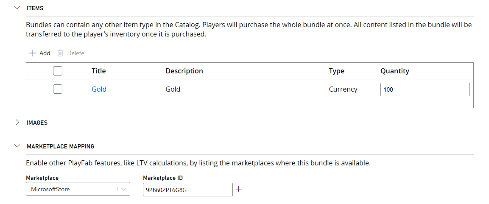

_このサンプルは March 2023 GDK と互換性があります_

# PlayFab ストア

## 説明
マイクロトランザクション経済が採用しているゲームは多くあります。 多くの場合、これらは開発者が実装するサービスによって管理され、トランザクションがセキュリティで保護され、所有権のサーバー認証が保証されます。 PlayFab には、これらのサービスを設定するオーバーヘッドなしで、同じセキュリティと権限を提供する機能が用意されています。

このサンプルでは、Microsoft Store の購入を [PlayFab Economy (v2)](https://learn.microsoft.com/en-us/gaming/playfab/features/economy-v2/) と組み合わせて、PlayFab サービスによって管理される仮想通貨とアイテムのゲーム内カタログを実装する方法を示します。 有効なテスト アカウントを使用してサンドボックス **XDKS.1** で実行することを目的としています。｢[このサンプルの使用](#using-the-sample)」を参照してください。

このサンプルでは、PlayFab Economy v2 用 [Inventory](https://learn.microsoft.com/en-us/rest/api/playfab/economy/inventory?view=playfab-rest) および[Catalog](https://learn.microsoft.com/en-us/rest/api/playfab/economy/catalog?view=playfab-rest) API と、March 2023 GDK で利用可能な PlayFab Services 拡張機能ライブラリ (PlayFab.Services.C) を利用します。

Economy v1 と XPlatCppSDK の使用方法については、October 2022 GDK に付属しているこのサンプルのバージョンを参照してください。

## サンプルのビルド

このサンプルでは、PlayFab.Services.C 拡張ライブラリを使用します。 このサンプルをビルドするには、March 2023 GDK (以降) をターゲットにする必要があります。

## サンプルの使用方法

このサンプルは、サンドボックス **XDKS.1** で実行することを目的としています。 `XStore` API を使用するため、使用されているテスト アカウント (すべてのテスト アカウントが XDKS.1 にサインインできる) がサンプル製品 9N4J3231RQRQ の資格を持っていることを確認します。

詳細については、「[XStore の開発とテストの有効化](https://learn.microsoft.com/en-us/gaming/gdk/_content/gc/commerce/getting-started/xstore-product-testing-setup)」を参照してください。

左側の列から項目を選択して、Microsoft Store から仮想通貨を購入します。 残高は右下に更新されます。

この仮想通貨では、PlayFab カタログ (右側の列) からアイテムを購入します。そのアイテムの残高はプレイヤーのインベントリ (中央の列) に反映されます。

さまざまな量のバンドルで購入できる矢印とポーションを使用できます。

特定の PlayFab 操作を選択し、オンデマンドで個別に実行することもできます。その出力は、デバッグ パネルを切り替えることで画面上に表示され、すべての一般的なデバッグ プリントと共に表示されます。

| 操作 | ゲームパッド |
|---|---|
| 購入アイテム/実行操作 | A |
| 矢印を使用する | LT |
| ポーションを使用する | RT |
| デバッグ パネルの切り替え | ビュー |

## 実装の詳細

### PlayFab 認証

[RedeemMicrosoftStoreInventoryItems](https://learn.microsoft.com/en-us/rest/api/playfab/economy/inventory/redeem-microsoft-store-inventory-items) (`PFInventoryRedeemMicrosoftStoreInventoryItemsAsync`) とその他のすべての[インベントリ](https://learn.microsoft.com/en-us/rest/api/playfab/economy/inventory?view=playfab-rest) 関数には、有効な PlayFab ログイン インスタンスが必要です。 これは、PlayFab 拡張機能ライブラリによって提供される API を使用する必要な [LoginWithXbox](https://learn.microsoft.com/en-us/rest/api/playfab/client/authentication/login-with-xbox) 認証をラップする [PlayFabResources](..\..\..\Kits\PlayFabGDK\PlayFabResources.h) ヘルパー クラスによって容易になります。 XToken を要求するには、パートナー センターを介して発行された Xbox Live が有効な製品が必要です。

プレイヤーが Xbox Live に正常にサインインすると、PlayFab、カタログ、インベントリの項目をサービスから取得できます。

### Microsoft Store 統合

このサンプルでは、2 セットの購入可能なアイテムを提供します。 左側には、実際のお金で購入するさまざまな仮想通貨 (Gold) の分母が用意されています。 これらは パートナー センター で設定および構成され、[XStore](https://learn.microsoft.com/en-us/gaming/gdk/_content/gc/reference/system/xstore/xstore_members) API を使用して列挙および購入されます。

これらは、**開発者が管理する**消耗品アイテムとして設定されています。これが現在 `RedeemMicrosoftStoreInventoryItems` でサポートされているためです (詳細については、以下をご覧ください)。 Store で管理される消耗品アイテムとは異なり、この種類には数量フィールドがないため、PlayFab で引き換えられるまで、ユーザーは同じアイテムを再度購入することはできません。

リアルマネー商品が正常に購入されると、`RedeemMicrosoftStoreInventoryItems` が呼び出され、PlayFab はリアルマネー購入と PlayFab アイテムの照合を行います。多くの場合、これらは開発者が実装するサービスによって管理され、トランザクションが安全で、所有権がサーバーに認証されていることを保証します。

### PlayFab Economy の統合

PlayFab は、Microsoft Store での購入を **Marketplace マッピング**構成が設定されているバンドルにマップします。 Marketplace ID は、パートナー センターの消耗品アイテムの Store ID に対応します。 次の図は PlayFab ゲーム マネージャー カタログ (v2) のもので、上図のパートナー センターのID の詳細にある Store ID と一致する Marketplace ID を持つ通貨バンドルを示しています。

これは、`RedeemMicrosoftStoreInventoryItems` が Store ID 9PB60ZPT6G8G の Microsoft Store の消耗品を見つけた場合、それを消費し (数量を 0 に減らし)、対応するバンドル内容 (この場合は 100 Gold) をプレイヤーに与えることを意味します。

この仮想通貨で購入できる PlayFab カタログアイテム (右側の列) は、ゲーム マネージャー のカタログ (V2) で構成されたアイテムとバンドルの組み合わせで構成されます。 仮想通貨を使用した購入は、[PurchaseInventoryItems](https://learn.microsoft.com/en-us/rest/api/playfab/economy/inventory/purchase-inventory-items) (`PFInventoryPurchaseInventoryItemsAsync`) を使用して実行されます。

[ゲーム マネージャー](https://learn.microsoft.com/en-us/gaming/playfab/gamemanager/)の構成はこのドキュメントの範囲外ですが、PlayFab コンテンツの構成はパブリックではないため、次のいくつかのスクリーンショットを示します:

仮想通貨: 

アイテム: 

なお、これらは、サンプルの中央に表示される 6 つのアイテムに対応します。 すべてのアイテムを複数回購入できます。 在庫量は、[GetInventoryItems](https://learn.microsoft.com/en-us/rest/api/playfab/economy/inventory/get-inventory-items) (`PFInventoryGetInventoryItemsAsync`) を呼び出すことによって取得できます。矢印とポーションは、[SubtractInventoryItems](https://learn.microsoft.com/en-us/rest/api/playfab/economy/inventory/subtract-inventory-items) (`PFInventorySubtractInventoryItemsAsync`) で使用できます。

バンドル: 

[バンドル] セクションには、Microsoft Store の製品にマップされる 3 つの Gold バンドルがあります。 また、上記で構成した一部のカタログ アイテムには、さまざまな数量のバンドルもあります。

サンプル UI の右側にある購入可能なアイテムは、上記で構成したアイテムとバンドルの組み合わせです。 そのアイテムをオファーするかは、サンプルによってハードコーディングされています。 [GetItems](https://learn.microsoft.com/en-us/rest/api/playfab/economy/catalog/get-items) (`PFCatalogGetItemsAsync`) は、要求されたすべての項目を返します。 購入可能なアイテムのリストを設定する動的な方法が必要な場合は、タグを追加するかストアに分離して区別し、[SearchItems](https://learn.microsoft.com/en-us/rest/api/playfab/economy/catalog/search-items) (`PFCatalogSearchItemsAsync`) を呼び出してコンテンツを取得します。

## 制限事項
このサンプルでは、PlayFab.Services.C 拡張ライブラリを介して PlayFab サービスと通信する方法を示します。 このライブラリは GDK 以外のプラットフォームでは使用できず、1 つのプレイヤー ログイン メソッド (`PFAuthenticationLoginWithXUserAsync`) のみが提供されます。 クライアント API (プレイヤー エンティティ キーを使用するもの) のみがサポートされており、Economy v1 機能はサポートされていません。

GDK に含めることで、開発者は [XAsync](https://developer.microsoft.com/en-us/games/xbox/docs/gdk/async-library-xasync) 呼び出しパターンを使用して PlayFab を呼び出すようになりました。 このサンプル内のほとんどの呼び出しではコールバックを使用して完了を判断しますが、関数を同期的に呼び出す (場合によっては推奨される) 可能性があります。 この方法は、`PFAuthenticationLoginWithXUserAsync` および [XAsyncGetStatus](https://developer.microsoft.com/en-us/games/xbox/docs/gdk/xasyncgetstatus) (wait = true) の呼び出しによって示されます。

このサンプルでは [PLM](https://developer.microsoft.com/en-us/games/xbox/docs/gdk/xbox-game-life-cycle) が正しく処理されません。 タイトルが一時停止/制約後に再開する場合は、XStoreContext と PlayFab EntityHandle/Key を再作成することをお勧めします。 これは今後の更新プログラムで対処される予定です。

このサンプルでは、調整が正しく処理されません。 PlayFab は、1 つのゲームがサービスの中断を引き起こさないために、[制限](https://learn.microsoft.com/en-us/gaming/playfab/features/economy-v2/catalog/limits)を適用することに積極的に取り組んでいます。 購入、減算、更新などのインベントリ書き込み呼び出しは、30 秒間で 10 要求に制限されます。 このサンプルでは、現在、ボタンを押すたびにサービスに対して 1 つ以上の呼び出しを行います。そのため、プレイヤーがすぐに矢印を撮影したり、ポーションを飲んだりすると、十分な時間が経過するまでサービスは応答を停止します。 現在、このサンプルでは組み込みの再試行がないため、プレイヤーは失敗した試行を手動で再試行する必要があります。 PlayFab Economy を使用する場合は、数量の変更をローカルで追跡し、Subtract または Update を定期的に呼び出してサービスと変更を同期することをお勧めします。 購入呼び出しを同期的に行ったり、サービスの制限を回避するために組み込みの遅延を発生させたりすることができます。

拡張機能ライブラリでは、サービスからのエラーは HRESULT (PFErrors.h で定義) として返されます。 多くの場合、HRESULT コードは、PlayFab が提供する基になるエラー コードほど有益ではありません。 たとえば、プレーヤーが十分な資金を持っていない場合 (PlayFab errorCode=1059) またはデータベースのスループットを超えた場合 (PlayFab errorCode=1113) に HR 0x8923541A (E_PF_SERVICEERROR) が返されることがあります。 [Fiddler](https://developer.microsoft.com/en-us/games/xbox/docs/gdk/fiddler-setup-networking) などの Web デバッグ ツールを使用して、サービスからの詳細なエラー メッセージを確認することをお勧めします。

## 更新履歴
2022 年 7 月: 初期リリース

2022 年 10 月: XPlatCppSdk NuGet を使用するように変更

2023 年 3 月: Economy V2 および PlayFab.Services.C に更新

2023 年 6 月: GDK 2306 以降を対象とする場合に XboxToken の代わりに XUserHandle を使用するように PFInventoryRedeemMicrosoftStoreItemsRequest を更新しました。

## プライバシーに関する声明
サンプルをコンパイルして実行する場合、サンプルの使用状況を追跡するために、サンプルの実行可能ファイルのファイル名が Microsoft に送信されます。 このデータ コレクションからオプトアウトするには、Main.cpp の「Sample Usage Telemetry」というラベルの付いたコードのブロックを削除します。

全般的な Microsoft のプライバシー ポリシーの詳細については、「[Microsoft のプライバシーに関する声明](https://privacy.microsoft.com/en-us/privacystatement/)」を参照してください。

