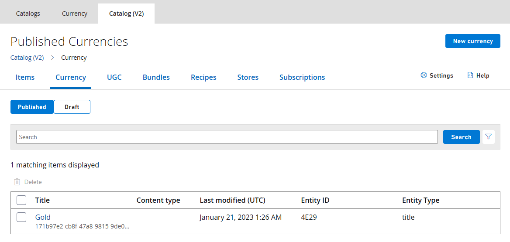
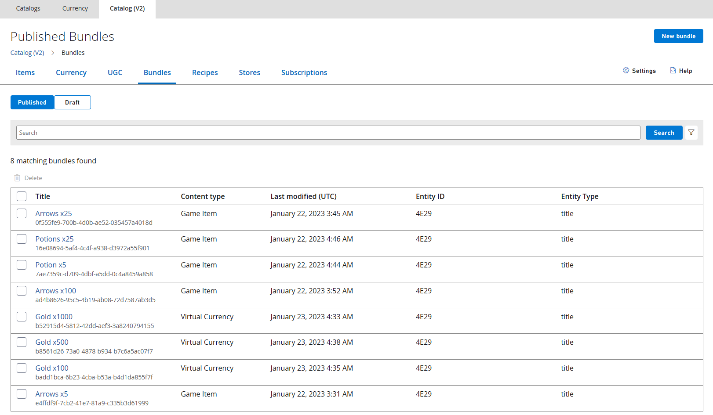

_이 샘플은 2023년 3월 GDK와 호환됩니다._

# PlayFab Store

## 설명
많은 게임에서 소액 결제 이코노미를 사용합니다. 개발자가 트랜잭션의 보안과 소유권이 서버에 있음을 보장하기 위해 구현하는 서비스에 의해 관리되는 경우가 많습니다. PlayFab은 이러한 서비스를 설정하는 데 드는 오버헤드 없이도 동일한 보안과 권한을 갖는 기능을 제공합니다.

이 샘플에서는 Microsoft Store 구매를 [PlayFab Economy(v2)](https://learn.microsoft.com/en-us/gaming/playfab/features/economy-v2/)와 결합하여 PlayFab 서비스에서 관리하는 가상 통화 및 아이템의 게임 내 카탈로그를 구현하는 방법을 보여 줍니다. 유효한 테스트 계정으로 샌드박스 **XDKS.1**에서 실행되도록 되어 있습니다. [이 샘플 사용](#using-the-sample)을 참조하세요.

이 샘플에서는 2023년 3월 GDK에서 사용할 수 있는 PlayFab Economy v2 및 PlayFab 서비스 확장 라이브러리(PlayFab.Services.C)에 대한 [인벤토리](https://learn.microsoft.com/en-us/rest/api/playfab/economy/inventory?view=playfab-rest) 및 [카탈로그](https://learn.microsoft.com/en-us/rest/api/playfab/economy/catalog?view=playfab-rest) API를 활용합니다.

Economy v1 및 XPlatCppSDK 사용의 경우 2022년 10월 GDK와 함께 제공된 이 샘플의 버전을 참조하세요.

## 샘플 빌드

이 샘플에서는 PlayFab.Services.C 확장 라이브러리를 사용합니다. 이 샘플을 빌드하려면 2023년 3월 GDK 이상을 대상으로 해야 합니다.

## 샘플 사용

이 샘플은 샌드박스 **XDKS.1**에서 실행됩니다. `XStore` API를 사용하므로 사용 중인 테스트 계정(모든 테스트 계정이 XDKS.1에 로그인할 수 있습니다)에 샘플 제품 9N4J3231RQJT를 사용할 수 있는지 확인합니다.

자세한 내용은 [XStore 개발 및 테스트 활성화](https://learn.microsoft.com/en-us/gaming/gdk/_content/gc/commerce/getting-started/xstore-product-testing-setup)를 참조하세요.

왼쪽 열에서 항목을 선택하여 Microsoft Store 가상 통화를 구매합니다. 잔액은 오른쪽 아래에서 업데이트됩니다.

이 가상 통화를 사용하여 플레이어의 인벤토리(가운데 열)에 잔액이 반영되는 PlayFab 카탈로그(오른쪽 열)에서 아이템을 구매합니다.

화살과 물약은 여러 개 묶음으로 구매할 수 있으며 소비할 수 있습니다.

특정 PlayFab 작업을 필요에 따라 선택해 독립적으로 실행할 수도 있으며, 그 출력은 디버그 패널을 토글하여 화면에서 확인할 수 있을 뿐만 아니라 모든 일반 디버그 프린트를 통해 확인할 수 있습니다.

| 동작 | Gamepad |
|---|---|
| 구매 항목/작업 실행 | A |
| 화살 소비 | LT |
| 물약 소비 | RT |
| 디버그 패널 토글 | 보기 |

## 구현 세부 정보

### PlayFab 인증

[RedeemMicrosoftStoreInventoryItems](https://learn.microsoft.com/en-us/rest/api/playfab/economy/inventory/redeem-microsoft-store-inventory-items) (`PFInventoryRedeemMicrosoftStoreInventoryItemsAsync`) 및 다른 모든 [인벤토리](https://learn.microsoft.com/en-us/rest/api/playfab/economy/inventory?view=playfab-rest) 함수에는 유효한 PlayFab 로그인 인스턴스가 필요합니다. 이는 [PlayFab](..\..\..\Kits\PlayFabGDK\PlayFabResources.h) 확장 라이브러리에서 제공하는 API를 사용하는 필수 [LoginWithXbox](https://learn.microsoft.com/en-us/rest/api/playfab/client/authentication/login-with-xbox) 인증을 래핑하는 PlayFabResources 도우미 클래스에 의해 촉진됩니다. XToken을 요청할 수 있으려면 파트너 센터를 통해 게시된 Xbox Live를 사용 가능한 제품이 필요합니다.

플레이어가 Xbox Live 및 PlayFab에 성공적으로 로그인하면 서비스에서 카탈로그 및 인벤토리 항목을 검색할 수 있습니다.

### Microsoft Store 통합

이 샘플에서는 구매 가능한 아이템 두 가지 세트를 제공합니다. 왼쪽에는 실제 돈으로 구매할 수 있는 가상 화폐(골드)의 다양한 액면가가 표시됩니다. 파트너 센터에서 설정 및 구성할 수 있으며, [XStore](https://learn.microsoft.com/en-us/gaming/gdk/_content/gc/reference/system/xstore/xstore_members) API를 사용하여 열거 및 구매할 수 있습니다.

현재 `RedeemMicrosoftStoreInventoryItems`이(가) 지원하는 것이므로 **개발자 관리** 소모품으로 설정되어 있습니다(자세한 내용은 아래 참조). Store 관리 소모품과 달리 이 형식에는 수량 필드가 없으며, PlayFab에서 사용한 후에야 사용자가 동일한 항목을 다시 구매할 수 있습니다.

실제 현금 제품을 성공적으로 구매하면 `RedeemMicrosoftStoreInventoryItems`이(가) 호출되며, 이는 PlayFab가 실제 현금 구매와 PlayFab 아이템을 조정하는 방식입니다.

### PlayFab Economy 통합

PlayFab은 **마켓플레이스 매핑** 구성이 설정된 번들에 Microsoft Store 구매를 매핑합니다. Marketplace ID는 파트너 센터 소모품의 Store ID에 해당합니다. 다음 그림은 PlayFab 게임 관리자 카탈로그(v2)에서 가져온 것으로, 위 파트너 센터 그림의 신원 정보에 표시된 Store ID와 일치하는 마켓플레이스 ID를 가진 통화 번들을 보여줍니다.

즉, `RedeemMicrosoftStoreInventoryItems`이(가) Store ID가 9PB60ZPT6G8G인 이 Microsoft Store 소모품의 수량을 발견하면 이를 소비하고(수량을 0으로 감소) 해당 번들 콘텐츠(이 경우 100골드)를 플레이어에게 부여합니다.

이 가상 화폐로 구매할 수 있는 PlayFab 카탈로그 아이템(오른쪽 열)은 게임 매니저의 카탈로그(V2)에 구성된 아이템과 번들의 조합으로 구성됩니다. 가상 통화를 사용한 구매는 [PurchaseInventoryItems](https://learn.microsoft.com/en-us/rest/api/playfab/economy/inventory/purchase-inventory-items)(`PFInventoryPurchaseInventoryItemsAsync`)를 사용하여 수행됩니다.

[Game Manager](https://learn.microsoft.com/en-us/gaming/playfab/gamemanager/) 구성은 이 문서에서 다루지 않지만, PlayFab 콘텐츠의 구성은 공개되지 않았으므로 몇 가지 스크린샷을 보여드리겠습니다.

가상 통화: 

항목: 

이러한 항목은 샘플의 가운데에 표시되는 6개 항목에 해당합니다. 모든 항목을 여러 번 구매할 수 있습니다. 인벤토리 양은 [GetInventoryItems](https://learn.microsoft.com/en-us/rest/api/playfab/economy/inventory/get-inventory-items) (`PFInventoryGetInventoryItemsAsync`)를 호출하여 검색할 수 있습니다. 화살과 물약은 [SubtractInventoryItems](https://learn.microsoft.com/en-us/rest/api/playfab/economy/inventory/subtract-inventory-items) (`PFInventorySubtractInventoryItemsAsync`)를 사용하여 소모할 수 있습니다.

번들: 

번들 섹션에는 Microsoft Store 제품에 매핑되는 세 개의 골드 번들이 있습니다. 또한 위에서 구성한 카탈로그 항목의 다양한 수량의 번들이 있습니다.

샘플 UI의 오른쪽에 있는 구매 가능한 항목은 위에서 구성한 항목과 번들의 조합입니다. 제공할 항목은 샘플이 하드 코딩합니다. [GetItems](https://learn.microsoft.com/en-us/rest/api/playfab/economy/catalog/get-items) (`PFCatalogGetItemsAsync`)는 요청된 모든 항목을 반환합니다. 구매 가능한 항목 목록을 채우는 동적 방법이 필요한 경우 태그를 추가하거나 Store로 구분한 다음 [SearchItems](https://learn.microsoft.com/en-us/rest/api/playfab/economy/catalog/search-items) (`PFCatalogSearchItemsAsync`)를 호출하여 콘텐츠를 검색합니다.

## 제한 사항
이 샘플에서는 PlayFab.Services.C 확장 라이브러리를 통해 PlayFab 서비스와 통신하는 방법을 보여 줍니다. 이 라이브러리는 GDK가 아닌 플랫폼에서 사용할 수 없으며 단일 플레이어 로그인 방법(`PFAuthenticationLoginWithXUserAsync`)만 제공됩니다. 클라이언트 API(플레이어 엔터티 키를 사용하는 API)만 지원되며, Economy v1 기능은 지원되지 않습니다.

GDK에 포함되면 개발자는 이제 [XAsync](https://developer.microsoft.com/en-us/games/xbox/docs/gdk/async-library-xasync) 호출 패턴을 사용하여 PlayFab을 호출할 수 있습니다. 이 샘플에서 대부분의 호출은 콜백을 사용하여 완료를 확인하지만, 함수를 동시에 호출하는 것도 가능하며 때로는 바람직합니다. 이 방법은 `PFAuthenticationLoginWithXUserAsync` 및 [XAsyncGetStatus](https://developer.microsoft.com/en-us/games/xbox/docs/gdk/xasyncgetstatus)(여기서 wait = true)를 호출하여 보여 줍니다.

이 샘플은 [PLM](https://developer.microsoft.com/en-us/games/xbox/docs/gdk/xbox-game-life-cycle)을 올바르게 처리하지 않습니다. 일시 중단/제한 후에 타이틀이 다시 시작되면 XStoreContext 및 PlayFab EntityHandle/Key를 다시 만드는 것이 좋습니다. 이 내용은 향후 업데이트에서 해결될 예정입니다.

이 샘플은 제한을 올바르게 처리하지 않습니다. PlayFab은 단일 게임이 서비스를 중단시킬 수 없도록 [제한](https://learn.microsoft.com/en-us/gaming/playfab/features/economy-v2/catalog/limits)을 적극적으로 적용합니다. 구매, 빼기, 업데이트와 같은 인벤토리 쓰기 호출은 30초 동안 10번의 요청으로 제한됩니다. 이 샘플은 현재 버튼을 누를 때마다 서비스를 한 번 이상 호출하므로 플레이어가 빠르게 화살을 쏘거나 물약을 마시면 충분한 시간이 지날 때까지 서비스 응답이 중지됩니다. 현재 이 샘플에는 재시도 기능이 내장되어 있지 않으므로 실패한 시도는 플레이어가 수동으로 재시도해야 합니다. PlayFab Economy로 작업할 때 권장되는 접근 방식은 로컬에서 수량 변경 사항을 추적하고 주기적으로 빼기 또는 업데이트를 호출하여 변경 사항을 서비스와 동기화하는 것입니다. 구매 호출은 동시에 이루어지거나 서비스 제한을 해결하기 위해 지연 기능이 내장되어 있습니다.

확장 라이브러리를 사용하면 서비스에서 발생하는 모든 오류가 HRESULT(PFErrors.h에 정의됨)로 반환됩니다. 대부분의 경우 HRESULT 코드는 PlayFab에서 제공하는 기본 오류 코드만큼 정보를 제공하지 않습니다. 예를 들어 플레이어의 잔액이 부족하거나(PlayFab errorCode=1059) 데이터베이스 처리량이 초과된 경우(PlayFab errorCode=1113) HR 0x8923541A(E_PF_SERVICEERROR)이 반환될 수 있습니다. [Fiddler](https://developer.microsoft.com/en-us/games/xbox/docs/gdk/fiddler-setup-networking)와 같은 웹 디버깅 도구를 사용하여 서비스에서 오는 자세한 오류 메시지를 확인하는 것이 좋습니다.

## 업데이트 기록
2022년 7월: 초기 릴리스

2022년 10월: XPlatCppSdk NuGet을 사용하도록 수정됨

2023년 3월: Economy V2 및 PlayFab.Services.C로 업데이트됨

2023년 6월: GDK 2306+를 대상으로 할 때 XboxToken 대신 XUserHandle을 사용하도록 PFInventoryRedeemMicrosoftStoreItemsRequest가 업데이트되었습니다.

## 개인정보처리방침
샘플을 컴파일하고 실행하는 경우 샘플 사용량을 추적할 수 있도록 샘플 실행 파일의 파일 이름이 Microsoft에 전송됩니다. 이 데이터 수집을 옵트아웃하려면 "샘플 사용량 원격 분석"으로 레이블이 지정된 Main.cpp에서 코드 블록을 제거할 수 있습니다.

Microsoft의 개인정보 정책에 대한 자세한 내용은 [Microsoft 개인정보처리방침](https://privacy.microsoft.com/en-us/privacystatement/)을 참조하세요.

