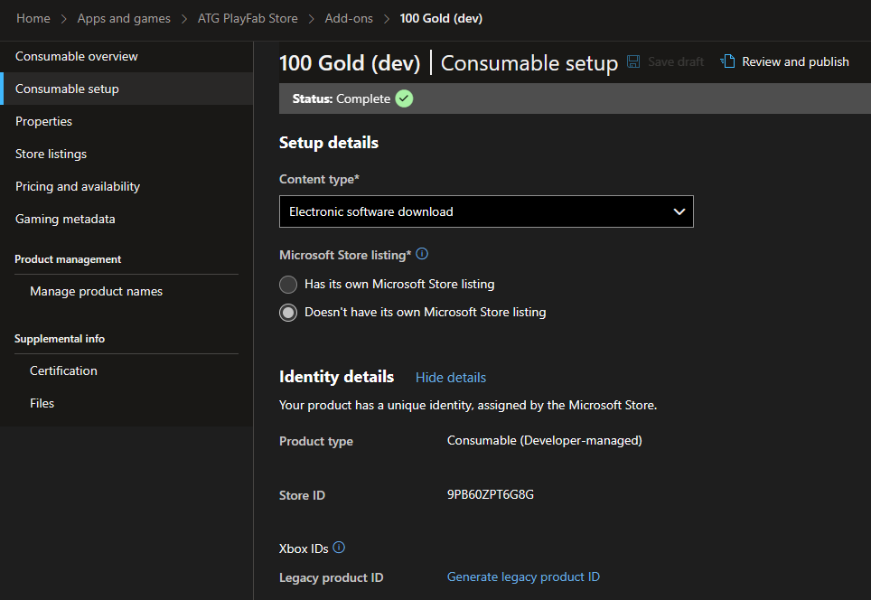

_此示例与 2023 年 3 月 GDK 兼容_

# PlayFab 应用商店

## 说明
许多游戏采用微转换经济。 通常，这些服务由开发人员实现的服务管理，以确保事务安全且所有权是服务器授权的。 PlayFab 提供的功能提供相同的安全性和颁发机构，而无需设置这些服务的开销。

此示例演示如何将Microsoft Store购买与 [PlayFab 经济 （v2）](https://learn.microsoft.com/en-us/gaming/playfab/features/economy-v2/) 合并，以实现由 PlayFab 服务管理的虚拟货币和物品的游戏内目录。 它旨在使用有效的测试帐户在沙盒 **XDKS.1** 中运行，请参阅 [使用此示例](#using-the-sample)。

本示例使用 [PlayFab 经济 v2 的清单](https://learn.microsoft.com/en-us/rest/api/playfab/economy/inventory?view=playfab-rest) 和 [目录](https://learn.microsoft.com/en-us/rest/api/playfab/economy/catalog?view=playfab-rest) API 以及 2023 年 3 月 GDK 提供的 PlayFab Services 扩展库 （PlayFab.Services.C）。

对于 Economy v1 和 XPlatCppSDK 使用情况，请参阅 2022 年 10 月 GDK 随附的此示例版本。

## 生成示例

此示例使用 PlayFab.Services.C 扩展库。 若要生成此示例，必须面向 2023 年 3 月 GDK（或更高版本）。

## 使用示例

此示例旨在在沙盒 **XDKS.1**中运行。 由于它使用 `XStore` API，因此请确保正在使用的测试帐户（所有测试帐户都可以登录到 XDKS.1）有权使用示例产品 9N4J3231RQJT。

有关更多详细信息，请参阅[启用 XStore 开发和测试](https://learn.microsoft.com/en-us/gaming/gdk/_content/gc/commerce/getting-started/xstore-product-testing-setup)。

从左列中选择一个项目，从Microsoft Store购买虚拟货币。 余额将在右下角更新。

使用此虚拟货币，从 PlayFab 目录（右列）购买物品，其余额将反映在玩家的库存（中间列）中。

可以使用箭头和瞧水，可以以不同金额的捆绑包购买。

也可以选择特定的 PlayFab 操作并按需独立运行，通过切换调试面板以及使用所有常规调试打印，可以在屏幕上查看其输出。

| 操作 | 游戏板 |
|---|---|
| 购买项目/执行操作 | A |
| 使用箭头 | LT |
| 使用水料 | RT |
| 切换调试面板 | 查看 |

## 实现详细信息

### PlayFab 身份验证

[RedeemMicrosoftStoreInventoryItems](https://learn.microsoft.com/en-us/rest/api/playfab/economy/inventory/redeem-microsoft-store-inventory-items) （`PFInventoryRedeemMicrosoftStoreInventoryItemsAsync`） 和所有其他 [Inventory](https://learn.microsoft.com/en-us/rest/api/playfab/economy/inventory?view=playfab-rest) 函数都需要有效的 PlayFab 登录实例。 这由 [PlayFabResources](..\..\..\Kits\PlayFabGDK\PlayFabResources.h) 帮助程序类提供，该类包装使用 PlayFab 扩展库提供的 API 的所需 [LoginWithXbox](https://learn.microsoft.com/en-us/rest/api/playfab/client/authentication/login-with-xbox) 身份验证。 若要请求 XToken，需要已通过合作伙伴中心发布的已启用Xbox Live产品。

玩家成功登录到Xbox Live并使用 PlayFab 后，可以从服务中检索目录和清单项。

### Microsoft Store集成

此示例提供两组可购买项。 左侧提供不同面额的虚拟货币 （Gold），这些货币是用实际货币购买的。 它们在 合作伙伴中心 中设置和配置，并使用 [XStore](https://learn.microsoft.com/en-us/gaming/gdk/_content/gc/reference/system/xstore/xstore_members) API 进行枚举和购买。

这些设置为 **开发人员管理** 的易耗品，因为这是当前支持的内容 `RedeemMicrosoftStoreInventoryItems` （下面对此进行了详细介绍）。 与应用商店托管的易耗品不同，此类型缺少数量字段，用户在 PlayFab 兑换后才能再次购买同一项。

成功购买实际货币产品后， `RedeemMicrosoftStoreInventoryItems` 将调用该产品，这是 PlayFab 将实际资金购买与 PlayFab 物品进行对帐的方式。

### PlayFab 经济集成

PlayFab 将 Microsoft Store 购买映射到设置了**商城映射**配置的捆绑包。 商城 ID 对应于合作伙伴中心中易耗品的Store ID。 下图来自 PlayFab Game Manager 目录 (v2)，其中显示了一个货币捆绑包，其商城 ID 与上图的标识详细信息中显示的 合作伙伴中心 Store ID 匹配。

这意味着，如果 `RedeemMicrosoftStoreInventoryItems` 在 Store ID 9PB60ZPT6G8G 中找到此Microsoft Store易耗品的数量，则会使用它（将数量递减为 0），并向玩家授予相应的捆绑包内容，在本例中为 100 Gold。

可以使用此虚拟货币购买的 PlayFab 目录项（在右列中）包括 Game Manager 目录 （V2） 中配置的项和捆绑包的组合。 使用虚拟货币进行的购买是使用 [PurchaseInventoryItems](https://learn.microsoft.com/en-us/rest/api/playfab/economy/inventory/purchase-inventory-items) （`PFInventoryPurchaseInventoryItemsAsync`） 执行的。

[Game Manager](https://learn.microsoft.com/en-us/gaming/playfab/gamemanager/) 配置超出了本文档的范围，但由于 PlayFab 内容的配置不是公开的，下面是一些屏幕截图：

虚拟货币： 

项目： 

请注意，这些项对应于示例中心显示的六个项。 可以多次购买所有商品。 可以通过调用 [GetInventoryItems](https://learn.microsoft.com/en-us/rest/api/playfab/economy/inventory/get-inventory-items) （`PFInventoryGetInventoryItemsAsync`） 来检索清单金额。可以使用 [SubtractInventoryItems](https://learn.microsoft.com/en-us/rest/api/playfab/economy/inventory/subtract-inventory-items) （`PFInventorySubtractInventoryItemsAsync`） 使用箭头和幅。

捆绑包： 

在&ldquo;捆绑包&rdquo;部分，有三个 Gold 捆绑包映射到Microsoft Store产品。 上面配置的某些目录项也有各种数量的捆绑包。

示例 UI 右侧的可购买项是上面配置的项和捆绑包的组合。 要提供的项由示例硬编码。 [GetItems](https://learn.microsoft.com/en-us/rest/api/playfab/economy/catalog/get-items) （`PFCatalogGetItemsAsync`） 返回所有请求的项目。 如果需要填充可购买项列表的动态方法，请通过添加标记或分隔到商店中进行区分，然后调用 [SearchItems](https://learn.microsoft.com/en-us/rest/api/playfab/economy/catalog/search-items) （`PFCatalogSearchItemsAsync`） 来检索内容。

## 限制
此示例演示如何通过 PlayFab.Services.C 扩展库与 PlayFab 服务进行通信。 此库在非 GDK 平台上不可用，并且仅提供单个玩家登录方法 （`PFAuthenticationLoginWithXUserAsync`）。 仅支持客户端 API（那些使用玩家实体密钥的 API），并且不支持经济 v1 功能。

包含在 GDK 中后，开发人员现在可以使用 [XAsync](https://developer.microsoft.com/en-us/games/xbox/docs/gdk/async-library-xasync) 调用模式调用 PlayFab。 虽然此示例中的大多数调用都使用回调来确定完成，但可以（有时最好）同步调用函数。 调用 `PFAuthenticationLoginWithXUserAsync` 和 [XAsyncGetStatus](https://developer.microsoft.com/en-us/games/xbox/docs/gdk/xasyncgetstatus) （其中 wait = true）演示了此方法。

此示例未正确处理 [PLM](https://developer.microsoft.com/en-us/games/xbox/docs/gdk/xbox-game-life-cycle)。 当游戏在挂起/约束后恢复时，最好重新创建 XStoreContext 和 PlayFab EntityHandle/Key。 此问题将在以后的 GDK 版本中得到解决。

此示例未正确处理限制。 PlayFab 积极强制实施 [限制](https://learn.microsoft.com/en-us/gaming/playfab/features/economy-v2/catalog/limits) ，以确保没有单个游戏会导致服务中断。 库存写入调用（如 Purchase、Subtract 和 Update）限制为 10 个请求（超过 30 秒）。 此示例当前在按下每个按钮的情况下对服务进行一次或多次调用，因此，如果玩家快速射箭头或饮料水，服务将停止响应，直到经过足够的时间。 此示例当前没有内置重试，因此玩家必须手动重试任何失败的尝试。 使用 PlayFab 经济版时，建议的方法是在本地跟踪数量变化，并定期调用&ldquo;减去&rdquo;或&ldquo;更新&rdquo;，以将更改与服务同步。 购买调用可以同步和/或具有内置延迟来解决服务限制。

使用扩展库时，来自服务的任何错误都返回为 HRESULT（在 PFErrors.h 中定义）。 在许多情况下，HRESULT 代码不如 PlayFab 提供的基础错误代码那样具有信息性。 例如，当玩家资金不足（PlayFab errorCode=1059）或超过数据库吞吐量（PlayFab errorCode=1113）时，可能会返回 HR 0x8923541A（E_PF_SERVICEERROR）。 建议使用 Web 调试工具（如 [Fiddler）](https://developer.microsoft.com/en-us/games/xbox/docs/gdk/fiddler-setup-networking) 查看来自服务的详细错误消息。

## 更新历史记录
2022 年 7 月：初始版本

2022 年 10 月：修改为使用 XPlatCppSdk NuGet

2023 年 3 月：更新到经济 V2 和 PlayFab.Services.C

2023 年 6 月：更新了 PFInventoryRedeemMicrosoftStoreItemsRequest，以在面向 GDK 2306+ 时使用 XUserHandle 而不是 XboxToken。

## 隐私声明
在编译和运行示例时，将向 Microsoft 发送示例可执行文件的文件名以帮助跟踪示例使用情况。 若要选择退出此数据收集，你可以删除 Main.cpp 中标记为&ldquo;示例使用遥测&rdquo;的代码块。

有关 Microsoft 的一般隐私策略的详细信息，请参阅 [Microsoft 隐私声明](https://privacy.microsoft.com/en-us/privacystatement/)。

