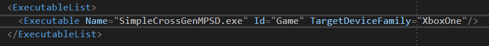
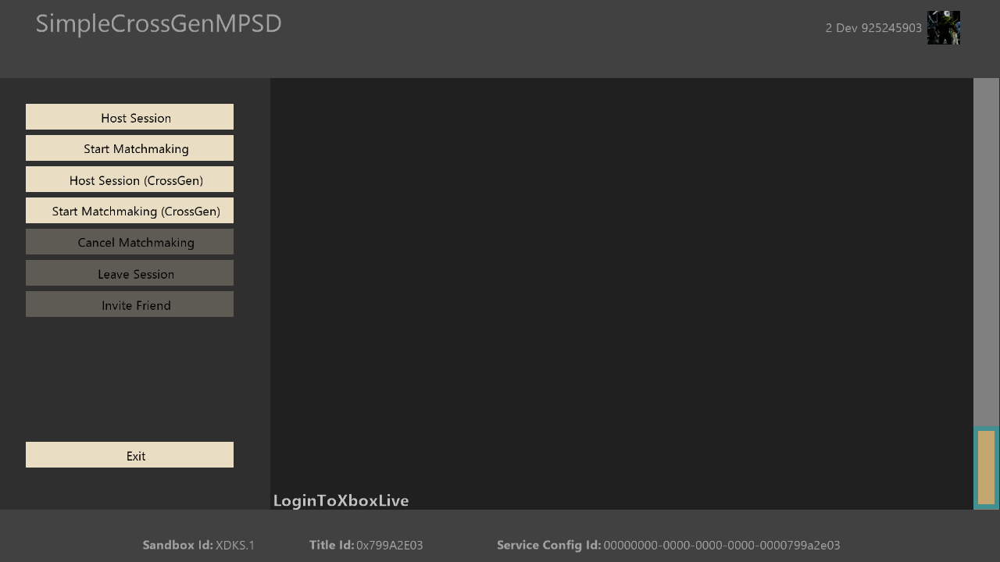
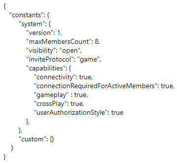

  

#   SimpleCrossGenMPSD Sample

*This sample is compatible with the Microsoft GDK (Desktop) and GDKX
(Xbox) (March 2022)*

# Description

This sample demonstrates how to use MPSD to implement sessions and
matchmaking for both cross generation and single generation games. This
sample does not demonstrate the full breadth of MPSD's features.

# Building the sample

If using an Xbox One devkit, set the active solution platform to `Gaming.Xbox.XboxOne.x64`.

If using an Xbox Series X|S devkit, set the active solution platform to `Gaming.Xbox.Scarlett.x64`.

If using PC, set the active solution platform to x64.

If you desire to run the Xbox One version of the sample on a Xbox Series
X|S devkit, set the active solution platform to Gaming.Xbox.XboxOne.x64.
You will also need to set the TargetDeviceFamily to XboxOne in the
MicrosoftGame.config file.

*For more information, see* __Running samples__, *in the GDK documentation.*

# Using the sample

This sample showcases a simplified demonstration of how to manage
sessions using MPSD for both single generation and cross generation
scenarios.

**Host Game Session** - Hosts a simple Game Session supporting invites
and join in progress.

**Start Matchmaking** -- Creates a lobby session and begins the
matchmaking process.

**Host Game Session (CrossGen)** - Hosts a simple Game Session
supporting cross generational invites and join in progress.

## 

**Start Matchmaking** **(CrossGen)** - Creates a lobby session and
begins the cross generational matchmaking process.

**Cancel Matchmaking** -- Cancels matchmaking and leaves the active
Lobby Session

## 

**Leave Session** -- Leaves the active Game Session.

**Invite Friend** -- Opens a shell UI to send an invite to a player on
the user's friends list.

## 

## Main Screen

# Implementation notes

The MPSD usage is all found in SessionManager.h/.cpp. Here you'll find
demonstrations of:

-   Creating, joining, and leaving sessions

-   Starting and canceling matchmaking

-   Managing MPSD subscriptions and events

-   Sending invitations

-   Managing activities

Please refer to MPSD documentation for detailed API notes and usage.

# Session Templates

This same makes use for four session templates: GameSession,
GameSessionCrossGen, LobbySession, and LobbySessionCrossGen. The core
difference between these sessions is the value that they have set for
the crossPlay capability. For sessions that support cross generation,
the crossPlay capability is set to true and is set false for session
that are intended for use with a single generation.

# Update history

February 2021 - Initial release February 2021

June 2022 -- Update for March 2022 GDK (and newer) compatibility

# Privacy Statement

When compiling and running a sample, the file name of the sample
executable will be sent to Microsoft to help track sample usage. To
opt-out of this data collection, you can remove the block of code in
Main.cpp labeled "Sample Usage Telemetry".

For more information about Microsoft's privacy policies in general, see
the [Microsoft Privacy
Statement](https://privacy.microsoft.com/en-us/privacystatement/).
