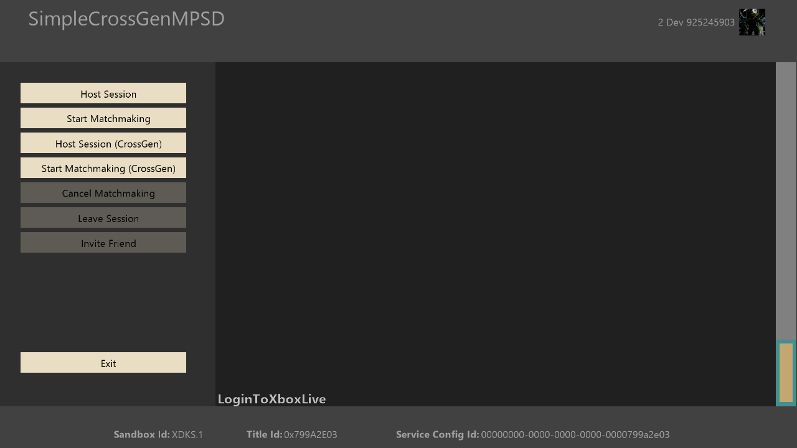

  

#   SimpleCrossGenMPSD サンプル

*このサンプルは Microsoft GDK (Desktop) および GDKX (Xbox) (2020 年 6
月) と互換性があります*

# 説明

このサンプルでは、MPSD
を使用してクロス世代ゲームとシングル世代ゲームの両方でセッションマッチメイキングを実装する方法を示します。このサンプルでは、MPSD
の機能の全範囲を示すものではありません。

# サンプルのビルド

Xbox One 開発キットを使用している場合、アクティブ ソリューション
プラットフォームを Gaming.Xbox.XboxOne.x64 に設定します。

Xbox Series X|S 開発キットを使用している場合、アクティブ ソリューション
プラットフォームを Gaming.Xbox.Scarlett.x64 に設定します。

PC を使用している場合には、アクティブ ソリューション プラットフォームを
Gaming.Desktop.x64 に設定します。

Xbox Series X|S 開発キットでサンプルのXbox
Oneバージョンを実行する場合は、アクティブなソリューション
プラットフォームを Gaming.Xbox.XboxOne.x64
に設定します。MicrosoftGame.config ファイルで TargetDeviceFamily を
XboxOne に設定する必要もあります。

*詳細については、GDK
のドキュメントの*「サンプルの実行」*を参照してください。*

# サンプルの使用

このサンプルでは、単一世代とクロス世代の両方のシナリオで MPSD
を使用してセッションを管理する方法の簡単なデモを紹介します。

**ゲームセッションのホスト**-招待と進行中の参加をサポートする簡単なゲームセッションをホストします。

**マッチメイキング**の開始 -- ロビー
セッションを作成し、マッチメイキング プロセスを開始します。

**ゲームセッションのホスト(CrossGen)**
-世代を超えた招待と進行中の参加をサポートする簡単なゲームセッションをホストします。

## 

**マッチメイキングの開始 (CrossGen)** - ロビー
セッションを作成し、マッチメイキング プロセスを開始します。

**マッチメイキングのキャンセル** --
マッチメイキングを取り消し、アクティブなロビー セッションから退出します

## 

**セッションを終了**--アクティブなゲームセッションを終了します。

**友達を招待**-- シェル UI を開き、ユーザーのフレンド
リストのプレイヤーに招待を送信します。

## 

## メイン画面

# 実装上の注意

MPSD の使用状況はすべて SessionManager.h/.cpp にあります。
ここでは、次のデモをご覧いただけます。

-   セッションの作成、参加、退出

-   マッチメイキングの開始とキャンセル

-   MPSD サブスクリプションとイベントの管理

-   招待を送信する

-   アクティビティの管理

APIに関する詳細な注意事項と使用法については、MPSDのドキュメントを参照してください。

# セッション テンプレート

これは、次の 4 つのセッション
テンプレートにも使用されます。GameSession、GameSessionCrossGen、LobbySession、LobbySessionCrossGen。これらのセッションの主な違いは、クロスプレイ機能に設定されている値です。クロスジェネレーションをサポートするセッションの場合、crossPlay
機能は true に設定され、単一世代での使用を意図したセッションでは false
に設定されます。

# 更新履歴

2021年2月 - 初回リリース 2021年2月

# プライバシーに関する声明

サンプルをコンパイルして実行する場合、サンプルの使用状況を追跡するために、サンプル実行ファイルのファイル名が
Microsoft に送信されます。このデータ
コレクションからオプトアウトするには、Main.cpp の「Sample Usage
Telemetry」というラベルの付いたコードのブロックを削除します。

全般的な Microsoft のプライバシー ポリシーの詳細については、「[Microsoft
プライバシー
ステートメント](https://privacy.microsoft.com/en-us/privacystatement/)」を参照してください。
