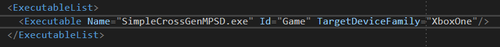

  

#   SimpleCrossGenMPSD 示例

*此示例与 Microsoft GDK（桌面）和 GDKX (Xbox)（2020 年 11 月）兼容*

# 说明

本示例演示了如何使用 MPSD 来实现跨代和单代游戏的会话和匹配。此示例不演示
MPSD 功能的完整广度。

# 生成示例

如果使用 Xbox One 开发工具包，请将活动解决方案平台设置为
Gaming.Xbox.XboxOne.x64。

如果使用 Xbox Series X|S 开发工具包，请将活动解决方案平台设置为
Gaming.Xbox.Scarlett.x64。

如果使用电脑，请将活动解决方案平台设置为 Gaming.Desktop.x64。

如果要在 Xbox Series X|S 开发工具包上运行示例 Xbox One
版本，请将活动解决方案平台设置为 Gaming.Xbox.XboxOne.x64。还需要在
MicrosoftGame.config 文件中将 TargetDeviceFamily 设置为 XboxOne。

*有关详细信息，请参阅 GDK 文档中的*"运行示例"*。*

# 使用示例

此示例简单演示了如何使用 MPSD 管理针对单代和跨代方案的会话。

**主持游戏会话** - 主持一个简单的游戏会话，支持进程中邀请和加入。

**启动匹配**--创建大厅会话并开始匹配过程。

**主持游戏会话（跨代系）** -
主持支持跨代进程中邀请和加入的简单游戏会话。

## 

**启动匹配（跨代系）**- 创建大厅会话并开始跨代匹配过程。

**取消匹配**--取消匹配并退出活动大厅会话

## 

**保存会话**--离开活动游戏会话。

**邀请好友**--打开 shell UI，向用户好友列表中的玩家发送邀请。

## 

## 主屏幕

# 实现说明

MPSD 用法全部在 SessionManager.h/.cpp 中。
在这里，你将找到以下内容的演示：

-   创建、加入、离开会话

-   启动和取消匹配

-   管理 MPSD 订阅和事件

-   正在发送邀请

-   管理活动

请参阅 MPSD 文档，了解详细的 API 说明和用法。

# 会话模板

它同样可用于四个会话模板：GameSession、GameSessionCrossGen、LobbySession、LobbySessionCrossGen。这些会话之间的核心区别是它们为
crossPlay 功能设置的值。对于支持跨代的会话，crossPlay 功能设置为
true，对于单代的会话，该功能设置为 false。

# 更新历史记录

2021 年 2 月 - 初始版本 2021 年 2 月

# 隐私声明

在编译和运行示例时，将向 Microsoft
发送示例可执行文件的文件名以帮助跟踪示例使用情况。若要选择退出此数据收集，你可以删除
Main.cpp 中标记为"示例使用遥测"的代码块。

有关 Microsoft 的一般隐私策略的详细信息，请参阅 [Microsoft
隐私声明](https://privacy.microsoft.com/en-us/privacystatement/)。
