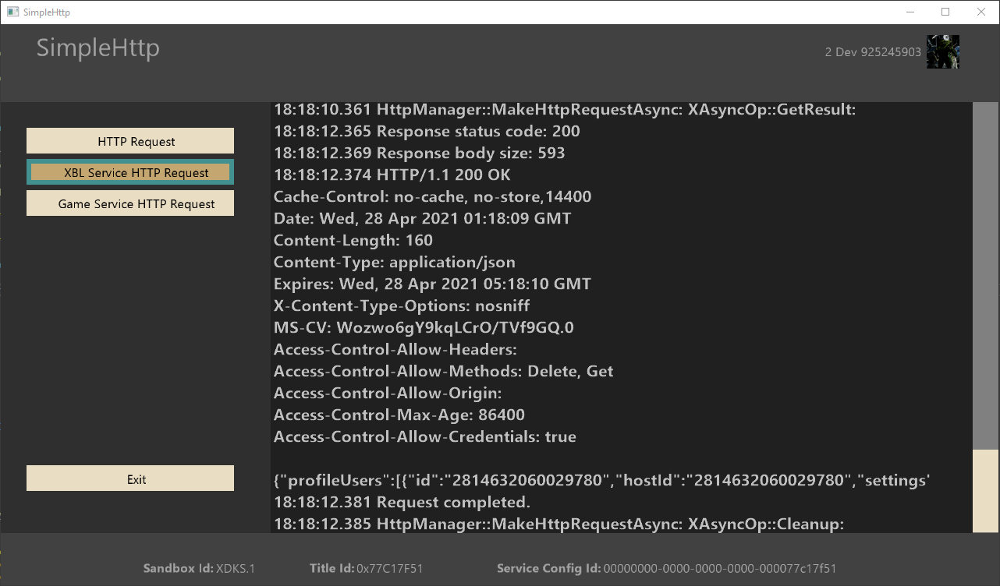

  

#   SimpleHttp Sample

*このサンプルは Microsoft GDK (Desktop) および GDKX (Xbox) (2021 年 4
月) と互換性があります*

# 説明

このサンプルでは、XCurl を使用して、認証された Xbox
Live呼び出しのヘッダーにユーザー トークンと署名を追加するなど、HTTP
要求を行う方法を示します。

# サンプルのビルド

XDKS.1
サンドボックスを使用する場合、サンプルは、ビルドに特定の変更を必要とせず、修正なしで実行する必要があります。

*詳細については、GDK
のドキュメントの*「サンプルの実行」*を参照してください。*

# サンプルの使用方法

サンプルを実行すると、XSTS トークンによる認証を必要とするサービスに
HTTPS 経由で要求を送信できます。

HTTPS 呼び出しの場合は、標準の Xbox Live
エンドポイントを呼び出すことを選択して、XBL サービスの HTTP
要求ボタンを使用して現在のユーザー (プロフィール サービス)
に関する情報を取得できます。 これによりサービスに接続し、XSTS トークンを
Authorization ヘッダーとして適切に追加し、Signature
ヘッダーを追加します。

カスタム ゲーム サービスへの呼び出しをシミュレートするには、Game Service
HTTP 要求を使用して、ゲーム サービスに必要な XSTS
トークン認証も追加します。 これは既定で、Game Service
サンプルの実行中のサンプル
バージョンを呼び出し、サービスの認証に使用されるユーザの X-Token
内のすべての要求に返信します。 このサンプルでは、ボタンのターゲット URL
をコードでコメント アウトされた他のオプションでオーバーライドして、b2b
コマース URI を含む他のサービス機能を使用することもできます。
独自のカスタム Game Service の構成の詳細については、Game Service
のサンプルと構成ガイドを参照してください。

## メイン画面

# 実装上の注意

XCurl の使用法はすべて HttpManager.h/.cpp にあります。
ここでは、次のデモをご覧いただけます。

-   ネットワークの可用性の待機

-   Web サーバーから HTTPS "GET" 要求の作成

-   一般的な HTTP クエリの作成

API の注意事項と使用方法の詳細については、XCurl
のドキュメントを参照してください。

# 更新履歴

2021 年 4 月の初回リリース

# プライバシー ステートメント

サンプルをコンパイルして実行する場合、サンプルの使用状況を追跡するために、サンプル実行ファイルのファイル名が
Microsoft に送信されます。このデータ
コレクションからオプトアウトするには、Main.cpp の「Sample Usage
Telemetry」というラベルの付いたコードのブロックを削除します。

全般的な Microsoft のプライバシー ポリシーの詳細については、「[Microsoft
プライバシー
ステートメント](https://privacy.microsoft.com/en-us/privacystatement/)」を参照してください。
