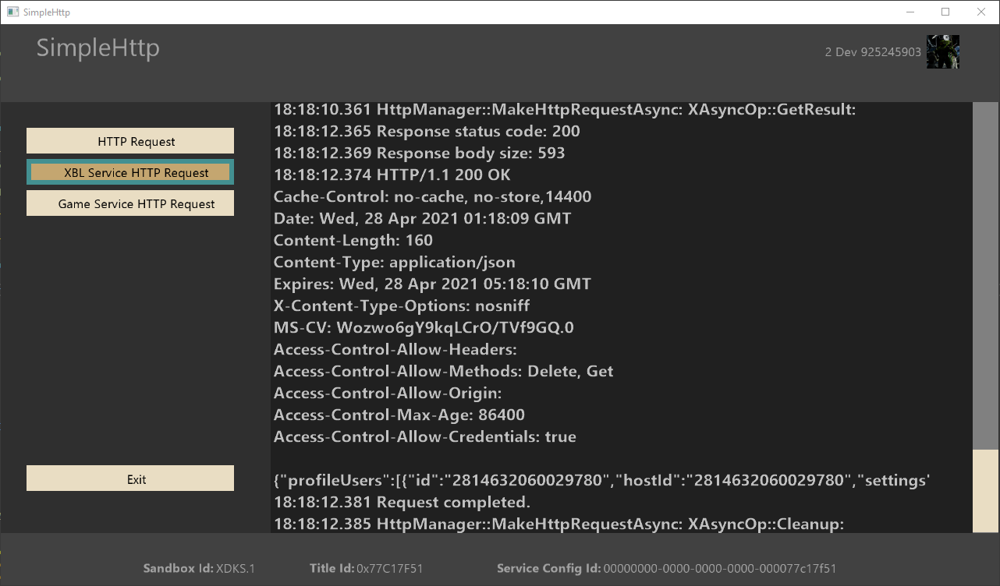

# SimpleHttp 샘플

*이 샘플은 Microsoft GDK(데스크톱) 및 GDKX(Xbox)(2022년 3월)와 호환됩니다.*

# 설명

이 샘플은 XCurl을 사용하여 인증된 Xbox Live 호출에 대한 헤더에 사용자 토큰 및 서명을 추가하는 것을 포함하여 HTTP 요청을 만드는 방법을 보여줍니다.

# 샘플 빌드

샘플은 빌드할 때 특정 변경 사항이 필요하지 않으며 XDKS.1 샌드박스를 사용하는 경우 수정 없이 실행되어야 합니다.

*자세한 내용은* *GDK 설명서의* __샘플 실행__을 참조하세요.&nbsp;

# 샘플 사용

샘플이 실행되면 XSTS 토큰을 사용한 인증이 필요한 서비스에 HTTPS를 통해 요청을 보낼 수 있습니다.

HTTPS 호출의 경우 표준 Xbox Live 끝점을 호출하도록 선택하여 XBL 서비스 HTTP 요청 단추를 사용하여 현재 사용자(프로필 서비스)에 대한 정보를 가져올 수 있습니다. 그러면 서비스에 연결되고 XSTS 토큰을 Authorization 헤더로 적절하게 추가하고 서명 헤더를 추가합니다.

사용자 지정 게임 서비스에 대한 호출을 시뮬레이션하려면 게임 서비스에 필요한 XSTS 토큰 인증도 추가하는 게임 서비스 HTTP 요청을 사용할 수 있습니다. 이것은 기본적으로 게임 서비스 샘플의 실행 중인 샘플 버전을 호출하고 서비스 인증에 사용된 사용자의 X-토큰 내의 모든 클레임으로 회신합니다. 코드에서 주석 처리된 다른 옵션으로 버튼의 대상 URL을 재정의하여 b2b 상거래 URI를 포함한 다른 서비스 기능을 이 샘플과 함께 사용할 수도 있습니다. 사용자 지정 게임 서비스 구성에 대한 자세한 내용은 게임 서비스 샘플 및 구성 가이드를 참조하세요.

## 메인 화면

# 구현 참고 사항

XCurl 사용법은 모두 HttpManager.h/.cpp에 있습니다. 여기에서 다음과 같은 데모를 찾을 수 있습니다.

- 네트워킹 가용성을 기다리는 중

- 웹 서버에서 HTTPS "GET" 요청 생성

- 일반 HTTP 쿼리 만들기

자세한 API 참고 사항 및 사용법은 XCurl 문서를 참조하세요.

# 업데이트 기록

2021년 4월 초기 릴리스

2022년 6월 -- 2022년 3월 GDK 이상 호환성

# 개인정보처리방침

샘플을 컴파일하고 실행하는 경우 샘플 사용량을 추적할 수 있도록 샘플 실행 파일의 파일 이름이 Microsoft에 전송됩니다. 이 데이터 수집을 옵트아웃하려면 Main.cpp에서 "샘플 사용량 원격 분석"이라는 레이블이 지정된 코드 블록을 제거할 수 있습니다.

일반적인 Microsoft의 개인 정보 정책에 대한 자세한 내용은 [Microsoft 개인정보처리방침](https://privacy.microsoft.com/en-us/privacystatement/)을 참조하세요.

