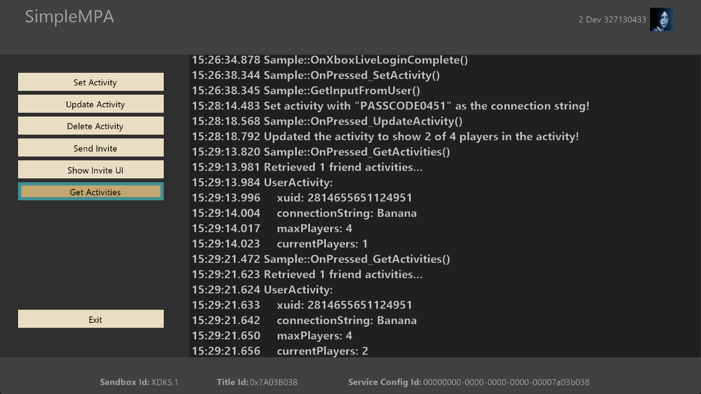

  

#   SimpleMPA Sample

*This sample is compatible with the Microsoft GDK (Desktop) and GDKX
(Xbox) (March 2022)*

# Description

This sample demonstrates how to use the Multiplayer Activity Service for
activities and invites.

# Building the sample

The sample should not require any specific changes to build and should
run without any modifications if using the XDKS.1 sandbox.

*For more information, see* __Running samples__, *in the GDK documentation.*

# Using the sample

When the sample is run you can create a multiplayer activity that has an
arbitrary string. Once an activity is created, you can update the
activity to show a different number of players in that activity.
Additionally, you can delete the activity or send invites to other
players for that activity. Finally, you can fetch the activities for
players on your friends list.

## Main Screen

# Update history

Initial release August, 2022

# Privacy Statement

When compiling and running a sample, the file name of the sample
executable will be sent to Microsoft to help track sample usage. To
opt-out of this data collection, you can remove the block of code in
Main.cpp labeled "Sample Usage Telemetry".

For more information about Microsoft's privacy policies in general, see
the [Microsoft Privacy
Statement](https://privacy.microsoft.com/en-us/privacystatement/).
