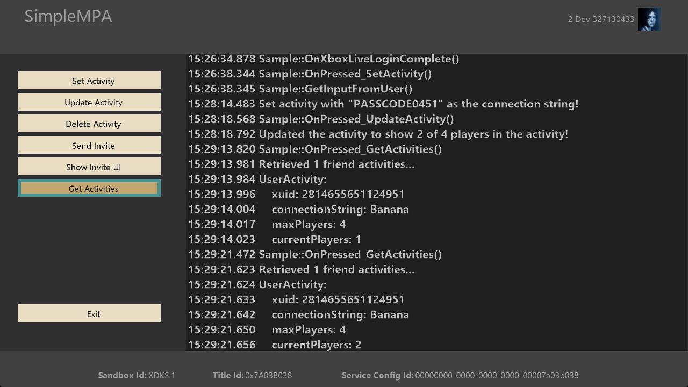

# SimpleMPA サンプル

*このサンプルは、Microsoft GDK (デスクトップ) と GDKX (Xbox) と互換性があります (2022 年 3 月)*

# 説明

このサンプルでは、マルチプレイヤー アクティビティ サービスをアクティビティと招待に使用する方法を示します。

# サンプルのビルド

サンプルでは、ビルドに特定の変更を必要とせず、XDKS.1 サンドボックスを使用する場合は変更なしで実行する必要があります。

*詳細については、**GDK ドキュメント*の「__サンプルの実行__」を参照してください。

# サンプルの使用方法

サンプルを実行すると、任意の文字列を持つマルチプレイヤー アクティビティを作成できます。 アクティビティが作成されたら、アクティビティを更新して、そのアクティビティ内の別のプレイヤー数を表示できます。 さらに、アクティビティを削除したり、そのアクティビティの他のプレイヤーに招待を送信したりできます。 最後に、フレンド リストのプレイヤーのアクティビティを取得できます。

## メイン画面

# 更新履歴

2022 年 8 月 初期リリース

# プライバシーに関する声明

サンプルをコンパイルして実行する場合、サンプルの使用状況を追跡するために、サンプルの実行可能ファイルのファイル名が Microsoft に送信されます。 このデータ コレクションからオプトアウトするには、Main.cpp の "サンプル使用状況テレメトリ" というラベルの付いたコードのブロックを削除します。

Microsoft のプライバシー ポリシー全般の詳細については、「[Microsoft のプライバシーに関する声明](https://privacy.microsoft.com/en-us/privacystatement/)」を参照してください。

