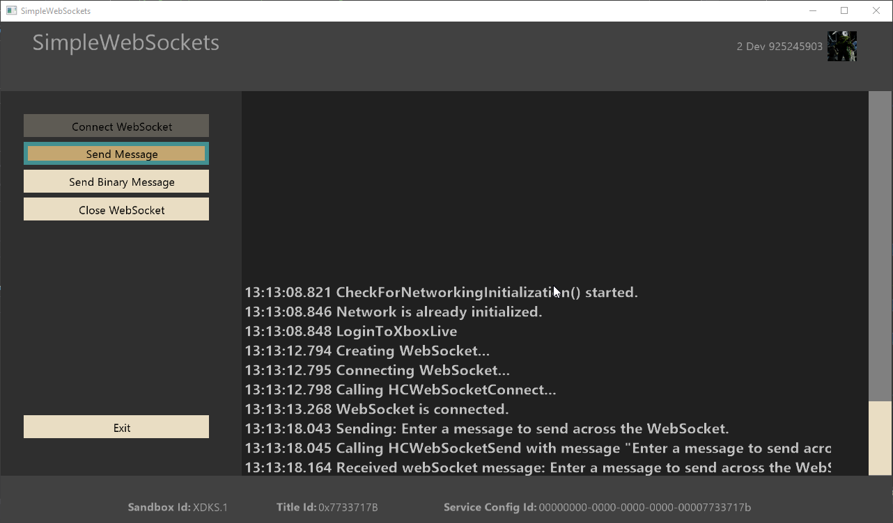

  

#   SimpleWebSockets Sample

*This sample is compatible with the Microsoft GDK (Desktop) and GDKX
(Xbox) (March 2022)*

# Description

This sample demonstrates using LibHttpClient to connect, send, and
receive messages to/from a host via Web Sockets.

# Building the sample

The sample should not require any specific changes to build and should
run without any modifications if using the XDKS.1 sandbox.

*For more information, see* __Running samples__, *in the GDK documentation.*

# Using the sample

When the sample is run, you can open a WebSocket connection to a service
that will repeat messages you send.

First click the Connect button to establish the WebSocket connection. By
default, the sample connects to the open echo server at
`wss://echo.websocket.org`. Once connected, selecting "Send Message" will
bring up the virtual keyboard so you can send a custom message up to
your endpoint. Selecting "Send Binary Message" will send a test message
with a binary payload to the endpoint.

## Main Screen

# Update history

April 2021 -- Initial release

June 2022 -- Updated for March 2022 GDK (and newer) compatibility

# Privacy Statement

When compiling and running a sample, the file name of the sample
executable will be sent to Microsoft to help track sample usage. To
opt-out of this data collection, you can remove the block of code in
Main.cpp labeled "Sample Usage Telemetry".

For more information about Microsoft's privacy policies in general, see
the [Microsoft Privacy
Statement](https://privacy.microsoft.com/en-us/privacystatement/).
