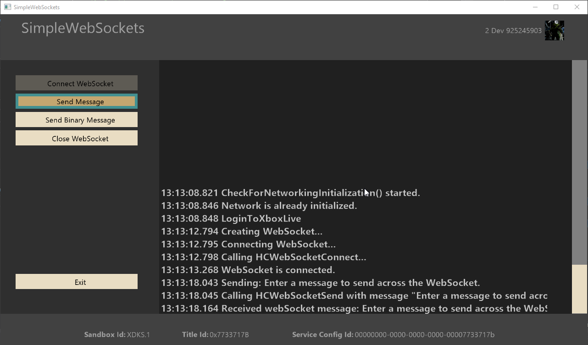

# SimpleWebSockets 샘플

*이 샘플은 Microsoft GDK(데스크톱) 및 GDKX(Xbox)(2022년 3월)와 호환됩니다.*

# 설명

이 샘플은 웹 소켓을 통해 호스트와 메시지를 연결, 전송 및 수신하기 위해 LibHttpClient를 사용하는 방법을 보여줍니다.

# 샘플 빌드

샘플은 빌드할 때 특정 변경 사항이 필요하지 않으며 XDKS.1 샌드박스를 사용하는 경우 수정 없이 실행되어야 합니다.

*자세한 내용은* *GDK 설명서의* __샘플 실행__을 참조하세요.&nbsp;

# 샘플 사용

샘플이 실행되면 보내는 메시지를 반복하는 서비스에 대한 WebSocket 연결을 열 수 있습니다.

먼저 연결 단추를 클릭하여 WebSocket 연결을 설정합니다. 기본적으로 샘플은 `wss://echo.websocket.org`에서 열린 에코 서버에 연결됩니다. 연결된 후, "메시지 보내기"를 선택하면 가상 키보드가 표시되므로 사용자 지정 메시지를 엔드포인트로 보낼 수 있습니다. "이진 메시지 보내기"를 선택하면 엔드포인트에 이진 페이로드가 있는 테스트 메시지가 전송됩니다.

## 메인 화면

# 업데이트 기록

2021년 4월 -- 초기 릴리스

2022년 6월 -- 2022년 3월 GDK(이상) 호환성 업데이트

# 개인정보처리방침

샘플을 컴파일하고 실행하는 경우 샘플 사용량을 추적할 수 있도록 샘플 실행 파일의 파일 이름이 Microsoft에 전송됩니다. 이 데이터 수집을 옵트아웃하려면 Main.cpp에서 "샘플 사용량 원격 분석"이라는 레이블이 지정된 코드 블록을 제거할 수 있습니다.

일반적인 Microsoft의 개인 정보 정책에 대한 자세한 내용은 [Microsoft 개인정보처리방침](https://privacy.microsoft.com/en-us/privacystatement/)을 참조하세요.

