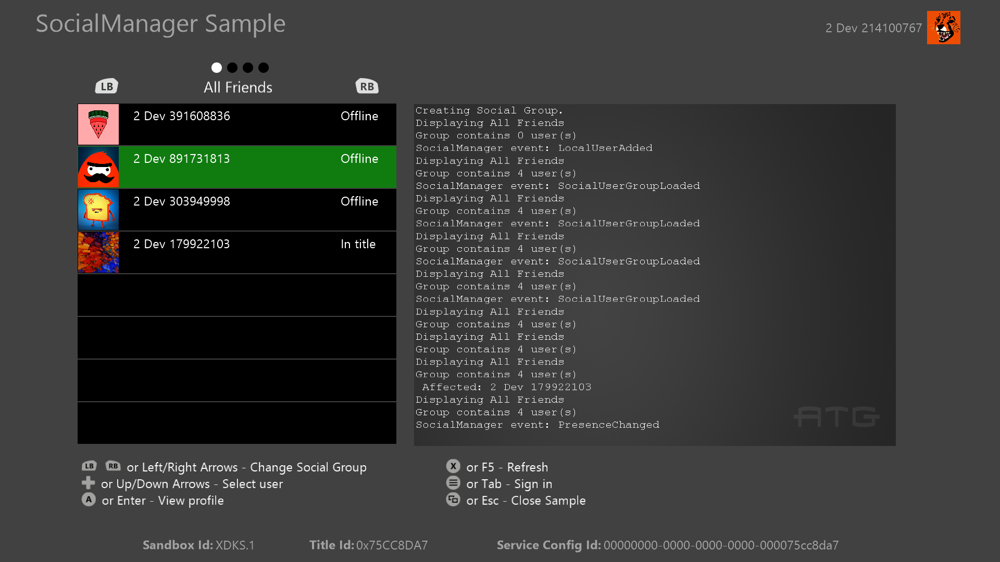

  

#   SocialManager Sample

*This sample is compatible with the Microsoft GDKX (March 2022)*

# 

# Description

This sample demonstrates the Social Manager C-API provided by the
Microsoft Gaming SDK (GDK).

This sample includes scenarios for:

-   Adding users and creating groups

-   Retrieving social groups based on filters

-   Responding to Social Manager events

# Building the sample

-   If using an Xbox One devkit, set the active solution platform to
    **Gaming.Xbox.XboxOne.x64**.

-   If using an Xbox Series X|S devkit, set the active solution platform
    to **Gaming.Xbox.Scarlett.x64**.

-   If using a PC, set the active solution platform to
    **x64**.

*For more information, see* __Running samples__, *in the GDK documentation.*

# Using the sample

The sample is controlled using a standard gamepad or keyboard. The
bottom of the screen displays the input legend with all available
actions.

## Sample Screen

| Action                      |  Gamepad                                |
|-----------------------------|----------------------------------------|
| Change Social Group  |  LB and RB shoulder buttons / Left or Right arrow keys                       |
| Select User                 |  DPad up/down or Up/Down arrow keys     |
| View Profile                |  A button or Enter key                  |
| Refresh UI for current filter |  X Button or F5 key |
| Sign in user                |  Menu button or Tab key                 |
| Exit                        |  View Button / ESC key                  |

# Implementation notes

The code that directly interfaces with Social Manager API is
encapsulated into the SocialManagerIntegration.cpp file.

# Privacy Statement

When compiling and running a sample, the file name of the sample
executable will be sent to Microsoft to help track sample usage. To
opt-out of this data collection, you can remove the block of code in
Main.cpp labeled "Sample Usage Telemetry".

For more information about Microsoft's privacy policies in general, see
the [Microsoft Privacy
Statement](https://privacy.microsoft.com/en-us/privacystatement/).

# Update history

September 2019 -- Initial release

February 2022

June 2022 -- March 2022 (and newer) GDK compatibility

August 2024 -- Adding `XblSocialManagerSetRichPresencePollingStatus` in code
