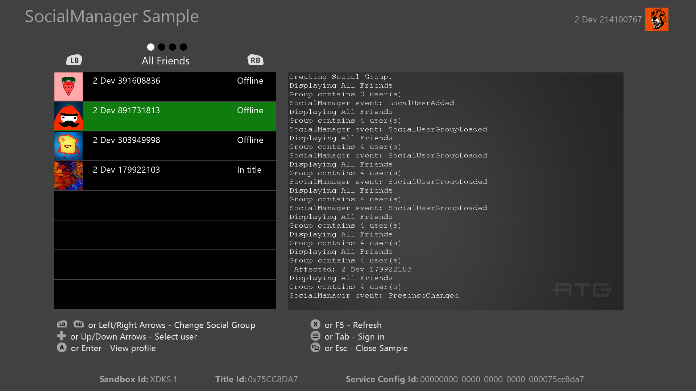

  

#   ソーシャル サンプル

*このサンプルは Microsoft Game Development Kit (2020 年 6 月)
と互換性があります*

# 

# 説明

このサンプルでは、Microsoft Gaming SDK (GDK) によって提供される Social
Manager C-API を示します。

このサンプルには、次のシナリオが含まれています:

-   ユーザーの追加とグループの作成

-   フィルターに基づくソーシャル グループの取得

-   Social Manager イベントの使用

# サンプルのビルド

-   Xbox One 開発キットを使用している場合は、アクティブなソリューション
    プラットフォームを **Gaming.Xbox.XboxOne.x64** に設定します。

-   Project Scarlett を使用している場合は、アクティブなソリューション
    プラットフォームを **Gaming.Xbox.Scarlett.x64** に設定します。

*詳細については、GDK
のドキュメントの*「サンプルの実行」*を参照してください。*

# サンプルの使用方法

サンプルは、標準のゲームパッドまたはキーボードを使用して制御されます。画面の下部には、使用可能なすべてのアクションを含む入力凡例が表示されます。

## サンプル画像

| 操作                        |  ゲームパッド                           |
|-----------------------------|----------------------------------------|
| ユーザーのサインイン        |  メニュー ボタン/Tab キー               |
| 現在のフィルターの UI を更新する |  ボタン/F5 キー |
| ソーシャル グループの表示を変更する |  LB および RB ショルダー ボタン/左方向キーまたは右方向キー      |
| 終了                        |  ビュー ボタン/ESC キーが押されました。 |

# 

# 実装上の注意

Social Manager API
と直接インターフェイスするコードは、SocialManagerIntegration.cpp
ファイルにカプセル化されます。

# プライバシーに関する声明

サンプルをコンパイルして実行する場合、サンプルの使用状況を追跡するために、サンプル実行ファイルのファイル名が
Microsoft に送信されます。このデータ
コレクションからオプトアウトするには、Main.cpp の「Sample Usage
Telemetry」というラベルの付いたコードのブロックを削除します。

全般的な Microsoft のプライバシー ポリシーの詳細については、「[Microsoft
のプライバシーに関する声明](https://privacy.microsoft.com/en-us/privacystatement/)」を参照してください。

# 更新履歴

**更新日:***2021 年 7 月*

**初回リリース:***2019 年 9 月*
