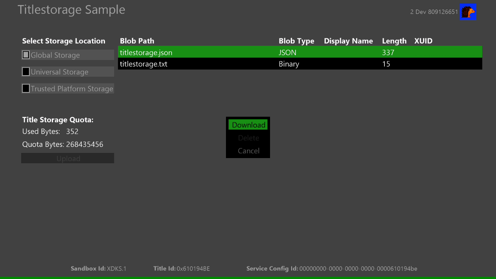

  

#   タイトル ストレージ サンプル

*このサンプルは、Microsoft GDKX (2020 年 8 月) と互換性があります*

# 説明

このサンプルでは、Microsoft Game Development Kit (GDK)
によって提供されるタイトル ストレージ API を示します。
このサンプルには、次のシナリオが含まれています。

-   グローバル ストレージ データの列挙とダウンロード

-   ユニバーサル ストレージ
    データの列挙、アップロード、ダウンロード、削除

-   信頼できるPプラットフォームストレージデータの列挙、アップロード、ダウンロード、削除

-   Rクォータ情報の取得

# サンプルのビルド

Xbox One 開発キットを使用している場合、アクティブ ソリューション
プラットフォームを Gaming.Xbox.XboxOne.x64 に設定します。

Xbox Series X|S 開発キットを使用している場合、アクティブ ソリューション
プラットフォームを Gaming.Xbox.Scarlett.x64 に設定します。

*詳細については、GDK
のドキュメントの*「サンプルの実行」*を参照してください。*

# サンプルの実行

-   サインインXbox Liveテスト アカウントが必要です

-   Xbox One 開発キット: コンソールのサンドボックスを XDKS.1
    に設定します

# サンプルの使用

## 

| 操作                                   |  ゲームパッド                |
|----------------------------------------|-----------------------------|
| 実行するストレージとシナリオを選択する |  Dパッド上/下                |
| ストレージを確認してシナリオを実行する |  A ボタン                    |
| ビュー ボタン                          |  終了                        |

T 黒い領域 (リスト ウィンドウ) には、アップロードされたユーザーの BLOB
パス、BLOB の種類、表示名、長さ (データ サイズ)、XUID
が表示されます。グローバル ストレージの場合、MPC
で事前に構成されているデータの列挙、ダウンロード、表示のみを行うことができます。このサンプルには、XDKS.1
のこの製品のグローバル
ストレージに既にアップロードされているデータがあります。他のストレージの場合は、それらに加えて、データのアップロードと削除を行うこともできます。

# 試すシナリオ

-   ストレージの選択

    -   P「ストレージの場所を選択」にフォーカスしているときに
        Aボタンを押すと、対応するストレージのリストウィンドウが表示されます。Dパッドを使用してリスト
        ウィンドウに移動し、A
        ボタンを押すとデータをダウンロードできます。既定では、このサンプルを起動すると、グローバル
        ストレージ データがリストウィンドウに表示されます。

> 

-   データのアップロード

    -   「ストレージの場所の選択」 でグローバル ストレージボタン以外の A
        ボタンがあるストレージを選択した後は、「アップロード」
        に移動して A
        ボタンを押すことで、任意の形式でデータをアップロードできます。

> 

-   タイトル ストレージ データのダウンロードと削除

    -   W選択したストレージにデータがある場合、リストウィンドウに自動的にデータが列挙されます。A
        ボタンを使用して任意のデータを選択すると、データをダウンロードして削除できます。

> 

# 更新履歴

**初回リリース：**2020 年 11 月

# プライバシーに関する声明

サンプルをコンパイルして実行する場合、サンプルの使用状況を追跡するために、サンプル実行ファイルのファイル名が
Microsoft に送信されます。このデータ
コレクションからオプトアウトするには、Main.cpp の「Sample Usage
Telemetry」というラベルの付いたコードのブロックを削除します。

全般的な Microsoft のプライバシー ポリシーの詳細については、「[Microsoft
プライバシー
ステートメント](https://privacy.microsoft.com/en-us/privacystatement/)」を参照してください。
