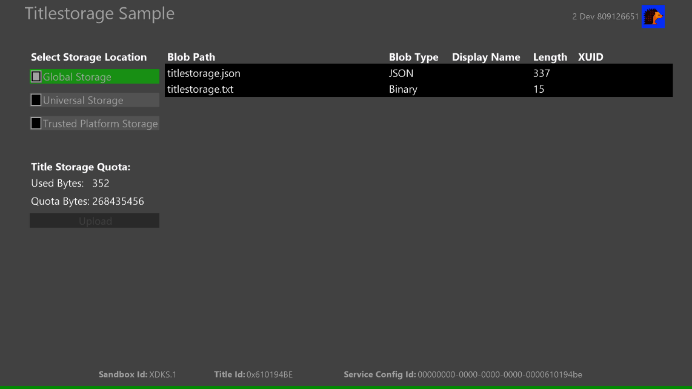
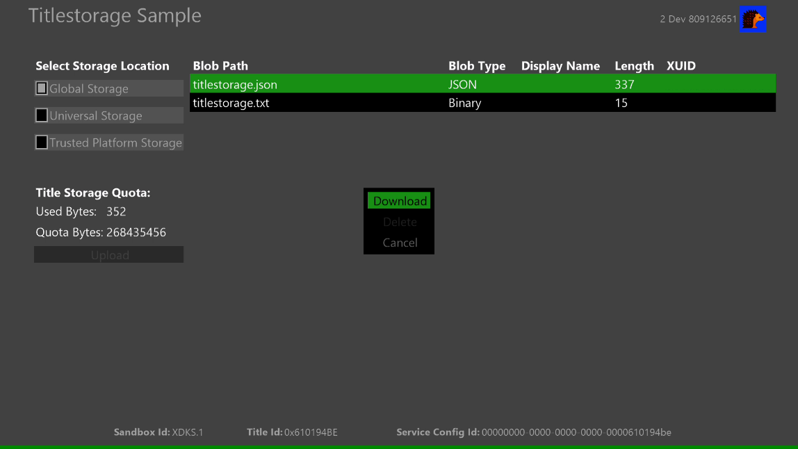
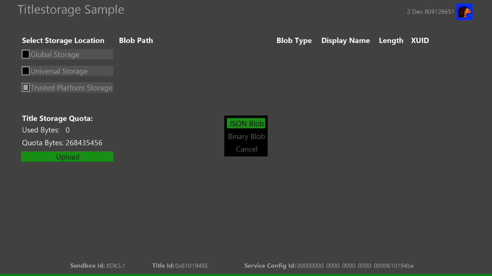
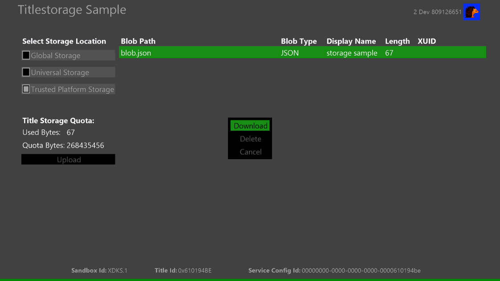

  

#   타이틀 저장소 샘플

*This sample is compatible with the Microsoft GDKX (August 2020)*

# 설명

이 샘플은 Microsoft GDK(게임 개발 키트)에서 제공하는 타이틀 저장소 API를
보여줍니다. 샘플에는 다음에 대한 시나리오가 포함됩니다.

-   글로벌 저장소 데이터 열거 및 다운로드

-   유니버설 저장소 데이터 열거, 업로드, 다운로드 및 삭제

-   신뢰할 수 있는 플랫폼 저장소 데이터 열거, 업로드, 다운로드 및 삭제

-   할당량 정보 검색

# 샘플 빌드

Xbox One 개발 키트를 사용하는 경우 활성 솔루션 플랫폼을
Gaming.Xbox.XboxOne.x64로 설정합니다.

Xbox Series X|S 개발 키트를 사용하는 경우 활성 솔루션 플랫폼을
Gaming.Xbox.Scarlett.x64로 설정합니다.

*자세한 내용은 GDK 설명서에서* 샘플 실행을 *참조하세요.*

# 샘플 실행

-   로그인한 Xbox Live 테스트 계정이 필요합니다.

-   Xbox One devkit: 콘솔의 샌드박스를 XDKS.1로 설정

# 샘플 사용

## 

| 작업                                   |  게임 패드                   |
|----------------------------------------|-----------------------------|
| 실행할 저장소 및 시나리오 선택         |  방향 패드 위/아래           |
| 저장소 확인 및 시나리오 실행           |  단추                        |
| 보기 단추                              |  출구                        |

검은 영역(목록 창)에는 업로드된 사용자의 Blob 경로, Blob 유형, 표시
이름, 길이(데이터 크기) 및 XUID가 표시됩니다. 전역 저장소의 경우 MPC에서
미리 구성된 데이터만 열거, 다운로드 및 표시할 수 있습니다. 이 샘플에는
XDKS.1에 이 제품의 글로벌 저장소에 이미 업로드된 데이터가 있습니다. 다른
저장소의 경우 그 외에도 데이터를 업로드하고 삭제할 수도 있습니다.

# 시도할 시나리오

-   저장소 선택

    -   \"저장 위치 선택\"에 초점을 맞춘 상태에서 A 버튼을 누르면 해당
        저장소의 목록 창이 표시됩니다. 방향 패드를 사용하여 목록 창으로
        이동할 수 있으며 A 버튼을 누르면 데이터를 다운로드할 수
        있습니다. 기본적으로 이 샘플을 실행하면 글로벌 저장소 데이터가
        목록 창에 표시됩니다.

> 

-   데이터 업로드

    -   \"저장 위치 선택\"에서 전역 저장소 이외의 A 버튼으로 저장소를
        선택한 후 \"업로드\"로 이동한 다음 A 버튼을 누르면 모든 형식의
        데이터를 업로드할 수 있습니다.

> 

-   타이틀 저장소 데이터 다운로드 및 삭제

    -   선택한 저장소에 데이터가 있을 경우 데이터가 목록 창에 자동으로
        열거됩니다. A 버튼으로 데이터를 선택하면 데이터를 다운로드 및
        삭제할 수 있습니다.

> 

# 업데이트 기록

**초기 릴리스:** 2020년 11월

# 개인정보 처리방침

샘플을 컴파일하고 실행하는 경우 샘플 사용량을 추적할 수 있도록 샘플 실행
파일의 파일 이름이 Microsoft에 전송됩니다. 이 데이터 수집을
옵트아웃하려면 \"샘플 사용량 원격 분석\"으로 레이블이 지정된
Main.cpp에서 코드 블록을 제거할 수 있습니다.

Microsoft의 개인정보 정책에 대한 자세한 내용은 [Microsoft
개인정보처리방침](https://privacy.microsoft.com/en-us/privacystatement/)을
참조하세요.
