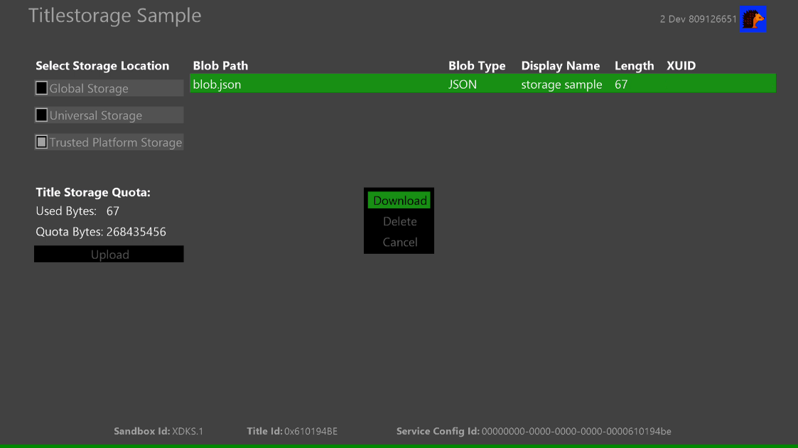

  

#   游戏存储示例

*此示例与 Microsoft GDKX (August 2020) 兼容*

# 说明

此示例演示 Microsoft 游戏开发工具包 (GDK) 提供的游戏存储 API。
此示例包括以下场景:

-   枚举和下载全局存储数据

-   枚举、上传、下载、删除通用存储数据

-   枚举、上传、下载、删除受信任的平台存储数据

-   检索配额信息

# 生成示例

如果使用 Xbox One 开发工具包，请将活动解决方案平台设置为
Gaming.Xbox.XboxOne.x64。

如果使用 Xbox Series X|S 开发工具包，请将活动解决方案平台设置为
Gaming.Xbox.Scarlett.x64。

*有关详细信息，请参阅 GDK 文档中的*"运行示例"*。*

# 运行示例

-   你需要登录 Xbox Live 测试帐户

-   Xbox One 开发工具包：将主机的沙盒设置为 XDKS.1

# 使用示例

## 

| 操作                                   |  游戏板                      |
|----------------------------------------|-----------------------------|
| 选择要运行的存储和方案                 |  方向键上/下                 |
| 确认存储并运行方案                     |  A 按钮                      |
| "视图"按钮                             |  退出                        |

黑色区域（列表窗口）将显示已上传用户的 Blob 路径、Blob
类型、显示名称、长度（数据大小）、XUID。对于全局存储，只能枚举、下载、显示预先在
MPC 中配置的数据。在此示例中，有数据已上传到 XDKS.1
中此产品的全局存储。对于其他存储，除了这些之外，还可以上传和删除数据。

# 可尝试的方案

-   选择存储

    -   在聚焦"选择存储位置"时按 A
        按钮将显示相应存储的列表窗口。可以使用方向键移动到列表窗口，按 A
        按钮可以下载其数据。默认情况下，启动此示例时，全局存储数据将显示在列表窗口中。

> 

-   正在上传数据

    -   在"选择存储位置"中使用 A
        按钮选择了除全局存储之外的任何存储后，可选择"上传"来上传任何格式的数据，然后按
        A 按钮。

> 

-   下载和删除游戏存储数据

    -   当所选存储具有数据时，数据将自动枚举在列表窗口中。使用 A
        按钮选择任何数据，可以下载和删除数据。

> 

# 更新历史记录

**初始版本：**2020 年 11 月

# 隐私声明

在编译和运行示例时，将向 Microsoft
发送示例可执行文件的文件名以帮助跟踪示例使用情况。若要选择退出此数据收集，你可以删除
Main.cpp 中标记为"示例使用遥测"的代码块。

有关 Microsoft 的一般隐私策略的详细信息，请参阅 [Microsoft
隐私声明](https://privacy.microsoft.com/en-us/privacystatement/)。
