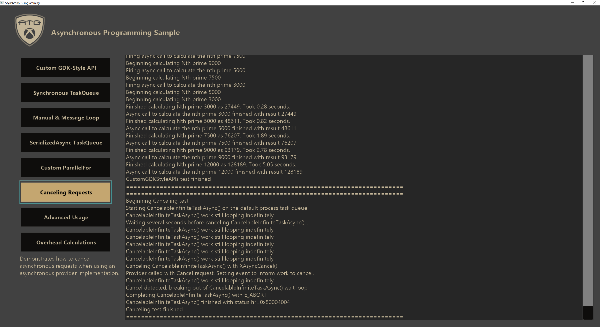

  

#   非同期プログラミングサンプル

*このサンプルは Microsoft Game Development Kit (2020 年 6 月)
と互換性があります。*

# 

# 説明

このサンプルでは、 **XAsync**、 **XTaskQueue**、および
**XAsyncProvider**
を使用して、さまざまな方法で非同期プログラミングとタスク処理を実装する方法を示します。GDK
非同期関数で XAsync
を使用する必要がありますが、ライブラリは独自に強力で、Windows 10、Xbox
One、Xbox Series X|S 間で完全に移植できます。

サンプル UI には、サンプル
テストを実行して出力を表示するためのインターフェイスが用意されています。各テストの詳細な説明と、ケースのコードに従う方法については、以下の
**実装ノート** を参照してください。

# サンプルのビルド

Xbox One 開発キットを使用している場合、アクティブ ソリューション
プラットフォームを Gaming.Xbox.XboxOne.x64 に設定します。

Xbox Series X|S 開発キットを使用している場合、アクティブ ソリューション
プラットフォームを Gaming.Xbox.Scarlett.x64 に設定します。

Windows 10 を使用している場合には、アクティブ ソリューション
プラットフォームを Gaming.Desktop.x64 に設定します。

*詳細については、GDK
のドキュメントの*「サンプルの実行」*を参照してください。*

# サンプルの使用方法

メイン画面のボタンを使用して、**XAsync/XTaskQueue**/**XAsyncProvider**
ライブラリのさまざまな使用方法に対してさまざまなテスト
シナリオを起動するだけです。

# 実装上の注意

このサンプルでは、**XAsync**、**XTaskQueue**、**XAsyncProvider**
のさまざまな機能をカバーする 8 つの異なるテスト シナリオを提供します。

*これらのライブラリの詳細については、GDK
ドキュメントを参照してください。つまり、 **XAsync**
は非同期タスクを実行および管理するためのメソッドを提供し、
**XTaskQueue**
は非同期タスクの実行コンテキスト/動作を管理するためのメソッドを提供し、
**XAsyncProvider** は非同期タスク
プロセス全体の組み込みの高度な管理を提供します。*

すべての使用法とテストはクラス **XAsyncExamples**
に実装されます。ただし、いずれかのテストで Windows メッセージ
ループに統合する 1 つのケースを除きます。各テストは
"**StartTest\_\[TestName\]**"
と呼ばれる関数に含まれているため、実装を確認するのに適した出発点です。

タスク キューは **XAsyncExamples::CreateTaskQueues()**
で作成され、スレッドは **XAsyncExamples::CreateThreads()**;
で生成されます。タスク キューのシャットダウン ロジックはタスク
キューのポート モードに依存するため、実装の詳細については
**、XAsyncExamples::ShutdownTaskQueues()** を参照してください。タスク
キューに手動ポートがある場合、 **XTaskQueueTerminate()**
が各ポートにイベントを追加するので、タスク
キューが返されるまで、そのポートをディスパッチし続ける必要があります。

**RunTask()** は、標準 の **XAsyncBlock** の作成とセットアップを実装し、
**XAsyncRun()** を使用して非同期呼び出しを開始する一般的なヘルパー
メソッドです。タスク
キュー、作業コールバック、および必要に応じて完了コールバックを指定するだけで、タスクの実行が大幅に簡素化されます。

各テストの詳細については、以下で繰り返します。

**カスタム GDK スタイル API テスト**

このテストでは、GDK API
関数のスタイルで非同期メソッドを設定する方法を示します。呼び出しと結果のプロセスは、非同期
GDK API メソッドの動作と同じです。

タスク キュー:

-   m_taskQueue_CustomGDKStyleAPIs

    -   作業ポート:ThreadPool

    -   完了ポート:Manual

**NthPrimeAsync()** と **NthPrimeAsyncResult()** は、GDK
非同期スタイルで実装される 2 つのメソッドです。どちらの関数も
**、XAsyncBlock** を設定し、非同期タスク
プロセスを開始するときにそれを渡す必要があります。非同期プロバイダーは、組み込み用に
**NthPrimeAsync()** を使用して実装され、操作の結果が
**NthPrimeAsyncResult()** から返されます。

テスト関数は **、NthPrimeAsync()** への 5
回の非同期呼び出しを設定し、完了コールバックで結果を報告します。使用されるタスク
キューには ThreadPool 作業ポートがあるため、これらの 5
つの要求はシステム スレッド
プールで並列に実行されます。手動完了ポートの場合、コールバックは
**XAsyncExamples::Update()** の **XTaskQueueDispatch()**
の呼び出しによってディスパッチされます。完了ポートのコールバックは、エンキューされた順序で実行されます。

**同期 TaskQueue テスト**

このテストでは、 **XAsyncBlock** 構造体内の指定されたタスク
キューのみに基づいて非同期タスクを同期的に呼び出す方法を示します。さらに、このテストでは、既定のプロセス
タスク キューを変更する方法も示します。

タスク キュー:

-   m_taskQueue_SynchronousTaskQueue

    -   作業ポート:Immediate

    -   完了ポート:Immediate

-   プロセスの既定タスク キュー

    -   作業ポート:ThreadPool

    -   完了ポート:ThreadPool

テスト関数は、最初に既定のプロセス タスク
キューをオーバーライドして、両方のポートを \[イミディエイト\]
に設定したカスタム
キューにします。即時ポートを使用すると、コールバックは、後でディスパッチするためにエンキューするのではなく、エンキューしようとするとすぐに実行されます。このテストでは、
**ParallelExecute()**
というヘルパー関数も使用します。この関数は、指定したタスク
キューで指定した回数コールバックを開始し、それらのすべてのタスクが完了するまで待機します。

テスト全体は、まず、システム の既定のタスク
キューにキャッシュされたハンドルを使用して **RunTask()**
を介してシステム スレッド
プールに移動されます。この目的は、アプリケーションをフリーズさせることなく、テストをバックグラウンドで実行できるようにすることです。次に、ThreadPool
ポートを使用するキャッシュされた既定のプロセス タスク キュー
ハンドルと並行して 20 個のタスクが実行されます。最後に、同じ 20
個のタスクが同じ方法で実行されますが、ポートが \[イミディエイト\]
に設定されているテストキューにタスク
キューを切り替えます。出力では、並列化により非同期作業が迅速に完了しますが、同期バージョンでは各タスクを一度に
1 つずつ実行する必要があります。

**手動 & メッセージ ループ テスト**

このテストでは、手動タスク
キューを使用する方法と、完了コールバックのためにそのタスク キューを
Windows メッセージ
ループと統合する方法を示します。複数のスレッドを使用して手動作業ポートを並列でディスパッチし、タスク
キュー モニター コールバックを使用して Windows メッセージ
ループに通知を送信し、1 つの手動完了コールバックを処理します。

タスク キュー:

-   m_taskQueue_ManualAndMessageLoop

    -   作業ポート:Manual

    -   完了ポート:Manual

このテストには、**StartTest_ManualAndMessageLoop()**
内だけでなく、コード内に関心のある場所がいくつかあります。注:
**WndProc()**、 **Notify_TaskQueueMonitor()**、
**ThreadProc_ManualAndMessageLoop()**、
**Monitor_ManualAndMessageLoop()**、 **CreateTaskQueues()**、
**ShutdownTaskQueues()** を参照してください。

このテストのタスク キューが **CreateTaskQueues()**
で作成されると、タスク
キューのモニターも作成されます。このモニターは、タスク
キューのポートに新しいコールバックが追加されるたびに実行されます。そのモニターが実行されるたびに、完了ポートのコールバックが検出されるたびに、*WM_TASKQUEUEMONITOR*
で **PostMessage()** が使用されます。**WndProc()**
は、*WM_TASKQUEUEMONITOR* イベントをチェックするように設定され、Windows
メッセージ ループのコンテキスト内で完了ポートから 1
つのコールバックをディスパッチする **Notify_TaskQueueMonitor()**
を呼び出します。

最後に、テスト関数は、作業コールバックと完了コールバックの両方を指定して、テスト
タスク キューで 20 個の非同期要求を開始する単純なドライバーです。

**SerializedAsync TaskQueue テスト**

このテストでは、SerializedThreadPool ポートを使用してタスク
キューを設定して使用する方法と、それらのポートがどのように機能するかを示します。

タスク キュー:

-   m_taskQueue_SerializedAsync

    -   作業ポート:SerializedThreadPool

    -   完了ポート:SerializedThreadPool

SerializedThreadPool に設定されたポートは、システム スレッド
プールでコールバックを自動的にディスパッチしましたが、一度に 1
つだけディスパッチされました。コールバックは、エンキューされた順序でディスパッチされます。この動作は、手動ポートを使用し、1
つのスレッドでのみ一度に 1
つのコールバックをディスパッチする場合と同じです。ただし、システム
スレッド プールでは、毎回同じスレッドを使用する必要はありません。

SerializedThreadPool ポートは一度に 1
つのコールバックのみを実行するため、非同期処理のさまざまなコールバック間に依存関係を持つことができます。テスト関数は、各タスクが前のタスクの結果を使用し、次のタスクのデータを変更するタスク
キューに 5 つの異なるタスクをエンキューすることで、これを利用します。

**Custom ParallelFor テスト**

このテストでは、ParallelFor 関数を実装する方法の 1
つを示します。手動タスク
キューを使用して作業を実行し、プレフィックス合計の計算を実行してパフォーマンスをテストします。

タスク キュー:

-   m_taskQueue_ParallelFor

    -   作業ポート:Manual

    -   完了ポート:Immediate

最大並列パフォーマンスを得るために、論理プロセッサごとにスレッドが生成され、各スレッドは
1
つのプロセッサのアフィニティを持つよう初期化されます。**ThreadProc_SingleCore()**
は同時に **XTaskQueueDispatch()**
を呼び出して並列化を取得でき、各スレッドは異なるタスクを取得します。

プレフィックスの合計は、同期動作と非同期動作をテストする 2
つの方法で計算されます。
可能な限り最適な比較を行うために、同期ケースに対して厳密なループが実装され、非同期ケースに対して異なる並列最適化アルゴリズムが使用されます。ケースのタイミングはログに報告されます。

**要求テストの取り消し**

このテストでは、非同期タスクを取り消す方法を示します。非同期タスクのプロバイダー内で取り消し動作を手動で処理する必要があるため、すべての非同期タスクを取り消すことはできません。その結果、**XAsyncRun()**
(**RunTask()** によって使用される)
を介して実行される単純なタスクを取り消すことはできません。取り消し可能なタスクを示すために、キャンセル
パスが実装されたカスタム非同期プロバイダー関数 (GDK
スタイルのテストと同様) が使用されます。

タスク キュー:

-   既定のプロセス タスク キュー

    -   作業ポート:ThreadPool

    -   完了ポート:ThreadPool

カスタム プロバイダーを使用した非同期メソッドの実装については、「
**CancelableInfiniteTaskAsync()**」
を参照してください。この非同期メソッドはデータを返しませんが、取り消されない限り無限に実行されます。**XAsyncOp::Cancel**
ケースは、無限ランタイムが検出できるイベントを設定するために実装されます。そのイベントが設定されると、プロバイダーは、*E_ABORT*
を使用して **XAsyncComplete()** で完了することを認識します。

テスト ケース関数は **CancelableInfiniteTaskAsync()**
の呼び出しを開始し、しばらくしてから **XAsyncCancel()**
を呼び出す別のタスクも開始します。出力ログを見て、テストの動作を確認します。

**高度な使用状況テスト**

このテストでは、複合タスク キュー、重複したタスク キュー
ハンドル、待機者の使用、イベントの遅延ディスパッチなど、一般的でない高度な機能をいくつか示します。このテストでは、すべてのタスク
キューとその他のテスト
データがテスト関数内で作成および破棄され、プロセス全体が表示されます。

テストは、最初に複合キューのテストを実行します。複合キューは、他のタスク
キューのポートで構成されるタスク キューです。通常のタスク
キューは、最初に ThreadPool
を作業ポートとして、手動を完了ポートとして設定して作成されます。次に、最初のタスク
キューの作業ポートを独自のポートの両方として使用する複合タスク
キューが作成されます。これにより、元のキューの同じポートで作業コールバックと完了コールバックの両方が実行されるようになります。

次に、テストではキュー ハンドルを複製する方法を示します。タスク キュー
ハンドルが複製されるたびに、クリーンアップを完了するためにその回数だけ閉じる必要があります。重複するハンドルは元のハンドルと同じように機能し、リソースの所有権を増やすだけです。

最後に、待機と遅延ディスパッチがテストされます。待機者は、複数回実行するためのコールバックを送信する方法ですが、送信は特定のイベントがトリガーされるたびにのみ行われます。これは、イベントの自動実行に役立ちます。遅延ディスパッチは、タスク
キューのいずれかのポートにコールバックを直接送信し、必要に応じて遅延します。通常の非同期送信には
**XAsyncBlock** が必要ですが、 代わりに
**XTaskQueueSubmitCallback**/**XTaskQueueSubmitDelayedCallback**
はコールバックをタスク
キューに直接送信します。通常は非同期プロバイダーによって内部的に使用されます。

**オーバーヘッド計算テスト**

このテストでは、**XAsync**/**XTaskQueue**/**XAsyncProvider**
を利用する際のさまざまなオーバーヘッドのタイミングを計算します。非同期メソッドを使用する際のさまざまなオーバーヘッドを理解すると便利です。

オーバーヘッドは、シナリオごとに複数のケースがある 3
つの異なるシナリオに対して計算されます。各タイミングの説明については、以下のグラフを参照してください。

| タイミング名           |  説明                                        |
|------------------------|---------------------------------------------|
| XAsyncRun_InvokeToWork (既定のプロセス タスク キュー)  |  **XAsyncRun()** の呼び出しから既定のプロセス タスク キューで作業 コールバックが開始されるまでにかかる時間。  |
| XAsyncRun_InvokeToWork (手動タスク キュー)  |  **XAsyncRun()** の呼び出しから、既に待機中の スレッドを含む手動キューの使用が作業コール バックによって開始されるまでにかかる時間。  |
| XAsy ncRun_WorkToCompletion (既定のプロセス タスク キュー) |  **XAsyncRun()** から作業コールバック スケジュールを終了してから 、完了コールバックがプロセスの既定のタスク キューを使用して開始するまでにかかる時間。  |
| XAsy ncRun_WorkToCompletion (手動タスク キュー)  |  **XAsyncRun()** から作業コールバック スケジュールを終了してから、完了 コールバックが既に待機中のスレッドを含む手 動キューの使用を開始するまでにかかる時間。  |
| Pa rallelFor_InvokeToWork  |  このサンプルで実装されているカスタム **ParallelFor()** メ ソッドが呼び出し時間から作業コールバックの 1 つの開始までにかかる時間。                |
| Para llelFor_InvokeToReturn  |  このサンプルで実装されているカスタム **ParallelFor()** メソッドが、実質的な作業なしでメソッド の呼び出し全体を完了するまでにかかる時間。  |
| GDKAsyncStyle _TimeInProviderAverage (既定のプロセス タスク キュー) |  プロセスの既定のタスク キューを使用するときに、カスタム プロバイダー メソッドに費やされた平均時間を合計します。  |
| GDKAsyncStyle _TimeInProviderAverage (手動タスク キュー)  |  既に待機しているスレッド を含む手動キューを使用する場合に、カスタム プロバイダー メソッドで費やされた平均時間を合計します。  |
| GDKAsyncStyle _TimeInProviderOverall (既定のプロセス タスク キュー)  |  プロセスの既定のタスク キューを使用するときに、カスタム プロバイダー メソ ッドに費やされた全体的な時間を合計します。  |
| GDKAsyncStyle _TimeInProviderOverall (手動タスク キュー)  |  既に待機しているスレッド を含む手動キューを使用する場合に、カスタム プロバイダー メソ ッドで費やされた全体的な時間を合計します。  |
| GDKA syncStyle_InvokeToWork (既定のプロセス タスク キュー) |  システムの既定のタスク キューでカスタム プロバイダーを使用する場合に、呼び出しか ら作業コールバックの開始までにかかる時間。 |
| GDKA syncStyle_InvokeToWork (手動タスク キュー)  |  既に待機 しているスレッドを含む手動キューでカスタム プロバイダーを使用する場合に、呼び出しか ら作業コールバックの開始までにかかる時間。  |
| GDKAsync Style_WorkToCompletion (既定のプロセス タスク キュー) |  プロセスの既定のタスク キューを使用する場合、カスタム プロバイダー メソッドの作業コール バックと完了コールバックの間にかかる時間。  |
| GDKAsync Style_WorkToCompletion (手動タスク キュー)  |  既に待機しているスレッドで手動タスク キューを使用する場合、カスタム プロバイダー メソッドの作業コール バックと完了コールバックの間にかかる時間。  |

実行ごとにタイミングが再計算され、ログに出力されます。

# SMT および時間依存スレッドに関する注意事項

**SMT(同時マルチスレッディング)**

Xbox Series X|S デバイスでは、論理コア数を 2 倍にするための SMT
がサポートされています。ただし、電力消費が増加すると、SMT
を有効にするとコアの周波数が低下します。つまり、タイトルでは、共有に関する考慮事項を考慮して、7
個の高速コア、または 14 個のコアを少し遅くすることを選択できます。

詳細については、「*Xbox OneとProject Scarlett CPU の CPU とメモリ*
」のセクションの*ドキュメントを参照してください。*

このサンプルで SMT を有効にするには、MicrosoftGame.config
ファイルを開き、その中の \<VirtualMachine\>
セクションのコメントを解除します。

CPU 動作の違いを強調するために、SMT
のオンとオフを切り替えていくつかの異なるテストを行うときのタイミングを次に示します。

|  |  ParallelFor PrefixSum Async Time |  5000^th^ Prime Calculation Sync/Parallel                       |
|------|-------------------------|-------------------------------------|
| SMT オン |  100 msから 125msの範囲  |  一貫した 0.47s 同期、3.88 \~ 9.20s 並列、合計で最大 9.3s               |
| SMT オフ |  140 msから 175 msの範囲  |  一貫した 0.44s 同期、0.44 \~ 1.14s 並列、合計で最大 4.5s               |

規約：

-   SMT
    をオンにした場合、並列化するように設計されたアルゴリズムはパフォーマンスが向上しますが、すべてのコアを集中的な計算で満たすだけでパフォーマンスが低下する可能性があります。

-   SMT
    をオフにすると、並列アルゴリズムはコア数が少ないほどパフォーマンス上の利点を得られるわけではありませんが、シングルスレッド型の作業は高速で、コアは強力な作業を最大限に活用してパフォーマンスの損失に対してより耐えられます。

SMT
がタイトルに適しているかどうかを判断するのは、最終的には開発者次第です。

**時間依存のスレッド**

すべての GDK API
関数が、ブロックせずに迅速に実行するスレッドを安全に呼び出せるわけではありません。これらのスレッドは、"時間依存"と呼ばれます。GDK
API
関数がこれらのスレッドをブロックできないようにするために、時間依存のスレッドをマークできるように時間依存の
API が追加されました。マークが付けられた後、遅くなる可能性のある GDK API
関数を呼び出すと、開発者が知るためのアサートがトリガーされます。これらのアサートは、実行を再開することで先に進むことができます。

詳細については、*「時間依存スレッド」*
セクションのドキュメントを参照してください。

このサンプルでテストするには、**Sample::Initialize()** で
**XThreadSetTimeSensitive()**
の呼び出しをコメント解除します。これにより、このスレッドの時間依存チェックが有効になります。有効にすると、アサートは次の
2 つの異なるテストで起動します。

-   同期 Task Queue テスト

    -   **XTaskQueueSetCurrentProcessTaskQueue()**

        -   この関数は、プロセスの既定のタスク
            キューを変更する方法を示すために使用されます。通常、これは潜在的な速度低下を避けるために読み込み時に行う必要がありますが、機能を示すためにこのテストで行います。

-   高度な使用状況テスト

    -   **XTaskQueueCreate()**

        -   このサンプルでは、ほとんどのタスク
            キューは初期化の早い段階で作成され、スレッドが時間の影響を受けやすいとマークされます。このテストでは、タスク
            キューがテストに直接作成されます。この関数は、作成に少し時間がかかる可能性があるため、時間に依存しません。

    -   **XTaskQueueGetPort()**

        -   タスク キューのポートの取得は高速な操作ではなく、
            **XTaskQueueCreate()**
            を呼び出すときなど、初期化の一部としてのみ行われると見なされます。

    -   **XTaskQueueCreateComposite()**

        -   これは、すべての同じ考慮事項を使用して
            **XTaskQueueCreate()**
            を呼び出すのと同じです。唯一異なるのは、新しいタスク
            キューが使用しているポートです。

    -   **XTaskQueueRegisterWaiter()**

        -   待機者の登録は、読み込み時間のために予約するか、時間の影響を受けるスレッドを取り除き、速度の低下やヒットを回避する必要があるもう
            1 つの低速操作です。

時間依存アサートをトリガーする上記の関数は、通常、タスク
キューが長時間保持されるため、読み込み時の呼び出し用に予約する必要があります。これを行うと、スレッドはシーケンスの読み込み中に
**XThreadSetTimeSensitive(false)**
を別の呼び出しで、時間依存状態を一時的に削除できます。ゲームプレイ中やその他のアクティブな時間にこれを行う必要がある場合は、呼び出しを時間に依存しないスレッドに移動して、アプリケーションのパフォーマンスに顕著な影響を与えないようにすることができます。

# 更新履歴

**初回リリース:**Microsoft Game Development Kit (2020 年 5 月)

2020 年 6 月:テストが完了しない原因となるラムダ
キャプチャのバグを修正しました。レンダリング
サイズと紛失したデバイスの既知の問題が修正され、セクションが削除されました。サンプルに
readme および Time-Sensitive Thread 呼び出しに SMT
および時間依存スレッド情報を追加しました。

# プライバシーに関する声明

サンプルをコンパイルして実行する場合、サンプルの使用状況を追跡するために、サンプル実行ファイルのファイル名が
Microsoft に送信されます。このデータ
コレクションからオプトアウトするには、Main.cpp の「Sample Usage
Telemetry」というラベルの付いたコードのブロックを削除します。

全般的な Microsoft のプライバシー ポリシーの詳細については、「[Microsoft
プライバシー
ステートメント](https://privacy.microsoft.com/en-us/privacystatement/)」を参照してください。
