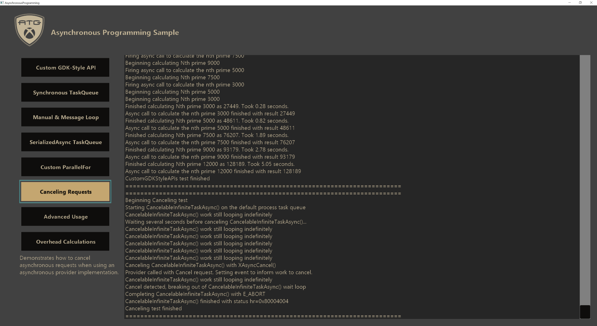

  

#   비동기 프로그래밍 샘플

이 샘플은 Microsoft 게임 개발 키트와 호환 가능(2020년 6월*)*

# 

# 설명

이 샘플에서는 **XAsync**, **XTaskQueue** 및 **XAsyncProvider**를
사용하여 다양한 방식으로 비동기 프로그래밍을 구현하고 작업을 처리하는지
방법을 보여줍니다. XAsync는 GDK 비동기 함수를 사용해야 하지만, 자체
라이브러리가 강력하고 Windows 10, Xbox One 및 Xbox Series X|S 간 완전한
이식이 가능합니다.

샘플 UI는 예제 테스트를 실행하고 출력을 표시하는 인터페이스를
제공합니다. 각 테스트에 대한 자세한 설명과 각 사례의 코드를 따르는
방법은 아래의 **구현 노트**를 참조하세요.

# 샘플 빌드

Xbox One 개발 키트를 사용하는 경우 활성 솔루션 플랫폼을
Gaming.Xbox.XboxOne.x64로 설정합니다.

Xbox Series X|S 개발 키트를 사용하는 경우 활성 솔루션 플랫폼을
Gaming.Xbox.Scarlett.x64로 설정합니다.

Windows 10을 사용하는 경우 활성 솔루션 플랫폼을 Gaming.Desktop.x64로
설정합니다.

*자세한 내용은 GDK 설명서의* 샘플 실행을 *참조하세요.*

# 샘플 사용

기본 화면의 버튼을 사용하여 **XAsync**/**XTaskQueue**/**XAsyncProvider**
라이브러리에서 여러 가지 용도에 따른 다양한 테스트 시나리오를 시작할 수
있습니다.

# 구현 노트

이 샘플에서는 **XAsync**, **XTaskQueue 및** **XAsyncProvider**의 다양한
기능을 커버하는 8가지 테스트 시나리오를 제공합니다.

*이러한 라이브러리에 대한 자세한 내용은 GDK 설명서를 참조하세요. 간단히
설명하자면, **XAsync**는 비동기 작업을 실행하고 관리하는 메서드를,
**XTaskQueue**는 비동기 작업의 실행 컨텍스트/동작을 관리하는 메서드를,
그리고 **XAsyncProvider**는 전체 비동기 작업 프로세스 배관에 대한 고급
관리를 제공합니다.*

하나의 테스트에서 Windows 메시지 루프에 통합하는 한 가지 경우를 제외하고
모든 사용 및 테스트는 **XAsyncExamples** 클래스에서 구현됩니다. 각
테스트는 "**StartTest\_\[TestName\]**"라는 함수에 있으므로, 구현을
살펴보기에 좋은 출발점입니다.

작업 큐는 **XAsyncExamples::CreateTaskQueues()**에서 생성되고 스레드는
**XAsyncExamples::CreateThreads()**;에서 생성됩니다. 작업 큐에 대한 종료
논리는 작업 큐의 포트 모드에 따라 다르므로 구현에 대한 세부 정보는
**XAsyncExamples::ShutdownTaskQueues()**를 참조하세요. 작업 큐에 수동
포트가 있는 경우 **XTaskQueueTerminate()**가 각 포트에 이벤트를
추가하므로 해당 포트는 반환될 때까지 계속 디스패치되어야 합니다.

**RunTask()**는 표준 **XAsyncBlock**의 생성 및 설정을 구현한 다음
**XAsyncRun()**으로 비동기 호출을 시작하는 일반적인 도우미 메서드입니다.
작업 큐, 작업 콜백 및 선택적인 완료 콜백의 사양만 요구하여 작업 실행을
크게 간소화합니다.

각 테스트에 대한 자세한 내용은 아래에서 설명합니다.

**사용자 지정 GDK 스타일 API 테스트**

이 테스트에서는 GDK 스타일API 함수로 비동기 메서드를 설정하는 방법을
보여 줍니다. 호출 및 결과 프로세스는 비동기 GDK API 메서드가 기능하는
방식과 동일합니다.

작업 큐:

-   m_taskQueue_CustomGDKStyleAPIs

    -   작업 포트: ThreadPool

    -   완료 포트: 수동

**NthPrimeAsync() 및** **NthPrimeAsyncResult()**는 GDK 비동기 스타일로
구현되는 두 가지 메서드입니다. 두 함수 모두 **XAsyncBlock**을 설정한
다음 비동기 작업 프로세스를 시작할 때 이를 전달해야 합니다. 비동기
공급자는 배관을 위해 **NthPrimeAsync()**로 구현되고 작업 결과는
**NthPrimeAsyncResult()**에서 반환됩니다.

테스트 함수는 **NthPrimeAsync()**에 대한 5개의 비동기 호출을 설정하고
완료 콜백에 결과를 보고합니다. 사용된 작업 큐에는 ThreadPool 작업 포트가
있으므로 이 5개의 요청은 시스템 스레드 풀에서 병렬로 실행됩니다. 수동
완료 포트의 경우 콜백은 **XAsyncExamples::Update()**의
**XTaskQueueDispatch()** 호출로 디스패치됩니다. 완료 포트의 콜백은 큐에
추가된 순서대로 실행됩니다.

**동기 TaskQueue 테스트**

이 테스트에서는 비동기 작업이 **XAsyncBlock** 구조체 내에서 지정된 작업
큐에만 기반하여 동기적으로 호출될 수 있는 방법을 보여줍니다. 또 프로세스
기본 작업 큐를 변경할 수 있는 방법을 보여줍니다.

작업 큐:

-   m_taskQueue_SynchronousTaskQueue

    -   작업 포트: Immediate

    -   완료 포트: Immediate

-   프로세스 기본 작업 큐

    -   작업 포트: ThreadPool

    -   완료 포트: ThreadPool

테스트 함수는 먼저 프로세스 기본 작업 큐를 작업 및 완료 두 포트 모두
Immediate로 설정한 사용자 지정 작업 큐로 재정의합니다. Immediate 포트를
사용하면 콜백이 추가된 이후 나중에 디스패치되는 대신 추가하려고 시도하는
즉시 실행됩니다. 또한 테스트에서는 지정된 작업 큐에 있는 콜백을 지정된
횟수만큼 시작한 다음 모든 작업이 완료될 때까지 기다리게 하는
**ParallelExecute()**라는 도우미 함수를 사용합니다.

전체 테스트는 먼저 시스템 기본 작업 큐에 캐시한 핸들을 사용하여
**RunTask()**를 통해 시스템 스레드 풀로 이동합니다. 이렇게 하면
애플리케이션을 중지하지 않고 백그라운드에서 테스트를 실행할 수 있습니다.
그런 다음 ThreadPool 포트를 사용하는 프로세스 기본 작업 큐 캐시 핸들을
통해 20개의 작업을 병렬로 실행합니다. 마지막으로 작업 큐를 Immediate로
포트를 설정한 테스트 큐로 전환하여 동일한 20개 작업을 예제와 동일한
방식으로 실행합니다. 출력에서 비동기 작업이 병렬 처리 덕분에 빠르게
완료되는 것이 보이겠지만 동기 버전은 각 작업을 한 번에 하나씩 실행해야
합니다.

**수동 및 메시지 루프 테스트**

이 테스트에서는 수동 작업 큐를 사용하는 방법과 수동 작업 큐를 Windows
메시지 루프와 통합하여 완료 콜백을 처리하는 방법을 보여 줍니다. 여러
스레드를 사용하여 수동 작업 포트를 병렬로 디스패치하고 작업 큐 모니터
콜백을 사용하여 Windows 메시지 루프에 알림을 보내 하나의 수동 완료
콜백을 처리합니다.

작업 큐:

-   m_taskQueue_ManualAndMessageLoop

    -   작업 포트: 수동

    -   완료 포트: 수동

**StartTest_ManualAndMessageLoop()** 내에서만이 아닌 코드에서 이
테스트에 대한 여러 관심 항목 위치가 있습니다. **WndProc()**,
**Notify_TaskQueueMonitor()**, **ThreadProc_ManualAndMessageLoop()**,
**Monitor_ManualAndMessageLoop()**, **CreateTaskQueues()**및
**ShutdownTaskQueues()**를 참조하세요.

이 테스트의 작업 큐가 **CreateTaskQueues()**에서 생성될 때 작업 큐에
대한 모니터도 생성된다는 점에 유의하세요. 이 모니터는 작업 큐의 포트에
새 콜백이 추가될 때마다 실행됩니다. 해당 모니터가 실행될 때마다 완료
포트에 대한 콜백을 감지하기만 하면 항상 *WM_TASKQUEUEMONITOR*와 함께
**PostMessage()**를 사용합니다. **WndProc()**는 *WM_TASKQUEUEMONITOR*
이벤트와 Windows 메시지 루프 컨텍스트 내의 완료 포트에서 하나의 콜백을
디스패치하는 **Notify_TaskQueueMonitor()**에 대한 호출을 확인하도록
설정됩니다.

마지막으로 테스트 함수는 작업 및 완료 콜백이 모두 지정된 테스트 작업
큐에서 20개의 비동기 요청을 시작하는 간단한 드라이버입니다.

**SerializedAsync TaskQueue 테스트**

이 테스트에서는 SerializedThreadPool 포트가 있는 작업 큐를 설정 및
사용하는 방법과 그러한 포트가 작동하는 방법을 보여 줍니다.

작업 큐:

-   m_taskQueue_SerializedAsync

    -   작업 포트: SerializedThreadPool

    -   완료 포트: SerializedThreadPool

SerializedThreadPool로 설정된 포트는 시스템 스레드 풀에서 콜백을 한 번에
하나씩만 자동으로 디스패치합니다. 콜백은 큐에 추가된 순서대로
디스패치됩니다. 이 동작은 수동 포트를 사용하여 하나의 스레드에서 한 번에
하나의 콜백을 디스패치하는 것과 동일합니다. 하지만 시스템 스레드
풀에서는 매번 동일한 스레드를 사용할 필요가 없습니다.

SerializedThreadPool 포트는 한 번에 하나의 콜백만 실행하므로 비동기
작업의 서로 다른 콜백 간의 종속성을 얻을 수 있습니다. 테스트 함수가 이
종속성을 활용하여 작업 큐에 5개의 다른 작업을 추가하면 각 작업은 이전
작업의 결과를 사용하여 다음 작업을 위해 데이터를 변경합니다.

**사용자 지정 ParallelFor 테스트**

이 테스트에서는 ParallelFor 함수를 구현할 수 있는 한 가지 방법을 보여
줍니다. 수동 작업 큐를 사용하여 작업을 수행하고, 접두사 합계를 계산하여
성능을 테스트합니다.

작업 큐:

-   m_taskQueue_ParallelFor

    -   작업 포트: 수동

    -   완료 포트: Immediate

최대의 병렬 성능을 얻기 위해 각 논리 프로세서에 스레드를 생성하고 각
스레드에 하나의 프로세서에 대한 선호도가 있도록 초기화합니다.
**ThreadProc_SingleCore()**는 **XTaskQueueDispatch()**를 동시에 호출하여
병렬화를 얻을 수 있으며 각 스레드는 다른 작업을 받습니다.

접두사 합계는 동기 및 비동기 동작을 테스트하는 두 가지 방법으로
계산됩니다. 가능한 한 최상의 비교가 되도록 동기 사례에는 긴밀한 루프를
구현하고 비동기 사례에는 다른 병렬 최적화 알고리즘을 사용합니다. 사례에
대한 타이밍은 로그에 보고합니다.

**요청 취소 테스트**

이 테스트에서는 비동기 작업을 취소하는 방법을 보여 줍니다. 비동기 작업에
대한 취소 동작은 공급자 내에서 수동으로 처리해야 하므로 모든 비동기
작업을 취소할 수 있는 것은 아닙니다. 그렇기 때문에
**XAsyncRun()**(**RunTask()**에서 사용)을 통해 실행하는 간단한 작업은
취소할 수 없습니다. 취소 가능한 작업을 보여주기 위해 취소 경로가 구현된
사용자 지정 비동기 공급자 함수(GDK 스타일 테스트와 유사)가 사용됩니다.

작업 큐:

-   기본 프로세스 작업 큐

    -   작업 포트: ThreadPool

    -   완료 포트: ThreadPool

사용자 지정 공급자를 사용하여 비동기 메서드를 구현하는 방법은
**CancelableInfiniteTaskAsync()**를 참조하세요. 이 비동기 메서드는
데이터를 반환하지 않지만 취소되지 않는 한 무한히 실행됩니다.
**XAsyncOp::Cancel** 사례는 무한 런타임에서 검색할 수 있는 이벤트를
설정하기 위해 구현됩니다. 해당 이벤트가 설정되면 공급자는 *E_ABORT*를
사용하여 **XAsyncComplete()**로 완료해야 한다는 것을 압니다.

테스트 사례 함수는 **CancelableInfiniteTaskAsync()**에 대한 호출을
시작하고 일정 시간 후에 **XAsyncCancel()**을 호출하는 또 다른 작업도
시작합니다. 출력 로그를 보면 동작 중인 테스트를 확인할 수 있습니다.

**고급 사용 테스트**

이 테스트에서는 복합 작업 큐, 복제된 작업 큐 핸들, 대기자 사용 및 이벤트
디스패치 연기 등 흔하지 않은 몇 가지 고급 기능을 보여 줍니다. 이
테스트에서는 모든 작업 큐와 기타 테스트 데이터를 테스트 함수 안에서 생성
및 제거하여 전체 프로세스를 보여줍니다.

테스트는 먼저 복합 큐 테스트를 통해 실행됩니다. 복합 큐는 포트가 다른
작업 큐들의 포트로 이루어진 작업 큐입니다. 먼저 작업 포트는
ThreadPool로, 완료 포트는 수동으로 설정하여 기본 작업 큐를 생성합니다.
그런 다음, 첫 번째 작업 큐의 작업 포트를 자체 포트로 활용하는 복합 작업
큐를 생성합니다. 이렇게 하면 작업 콜백과 완료 콜백 모두 원래 큐의 동일한
포트에서 실행됩니다.

다음으로 테스트는 큐 핸들을 복제하는 방법을 보여줍니다. 작업 큐 핸들은
정리를 완료하기 위해 복제될 때마다 닫혀야 합니다. 복제 핸들은 원래
핸들과 동일하게 기능하며 리소스에 대한 소유권만 증가시킵니다.

마지막으로, 대기자와 연기된 디스패치를 테스트합니다. 대기자는 여러 번
실행하기 위한 콜백을 제출하는 한 가지 방법이지만 제출은 특정 이벤트가
트리거될 때만 발생합니다. 이는 이벤트를 자동 실행시키는 데 유용합니다.
연기된 디스패치는 선택적 연기가 있는 작업 큐의 포트 중 하나로 직접
콜백을 제출하는 것입니다. 일반 비동기 제출에는 **XAsyncBlock**이
필요하지만
**XTaskQueueSubmitCallback**/**XTaskQueueSubmitDelayedCallback**은 작업
큐에 콜백을 직접 제출합니다. 이것들은 일반적으로 비동기 공급자가
내부적으로 사용합니다.

**오버헤드 계산 테스트**

이 테스트는 **XAsync**/**XTaskQueue**/**XAsyncProvider** 활용에서
발생하는 다양한 오버헤드의 타이밍을 계산합니다. 비동기 메서드 활용에서
발생하는 다양한 오버헤드를 이해하면 매우 유용할 수 있습니다.

오버헤드는 시나리오마다 여러 사례가 있는 세 가지 시나리오에서
계산됩니다. 각 타이밍에 대한 설명은 아래 차트를 참조하세요.

| 타이밍 이름                   |  설명                                 |
|-------------------------------|--------------------------------------|
| XA syncRun_InvokeToWork(프로세스 기본 작업 큐)  |  **XAsyncRun()** 호출 이후 프로세스 기본 작업 큐에서 작업 콜백을 시작하기까지 걸리는 시간을 계산합니다.                          |
| XAsyncRun_InvokeToWork(수동 작업 큐)  |  **XAsyncRun()** 호출 이후 작업 콜백이 이미 대기 중인 스레드가 있는 수동 큐를 사용하기 시작하기까지 걸리는 시간을 계산합니다.            |
| XAsync Run_WorkToCompletion(프로세스 기본 작업 큐)  |  **XAsyncRun()**에서 작업 콜백 일정을 종료한 이후 프로세스 기본 작업 큐를 사용하여 완료 콜백을 시작하기까지 걸리는 시간을 계산합니다.            |
| XA syncRun_WorkToCompletion(수동 작업 큐)  |  **XAsyncRun()**에서 작업 콜백 일정을 종료한 이후 이미 대기 중인 스레드가 있는 수동 큐를 사용하여 완료 콜백을 시작하기까지 걸리는 시간을 계산합니다.                          |
| ParallelFor_InvokeToWork  |  이 샘플에서 구현한 사용자 지정 **ParallelFor()** 메서드가 호출 이후 작업 콜백 중 하나를 시작하기까지 걸리는 시간을 계산합니다.            |
| ParallelFor_InvokeToReturn  |  이 샘플에서 구현한 사용자 지정 **ParallelFor()** 메서드가 실질적인 작업 없이 메서드의 전체 호출을 완료하는 데 걸리는 시간을 계산합니다.                          |
| GDKAsyncStyle_T imeInProviderAverage(프로세스 기본 작업 큐) |  프로세스 기본 작업 큐를 사용할 때 사용자 지정 공급자 메서드에서 소요되는 평균 시간을 계산합니다.     |
| GDKAsyncSty le_TimeInProviderAverage(수동 작업 큐)  |  이미 대기 중인 스레드가 있는 수동 큐를 사용할 때 사용자 지정 공급자 메서드에서 소요되는 평균 시간을 계산합니다.                          |
| GDKAsyncStyle_T imeInProviderOverall(프로세스 기본 작업 큐) |  프로세스 기본 작업 큐를 사용할 때 사용자 지정 공급자 메서드에서 소요되는 전체 시간을 계산합니다.     |
| GDKAsyncSty le_TimeInProviderOverall(수동 작업 큐)  |  이미 대기 중인 스레드가 있는 수동 큐를 사용할 때 사용자 지정 공급자 메서드에 소요되는 전체 시간을 계산합니다.                          |
| GDKAsy ncStyle_InvokeToWork(프로세스 기본 작업 큐)  |  시스템 기본 작업 큐와 함께 사용자 지정 공급자를 사용할 때 호출에서 작업 콜백 시작까지 걸리는 시간을 계산합니다.                          |
| GD KAsyncStyle_InvokeToWork(수동 작업 큐)  |  이미 대기 중인 스레드가 있는 수동 큐와 함께 사용자 지정 공급자를 사용할 때 호출에서 작업 콜백 시작까지 걸리는 시간을 계산합니다.   |
| GDKAsyncSt yle_WorkToCompletion(프로세스 기본 작업 큐) |  프로세스 기본 작업 큐를 사용할 때 사용자 지정 공급자 메서드의 작업부터 완료 콜백까지의 시간을 계산합니다.   |
| GDKAsy ncStyle_WorkToCompletion(수동 작업 큐)  |  이미 대기 중인 스레드가 있는 수동 작업 큐를 사용할 때 사용자 지정 공급자 메서드의 작업부터 완료 콜백까지의 시간을 계산합니다.        |

타이밍은 실행될 때마다 다시 계산되며 로그에 출력됩니다.

# SMT 및 시간에 민감한 스레드에 대한 노트

**SMT(동시 멀티스레딩)**

Xbox Series X|S 장치는 SMT를 지원하여 논리 코어 수를 두 배로 늘릴 수
있게 합니다. 하지만 SMT가 활성화되면 전력 소모가 증가하여 코어의
주파수가 떨어집니다. 이는 타이틀에 빠른 7개의 코어를 선택하거나 몇 가지
공유 고려 사항과 함께 약간 느린 14개의 코어를 선택할 수 있음을
의미합니다.

자세한 내용은 "*Xbox One vs. Project Scarlett CPU & Memory"* 섹션의
설명서에서 확인할 수 있습니다.

이 샘플에서 SMT를 활성화하려면 MicrosoftGame.config 파일을 열고
\<VirtualMachine\> 섹션의 주석 처리를 제거합니다.

CPU 동작의 차이를 강조하기 위해 SMT를 켜거나 끄는 서로 다른 테스트를
시행할 때의 몇 가지 시간 계산은 다음과 같습니다.

|  |  ParallelFor PrefixSum 비동기 시간 |  5000^th^ 소수 계산 동기화/병렬 |
|------|-------------------------|-------------------------------------|
| SMT 켜짐 |  100ms\~125ms까지의 범위  |  일관된 0.47s 동기화, 3.88\~9.20s 병렬, 총 \~9.3s                     |
| SMT 꺼짐 |  140ms\~175ms까지의 범위  |  일관된 0.44s 동기화, 0.44\~1.14s 병렬, 총 \~4.5s                     |

유의 사항:

-   SMT를 켜면 병렬 알고리즘이 더 원활하게 수행되지만 모든 코어를 강력한
    계산으로 채우는 것만으로 성능이 저하될 수 있습니다.

-   SMT를 끄면 코어가 적은 병렬 알고리즘이 큰 이점을 얻지 못하지만 단일
    스레드 형식의 작업이은 더 빠르고 코어는 강력한 작업의 최대 활용으로
    인한 성능 저하의 영향을 덜 받습니다.

궁극적으로 SMT가 타이틀에 적합한지 여부는 개발자가 결정합니다.

**시간에 민감한 스레드**

모든 GDK API 함수가 차단 없이 빠르게 실행되어야 하는 스레드를 안전하게
호출할 수 있는 것은 아닙니다. 이러한 스레드를 \"시간에 민감한\"
스레드라고 합니다. GDK API 함수가 이러한 스레드를 차단하지 않게 하기
위해 시간에 민감한 스레드를 표시할 수 있도록 시간에 민감한 API가
추가되었습니다. 표시된 이후에는, 느릴 수도 있는 GDK API 함수를 호출하면
어설션이 트리거되어 개발자가 알 수 있게 합니다. 이러한 어설션은 실행을
다시 시작함으로써 지나쳐서 진행될 수 있습니다.

자세한 내용은 *"*시간에 민감한 스레드" 섹션의 설명서에서 확인할 수
있습니다.

이 샘플에서 테스트하려면 **Sample::Initialize()**의
**XThreadSetTimeSensitive()**에 대한 호출의 주석 처리를 제거합니다.
이렇게 하면 이 스레드에 대해 시간에 민감한 검사가 활성화됩니다. 활성화한
후 어설션은 아래에 설명된 두 가지 다른 테스트에서 실행됩니다.

-   동기 작업 큐 테스트

    -   **XTaskQueueSetCurrentProcessTaskQueue()**

        -   이 함수는 프로세스의 기본 작업 큐를 변경하는 방법을 보여
            주는 데 사용합니다. 일반적으로 이 작업은 잠재적인 속도
            저하를 방지하기 위해 로드 중에 수행하지만 이 테스트에서는
            기능을 소개하기 위해 수행합니다.

-   고급 사용 테스트

    -   **XTaskQueueCreate()**

        -   샘플에서 대부분의 작업 큐는 시간에 민감한 스레드를 표시하기
            전에 초기화의 초기 단계에 생성됩니다. 이 테스트에서는 작업
            큐를 직접 생성합니다. 이 함수는 생성하는 데 짧은 시간이 걸릴
            수 있으므로 시간 민감성 안전이 없습니다.

    -   **XTaskQueueGetPort()**

        -   작업 큐의 포트를 가져오는 것은 빠른 작업이 아니며 실제로
            **XTaskQueueCreate()**를 호출할 때와 같이 초기화의
            일부로서만 수행되는 것으로 간주합니다.

    -   **XTaskQueueCreateComposite()**

        -   이는 모든 동일한 고려 사항과 함께 **XTaskQueueCreate()**를
            호출하는 것과 같습니다. 유일한 차이점은 새 작업 큐에서
            사용하는 포트입니다.

    -   **XTaskQueueRegisterWaiter()**

        -   대기자 등록 또한 느린 작업이며 속도 저하 또는 적중을
            방지하기 위해 로드 시간을 예약하거나 시간에 민감한 스레드를
            해제해야 합니다.

시간에 민감한 어설션을 트리거하는 위의 함수는 일반적으로 작업 큐가
장시간 유지되므로 로드 시 호출을 예약해야 합니다. 이 작업을 수행할 때
시퀀스를 로드하는 동안 **XThreadSetTimeSensitive(false)**에 대한 다른
호출을 통해 스레드의 시간에 민감한 상태를 일시적으로 제거할 수 있습니다.
게임 플레이 또는 기타 활성 시간 동안 이 작업을 수행해야 하는 경우
애플리케이션 성능에 눈에 띄는 영향을 주지 않도록 시간에 민감하지 않은
스레드로 호출을 이동할 수 있습니다.

# 업데이트 기록

**초기 릴리스:** Microsoft GDK(게임 개발 키트)(2020년 5월)

2020년 6월: 테스트가 완료되지 않게 하는 람다 캡처 버그를 수정했습니다.
렌더링 크기 및 손실된 장치가 알려진 문제를 해결하고 섹션을
제거하였습니다. 추가 정보에 SMT 및 시간에 민감한 스레드 정보를 추가하고
샘플에 시간에 민감한 스레드 호출을 추가했습니다.

# 개인정보처리방침

샘플을 컴파일하고 실행하는 경우 샘플 사용량을 추적할 수 있도록 샘플 실행
파일의 파일 이름이 Microsoft에 전송됩니다. 이 데이터 수집을
옵트아웃하려면 \"샘플 사용량 원격 분석\"으로 레이블이 지정된
Main.cpp에서 코드 블록을 제거할 수 있습니다.

Microsoft의 개인정보 정책에 대한 자세한 내용은 [Microsoft
개인정보처리방침](https://privacy.microsoft.com/en-us/privacystatement/)을
참조하세요.
