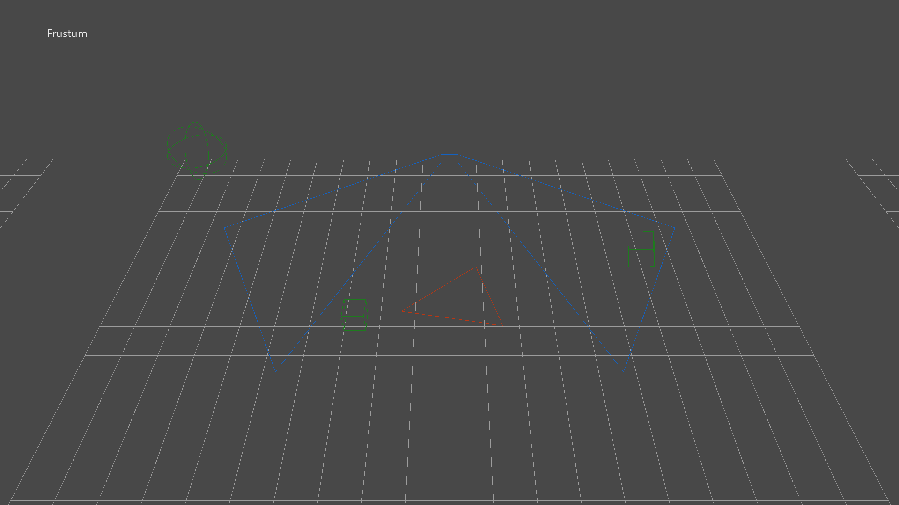

  

#   Collision Sample

*This sample is compatible with the Microsoft Game Development Kit (June
2020)*

# 

# Description

This sample demonstrates DirectXMath's collision types for simple
bounding volume tests in an Xbox One app.

# Building the sample

If using an Xbox One devkit, set the active solution platform to `Gaming.Xbox.XboxOne.x64`.

If using an Xbox Series X|S devkit, set the active solution platform to `Gaming.Xbox.Scarlett.x64`.

If using Windows 10, set the active solution platform to `Gaming.Desktop.x64`.

*For more information, see* __Running samples__, *in the GDK documentation.*

# Using the sample

The sample shows four different 'collision' groups:

1.  A static bounding **frustum** colliding with an animated sphere,
    axis-aligned box, oriented box, and a triangle.

2.  A static **axis-aligned box** colliding with an animated sphere,
    axis-aligned box, oriented box, and a triangle.

3.  A static **oriented box** colliding with an animated sphere,
    axis-aligned box, oriented box, and a triangle.

4.  An animated **ray** colliding with a static sphere, axis-aligned
    box, oriented box, and a triangle. If there is a ray hit, a marker
    box is placed at the intersection point on the target object.

| Action                       |  Gamepad                               |
|------------------------------|---------------------------------------|
| Orbit camera X/Y around group |  Right Thumbstick |
| Reset view                   |  Right Thumstick Button                |
| Focus on Frustum group       |  DPad Up                               |
| Focus on Axis-aligned box group |  DPad Right |
| Focus on Oriented box group  |  DPad Down                             |
| Focus on Ray test group      |  DPad Left                             |
| Toggle help                  |  Menu Button                           |
| Exit                         |  View Button                           |

# Implementation notes

For more on DirectXMath's bounding volume types, see [Microsoft
Docs](https://docs.microsoft.com/windows/desktop/dxmath/directxmath-portal)
for:

-   **BoundingBox** class

-   **BoundingFrustum** class

-   **BoundingOrientedBox** class

-   **BoundingSphere** class

-   **TriangleTests** namespace

The latest version of DirectXMath is available on
[GitHub](https://github.com/Microsoft/DirectXMath).

# Known issues

DirectXMath's **BoundingFrustum** class only works with left-handed
viewing systems.

# Update history

Initial release of the Xbox One XDK version of this sample made in May
2016. The most recent legacy DirectX SDK version of this sample can be
found on
[GitHub](https://github.com/walbourn/directx-sdk-samples/tree/master/Collision).

June 2020 -- Updated with Gaming.Desktop.x64

# Privacy statement

When compiling and running a sample, the file name of the sample
executable will be sent to Microsoft to help track sample usage. To
opt-out of this data collection, you can remove the block of code in
Main.cpp labeled "Sample Usage Telemetry".

For more information about Microsoft's privacy policies in general, see
the [Microsoft Privacy
Statement](https://privacy.microsoft.com/en-us/privacystatement/).
