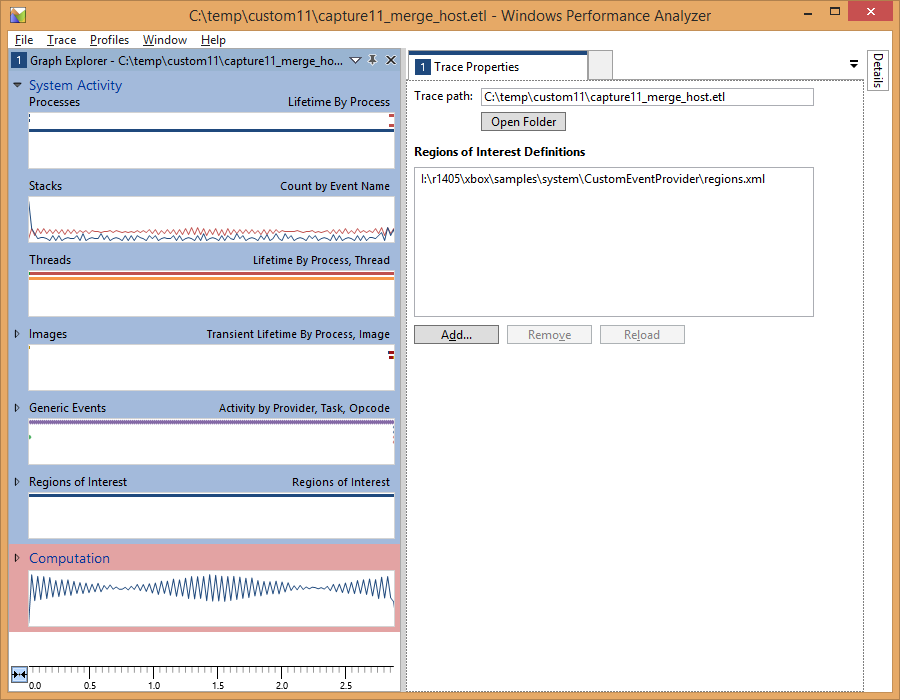
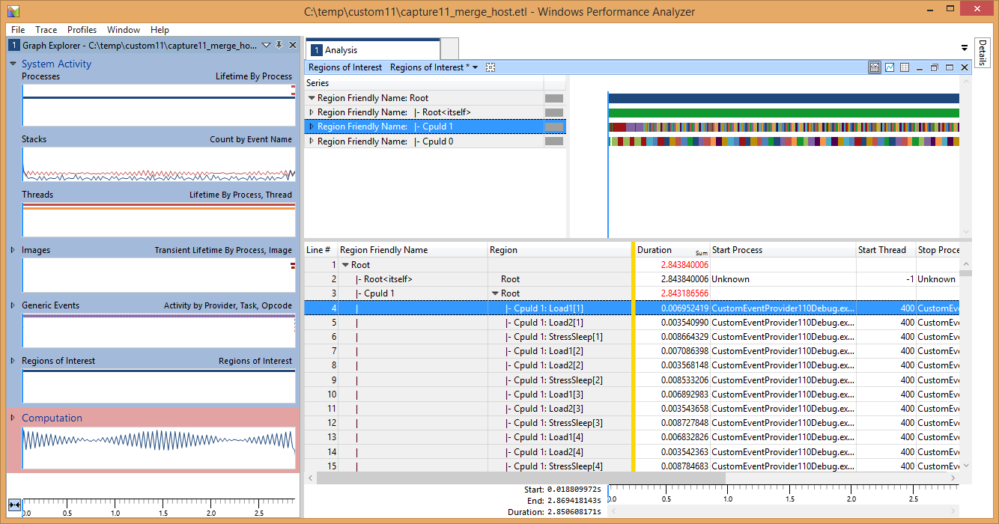

  

#   Custom Event Provider Sample

*This sample is compatible with the Microsoft Game Development Kit (June
2020)*

# Description This sample demonstrates how to use custom ETW event providers on Xbox One.  Building the sample

If using an Xbox One devkit, set the active solution platform to `Gaming.Xbox.XboxOne.x64`.

If using an Xbox Series X|S devkit, set the active solution platform to `Gaming.Xbox.Scarlett.x64`.

*For more information, see* __Running samples__, *in the GDK documentation.*

# Using the sample

The sample uses the following controls:

| Action                       |  Gamepad                               |
|------------------------------|---------------------------------------|
| Exit the sample.             |  View Button                           |

Implementation notes\
This sample follows the same structure as a conventional Windows ETW
provider, however since a title running in the Exclusive partition
cannot add its event providers to the registry some additional steps are
required on the host PC to resolve generated event data correctly.

To generate events, you first need to create an event manifest file (in
this sample, this can be found in **etwprovider.man**).

The event manifest file can be created by hand -- it's XML based -- or
it can be built using **ecmangen.exe,** a GUI-based tool that ships as
part of the Windows SDK. The Manifest Generator tool can usually be
found in the following location: c:\\Program Files (x86)\\Windows
Kits\\10\\bin\\{sdk version}\\x64\\ecmangen.exe

Once you have an event manifest, it is compiled into a resource file
(**etwproviderGenerated.rc**) and header (**etwproviderGenerated.h**)
using the Visual Studio message compiler (mc.exe). Both resource file
and header are included in the title project.

To generate the header, resource, and binary files, mc.exe is called
with the following parameters:

mc.exe -um *inputmanifestfile.man*

The.BIN files generated by this step are automatically brought in by the
generated .RC file, and compiled into your executable or DLL.

During title initialization, the event provider is registered via a call
to **EventRegisterCEP_Main**, and then subsequently unregistered via a
call to **EventUnregisterCEP_Main** during shutdown processing. "Mark"
events are emitted via calls to **EventWriteMark** which takes a single
Unicode string as a parameter.

The sample can be built, deployed and activated as for any other sample.
Once it is running, use xperf to capture events (tracelog lacks the
ability to merge ETL provider events, and xbperf lacks the capability to
specify custom event providers). Since the title's event provider hasn't
been added to the registry it has to be identified via GUID, not by name
(note that the GUID must match the provider GUID specified in the event
manifest):

C:\\temp\>xbrun /x/title /O xperf -start -on
PROC_THREAD+LOADER+DPC+INTERRUPT+CSWITCH+PROFILE -stackwalk
PROFILE+CSWITCH -f d:\\kernel.etl

C:\\temp\> xbrun /x/title /O xperf -start \"user\" -on
A4A76336-4BA7-4CD9-85C3-B9C236D3041C -f d:\\user.etl

Once the required data has been captured, the session can be stopped in
the usual way. Also merge the ETL file on the devkit to resolve the
system event providers. This will *not* resolve our custom event
provider:

C:\\temp\> xbrun /x/title /O xperf -stop -stop \"user\" -d
d:\\merged.etl

Now the merged file can be copied back to the host PC:

C:\\temp\\\> xbcp xd:\\merged.etl .

This file can be loaded into WPA, and the custom events will appear in
the "Generic Events" graph within the "System Activity" group. However
at this point the events will only be identified by GUID, and
information like the Task Name and Opcode Name will not be visible. More
importantly, the custom data we provided for each event (the Unicode
string) will not be displayed either.

In order to display the full information for each custom event, we make
use of a trick -- *we register the event provider on the host PC, rather
than the devkit, and resolve the events there.*

First, edit the provider node of the event manifest (evtprovider.man)
and make sure that the **resourceFileName** and **messageFileName**
attributes point at the location on your development PC where the Xbox
One executable is built:

\<provider name=\"CEP-Main\" guid=\"{A4A76336-4BA7-4CD9-85C3-B9C236D3041C}\" \
symbol=\"CEP_MAIN\" \
resourceFileName=\"S:\\samples\\gx_dev\\Samples\\System\\CustomEventProvider\\Gaming.Xbox.x64\\Debug\\CustomEventProvider.exe\" \
messageFileName=\"S:\\samples\\gx_dev\\Samples\\System\\CustomEventProvider\\Gaming.Xbox.x64\\Debug\\CustomEventProvider.exe\"\>

Next, register the event provider on your host PC by running the
wevtutil.exe tool from an elevated command prompt:

D:\\dev\\CustomEventProvider\>wevtutil im etwprovider.man

If you check in the registry on your host PC, you should see the
provider listed under
HKLM\\SOFTWARE\\Microsoft\\Windows\\CurrentVersion\\WINEVT\\Publishers

Finally, resolve the ETL file on your host PC using xperf:

C:\\temp\\custom03\>xperf -merge merged.etl final.etl

If the host merged ETL file (**final.etl**) is loaded into WPA you
should now see the events correctly resolved:

Note how the Description (Field 1) column now contains the strings that
were logged with the events. We can also see the Task and Opcode names.

When you have finished your performance analysis session, you can remove
the provider from your host PC:

D:\\dev\\CustomEventProvider\>wevtutil um etwprovider.man

The BlockCulled event is similar to the Mark event, save in the respect
that it has a single UInt32 payload rather than a string payload.
Unfortunately, at present it is not possible to graph a numeric field of
a custom event within WPA.

**Regions of Interest**

Since October 2013, WPA has supported the concept of [Regions of
Interest](http://msdn.microsoft.com/en-us/library/windows/hardware/dn450838.aspx):
the capability to denote and label temporal ranges within a capture. The
**EtwScopedEvent** class and **ETWScopedEvent()** macro demonstrate how,
with the appropriate payload, Regions of Interest (ROI) can be used to
provide bracketing functionality analogous to **PIXBeginEvent()** and
**PIXEndEvent()**.

To show ROI you will first need to load the region definition file. From
the Trace menu choose Trace Properties and then load the regions.xml
definition that ships with the sample.

You should now see the Regions of Interest graph available under the
Generic Events graph. Drag the ROI graph over to the analysis area to
expand it; the default view preset (on the toolbar) should be "Regions
of Interest". Add the Region column to the table (so that each region
gets a unique color), and expand the Root node; you should see a display
similar to this:

Expanding the Region nodes of the table will give you information on the
individual brackets:

As you can see, the labels that were provided in the calls to
**ETWScopedEvent()** are visible here (the number is the instance of a
particular label).

Expanding the graph will show each region's timeline separately:

Better still, you can now correlate regions with data from a sampling
capture, if you had this enabled:

# Known Issues

Since we resolve the event provider GUID on the host PC, it is essential
that no ETW providers with that ID have already been registered. If you
create a new event manifest from the one in the sample, regenerate the
GUIDs using **ecmangen** when the manifest is being edited, or use
guidgen.exe (provided with Visual Studio) to generate new GUIDs.

When the ETL file is resolved on the host PC you may see some additional
event providers appear in the Generic Events view; these can be ignored.

# 

# Other Resources

## Creating an Event Manifest

-   [Using Windows Event
    Log](https://docs.microsoft.com/en-us/windows/desktop/WES/using-windows-event-log)

-   [Writing an Instrumentation
    Manifest](https://docs.microsoft.com/en-us/windows/desktop/WES/writing-an-instrumentation-manifest)

-   [Compiling an Instrumentation
    Manifest](https://docs.microsoft.com/en-us/windows/desktop/WES/compiling-an-instrumentation-manifest)

-   [Message Compiler
    (mc.exe)](https://docs.microsoft.com/en-us/windows/desktop/WES/message-compiler--mc-exe-)

## Windows Performance Analyzer

-   [Windows Performance
    Analyzer](https://docs.microsoft.com/en-us/windows-hardware/test/wpt/windows-performance-analyzer)

-   [Regions of
    Interest](https://docs.microsoft.com/en-us/windows-hardware/test/wpt/regions-of-interest)

-   [Creating a Regions of Interest
    file](https://docs.microsoft.com/en-us/windows-hardware/test/wpt/creating-a-regions-of-interest-file)

# Privacy statement

When compiling and running a sample, the file name of the sample
executable will be sent to Microsoft to help track sample usage. To
opt-out of this data collection, you can remove the block of code in
Main.cpp labeled "Sample Usage Telemetry".

For more information about Microsoft's privacy policies in general, see
the [Microsoft Privacy
Statement](https://privacy.microsoft.com/en-us/privacystatement/).
