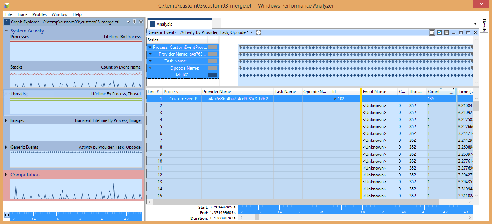
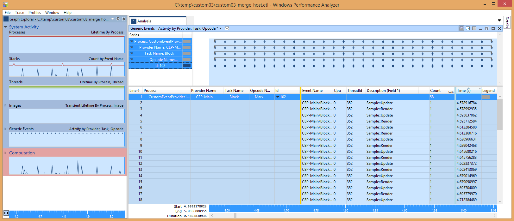
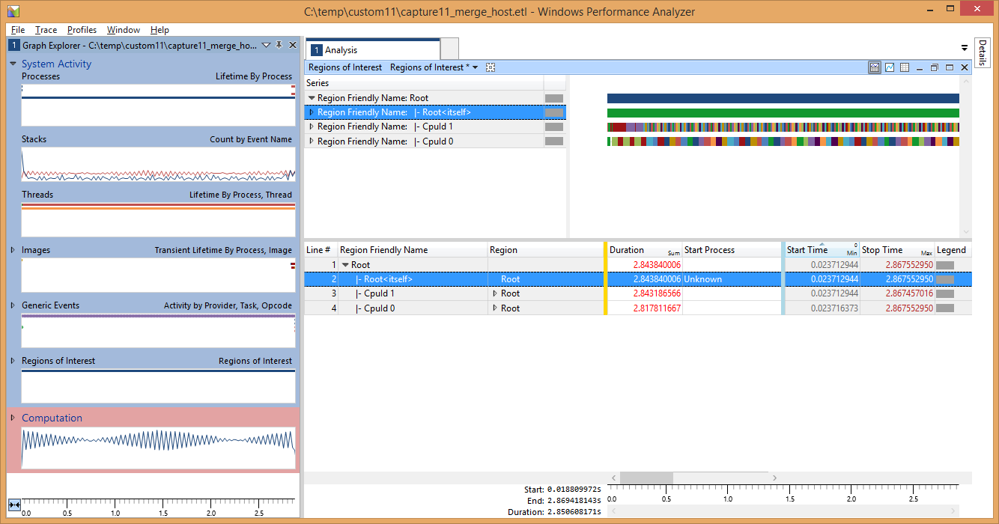

  

#   사용자 지정 이벤트 공급자 샘플

*이 샘플은 Microsoft 게임 개발 키트 미리 보기(2019년 11월)와
호환됩니다.*

# 

# 설명 이 샘플에서는 Xbox One에서 사용자 지정 ETW 이벤트 공급자를 사용하는 방법을 보여 줍니다.  샘플 빌드

Project Scarlett을 사용하는 경우에는 프로젝트에 Gaming.Xbox.Scarlett.x64
플랫폼 구성을 추가해야 합니다. *Configuration Manager*를 통해 이 작업을
수행할 수 있습니다. \"활성 솔루션 플랫폼\"에서 \"Configuration Manager\"
옵션을 선택하고 \"새로 만들기\...\"를 선택합니다. \"새 플랫폼 입력 또는
선택\"을 Gaming.Xbox.Scarlett.x64로 설정하고 \"다음에서 설정 복사\"를
Gaming.Xbox.XboxOne.x64로 설정합니다. 그런 다음, 확인을 선택합니다.

*자세한 내용은 GDK 문서에서* 샘플 실행하기*를 참조하세요.*

# 샘플 사용

이 샘플은 다음 컨트롤을 사용합니다.

| 작업                         |  게임패드                              |
|------------------------------|---------------------------------------|
| 샘플을 종료합니다.  |  왼쪽 트리거 + 오른쪽 트리거 + 오른쪽 숄더                                  |

구현 참고 사항\
이 샘플은 기존 Windows ETW 공급자와 같은 구조를 따릅니다. 그러나 단독
파티션에서 실행되는 타이틀은 해당 이벤트 공급자를 레지스트리에 추가할 수
없기 때문에 호스트 PC에서 생성된 이벤트 데이터를 올바르게 확인하기 위한
추가 단계가 필요합니다.

이벤트를 생성하려면 먼저 이벤트 매니페스트 파일을 만들어야 합니다. 이
예제에서는 이 파일을 **etwprovider.man**에서 찾을 수 있습니다.

이벤트 매니페스트 파일은 XML 기반이므로 직접 만들 수 있으며, Windows
SDK의 일부로 제공되는 GUI 기반 도구인 **ecmangen.exe**를 사용하여 작성할
수도 있습니다. 매니페스트 생성기 도구는 보통 c:\\Program Files
(x86)\\Windows Kits\\10\\bin\\{sdk version}\\x64\\ecmangen.exe에서 찾을
수 있습니다.

이벤트 매니페스트를 만든 후에는 Visual Studio 메시지 컴파일러(mc.exe)를
사용하여 리소스 파일(**etwproviderGenerated.rc**) 및
헤더(**etwproviderGenerated.h**)로 컴파일됩니다. 타이틀 프로젝트에는
리소스 파일과 헤더가 모두 포함됩니다.

헤더, 리소스 및 이진 파일을 생성하기 위해 다음 매개 변수를 사용하여
mc.exe가 호출됩니다.

mc.exe -um *inputmanifestfile.man*

이 단계에서 생성되는 .BIN 파일을 생성된 .RC 파일이 가져온 후, 실행
파일이나 DLL로 컴파일합니다.

타이틀 초기화 중에 이벤트 공급자는 **EventRegisterCEP_Main** 호출을 통해
등록된 후 종료 프로세스 동안 **EventUnregisterCEP_Main** 호출을 통해
등록 취소됩니다. \"Mark\" 이벤트는 단일 유니코드 문자열을 매개 변수로
사용하는 **EventWriteMark** 호출을 통해 내보냅니다.

이 샘플은 다른 모든 샘플의 경우처럼 빌드, 배포 및 활성화될 수 있습니다.
일단 실행되고 나면, xperf를 사용하여 이벤트를 캡처합니다(tracelog에는
ETL 공급자 이벤트를 병합할 수 있는 기능이 없고, xbperf에는 사용자 지정
이벤트 공급자를 지정할 수 있는 기능이 없음). 타이틀의 이벤트 공급자가
레지스트리에 추가되지 않았기 때문에 이름이 아니니 GUID를 통해 식별해야
합니다. GUID는 이벤트 매니페스트에 지정된 공급자 GUID와 일치해야 합니다.

C:\\temp\>xbrun /x/title /O xperf -start -on
PROC_THREAD+LOADER+DPC+INTERRUPT+CSWITCH+PROFILE -stackwalk
PROFILE+CSWITCH -f d:\\kernel.etl

필수 데이터를 캡처한 후에는 일반적인 방법으로 세션을 중지할 수 있습니다.

C:\\temp\> xbrun /x/title /O xperf -start \"user\" -on
A4A76336-4BA7-4CD9-85C3-B9C236D3041C -f d:\\user.etl

devkit에서 ETL 파일을 병합하여 시스템 이벤트 공급자를 확인합니다. 이렇게
해도 사용자 지정 이벤트 공급자는 확인되지 *않습니다.*

C:\\temp\> xbrun /x/title /O xperf -stop -stop \"user\" -d
d:\\merged.etl

이제 다음 명령을 사용하여 병합된 파일을 호스트 PC로 다시 복사할 수
있습니다.

C:\\temp\\\> xbcp xd:\\merged.etl .

이 파일을 WPA로 로드할 수 있으며, 사용자 지정 이벤트는 \"시스템 활동\"
그룹 내의 \"일반 이벤트\" 그래프에 나타납니다. 그러나 이때는 이벤트를
GUID로만 식별할 수 있으며 작업 이름 및 Opcode 이름과 같은 정보는 볼 수
없습니다. 보다 중요한 사실은 각 이벤트에 제공된 사용자 지정
데이터(유니코드 문자열)가 표시되지 않는다는 것입니다.

각 사용자 지정 이벤트에 대한 전체 정보를 표시하기 위해 *devkit가 아니라
호스트 PC에 이벤트 공급자를 등록하고 여기에서 이벤트를 확인하는 방법을
사용합니다.*

먼저 이벤트 매니페스트의 공급자 노드(evtprovider.man)를 편집하고
**resourceFileName** 및 **messageFileName** 특성이 개발 PC에서 Xbox One
실행 파일이 빌드되는 위치를 가리키도록 해야 합니다.

\<provider name=\"CEP-Main\" guid=\"{A4A76336-4BA7-4CD9-85C3-B9C236D3041C}\" \
symbol=\"CEP_MAIN\" \
resourceFileName=\"S:\\samples\\gx_dev\\Samples\\System\\CustomEventProvider\\Gaming.Xbox.x64\\Debug\\CustomEventProvider.exe\" \
messageFileName=\"S:\\samples\\gx_dev\\Samples\\System\\CustomEventProvider\\Gaming.Xbox.x64\\Debug\\CustomEventProvider.exe\"\>

다음으로, 관리자 권한 명령 프롬프트에서 wevtutil.exe 도구를 실행하여
호스트 PC에 이벤트 공급자를 등록합니다.

D:\\dev\\CustomEventProvider\>wevtutil im etwprovider.man

호스트 PC에서 레지스트리를 체크 인하면
HKLM\\SOFTWARE\\Microsoft\\Windows\\CurrentVersion\\WINEVT\\Publishers
아래에 공급자가 표시됩니다.

마지막으로 xperf를 사용하여 호스트 PC에서 ETL 파일을 확인합니다.

C:\\temp\\custom03\>xperf -merge merged.etl final.etl

호스트 병합 ETL 파일(**final.etl**)이 WPA로 로드되면 다음과 같이
이벤트가 올바르게 확인되었다고 표시됩니다.

이제 설명(필드 1) 열에 이벤트와 함께 기록된 문자열이 포함되는 방식을
확인합니다. 작업 및 Opcode 이름을 볼 수도 있습니다.

성능 분석 세션을 완료하면 호스트 PC에서 공급자를 제거할 수 있습니다.

D:\\dev\\CustomEventProvider\>wevtutil um etwprovider.man

BlockCulled 이벤트는 문자열 페이로드가 아니라 단일 UInt32 페이로드가
있다는 점에서 Mark 이벤트와 유사합니다. 안타깝게도 현재는 WPA에서 사용자
지정 이벤트의 숫자 필드를 그래프로 표시할 수 없습니다.

**관심 영역**

2013년 10월 이후로 WPA에서는 [관심
영역](http://msdn.microsoft.com/en-us/library/windows/hardware/dn450838.aspx)
개념을 지원하고 있습니다. 이 기능은 캡처 내에서 임시 범위를 나타내고
레이블을 지정하는 기능입니다. **EtwScopedEvent** 클래스 및
**ETWScopedEvent ()** 매크로는 해당 페이로드에서 ROI(관심 영역)를
사용하여 **PIXBeginEvent()** 및 **PIXEndEvent()**와 유사한 대괄호 지정
기능을 제공하는 방법을 보여 줍니다.

ROI를 표시하려면 먼저 영역 정의 파일을 로드해야 합니다. 추적 메뉴에서
추적 속성을 선택한 다음, 샘플과 함께 제공되는 regions.xml 정의를
로드합니다.

이제 일반 이벤트 그래프 아래에서 관심 영역 그래프를 볼 수 있습니다. ROI
그래프를 분석 영역으로 끌어 확장합니다. 도구 모음에서 미리 설정된 기본
보기는 \"관심 영역\"입니다. 각 영역이 고유한 색으로 표시되도록 표에 영역
열을 추가하고, 루트 노드를 확장합니다. 그러면 다음과 같이 표시됩니다.

표의 영역 노드를 확장하면 별도의 대괄호로 묶인 정보가 제공됩니다.

여기에서 볼 수 있듯이 **ETWScopedEvent()** 호출에 제공된 레이블은 여기에
표시됩니다(숫자는 특정 레이블의 인스턴스임).

그래프를 확장하면 각 영역의 시간 표시 막대가 별도로 표시됩니다.

더 좋은 점은 이제 이 기능을 사용하도록 설정하면 샘플링 캡처에서 영역을
데이터와 상호 연관 지을 수 있다는 것입니다.

# 알려진 문제

호스트 PC에서 이벤트 공급자 GUID를 확인하기 때문에 해당 ID를 사용하는
ETW 공급자가 아직 등록되어 있지 않아야 합니다. 샘플에 있는 것으로 새
이벤트 매니페스트를 만드는 경우 매니페스트를 편집할 때 **ecmangen**을
사용하여 GUID를 다시 생성하거나 guidgen.exe(Visual Studio에 제공)를
사용하여 새 GUID를 생성합니다.

호스트 PC에서 ETL 파일이 확인되면 일반 이벤트 보기에서 일부 추가 이벤트
공급자가 표시될 수 있습니다. 이러한 공급자는 무시해도 됩니다.

# 

# 기타 리소스

## 이벤트 매니페스트 만들기

-   [Windows 이벤트 로그
    사용](https://docs.microsoft.com/en-us/windows/desktop/WES/using-windows-event-log)

-   [계측 매니페스트
    쓰기](https://docs.microsoft.com/en-us/windows/desktop/WES/writing-an-instrumentation-manifest)

-   [계측 매니페스트
    컴파일](https://docs.microsoft.com/en-us/windows/desktop/WES/compiling-an-instrumentation-manifest)

-   [메시지
    컴파일러(mc.exe)](https://docs.microsoft.com/en-us/windows/desktop/WES/message-compiler--mc-exe-)

## Windows 성능 분석기

-   [Windows 성능
    분석기](https://docs.microsoft.com/en-us/windows-hardware/test/wpt/windows-performance-analyzer)

-   [관심
    영역](https://docs.microsoft.com/en-us/windows-hardware/test/wpt/regions-of-interest)

-   [관심 영역 파일
    만들기](https://docs.microsoft.com/en-us/windows-hardware/test/wpt/creating-a-regions-of-interest-file)

# 개인정보처리방침

샘플을 컴파일하고 실행할 때 샘플 사용을 추적하는 데 도움이 되도록 샘플
실행 파일의 파일 이름이 Microsoft에 전송됩니다. 이 데이터 수집을
옵트아웃하려면 Main.cpp에서 \"샘플 사용 원격 분석\"이라고 레이블이
지정된 코드 블록을 제거할 수 있습니다.

Microsoft의 일반 개인정보취급방침에 대한 자세한 내용은 [Microsoft
개인정보처리방침](https://privacy.microsoft.com/en-us/privacystatement/)을
참조하세요.
