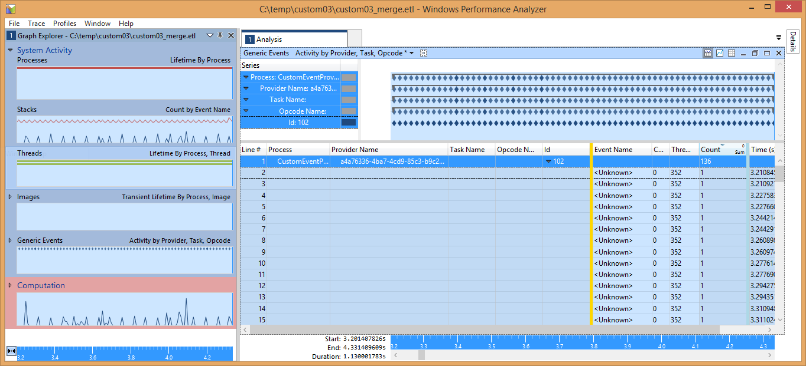
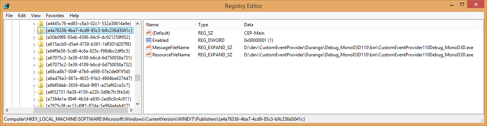
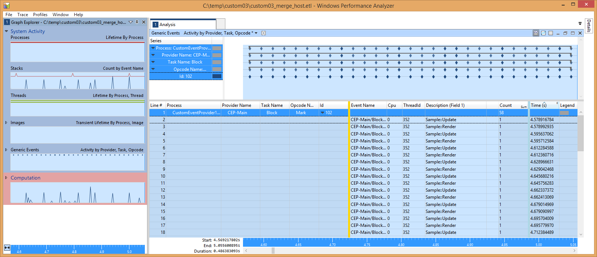
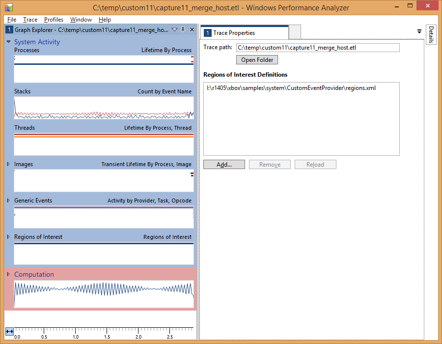
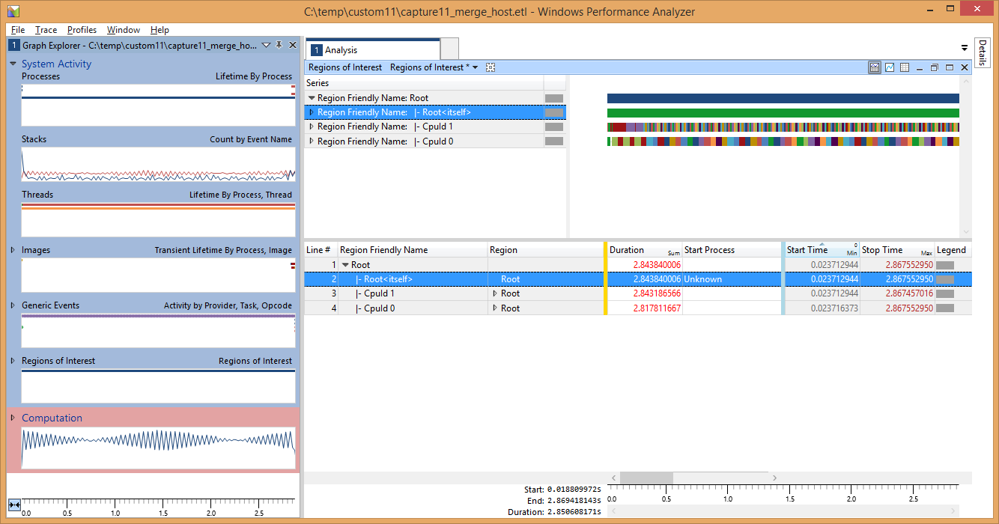
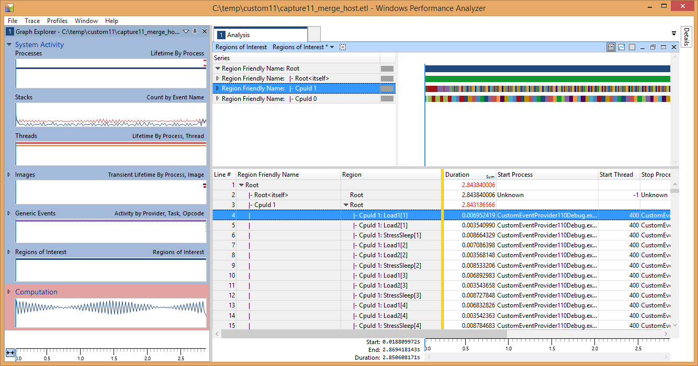
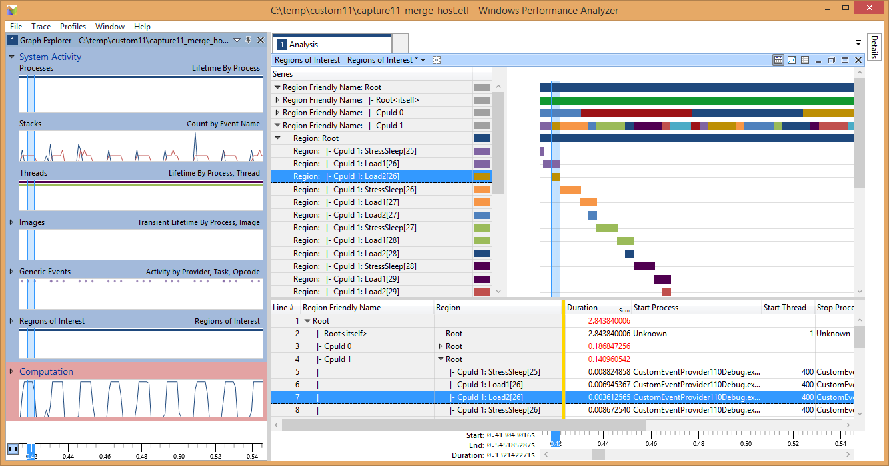

  

#   自定义事件提供程序示例

*本示例与 Microsoft 游戏开发工具包预览版（2019 年 11 月）兼容*

# 

# 说明 本示例演示如何在 Xbox One 中使用自定义 ETW 事件提供程序。  构建示例

如果使用 Project Scarlett，你需要将 Gaming.Xbox.Scarlett.x64
平台配置添加到项目中。可以通过 *Configuration Manager*
执行此操作：选择"活动解决方案平台"下的"Configuration
Manager"选项，然后选择"新建..."。将"键入或选择新平台"设置为
Gaming.Xbox.Scarlett.x64，将"从此处复制设置"设置为
Gaming.Xbox.XboxOne.x64。然后选择"确定"。

*有关详细信息，请参阅 GDK 文档中的"*运行示例*"。*

# 使用示例

此示例使用以下控制：

| 操作                         |  游戏手柄                              |
|------------------------------|---------------------------------------|
| 退出示例。                   |  左扳机键 + 右扳机键 + 右肩键          |

实现说明\
此示例与传统 Windows ETW
提供程序的结构相同，但是，由于在独占分区中运行的游戏无法将其事件提供程序添加到注册表中，因此需要在主机电脑上执行一些其他步骤才能正确解析生成的事件数据。

若要生成事件，首先需要创建事件清单文件（在本示例中，可在
**etwprovider.man** 中找到该文件）。

事件清单文件可以手动创建（基于 XML），也可以使用 **ecmangen.exe**（作为
Windows SDK 的一部分提供的基于 GUI
的工具）来构建。清单生成器工具通常可在以下位置找到：c:\\Program Files
(x86)\\Windows Kits\\10\\bin\\{sdk 版本}\\x64\\ecmangen.exe

拥有事件清单后，可使用 Visual Studio 消息编译器 (mc.exe)
将其编译为资源文件 (**etwproviderGenerated.rc**) 和头文件
(**etwproviderGenerated.h**)。资源文件和头文件均包含在相应游戏项目中。

若要生成头文件、资源文件和二进制文件，可以使用以下参数调用 mc.exe：

mc.exe -um *inputmanifestfile.man*

通过此步骤生成的 .BIN 文件将由生成的 .RC
文件自动引入，并被编译为可执行文件或 DLL。

在游戏初始化过程中，事件提供程序通过调用 **EventRegisterCEP_Main**
实现注册，然后在关机处理过程中通过调用 **EventUnregisterCEP_Main**
实现注销。"Mark"事件通过调用 **EventWriteMark** 发出，该函数将一个
Unicode 字符串作为参数。

本示例可以像任何其他示例一样进行构建、部署和激活。运行本示例后，请使用
xperf 捕获事件（tracelog 无法合并 ETL 提供程序事件，而 xbperf
则无法指定自定义事件提供程序）。由于游戏的事件提供程序尚未添加到注册表中，因此必须通过
GUID 来进行标识，而不是通过名称（请注意，该 GUID
必须与事件清单中指定的提供程序 GUID 匹配）：

C:\\temp\>xbrun /x/title /O xperf -start -on
PROC_THREAD+LOADER+DPC+INTERRUPT+CSWITCH+PROFILE -stackwalk
PROFILE+CSWITCH -f d:\\kernel.etl

捕获所需的数据后，可以按常规方式停止会话：

C:\\temp\> xbrun /x/title /O xperf -start \"user\" -on
A4A76336-4BA7-4CD9-85C3-B9C236D3041C -f d:\\user.etl

合并开发工具包上的 ETL
文件以解析系统事件提供程序。这*不会*解析我们的自定义事件提供程序：

C:\\temp\> xbrun /x/title /O xperf -stop -stop \"user\" -d
d:\\merged.etl

现在，可以将合并后的文件复制回主机电脑：

C:\\temp\\\> xbcp xd:\\merged.etl .

此文件可加载到 WPA
中，且自定义事件将显示在"系统活动"组中的"一般性事件"图中。但在此时，这些事件仅可由
GUID
标识，而任务名称和操作码名称之类的信息将不可见。更重要的是，我们为每个事件提供的自定义数据（Unicode
字符串）也将不显示。

为了显示每个自定义事件的完整信息，我们使用了一个技巧 --
*我们在主机电脑上注册事件提供程序，而不是开发工具包，并在主机上解析这些事件。*

首先，编辑事件清单 (evtprovider.man) 的提供程序节点，并确保
**resourceFileName** 和 **messageFileName** 属性指向开发电脑上构建了
Xbox One 可执行文件的位置：

\<provider name=\"CEP-Main\" guid=\"{A4A76336-4BA7-4CD9-85C3-B9C236D3041C}\" \
symbol=\"CEP_MAIN\" \
resourceFileName=\"S:\\samples\\gx_dev\\Samples\\System\\CustomEventProvider\\Gaming.Xbox.x64\\Debug\\CustomEventProvider.exe\" \
messageFileName=\"S:\\samples\\gx_dev\\Samples\\System\\CustomEventProvider\\Gaming.Xbox.x64\\Debug\\CustomEventProvider.exe\"\>

接下来，通过从提升的命令提示符处运行 wevtutil.exe
工具，来在主机电脑上注册事件提供程序：

D:\\dev\\CustomEventProvider\>wevtutil im etwprovider.man

如果你在主机电脑上签入注册表，你会看到提供程序在
HKLM\\SOFTWARE\\Microsoft\\Windows\\CurrentVersion\\WINEVT\\Publishers
下列出。

最后，使用 xperf 在主机电脑上解析 ETL 文件：

C:\\temp\\custom03\>xperf -merge merged.etl final.etl

如果主机合并的 ETL 文件 (**final.etl**) 已加载到 WPA
中，则事件现在应该已得到正确解析：

请注意"说明"（字段
1）列现在如何包含与事件一起记录的字符串。我们还可以查看任务和操作码的名称。

完成性能分析会话后，可从主机电脑中删除提供程序：

D:\\dev\\CustomEventProvider\>wevtutil um etwprovider.man

BlockCulled 事件与 Mark 事件类似，但它有一个单精度 UInt32
负载，而不是字符串负载。遗憾的是，目前无法在 WPA
内绘制自定义事件的数字字段。

**感兴趣区**

自 2013 年 10 月起，WPA
开始支持[感兴趣区](http://msdn.microsoft.com/en-us/library/windows/hardware/dn450838.aspx)这一概念：在捕获内表示和标记时间范围的能力。**EtwScopedEvent**
类和 **ETWScopedEvent()** 宏使用适当的负载展示了如何使用"感兴趣区"(ROI)
来提供类似于 **PIXBeginEvent()** 和 **PIXEndEvent()** 的范围界定功能。

若要显示
ROI，需要先加载区域定义文件。从"跟踪"菜单中，选择"跟踪属性"，然后加载示例附带的
regions.xml 定义。

现在，应该可以在"一般性事件"图下看到"感兴趣区"图。将 ROI
图拖动到分析区域，以将其展开；默认视图预设（在工具栏上）应该是"感兴趣区"。将"区域"列添加到表中（以便每个区域均获取唯一颜色），然后展开根节点；你将看到类似如下所示的显示内容：

展开表的区域节点时，系统将会提供有关各个范围的信息：

正如你看到的，此处显示了在调用 **ETWScopedEvent()**
时提供的标签（该数字是特定标签的实例）。

展开该图将单独显示每个区域的时间线：

更重要的是，现在可以将区域与来自采样捕获的数据关联起来（如果已启用此功能）：

# 已知问题

由于我们在主机电脑上解析事件提供程序
GUID，因此必须确保该主机上尚未注册任何具有该 ID 的 ETW
提供程序。如果要使用本示例中的事件清单创建新事件清单，请使用
**ecmangen** 来重新生成 GUID（如果对该清单进行了编辑），或者使用
guidgen.exe（随 Visual Studio 提供）来生成新的 GUID。

在主机电脑上解析 ETL
文件后，"一般性事件"视图中可能会出现一些其他事件提供程序；可忽略这些提供程序。

# 

# 其他资源

## 创建事件清单

-   [使用 Windows
    事件日志](https://docs.microsoft.com/en-us/windows/desktop/WES/using-windows-event-log)

-   [编写检测清单](https://docs.microsoft.com/en-us/windows/desktop/WES/writing-an-instrumentation-manifest)

-   [编译检测清单](https://docs.microsoft.com/en-us/windows/desktop/WES/compiling-an-instrumentation-manifest)

-   [消息编译器
    (mc.exe)](https://docs.microsoft.com/en-us/windows/desktop/WES/message-compiler--mc-exe-)

## Windows Performance Analyzer

-   [Windows Performance
    Analyzer](https://docs.microsoft.com/en-us/windows-hardware/test/wpt/windows-performance-analyzer)

-   [感兴趣区](https://docs.microsoft.com/en-us/windows-hardware/test/wpt/regions-of-interest)

-   [创建"感兴趣区"文件](https://docs.microsoft.com/en-us/windows-hardware/test/wpt/creating-a-regions-of-interest-file)

# 隐私声明

在编译和运行示例时，会将示例可执行文件的文件名发送给
Microsoft，用于帮助跟踪示例使用情况。要选择退出此数据收集，你可以删除
Main.cpp 中标记为"示例使用遥测"的代码块。

有关 Microsoft 的一般隐私政策的详细信息，请参阅 [Microsoft
隐私声明](https://privacy.microsoft.com/en-us/privacystatement/)。
