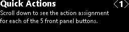
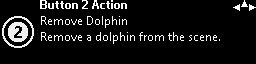

  

#   FrontPanelDemo Sample

*This sample is compatible with the Microsoft Game Development Kit (June
2020)*

#  

# Description

FrontPanelDemo combines several samples into one executable and then
ties together the functionality with a menu system all hosted entirely
on the front panel of the Xbox One X Devkit or the Xbox Series X|S
Devkit. As the name implies, it is intended as a demonstration of some
of the capabilities of the front panel. For more detailed explanations
of the various parts of the demo, the reader is encouraged to explore
the other front panel samples.

# Building the sample

If using an Xbox One devkit, set the active solution platform to `Gaming.Xbox.XboxOne.x64`.

If using Xbox Series X|S, set the active solution platform to `Gaming.Xbox.Scarlett.x64`.

*For more information, see* __Running samples__, *in the GDK documentation.*

# Using the sample

The FrontPanelDemo sample renders a simple dolphin scene on the main
display and hosts a menu-driven demo on the front panel. Note that the
FrontPanelDemo is intended for the Xbox One X DevKit or the Xbox Series
X|S devkit with the integrated front panel (the sample will compile and
run on an Xbox One or Xbox One S however will not be very interesting
without the physical front panel.)

 The front panel provides 5 toggle buttons, 5 LED lights, an LCD display, and a DPAD input. Each of the 5 LEDs are physically associated each of the 5 toggle buttons. The LCD display, is 256 pixels wide by 64 pixels high and supports 16 shades of gray. The DPAD supports input for up, down, left, and right and can also be pressed in for select. 

## Top Level Menus

The menu system consists of four top level menus and each menu prints a
simple description of the functionality that you can access from the
menu. Use the DPAD (down) to "scroll down" and access the functionality
for each of the menus:

The sample has several actions that can be
mapped dynamically to any of the 5 toggle buttons on the front panel.
The Quick Actions menu allows the user to inspect the mappings for each
button.

The sub-menus of CPU Fonts show a variety
of fonts rendered on the front panel display. For a more detailed look
at rendering text see the FrontPanelText sample.

GPU to Front Panel demonstrates how to use the
GPU to render a scene that can then be displayed on the front panel. For
a more detailed example

The sub-menus of Button Mappings allow the
user to dynamically remap the buttons to different actions.

## 

## Quick Action Sub-Menus

From the Quick Actions \<1\> menu, use DPAD down to go to the Quick
Actions sub-menus. Each sub-menu explains what action is currently
mapped to the corresponding toggle button on the Front Panel. Also, the
LED associated with the toggle button with blink when you navigate to
the sub-menu {width="7.979166666666667in"
height="1.7173611111111111in"}{width="7.979166666666667in"
height="1.7173611111111111in"}{width="7.979166666666667in"
height="1.7173611111111111in"}corresponding to that toggle button.

## 

## 

Each of the sub-menus also has a glyph with a number on it to indicated
the associated toggle button.

Also notice the "compass rose" on the
upper-right corner of every sub-menu. This provides a navigation "hint"
to the user. In the example above, the user can use DPAD Left, Right,
and Up. This convention is used throughout the demo.

## 

## 

## 

## 

## 

## 

## 

## 

## 

## CPU Fonts

There are too-many CPU font screens to show them all here. Here is an
example for one font:

This shows the Segoe UI Bold font
generated at a height of 32 pixels using the RasterFontGen tool. The
user can use DPAD Left, Right to change the font height and DPAD Up,
Down to browse different font faces. Note that by going up multiple
times the user eventually returns to the top-level menu (CPU Fonts
\<2\>.) For more details on how to use the CPU to render text to the
Front Panel, please see the RasterFontGen, RasterFontViewer, and
FrontPanelText samples.

## GPU to Front Panel

The GPU to Front Panel \<3\> has one
sub-menu. This is just a simple screen that captures whatever is
rendering on the main display and then copies it to the front panel in
real time. The user can use DPAD Up to return to the top-level menu (GPU
to Front Panel \<3\>.) For a more detailed example of how to use the GPU
to render graphics that can then be used on the Front Panel display,
please see the FrontPanelDolphin sample.

## Button Mappings

The Button Mappings screens resemble the Quick Actions screens, but have
a slightly different interpretation. Each button mapping screen
corresponds to an action that can be mapped to a button. There are more
actions available than there are buttons. So there will always be at
least one action that is not mapped to a button. On the Button Mapping
screen, the icon therefore indicates what button, if any is currently
the "owner" of the action.

# 

# 

In this example, the button icon is dimmed
and there is a question mark indicating that no button owns the action.
If the user presses any toggle button, then that button becomes the new
owner of the action. Furthermore, whatever action that the button
previously owned, if any, will no-longer have an owner. For example,
here's what the same Add 12 Dolphins action screen looks like after
pressing Button 1:

 Here's a summary of how the Button Mapping screens work: -   If the action has no owner then pressing any button will cause that     button to be the new owner. -   If the action already has an owner then the user can change the     owner by pressing a different toggle button. -   If the action already has an owner and the user presses the owning     toggle button, then the action will no longer have an owner -   In order to actually perform the action, the user will have to     scroll back to the top level using DPAD Up. The sample currently has 6 map-able
actions:

1.  Add Dolphin

2.  Remove Dolphin

3.  Clear All Dolphins

4.  Toggle Wireframe

5.  Pause/Resume Simulation

6.  Add 12 Dolphins

E.g. the image on the left shows the scene rendered in wireframe mode
after executing the Toggle Wireframe action via a Front Panel Button
press.

Here we see the results of adding lots of dolphins using the Add 12
Dolphins action.

# 

# 

# 

# 

# Update history

April 2019, first release of the sample.

November 2019, support for Xbox Series X|S Devkit.

# Privacy Statement

When compiling and running a sample, the file name of the sample
executable will be sent to Microsoft to help track sample usage. To
opt-out of this data collection, you can remove the block of code in
Main.cpp labeled "Sample Usage Telemetry".

For more information about Microsoft's privacy policies in general, see
the [Microsoft Privacy
Statement](https://privacy.microsoft.com/en-us/privacystatement/).

# 
