  

#   FrontPanelDemo サンプル

*このサンプルは、Microsoft ゲーム開発キットのプレビュー (2019 年 11 月)
に対応しています。*

#  

# 説明

FrontPanelDemo は複数のサンプルを 1
つの実行可能ファイルにまとめ、そのすべての機能をメニュー
システムに関連付けて Xbox One X Devkit または Project Scarlett Devkit
のフロント パネルにホストします。名前が示しているように、これはフロント
パネルの一部の機能のデモンストレーションのためのものです。このデモのさまざまな部分の詳細な説明については、他のフロント
パネルのサンプルを参考にしてください。

# サンプルのビルド

Xbox One の devkit を使用している場合は、アクティブなソリューション
プラットフォームを Gaming.Xbox.XboxOne.x64 に設定します。

Project Scarlett を使用している場合は、アクティブなソリューション
プラットフォームを Gaming.Xbox.Scarlett.x64 に設定します。

*詳細については、GDK ドキュメントの*
「サンプルの実行」*を参照してください。*

# サンプルの使用

FrontPanelDemo のサンプルでは、シンプルなイルカのシーンがメイン
ディスプレイにレンダリングされ、フロント
パネルにメニュー形式のデモが表示されます。FrontPanelDemo
はフロントパネルが内蔵された Xbox One X Devkit またはProject Scarlett
devkit を対象としています (このサンプルは Xbox One または Xbox One S
でもコンパイルして実行できますが、物理的なフロント
パネルがなければあまり興味深くはありません)。

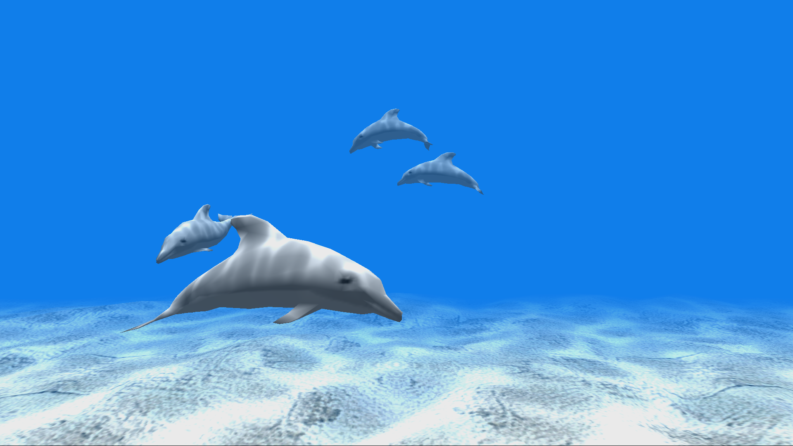

フロント パネルには 5 つのトグル ボタン、5 つの LED ランプ、LCD
ディスプレイ、および方向パッド入力が用意されています。5 つの LED
はそれぞれ 5 つのトグル ボタンに物理的に関連付けられています。LCD
ディスプレイは、幅 256 ピクセル、高さが 64 ピクセルで、16
階調のグレースケールに対応しています。方向パッドは、上下左右の入力をサポートし、選択のために押すこともできます。

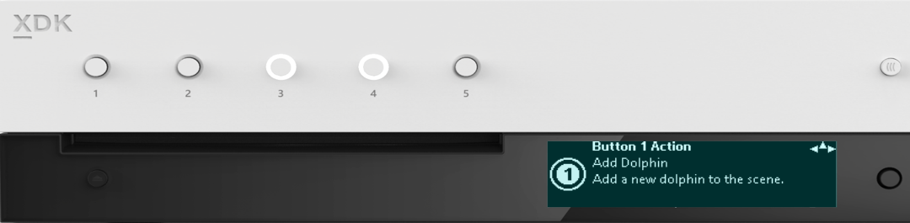

## 最上位のメニュー

メニュー システムは 4
つの最上位のメニューで構成され、各メニューには、そのメニューからアクセスできる機能の簡単な説明が表示されます。方向パッド
(下) を使用して \"下へスクロール\"
し、各メニューの機能にアクセスします。

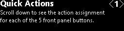このサンプルには、フロント パネルにある 5
つのトグル
ボタンに動的に割り当てることができるいくつかの操作があります。\[Quick
Actions\]
メニューでは、ユーザーが各ボタンのマッピングを調べることができます。

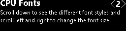サブメニューの \[CPU Fonts\]
には、フロント パネル
ディスプレイにレンダリングされる各種フォントが表示されます。テキストのレンダリングの詳細については、FrontPanelText
サンプルを参照してください。

\[GPU to 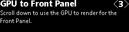Front Panel\] には、GPU
を使用してシーンをレンダリングしてフロント
パネルに表示する方法が示されます。詳細な例

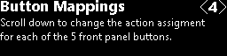サブメニューの \[Button Mappings\]
では、ユーザーがボタンを別のアクションに動的に再マップができます。

## 

## \[Quick Actions\] のサブメニュー

\[Quick Actions\] \< 1 \> メニューで、方向パッド 下を使用して、\[Quick
Actions\] のサブメニューに移動します。各サブメニューには、フロント
パネル上の対応するトグル
ボタンに現在マップされている操作の説明があります。また、トグル
ボタンに対応するサブメニューに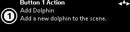{width="7.979166666666667in"
height="1.7173611111111111in"}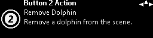{width="7.979166666666667in"
height="1.7173611111111111in"}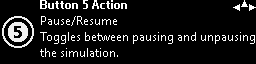{width="7.979166666666667in"
height="1.7173611111111111in"}移動したとき、トグル
ボタンに関連付けられた LED が点滅します。

## 

## 

各サブメニューには、関連付けられているトグル
ボタンを示す番号付きのグリフも表示されています。

すべてのサブメニューの右上隅にある
\"羅針図\" にも注目してください。これにより、ユーザーにナビゲーションの
"ヒント"
が提供されます。上記の例では、ユーザーは方向パッドで左、右、および上に移動できます。この規則がデモ全体で使用されています。

## 

## 

## 

## 

## 

## 

## 

## 

## 

## \[CPU Fonts\]

CPU
フォントの画面は非常に多いため、ここではすべてを表示できません。あるフォントの例を次に示します。

ここでは RasterFontGen
ツールを使用して、32 ピクセルの高さで生成された Segoe UI
太字フォントを示します。ユーザーは方向パッドの左および右を使用してフォントの高さを変更したり、方向パッドの上および下を使用して別のフォントを参照したりできます。ユーザーが何回か上に移動すると、最終的に最上位メニュー
(CPU Fonts \< 2 \>) に戻ります。 CPU を使用してテキストをフロント
パネルにレンダリングする方法の詳細については、RasterFontGen、RasterFontViewer、FrontPanelText
のサンプルを参照してください。

## \[GPU to Front Panel\]

\[GPU to Front Panel\]\<3\> には 1
つのサブメニューがあります。これは、メイン
ディスプレイにレンダリングされているものをキャプチャし、それをリアルタイムでフロント
パネルにコピーする単純な画面です。
ユーザーは方向パッドの上を使用して、最上位レベルのメニュー (\[GPU to
Front Panel\] \<3\>) に戻ることができます。 GPU
を使用してグラフィックスをレンダリングしてフロント パネル
ディスプレイで使用できるようにする方法の詳細な例については、FrontPanelDolphin
サンプルを参照してください。

## \[Button Mappings\]

\[Button Mappings\] 画面は \[Quick Actions\]
画面と似ていますが、解釈が若干異なります。それぞれのボタン
マッピング画面は、ボタンにマップできる操作に対応します。ボタンの数よりも多くの操作を使用できます。そのため、ボタンにマップされていない操作が常に
1 つ以上存在します。したがって、\[Button Mappings\]
画面では、現時点で操作の \"所有者\"
であるボタンがある場合、そのボタンがアイコンで示されます。

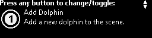

# 

# 

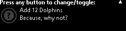この例では、ボタン
アイコンが淡色表示になっており、操作を所有しているボタンがないことを示す疑問符が付いています。ユーザーがいずれかのトグル
ボタンを押すと、そのボタンがこの操作の新しい所有者になります。また、ボタンが以前所有していた操作がある場合、その操作には所有者がいなくなります。たとえば、以下は
\[Add 12 Dolphins\] 操作の画面が、ボタン 1
を押した後にどのように表示されるかを示しています。

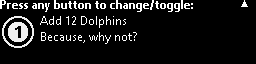

\[Button Mappings\] 画面の機能をまとめると、次のようになります。

-   操作の所有者がいない場合、いずれかのボタンを押すと、そのボタンが新しい所有者になります。

-   操作に既に所有者がいる場合、ユーザーは別のトグル
    ボタンを押すことによって所有者を変更できます。

-   操作に既に所有者がいる場合に、所有しているトグル
    ボタンをユーザーが押すと、その操作の所有者はいなくなります。

-   実際に操作を実行するには、ユーザーは方向パッドの上を使用して、最上位レベルにスクロールする必要があります。

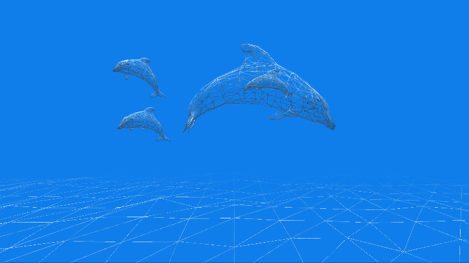このサンプルには、現在 6
つのマッピング可能な操作があります。

1.  Add Dolphin

2.  Remove Dolphin

3.  Clear All Dolphins

4.  Toggle Wireframe

5.  Pause/Resume Simulation

6.  Add 12 Dolphins

たとえば、左側の画像は、フロントパネル ボタンを使用して \[Toggle
Wireframe\] 操作を実行した後に、ワイヤフレーム
モードでレンダリングされるシーンを示しています。

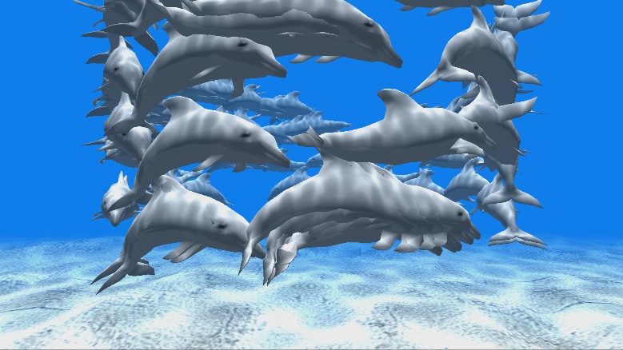

これは、\[Add 12 Dolphins\]
操作を使用して、多数のイルカを追加した結果を示しています。

# 

# 

# 

# 

# 更新履歴

2019 年 4 月、サンプルの最初のリリース。

2019 年 11 月、Project Scarlett Devkit のサポート。

# プライバシーに関する声明

サンプルをコンパイルして実行すると、サンプルの使用状況を追跡するため、サンプルの実行可能ファイルのファイル名が
Microsoft に送信されます。このデータ収集を無効にするには、「Sample Usage
Telemetry」とラベル付けされた Main.cpp
内のコードのブロックを削除します。

Microsoft のプライバシーに関する声明の詳細については、「[Microsoft
プライバシー
ステートメント](https://privacy.microsoft.com/en-us/privacystatement/)」を参照してください。

# 
