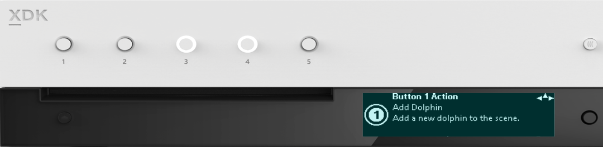
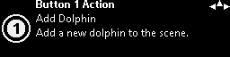
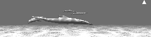
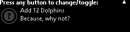

  

#   FrontPanelDemo 샘플

*이 샘플은 Microsoft 게임 개발 키트 미리 보기(2019년 11월)와
호환됩니다.*

#  

# 설명

FrontPanelDemo는 여러 개의 샘플을 하나의 실행 파일로 결합한 다음, Xbox
One X Devkit 또는 Project Scarlett Devkit의 전면 패널에 완전히
호스트되는 메뉴 시스템에 해당 기능을 통합합니다. 이름에서 알 수 있듯이
이 샘플은 전면 패널의 일부 기능을 보여 주기 위해 작성되었습니다. 데모의
다양한 부분에 대한 자세한 설명을 보려면 다른 전면 패널 샘플을 살펴보는
것이 좋습니다.

# 샘플 빌드

Xbox One 개발 키트를 사용하는 경우 활성 솔루션 플랫폼을
Gaming.Xbox.XboxOne.x64로 설정하세요.

Project Scarlett을 사용하는 경우 활성 솔루션 플랫폼을
Gaming.Xbox.Scarlett.x64로 설정하세요.

*자세한 내용은 GDK 문서에서* 샘플 실행하기*를 참조하세요.*

# 샘플 사용

FrontPanelDemo 샘플은 주 디스플레이에 간단한 돌고래 장면을 렌더링하고
전면 패널에 메뉴 기반 데모를 호스트합니다. FrontPanelDemo는 전면 패널이
통합된 Xbox One X DevKit 또는 Project Scarlett devkit용으로
고안되었습니다. 이 샘플은 Xbox One 또는 Xbox One S에서 컴파일되고 실행될
예정이지만 물리적 전면 패널이 없으면 별로 유용하지 않을 것입니다.

전면 패널은 5개의 토글 단추, 5개의 LED 표시등, LCD 디스플레이 및 D-패드
입력 장치를 제공합니다. 5개의 LED 각각은 5개의 각 토글 단추과 물리적으로
연결되어 있습니다. LCD 디스플레이는 256픽셀x64픽셀이며 16개 음영을
지원합니다. D-패드는 위쪽, 아래쪽, 왼쪽 및 오른쪽 입력을 지원하며 선택을
위해 누를 수도 있습니다.

## 최상위 메뉴

메뉴 시스템은 4개의 최상위 메뉴로 구성되어 있으며 각 메뉴는 메뉴에서
액세스할 수 있는 기능에 대한 간단한 설명을 표시합니다. D-패드(아래쪽)를
사용하여 \"아래로 스크롤하고\" 각 메뉴의 기능에 액세스합니다.

이 샘플에는 전면 패널의 5개 토글 단추에
동적으로 매핑될 수 있는 몇 가지 작업이 있습니다. Quick Actions 메뉴를
사용하면 각 단추에 대한 매핑을 확인할 수 있습니다.

CPU Fonts 하위 메뉴는 전면 패널
디스플레이에 렌더링되는 다양한 글꼴을 표시합니다. 텍스트를 렌더링하는
방법에 대한 자세한 내용은 FrontPanelText 샘플을 참조하세요.

GPU to Front Panel은 GPU를 사용하여 전면
패널에 표시될 수 있는 장면을 렌더링하는 방법을 보여 줍니다. 자세한 예제

Button Mappings 하위 메뉴에서는 단추를
다른 작업에 동적으로 다시 매핑할 수 있습니다.

## 

## Quick Actions 하위 메뉴

Quick Actions \<1\> 메뉴에서 D-패드 아래쪽을 사용하여 Quick Actions 하위
메뉴로 이동합니다. 각 하위 메뉴는 전면 패널의 해당 토글 단추에 현재
매핑되어 있는 작업을 설명합니다. 또한 토글 단추에 연결된 LED는 해당 토글
단추에 해당하는 하위
메뉴{width="7.979166666666667in"
height="1.7173611111111111in"}{width="7.979166666666667in"
height="1.7173611111111111in"}{width="7.979166666666667in"
height="1.7173611111111111in"}로 이동하면 깜박입니다.

## 

## 

각 하위 메뉴에는 연결된 토글 단추를 나타내기 위한 번호가 있는 문자
모양이 표시됩니다.

또한 모든 하위 메뉴의 오른쪽 위 모서리에
\"나침도\"가 표시됩니다. 이를 통해 탐색 \"힌트\"를 얻을 수 있습니다. 위
예제에서 사용자는 D-패드 왼쪽, 오른쪽, 위쪽을 사용할 수 있습니다. 이
규칙은 데모 전체에서 사용됩니다.

## 

## 

## 

## 

## 

## 

## 

## 

## 

## CPU 글꼴

CPU 글꼴 화면이 너무 많으므로 여기에는 일부만 나와 있습니다. 다음은 한
글꼴에 대한 예제입니다.

이 예제는 RasterFontGen 도구를 사용하여
32픽셀 높이에서 생성된 Segoe UI Bold 글꼴을 보여 줍니다. 사용자는 D-패드
왼쪽, 오른쪽을 사용하여 글꼴 높이를 변경하고, D-패드 위쪽, 아래쪽을
사용하여 다른 글꼴을 찾아볼 수 있습니다. 여러 번 위로 올라가면
결과적으로 최상위 메뉴(CPU Fonts\<2\>)로 돌아갑니다. CPU를 사용하여 전면
패널에 텍스트를 렌더링하는 방법에 대한 자세한 내용은 RasterFontGen,
RasterFontViewer 및 FrontPanelText 샘플을 참조하세요.

## GPU to Front Panel

GPU to Front Panel\<3\>에는 1개의 하위
메뉴가 있습니다. 이 화면은 주 디스플레이에서 렌더링되는 항목을 캡처한
다음, 전면 패널에 실시간으로 복사하는 간단한 화면에 불과합니다. 사용자는
D-패드를 사용하여 최상위 메뉴(GPU to Front Panel\<3\>)로 돌아갈 수
있습니다. GPU를 사용하여 전면 패널 디스플레이에서 사용할 수 있도록
그래픽을 렌더링하는 방법에 대한 자세한 예제는 FrontPanelDolphin 샘플을
참조하세요.

## Button Mappings

Button Mappings는 Quick Actions 화면과 비슷하지만 약간 다르게 해석할 수
있습니다. 각 단추 매핑 화면은 단추에 매핑할 수 있는 작업에 해당합니다.
단추가 있는 것보다 더 많은 작업을 수행할 수 있습니다. 따라서 단추에
매핑되지 않는 작업이 적어도 하나는 항상 있습니다. 따라서 Button Mapping
화면에서 아이콘으로 작업의 \"소유자\"에 해당하는 단추를 나타냅니다.

# 

# 

이 예제에서는 단추 아이콘이 흐리게
표시되고 해당 작업을 소유하는 단추가 없음을 나타내는 물음표가
표시됩니다. 사용자가 아무 토글 단추를 누르면 해당 단추이 작업의 새
소유자가 됩니다. 또한 단추가 이전에 소유한 작업은(있는 경우) 더 이상
소유자가 없습니다. 예를 들어 이 화면은 단추 1을 누른 이후에 표시되는
동일한 Add 12 Dolphins 작업 화면입니다.

Button Mapping 화면의 작동 방식을 요약하면 다음과 같습니다.

-   작업에 소유자가 없을 때 아무 단추나 누르면 해당 단추가 새 소유자가
    됩니다.

-   작업에 이미 소유자가 있는 경우 사용자는 다른 토글 단추를 눌러
    소유자를 변경할 수 있습니다.

-   작업에 이미 소유자가 있고 사용자가 소유 토글 단추를 누르는 경우 해당
    작업에는 더 이상 소유자가 없습니다.

-   실제로 이 작업을 수행하기 위해 사용자는 D-패드 위쪽 키를 사용하여
    최상위 수준으로 다시 스크롤해야 합니다.

이 샘플에는 현재 6개의 매핑 가능 작업이
있습니다.

1.  돌고래 추가

2.  돌고래 제거

3.  모든 돌고래 지우기

4.  와이어프레임 토글

5.  시뮬레이션 일시 중지/다시 시작

6.  12마리 돌고래 추가

예를 들어, 왼쪽에 있는 이미지에는 전면 패널 단추 누르기를 통해
와이어프레임 토글 작업을 실행한 후 와이어프레임 모드로 렌더링된 장면이
표시됩니다.

다음은 Add 12 Dolphins 작업을 사용하여 많은 돌고래를 추가할 때의 결과를
보여 줍니다.

# 

# 

# 

# 

# 업데이트 기록

2019년 4월, 샘플의 첫 번째 릴리스

2019년 11월, Project Scarlett Devkit 지원

# 개인정보처리방침

샘플을 컴파일하고 실행할 때 샘플의 사용을 추적하는 데 도움이 되도록 샘플
실행 파일의 파일 이름이 Microsoft에 전송됩니다. 이 데이터 수집을
옵트아웃하려면 Main.cpp에서 \"샘플 사용 원격 분석\"이라고 레이블이
지정된 코드 블록을 제거할 수 있습니다.

Microsoft의 일반 개인정보취급방침에 대한 자세한 내용은 [Microsoft
개인정보처리방침](https://privacy.microsoft.com/en-us/privacystatement/)을
참조하세요.

# 
