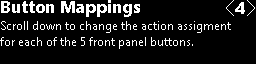
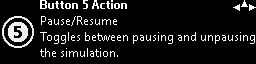
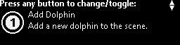

  

#   FrontPanelDemo 示例

此示例与 Microsoft 游戏开发工具包预览版（2019 年 11 月）兼容

#  

# 说明

FrontPanelDemo
将多个示例合并为一个可执行文件，然后将功能与一个菜单系统结合在一起，全部托管在
Xbox One X Devkit 或 Project Scarlett Devkit
的前面板上。从名称可以看出，它用于演示前面板中的某些功能。有关演示的各组成部分的更多详细说明，建议读者浏览其他前面板示例。

# 构建示例

如果使用 Xbox One 开发工具包，请将活动解决方案平台设置为
Gaming.Xbox.XboxOne.x64。

如果使用 Project Scarlett，请将活动解决方案平台设置为
Gaming.Xbox.Scarlett.x64。

有关详细信息，请参阅 GDK 文档中的"运行示例"。

# 使用示例

FrontPanelDemo
示例在主显示屏上呈现一个简单的海豚场景，并在前面板上托管一个菜单驱动的演示。请注意，FrontPanelDemo
适用于包含集成前面板的 Xbox One X Devkit 或 Project Scarlett
Devkit（此示例将在 Xbox One 或 Xbox One S
上编译和运行，但如果没有物理前面板，就会少了一些乐趣。）

前面板提供 5 个切换按钮、5 个 LED 灯、一个 LCD
显示屏和一个方向键输入。这 5 个 LED 与 5
个切换按钮通过物理方式一一关联。LCD 显示屏为 256 x 64 像素，支持 16
级灰度。方向键支持向上、向下、向左和向右输入，还可以按下进行选择。

## 顶层菜单

菜单系统由四个顶层菜单组成，每个菜单都输出用户可从菜单访问的功能的简单说明。使用方向键（向下）"向下滚动"并访问每个菜单的功能：

示例包含若干个操作，这些操作可以动态映射到前面板上的
5 个切换按钮。使用"快速操作"菜单，可以检查每个按钮的映射。

"CPU
字体"的子菜单显示在前面板显示屏上呈现的各种字体。有关呈现文本的更具体外观，请参阅
FrontPanelText 示例。

"使用 GPU 向前面板呈现内容"演示了如何使用 GPU
呈现可以在前面板上显示的场景。更多详细示例

使用"按钮映射"的子菜单，用户可以将按钮重新动态映射到不同的操作。

## 

## "快速操作"子菜单

在"快速操作"的 \<1\>
菜单中，使用向下方向键转到"快速操作"子菜单。每个子菜单都会说明当前会将哪个操作映射到前面板上的对应切换按钮。同时，当导航到该切换按钮对应的子菜单{width="7.979166666666667in"
height="1.7173611111111111in"}{width="7.979166666666667in"
height="1.7173611111111111in"}{width="7.979166666666667in"
height="1.7173611111111111in"}时，与切换按钮相关联的 LED 会闪烁。

## 

## 

另外，每个子菜单都有一个字形，上面带一个数字，表示关联的切换按钮。

另请注意每个子菜单右上角的"罗盘刻度盘"。此标志可以为用户提供导航"提示"。在上面的示例中，用户可以使用向左、向右和向上方向键。在整个演示中均使用此约定。

## 

## 

## 

## 

## 

## 

## 

## 

## 

## CPU 字体

CPU 字体屏幕太多，无法在此处全部显示。下面提供一种字体的示例：

此示例显示使用 RasterFontGen 工具以 32
像素的高度生成的 Segoe UI Bold
字体。用户可以使用向左方向键和向右方向键更改字体高度，使用向上方向键和向下方向键浏览不同的字体。请注意，在连续多次使用向上方向键后，用户最终将返回到顶层菜单（即"CPU
字体"\<2\>。） 若要详细了解如何使用 CPU 向前面板呈现文本，请参阅
RasterFontGen、RasterFontViewer 和 FrontPanelText 示例。

## 使用 GPU 向前面板呈现内容

"使用 GPU 向前面板呈现内容"\<3\>
有一个子菜单。这只是一个简单的屏幕，可用于捕获主显示屏上正在呈现的任何内容，然后将该内容实时复制到前面板。
用户可以使用向上方向键返回到顶层菜单（"使用 GPU
向前面板呈现内容"\<3\>）。 有关介绍如何使用 GPU
呈现可随后用于前面板显示屏的图形的更详细示例，请参阅 FrontPanelDolphin
示例。

## 按钮映射

"按钮映射"屏幕与"快速操作"屏幕类似，但是说明略有不同。每个按钮映射屏幕对应一个可以映射到按钮的操作。提供的操作数比按钮数要多。因此，将始终至少有一个操作不会映射到任何按钮。因此，在"按钮映射"屏幕上，此图标指示当前操作的"执行者"是哪个按钮。

# 

# 

在本示例中，按钮图标呈灰色，并且有一个问号表示任何按钮均不执行该操作。如果用户按下任意切换按钮，则该按钮将成为操作的新执行者。此外，该按钮之前执行的任何操作（如果有）都将不再具有执行者。例如，下面是按下"按钮
1"后同一个"添加 12 个海豚"操作屏幕的外观，如下所示：

下面简要介绍一下"按钮映射"屏幕的工作方式：

-   如果操作没有执行者，那么，按下任意按钮将使该按钮成为新的执行者。

-   如果操作已有执行者，用户可以通过按下其他切换按钮来更改执行者。

-   如果操作已有执行者，并且用户按下拥有执行权的切换按钮，则该操作将不再具有执行者

-   为实际执行此操作，用户必须使用向上方向键滚动回顶层菜单。

本示例目前有 6 个可映射的操作：

1.  添加海豚

2.  删除海豚

3.  清除所有海豚

4.  切换线框

5.  暂停/恢复模拟

6.  添加 12 只海豚

例如，左侧的图像显示在按下前面板按钮以执行"切换线框"操作后，在线框模式下呈现的场景。

此图显示在使用"添加 12 只海豚"操作执行添加后呈现的多只海豚。

# 

# 

# 

# 

# 更新历史记录

2019 年 4 月，首次发布此示例。

2019 年 11 月，支持 Project Scarlett Devkit。

# 隐私声明

在编译和运行示例时，示例可执行文件的文件名将发送给
Microsoft，用于帮助跟踪示例使用情况。要选择退出此数据收集，你可以删除
Main.cpp 中标记为"示例使用遥测"的代码块。

有关 Microsoft 的一般隐私政策的详细信息，请参阅《[Microsoft
隐私声明](https://privacy.microsoft.com/en-us/privacystatement/)》。

# 
